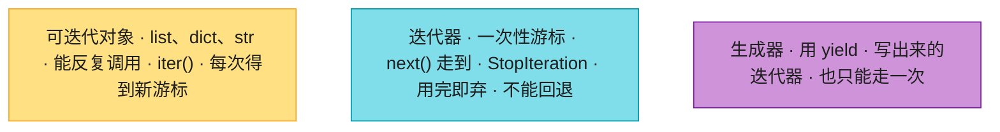
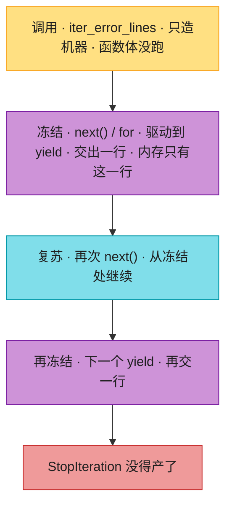

# Ch03 · 控制流、迭代器、生成器、推导式

> **预计**:1 天 ｜ **前置**:Ch02
> **目标**:掌握 Python 效率的核心——**推导式**、**for-else**、**迭代器协议**、**生成器 `yield`**。这些是 Python 相对 Java 最「顺手」的地方,也是运维/AI 章节的地基(流式处理 GB 级日志、流式读 LLM token)。
> 本章主线:你负责电商后台的「数据 + 监控」两条线——白天给运营写商品文案、榜单、对接老 ERP(`products.json`,10 个商品);晚上写日志巡检脚本和监控大盘(`logs.json`,20 行样本,代表线上 GB 级日志流——所以「流式处理」是本章的灵魂)。

> 📐 **本教程的契约**:下面每一节(§3.1–§3.7)都**精确对应**作业里的题。讲过的才考,考的必讲过。卡住时,按对应表回查小节即可。

---

## 🗺️ 本章地图(元学习 · 原则一)

学完这章,你将能够:
- 写出带过滤条件的**列表推导式**,并分清「过滤 if」和「三元 if-else」的位置(Java 老手必混)
- 用 **for-else**(Java 完全没有)省掉「找到了吗」标志位,优雅表达「找遍了都没有」
- 用 `enumerate` 拿带序号的遍历,用 `zip` 并行配对两个序列,知道 zip **按最短的截断**
- 用 `first, *rest = xs` 一行拆分序列,并理解**迭代器不能切片但能解包**
- 说清**迭代器协议**(`iter`/`next`/`StopIteration`),知道迭代器「只能遍历一次」,会 `list(it)` 物化
- 用 `yield` 写**生成器**,解释惰性求值为什么能处理 GB 级文件而不爆内存
- 用**生成器表达式** `sum(1 for ...)` 做流式计数,不物化大列表

**作业 ↔ 教程对应表**(学哪节,就去做哪题):

| 作业题 | 对应小节 | 核心知识点 |
|--------|----------|-----------|
| `cheap_product_names` | §3.1 | 列表推导式(带条件) |
| `find_first_error` | §3.2 | for-else |
| `indexed_summary` | §3.3 | enumerate |
| `merge_product_lists` | §3.3 | zip |
| `champion_and_rest` | §3.4 | 星号解包 `first, *rest` |
| `top_n_by_price` | §3.5 | 迭代器消费 + 物化 |
| `iter_error_lines` | §3.6 | 生成器 yield |
| `count_error_logs` | §3.7 | 生成器表达式 |

---

## ⏱️ 学习路径:费曼五步(约 60-90 分钟)

| 步 | 你要做 | 在哪做 |
|----|--------|--------|
| ① 预览猜(2分钟) | 下面 5 个 Java 场景,猜 Python 怎么写 | 本页 ① |
| ② 先动手 | 打开 `ch03_assignment.py`,**先试着写**(别看教程) | assignment |
| ③ 提取+反馈 | 凭记忆写完 → `pytest` 红绿 | test |
| ④ 费曼(2分钟) | 大白话讲清"yield 到底做了什么""for-else 何时执行" | 本页 ④ |
| ⑤ 存闪卡 | 把 [`review.md`](./review.md) 的卡标复习日期 | review.md |

> 💡 **直接性原则**:别通读!先猜 ① → 去 ② 写作业 → **哪题卡了,回对应 § 查** → 改 → 再跑。

---

## ① 预览猜(2 分钟 · 激活你的 Java 直觉)

先别看答案,凭 Java 经验猜一猜(猜错记得更牢):
1. Java 在日志里找第一条 ERROR:循环 + `boolean found` 标志 + 循环后再判断。Python 的 `for` 后面居然能跟 `else`,你猜它什么时候执行?
2. Java 遍历拿索引:`for (int i=0; i<list.size(); i++)`。Python 一个什么函数能同时给出「序号 + 元素」?
3. 老系统接口返回 `names[]` 和 `prices[]` 两个**平行数组**(`names[i]` 配 `prices[i]`)。Java 按下标 for 循环配对,Python 一个什么函数?
4. Java 读 10GB 日志 `Files.readAllLines` 直接 OOM。Python 用一个什么关键字,让普通函数变成「逐条产出、永不爆内存」的机器?
5. Java 的 `Iterator` 走完一轮能 `reset` 再用吗?Python 里 `list(it)` 之后再 `list(it)`,第二次得到什么?

> 猜完,带着验证心态进入正文。第 1 题的 `else` 是本章最反直觉的设计,答案在 §3.2。

---

## §3.1 列表推导式:过滤 + 变换(对应:`cheap_product_names`)🟡

Ch01/Ch02 你已经写过推导式,这节把**过滤条件**讲透,并拆掉 Java 老手最容易踩的「if 位置」的坑。

### Java 对照:Stream 流水线

```java
// Java:优惠券圈品——价格低于 200 的商品名
List<String> names = products.stream()
    .filter(p -> p.getPrice() < 200)
    .map(Product::getName)
    .toList();
```

```python
# Python:一行推导式
names = [p["name"] for p in products if p["price"] < 200]
# ["无线鼠标", "Python编程:从入门到实践", "设计模式", "智能水杯"]
```

### 语法骨架

```python
[表达式 for 变量 in 可迭代对象 if 条件]
```

读法:**先 for,再 if,最后算表达式**(和执行顺序一致)。三个小例子:

```python
[n * 2 for n in [1, 2, 3]]               # [2, 4, 6]        纯变换
[n for n in range(10) if n % 2 == 0]     # [0, 2, 4, 6, 8]  过滤
[p["name"] for p in products if p["price"] < 200 and p["stock"] > 0]
# 条件可以复合:低于 200 且有货
```

等价的传统写法(帮你建立直觉):

```python
result = []
for p in products:
    if p["price"] < 200:          # ← 同一个 if
        result.append(p["name"])  # ← 同一个表达式
```

### ⚠️ 坑 1:过滤 if vs 三元 if-else,位置完全不同 🔴

这是 Java 老手写推导式的**头号 SyntaxError 来源**:

```python
[p["name"] for p in products if p["price"] < 200]           # ✅ 过滤:if 在 for 后面
["贵" if p["price"] > 1000 else "便宜" for p in products]    # ✅ 三元变换:if-else 在 for 前面
[p["name"] if p["price"] < 200 for p in products]           # ❌ SyntaxError!
```

记法:**「过滤」是不要某些元素(影响个数),贴在 for 后;「三元」是每个元素都要、只是换算法(不影响个数),贴在表达式位**。推导式里没有 `else` 配过滤 if 的写法——不满足条件的直接被丢弃,没有「否则」。

### ⚠️ 坑 2:推导式里写 append

```python
result = []
[result.append(p["name"]) for p in products]   # ❌ 造出 [None, None, ...],纯副作用,反模式
result = [p["name"] for p in products]         # ✅ 表达式本身就是结果
```

### 顺便复习:dict / set 推导(Ch02 已考)

```python
{p["name"]: p["price"] for p in products}      # 字典推导 → 价格速查表
{p["category"] for p in products}              # 集合推导 → 类目自动去重
```

> 了解:双层 for 可以拍平嵌套列表 `[x for row in matrix for x in row]`,超过两层就老实写 for 循环。本章作业用不到。

> ✅ **做 `cheap_product_names` 题**:一行 `[p["name"] for p in products if p["price"] < max_price]`。注意是严格小于——价格恰好等于 `max_price` 的不算,测试会查这个边界。

---

## §3.2 for-else:找遍了都没有(对应:`find_first_error`)🔴

**Java 完全没有的语法**,也是 Python 里最反直觉的命名。先记住一句话:

> `for ... else:` 的 **else 在循环【没有被 `break` / `return` 提前打断】时执行**。循环完整跑完(或一次都没进),才走 else。

### 最小例

```python
for i in range(5):
    if i == 3:
        break          # 提前跳出 → else 【不执行】
else:
    print("正常结束")  # 不打印

for i in range(5):
    if i == 99:
        break          # 永远不满足 → 循环完整跑完
else:
    print("正常结束")  # ✅ 打印
```

> 🤯 **Java 老手震惊点**:这个 `else` 和 `if-else` **毫无关系**!它更像 `nobreak` / `completed`。名字起得差是 Python 公认的历史包袱,既来之则安之。

### ❌ Java 风格 → ✅ Pythonic:搜索场景

真实场景:监控巡检脚本,在日志流里找**第一条** ERROR;一条都没有就返回 `None` 表示「本轮平安」。

```python
# ❌ Java 风格:flag 标志位,啰嗦
def find_first_error(logs):
    found = None
    for line in logs:
        if "ERROR" in line:
            found = line
            break
    return found          # 找不到时 found 还是 None——靠巧合,不靠结构
```

```python
# ✅ Pythonic:for-else,意图写进结构里
def find_first_error(logs):
    for line in logs:
        if "ERROR" in line:
            return line       # 找到 → 函数直接结束(else 不会执行)
    else:
        return None           # 循环完整跑完 → 找遍了都没有
```

对 `logs.json`(20 行,第一条 ERROR 在第 4 行):

```python
find_first_error(logs)
# "2026-07-18 09:00:03 ERROR Failed to connect to redis at localhost:6379"
find_first_error(["INFO ok", "WARN meh"])   # None
find_first_error([])                        # None —— 空循环一次没进,也算「完整跑完」
```

> 🔑 **边界直觉**:`for x in []:` 一次都不执行 → 视为「没被 break」→ **直接进 else**。所以空列表上 `find_first_error` 返回 `None`,不用特判。

### 经典第二例:素数判断

`for-else` 的另一个教科书场景(理解即可,本章作业不考):

```python
def is_prime(n):
    if n < 2:
        return False
    for i in range(2, n):
        if n % i == 0:
            return False      # 找到因子 → 提前结束
    else:
        return True           # 一个因子都没找到 → 是素数
```

`is_prime(2)`:`range(2, 2)` 是空的,循环不执行 → 进 else → `True`。✓(2 是最小素数)

> 了解:`while` 也有 `while-else`,语义完全相同(没 break 就进 else),实战极少用。
> 实话:多数情况直接 `return` 或用 `any()`/`next(filter)` 更直白。for-else 记住语义、读得懂即可,不必强行用。

> ✅ **做 `find_first_error` 题**:`for` + `if "ERROR" in line: return line` + `else: return None`。

---

## §3.3 enumerate / zip:遍历两大神器(对应:`indexed_summary`、`merge_product_lists`)🟡

### enumerate:序号 + 元素,一次拿到

❌ 错误写法 → ✅ 正确写法:

```python
for i in range(len(products)):           # ❌ C/Java 遗风,既不 Pythonic 又容易越界写错
    print(i, products[i]["name"])

for i, p in enumerate(products):         # ✅ 直接拿到 (序号, 元素)
    print(i, p["name"])
```

```java
// Java 对照:没有等价物,最接近的写法也啰嗦
IntStream.range(0, products.size())
    .forEach(i -> System.out.println(i + " " + products.get(i).getName()));
```

**序号从 1 开始**(日常需求!给人类看的编号都从 1 数起):

```python
for i, p in enumerate(products, start=1):   # start 默认 0
    print(i, p["name"])                      # 1 机械键盘 / 2 无线鼠标 / ...
```

真实场景(就是作业):运营晨会的播报文案,格式 `"N. 商品名 (¥价格)"`:

```python
[f"{i}. {p['name']} (¥{p['price']})" for i, p in enumerate(products, 1)]
# ["1. 机械键盘 (¥599.0)", "2. 无线鼠标 (¥159.0)", ...]
```

### zip:把平行数组「拉链式」配对

真实场景:对接公司**老 ERP 系统**——它的接口不返回 JSON 对象数组,而是两个**平行数组**,`names[i]` 和 `prices[i]` 是同一个商品:

```python
names  = ["机械键盘", "无线鼠标", "27寸4K显示器"]
prices = [599.0,      159.0,      2199.0]

list(zip(names, prices))
# [("机械键盘", 599.0), ("无线鼠标", 159.0), ("27寸4K显示器", 2199.0)]
```

```java
// Java 对照:没有内置 zip,只能手动按下标走
List<Pair> pairs = new ArrayList<>();
for (int i = 0; i < names.size(); i++) {
    pairs.add(new Pair(names.get(i), prices.get(i)));
}
```

### ⚠️ zip 的两个坑(都是考点)🔴

**坑 1:按最短的截断,不报错**:

```python
list(zip(["a", "b", "c"], [1.0, 2.0]))   # [("a", 1.0), ("b", 2.0)] —— "c" 被悄悄丢掉!
```

老 ERP 数据缺斤短两是常态,这个行为是特性也是坑:对不上齐的数据**静默丢弃**。要补默认值用 `itertools.zip_longest`(Ch09 细讲)。

**坑 2:zip 返回的是迭代器,不是列表**:

```python
z = zip(names, prices)
print(z)            # <zip object ...> —— 不是列表!
list(z)             # 物化成列表(同时 z 被耗尽,§3.5 讲透)
```

> 了解:`zip(*pairs)` 可以把配对列表「解压回去」(`pairs` 是 `[(name, price), ...]` 时,`zip(*pairs)` 得到两列)。这里的 `*` 就是下一节的星号解包。

> ✅ **做 `indexed_summary` 题**:`enumerate(products, 1)` + f-string + 推导式。
> ✅ **做 `merge_product_lists` 题**:`list(zip(names, prices))`,不等长按最短的截断(zip 自带语义,不用特判)。

---

## §3.4 解包与星号:`first, *rest`(对应:`champion_and_rest`)🟡

Ch02 你用过元组解包 `a, b = pair`。这节讲它的升级版:**星号收集**。

### 最小例

```python
first, *rest = ["机械键盘", "无线鼠标", "27寸4K显示器"]
first    # "机械键盘"
rest     # ["无线鼠标", "27寸4K显示器"] —— 星号把「剩下的全部」收进一个 list
```

```java
// Java 对照:又啰嗦又要拷贝
String first = names.get(0);
List<String> rest = names.subList(1, names.size());   // 还是个 view,有坑
```

### 真实场景:热销榜 UI(就是作业)

榜单组件:第 1 名渲染成「冠军大卡」,其余小字列出:

```python
champion, others = champion_and_rest(["27寸4K显示器", "人体工学椅", "降噪耳机"])
champion   # "27寸4K显示器"
others     # ["人体工学椅", "降噪耳机"]
```

### 为什么不用 `xs[0]` + `xs[1:]`?——迭代器不能切片!🔴

这是星号解包的**隐藏卖点**,也是它和切片的分水岭:

```python
it = iter(["机械键盘", "无线鼠标", "显示器"])
it[0]                    # ❌ TypeError:迭代器没有下标!
it[1:]                   # ❌ TypeError:迭代器不能切片!
first, *rest = it        # ✅ 唯一能拆分迭代器的手段
first                    # "机械键盘"
rest                     # ["无线鼠标", "显示器"]
```

处理「只能遍历一次」的数据流(§3.5)时,星号解包是你唯一的拆分工具。

### ⚠️ 坑:空序列解包会 ValueError

```python
first, *rest = []        # ❌ ValueError: not enough values to unpack
```

所以作业里要先判空:空列表约定返回 `(None, [])`。

### 星号的另一半:调用处「打散」

`*` 在**赋值左边**是收集,在**函数调用**里是打散:

```python
pairs = [("机械键盘", 599.0), ("无线鼠标", 159.0)]
zip(*pairs)              # 等价 zip(("机械键盘",599.0), ("无线鼠标",159.0)) → 转置回两列
print(*[1, 2, 3])        # 等价 print(1, 2, 3)
```

> 了解:函数定义里的 `def f(*args, **kwargs)` 也用星号收集多余参数——那是 Ch04(函数章)的主场,本章只要认得 `first, *rest` 和 `f(*xs)` 两种形态。

> ✅ **做 `champion_and_rest` 题**:先判空 `if not names: return None, []`,再 `first, *rest = names`。

---

## §3.5 迭代器协议:只能走一次(对应:`top_n_by_price`)🔴

生成器是「迭代器」的一种,先把迭代器这个底层概念讲透,下节 yield 就水到渠成了。

### 两个概念:可迭代对象 vs 迭代器

- **可迭代对象(Iterable)**:能被 `for` 遍历的东西。`list`、`dict`、`str`、`range`、生成器都是。≈ Java 的 `Iterable`。
- **迭代器(Iterator)**:实际执行遍历的「游标对象」,有 `__next__()` 方法。≈ Java 的 `Iterator`。

```python
nums = [1, 2, 3]          # 可迭代对象(list)
it = iter(nums)           # iter() 从可迭代对象造出迭代器(游标指向开头)
next(it)                  # 1   游标前进
next(it)                  # 2
next(it)                  # 3
next(it)                  # StopIteration 异常:到头了
```

> 🟡 **Java 对比**:`iter(x)` ≈ `x.iterator()`,`next(it)` ≈ `it.next()`。区别在于:Java 用 `hasNext()` **预先问**,Python 用「抛 `StopIteration` 异常」**事后告知**——`for` 循环底层就是 `iter()` + 反复 `next()` + 捕获 `StopIteration` 自动退出。

### 关键性质:迭代器【只能遍历一次】🔴

```python
it = iter([1, 2, 3])
list(it)                  # [1, 2, 3]   ← 游标走到底
list(it)                  # []          ← 已经空了!游标不会回退
```

❌ 错误写法 → ✅ 正确写法:

```python
it = iter(products)
top3 = sorted(it, ...)[:3]     # sorted 内部把 it 耗尽
rest = list(it)                # ❌ 以为还有剩,结果 []

it = iter(products)
all_products = list(it)        # ✅ 先物化成列表(一次性耗尽,但拿到全部)
top3 = sorted(all_products, ...)[:3]   # 列表可以反复遍历、排序、切片
```

这是和 `list` 最大的区别:**list 能反复遍历,迭代器用完即弃**。预览猜第 5 题的答案:Java 的 `Iterator` 同样不能 reset,只是 Java 里你很少裸用它,Python 里迭代器无处不在。

### 真实场景:流式来源求 Top N(就是作业)

商品数据从网络/文件**流式**读进来,到你手上是个只能遍历一次的迭代器。运营要看「价格 Top N」——排序需要全部数据,怎么办?

**答案:`list(iterable)` 一次性物化**(游标从头拉到尾,收集所有元素),之后它就是普通列表,随便排序切片:

```python
def top_n_by_price(product_iter, n=3):
    products = list(product_iter)                              # 物化(迭代器随之耗尽)
    top = sorted(products, key=lambda p: p["price"], reverse=True)[:n]
    return [p["name"] for p in top]

top_n_by_price(iter(products), n=3)
# ["27寸4K显示器", "人体工学椅", "降噪耳机"]   # 2199 / 1599 / 1299
```

> ⚠️ 调用后,传入的迭代器就空了(测试会专门验证这一点)。物化 = 放弃惰性换随机访问,**数据真放不下内存时这招不能用**——那是 §3.6 生成器要解决的矛盾。

### 你已经一直在用迭代器

`zip`、`map`、`filter`、`enumerate`、`range`、文件对象……返回的都是迭代器。Python 里「迭代」是统一协议,本章所有函数本质上都在玩这套协议。



**这张图要你看懂：** `list` 等可迭代对象能反复 `iter()` 造新游标；迭代器是一次性游标，`next()` 走到 `StopIteration` 就废；生成器只是「用 `yield` 写出来的迭代器」，所以也只能走一次。

> ✅ **做 `top_n_by_price` 题**:`list()` 物化 → `sorted(key=..., reverse=True)[:n]` → 推导式取 name。

---

## §3.6 生成器 yield:可暂停的机器(对应:`iter_error_lines`)🔴

本章**最重要、最 Pythonic** 的概念,Java 和 Python 差异最大的地方之一。请慢慢读。

### 问题:10GB 日志怎么过滤?

```python
# ❌ 一次性读进内存 → 10GB 日志直接 OOM
all_lines = open("huge.log").readlines()
errors = [line for line in all_lines if "ERROR" in line]
```

数据像水流过管道,不蓄水。这正是 Ch26(大日志流式分析)和 Ch33(LLM 流式 token)的地基。

### yield 到底做了什么?

普通函数:从头跑到尾,`return` 一次就结束。
**生成器函数**(函数体里出现 `yield`):变成一台「**可暂停的机器**」。

```python
def iter_error_lines(lines):
    for line in lines:
        if "ERROR" in line:
            yield line          # ① 产出值 ② 在这里【冻结】,保留所有局部变量

gen = iter_error_lines(["INFO a", "ERROR boom", "ERROR crash"])
# 注意:调用函数【不会执行函数体】,只是造了一台机器(生成器对象)

next(gen)   # → "ERROR boom"   (机器运转到第一个 yield,产出并冻结)
next(gen)   # → "ERROR crash"  (从冻结处复苏,转到下一个 yield)
next(gen)   # → StopIteration  (没得产了,机器停转)
```

**三个关键点**(背下来):
1. **定义生成器函数 ≠ 运行它**。`gen = iter_error_lines(...)` 只是造机器,函数体一行都没跑。
2. **`next(gen)` 才驱动机器**运转到下一个 yield 并产出值。
3. **惰性**:要一个产一个,绝不提前算。所以能处理无限流/超大数据。

### 实际怎么用?(很少手写 next)

日常用 `for` 或 `list()` 消费,Python 自动帮你 `next`:

```python
for line in iter_error_lines(logs):   # for 自动 next,直到 StopIteration
    send_alert(line)

list(iter_error_lines(logs))          # 一次性物化:5 条 ERROR 全收进列表
```

### ❌ 错误写法 → ✅ 正确写法

```python
def iter_error_lines(lines):
    for line in lines:
        if "ERROR" in line:
            return line    # ❌ return 直接结束函数,只能交出第一条!

def iter_error_lines(lines):
    result = []
    for line in lines:
        if "ERROR" in line:
            result.append(line)
    return result          # ❌ 能跑,但失去惰性——10GB 日志照样 OOM

def iter_error_lines(lines):
    for line in lines:
        if "ERROR" in line:
            yield line     # ✅ 产出并暂停,下次 next 继续
```

另一个 Java 老手高频误解:

```python
gen = iter_error_lines(logs)
# ❌ 以为「调用 = 执行」,奇怪为什么 logs 有错却没动静
# ✅ 调用只是造机器;for / list / next 才让它运转
```

> 🟡 **Java 对比**:最接近的是 `Stream`(惰性流水线)或手写 `Iterator`。但 Python 生成器用**普通 for + yield** 就写出来,比 Java 的 `Spliterator` / `Stream.Builder` 简单一个数量级。



**这张图要你看懂：** 调用 `iter_error_lines` 只造机器、函数体一行没跑；每次 `next()` / `for` 才跑到下一个 `yield` 冻结并交出一行；内存里始终只有这一行，产完就 `StopIteration`。

### 了解:生成器可以串成管道

```python
def iter_error_lines(lines):
    for line in lines:
        if "ERROR" in line:
            yield line

def iter_redis_errors(lines):
    for line in iter_error_lines(lines):     # 复用上游生成器
        if "redis" in line:
            yield line
```

一级一级 `yield` 串起来,就是 Unix 管道的 Python 版。`yield from`(委托给子生成器)Ch09 再细讲,本章认得即可。

> ✅ **做 `iter_error_lines` 题**:`for` + `if "ERROR" in line:` + `yield line`。检查自己写的:函数体里有 **yield** 这个词吗?写成 return 就全错了。

---

## §3.7 生成器表达式:推导式的惰性版(对应:`count_error_logs`)🟡

列表推导式把 `[]` 换成 `()`,立刻从「一次算完」变成「边算边给」:

```python
[x * 2 for x in range(10)]     # 列表推导式:立刻算出 10 个元素的列表
(x * 2 for x in range(10))     # 生成器表达式:一台机器,一个都没算
```

### 什么时候用:只要「聚合结果」,不要「中间列表」

真实场景:监控大盘展示「过去 1 小时 ERROR 条数」。日志是流式读的,**只要计数,行本身用完就扔**——别物化:

```python
# ❌ 先把 1000 万个 1 物化成列表,再求和——白白占内存
sum([1 for line in lines if "ERROR" in line])

# ✅ 生成器表达式:边遍历边加,内存恒定
sum(1 for line in lines if "ERROR" in line)
```

> 🔑 注意 `sum(...)` 里那对括号:函数调用本身有括号,生成器表达式作为**唯一参数**时可以省掉自己的 `()`——这不是语法错误,是官方许可的简写。

对 `logs.json`:

```python
sum(1 for line in logs if "ERROR" in line)   # 5
sum(1 for line in logs if "WARN" in line)    # 5
sum(1 for line in logs if "INFO" in line)    # 10
```

### 哪些函数「直接吃」生成器

`sum`、`max`、`min`、`any`、`all`、`"".join(...)`、`list`、`sorted`……**所有接受可迭代对象的函数都行**(它们内部就是 §3.5 的迭代器协议):

```python
any("ERROR" in line for line in logs)    # True —— 且找到第一个就短路停
all("2026" in line for line in logs)     # True
```

> 了解:`any()`/`all()` 会**短路**——`any` 遇到第一个 True 就停,后面的元素根本不消费。配生成器表达式,处理大流时既省内存又省时间。

### 选择指南:列表推导式 vs 生成器表达式

| 需求 | 用哪个 |
|------|--------|
| 结果要反复用 / 要下标 / 要切片 | 列表推导式 `[]` |
| 结果只过一遍(求和、计数、判断) | 生成器表达式 `()` |
| 数据量大或来源是流 | 生成器表达式 `()` |

> ✅ **做 `count_error_logs` 题**:`sum(1 for line in lines if keyword in line)`。

---

## ⚠️ Java 老手常踩的坑(本章汇总)

1. **推导式 if 位置**:过滤 if 在 `for` 后;三元 `x if c else y` 在 `for` 前。混了就是 SyntaxError。(§3.1)
2. **for-else 的 else 和 if 无关**:它是「nobreak」。空循环也算「完整跑完」,直接进 else。(§3.2)
3. **`range(len(xs))` 是 C 遗风**:要索引用 `enumerate`,要配对用 `zip`。(§3.3)
4. **zip 按最短的截断**:不等长静默丢数据,不报错。(§3.3)
5. **迭代器只能用一次**:`list(it)` 物化后才能反复用;迭代器没有下标、不能切片,拆分用 `first, *rest = it`。(§3.4/§3.5)
6. **生成器函数调用时不执行**:`gen = f()` 只是造机器,`next`/`for`/`list` 才驱动;函数里写 `return` 会提前终结生成器。(§3.6)

---

## 📝 本章作业(8 个函数,电商 + 日志两条主线)

打开 **`ch03_assignment.py`**,每题 docstring 里标了【对应小节】,卡住回查:

| 函数 | 场景 | 知识点 | 难度 |
|------|------|--------|------|
| `cheap_product_names` | 优惠券圈品清单 | 列表推导式(带条件) | 🟢 |
| `find_first_error` | 巡检找第一条 ERROR | for-else | 🟡 |
| `indexed_summary` | 晨会播报文案 | enumerate | 🟢 |
| `merge_product_lists` | 对接老 ERP 平行数组 | zip | 🟢 |
| `champion_and_rest` | 热销榜冠军卡 | 星号解包 | 🟡 |
| `top_n_by_price` | 流式商品 Top N | 迭代器消费(综合) | 🟡 |
| `iter_error_lines` | GB 级日志流式过滤 | 生成器 yield | 🟡 |
| `count_error_logs` | 监控大盘计数 | 生成器表达式 | 🟡 |

```bash
uv run pytest 01_python_core/ch03/test_ch03_assignment.py -v
```

全绿 = 掌握 Ch03。哪题卡 → 回对应 §。

---

## ✅ 自测:你真的掌握了吗?

- [ ] 能默写推导式骨架,并说清「过滤 if」和「三元 if-else」的位置区别(§3.1)
- [ ] 能解释 for-else 的 else 什么时候执行,空循环走不走 else(§3.2)
- [ ] 会用 `enumerate(seq, 1)` 让序号从 1 开始;知道 zip 按最短截断、返回迭代器(§3.3)
- [ ] 能解释为什么迭代器不能切片却能 `first, *rest = it`(§3.4)
- [ ] 知道迭代器只能遍历一次,`list(it)` 物化的代价和意义(§3.5)
- [ ] 能说清「调用生成器函数时发生了什么?yield 和 return 的区别?」(§3.6)
- [ ] 知道 `sum(1 for ...)` 比 `sum([1 for ...])` 省在哪(§3.7)
- [ ] 8 个作业全绿

---

## 🎓 费曼挑战(直觉 · Ultralearning 原则八)

> 用大白话讲给「Java 同事」听。**讲不清 = 没懂**,回查对应 §。

任选一题,讲清楚(1-2 分钟):
1. 「`yield` 到底干了什么?为什么生成器能处理 10GB 文件而不爆内存?」— 卡壳重读 §3.6
2. 「for-else 的 else 什么时候执行?它和 if-else 的 else 是一回事吗?」— 卡壳重读 §3.2
3. 「为什么迭代器只能遍历一次?`list(iter(...))` 之后原迭代器怎么了?」— 卡壳重读 §3.5

✅ 自检:不查资料、不堆术语,能说清「为什么」吗?

## 🧠 记忆闪卡(⑤ · 原则七)

→ 本章闪卡在 [`review.md`](./review.md)。学完标复习日期(1/3/7 天)。
> 每天开学习前,先翻根 [`REVIEW.md`](../../REVIEW.md) 的「今日复习」总览。

---

## ⏭️ 下一步

Ch03 掌握后,进 **Ch04 · 函数:一等公民、闭包、装饰器**——Python 最强大的特性之一(装饰器 = Java 注解 + AOP 的进阶版),你会手写 `@timer`、`@retry`、`@cached`,也会见到 `*args, **kwargs` 的完整形态(本章 §3.4 只揭开了星号的一半)。
