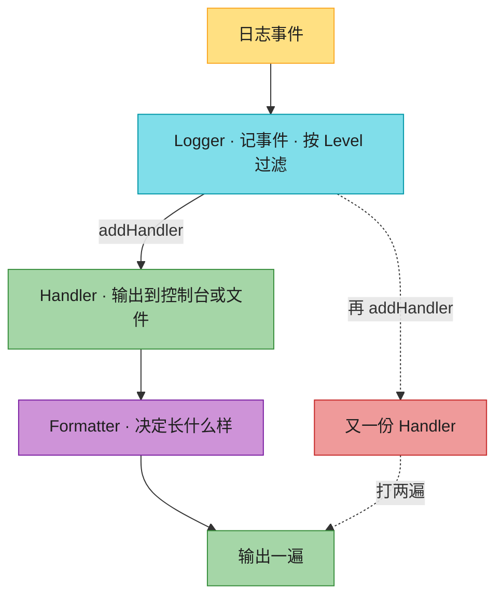

# Ch12 · 现代工具链:logging / 配置 / 项目结构

> **预计**:0.5 天 ｜ **前置**:Ch01(uv 命令)、Ch06(文件 IO)｜ **M2 收官**
> **目标**:把工程化基础打好——学会 `logging`(对比 Java logback/slf4j)、用环境变量/`.env` 管配置、理解 `uv`+`pyproject.toml` 项目结构。为 M3 Web 框架铺路。
> 本章主线:你是「订单服务」(order-service) 的后端负责人,服务明天上线。现在代码里全是 `print`,数据库密码写在源码里。上线前你要完成工程化改造:**print → 具名 logger → 控制台格式化输出 → 级别可配置 → 结构化事件日志 → 配置外置(环境变量 + .env)→ 一键 bootstrap**。

> 📐 **本教程的契约**:§12.2–§12.10 每节**精确对应**作业里的一个任务,讲过的才考,考的必讲过。§12.1 是开胃、§12.11(项目结构)是配置类知识,讲透但不出 pytest 题。卡住时,按对应表回查小节。

---

## 🗺️ 本章地图(元学习 · 原则一)

读完这章 + 完成作业,你将能够:
- 说清 logging 四要素(Logger / Handler / Formatter / Level)各自对应 logback 的什么
- 用 `getLogger` 拿**具名单例** logger,并说清为什么不能直接用 root
- 给 logger 挂 Handler + Formatter,并且**不会因为重复添加把日志打两遍**
- 把配置文件里的字符串 `"DEBUG"` 安全地变成 `logging` 常量,非法值给出清晰报错
- 写**结构化事件日志**(`event=order_created order_id=123`),说清楚为什么比「拼人话」强
- 用 `os.environ` + 手写 `.env` 解析做配置外置,并按 **12-Factor** 规则合并(环境变量优先)
- 用 **dictConfig** 把 logging 配置写成数据(= logback.xml 的 Python 版)
- 看懂 `pyproject.toml` / `uv.lock` / src layout,对应回 Maven 世界

**作业 ↔ 教程对应表**(学哪节,就去做哪题):

| 作业题 | 对应小节 | 核心知识点 |
|--------|----------|-----------|
| `make_logger` | §12.2 | getLogger 具名单例 + setLevel |
| `add_console_handler` | §12.3 | StreamHandler + Formatter + 防重复添加 |
| `parse_level` | §12.4 | 级别名 → 常量:getLevelNamesMapping |
| `log_event` | §12.5 | logger.log + key=value 结构化日志 |
| `get_config` | §12.6 | os.environ.get(key, default) |
| `read_env_file` | §12.7 | .env 手写解析:注释 / export / 引号 / split("=", 1) |
| `load_config` | §12.8 | 12-Factor 合并:环境变量覆盖 .env |
| `build_logging_config` | §12.9 | dictConfig 配置字典 |
| `bootstrap` | §12.10 | 综合:配置 → 级别 → logger → 启动事件 |

---

## ⏱️ 学习路径:费曼五步(约 45-60 分钟)

| 步 | 你要做 | 在哪做 |
|----|--------|--------|
| ① 预览猜(2分钟) | 下面 5 个 Java 场景,猜 Python 怎么写 | 本页 ① |
| ② 先动手 | 打开 `ch12_assignment.py`,**先试着写**(别看教程) | assignment |
| ③ 提取+反馈 | 凭记忆写完 → `uv run pytest` 红绿 | test |
| ④ 费曼(2分钟) | 大白话讲清「单例 logger、handler 防重复、env 覆盖 .env」 | 本页 ④ |
| ⑤ 存闪卡 | 把 [`review.md`](./review.md) 的卡标复习日期 | review.md |

> 💡 **直接性原则**:别通读!先猜 ① → 去 ② 写作业 → **哪题卡了,回对应 § 查** → 改 → 再跑。

---

## ① 预览猜(2 分钟 · 激活你的 Java 直觉)

先别看答案,凭 Java 经验猜一猜(猜错记得更牢):
1. Java 里 `LoggerFactory.getLogger("order")` 拿 logger。Python 标准库里对应的调用长什么样?
2. logback.xml 里 `<appender>` 决定日志输出到控制台还是文件。Python logging 里对应的概念叫什么?
3. 配置中心下发的是字符串 `"DEBUG"`,Java logback 用 `Level.toLevel("DEBUG")` 转。Python 怎么把字符串级别名变成常量?
4. Spring 里 `${DB_PASSWORD}` 从环境变量注入。Python 标准库读环境变量,一行代码怎么写?
5. logback 用 XML 配置。Python 想用一个 **dict** 描述整个 logging 配置,官方入口叫什么?

> 猜完,带着验证心态进入正文。第 3 题的「字符串→常量」和第 5 题的 dictConfig 是 Java 老手最陌生的两块。

---

## §12.1 为什么用 logging 不用 print(开胃 · 不出题)🟢

`print` 只能往屏幕糊一行字:没法按级别开关、没法写文件、分不清是哪个模块打的、上线后没法对接采集系统。`logging` 一次解决全部:

❌ **错误写法**(上线后运维想打人):

```python
print("订单创建成功", order_id)          # 没法关、没法过滤、没法采集
print("DEBUG: 查库存耗时", elapsed)      # 生产上不想看,只能删代码
```

✅ **正确写法**:

```python
import logging
logger = logging.getLogger("order")
logger.info("event=order_created order_id=%s", order_id)   # 可过滤、可写文件、可采集
logger.warning("库存低于阈值")
```

> 🟡 **Java 对比**:你不会在 Java 里用 `System.out.println` 打线上日志,同理别在 Python 里用 `print`。slf4j 是「门面 + logback 实现」两件套;Python `logging` 是标准库内置一家全包,不用引三方依赖。

---

## §12.2 Logger 与级别:getLogger 具名单例(对应:`make_logger`)🟡

### Java 对照最小例

```java
// slf4j:同名拿到同一个 logger(工厂内部缓存)
Logger logger = LoggerFactory.getLogger("order.api");
logger.info("created");
```

```python
import logging

logger = logging.getLogger("order.api")   # 具名 logger,同名返回【同一个】(单例)
logger.setLevel(logging.INFO)             # 设级别:只输出不低于 INFO 的
logger.info("created")
```

`logging.getLogger(name)` 的关键特性:
- **单例**:`logging.getLogger("order") is logging.getLogger("order")` → `True`。跨模块用同一个名字拿到同一个 logger,配置一次,处处生效。
- **层级**:名字按 `.` 分层,`getLogger("order.db")` 是 `order` 的子 logger,默认继承父的配置(M3 你会看到 `uvicorn.access` 就是这种命名)。
- **不传名 = root logger**:`logging.getLogger()` 拿到的是根 logger。库代码里用 root 是事故(会污染整个应用的日志配置),**业务代码永远用具名 logger**。

### 级别:数值越小越啰嗦

```
DEBUG(10) < INFO(20) < WARNING(30) < ERROR(40) < CRITICAL(50)
```

`setLevel(logging.INFO)` 后,DEBUG 直接被丢弃——过滤是「**不低于**」。生产设 INFO,排查问题临时改 DEBUG,不用改代码。

❌ **错误写法**(图省事用模块级快捷函数):

```python
logging.info("订单创建")      # 打的是 root logger!没名字、没模块来源,和别人的日志混成一团
```

✅ **正确写法**(具名 logger,一看名字就知道是哪打的):

```python
logging.getLogger("order.api").info("订单创建")
```

### 真实场景例:订单服务按模块建 logger

```python
api_logger = logging.getLogger("order.api")     # 接口层
db_logger = logging.getLogger("order.db")       # 数据层
db_logger.setLevel(logging.WARNING)             # 数据层只看警告以上,降噪

api_logger is logging.getLogger("order.api")    # True —— 单例,别处的配置这里生效
```

> 💡 本章测试用 pytest 的 `caplog` fixture 抓日志断言(看测试文件即可,不要求会写)——知道「日志是可测试的」这一点就行。

> ✅ 做 `make_logger` 题:`logging.getLogger(name)` → `logger.setLevel(level)` → return。一行都不能多,单例是 `getLogger` 白送的。

---

## §12.3 Handler + Formatter:输出到哪、长什么样(对应:`add_console_handler`)🟡

Logger 只负责「记」,**Handler 决定输出到哪**(= logback 的 Appender),**Formatter 决定长什么样**(= PatternLayout)。

| logging | logback | 职责 |
|---------|---------|------|
| `StreamHandler` | `ConsoleAppender` | 输出到控制台(stderr) |
| `FileHandler` | `FileAppender` | 输出到文件 |
| `Formatter("%(asctime)s ...")` | `<pattern>` | 输出格式 |

### Java 对照最小例

```xml
<!-- logback.xml:控制台 appender + 格式 -->
<appender name="CONSOLE" class="ch.qos.logback.core.ConsoleAppender">
  <encoder><pattern>%d{HH:mm:ss} [%level] %logger: %msg%n</pattern></encoder>
</appender>
```

```python
# Python:代码里拼出来(§12.9 会讲怎么把这段也变成配置)
handler = logging.StreamHandler()                                   # 输出到控制台
handler.setFormatter(logging.Formatter("%(asctime)s [%(levelname)s] %(name)s: %(message)s"))
logger.addHandler(handler)
```

格式串逐段拆:`%(asctime)s` 时间、`%(levelname)s` 级别名、`%(name)s` logger 名(具名的好处在这体现)、`%(message)s` 消息本体。

### 🔴 最大的坑:handler 重复添加 → 日志打两遍

`addHandler` 是**追加**不是替换。初始化函数被调两次(测试反复跑、web 框架双进程预热、手动调用两次),handler 就挂了两份,**每条日志原样打印两遍**——这是 logging 新手第一经典事故:

❌ **错误写法**:

```python
def setup(logger):
    logger.addHandler(logging.StreamHandler())   # 调一次加一个,调三次打三遍!
```

✅ **正确写法**(加之前查重,幂等):

```python
def setup(logger):
    if any(isinstance(h, logging.StreamHandler) for h in logger.handlers):
        return                                   # 已有控制台 handler,直接跳过
    handler = logging.StreamHandler()
    handler.setFormatter(logging.Formatter(FMT))
    logger.addHandler(handler)
```

> 💡 `logging.FileHandler` 是 `StreamHandler` 的子类——`isinstance(h, StreamHandler)` 会把文件 handler 也算进来。本章只有控制台 handler,这个查重够用;混用时要按精确类型查(`type(h) is StreamHandler`)。

### 真实场景例:给订单服务的 logger 统一格式

```python
logger = logging.getLogger("order")
add_console_handler(logger)                      # 第一次:挂上
add_console_handler(logger)                      # 启动流程里被再调一次:安全跳过
len(logger.handlers)                             # 1 —— 幂等,日志不会打两遍
```



**这张图要你看懂：** Logger 只负责记事件并按 Level 过滤；Handler 决定打到控制台还是文件；Formatter 决定长什么样。`addHandler` 是追加不是替换，挂两次就会沿红虚线把同一条日志打两遍。

> ✅ 做 `add_console_handler` 题:遍历 `logger.handlers` 查重 → 没有才 `StreamHandler()` + `setFormatter(Formatter(fmt))` + `addHandler` → 返回 logger(支持链式)。默认格式用作业里给好的 `DEFAULT_FMT`。

---

## §12.4 级别名 → 常量:配置里的 "DEBUG" 怎么变成 20(对应:`parse_level`)🟢

`.env`、配置中心、命令行参数里的日志级别**都是字符串**:`LOG_LEVEL=debug`。而 `setLevel` 要的是 int 常量。这步转换每个项目都有,别自己写 if/elif 链。

### Java 对照最小例

```java
Level level = Level.toLevel("debug");   // logback:字符串 → Level,未知值默认 DEBUG
```

```python
logging.getLevelNamesMapping()          # Python 3.11+:{"DEBUG": 10, "INFO": 20, "WARN": 30, ...}
# 一次性把「全部合法名字 → 数值」给你,查表即可
```

### 真实场景例:读配置定级别,非法值要报人话

❌ **错误写法**(手写映射,漏一个级别就是一个线上 bug;私有 API `_nameToLevel` 没保障):

```python
LEVELS = {"debug": 10, "info": 20, "warning": 30}   # error/critical/warn 呢?
level = logging._nameToLevel[name.upper()]          # 下划线开头 = 私有,版本升级可能没
```

✅ **正确写法**(公共 API 查表 + 归一化 + 明确报错):

```python
def parse_level(name: str) -> int:
    mapping = logging.getLevelNamesMapping()
    key = name.strip().upper()              # 配置里 " Info " 这种脏数据很常见
    if key not in mapping:
        raise ValueError(f"未知日志级别: {name!r}(可选: {', '.join(mapping)})")
    return mapping[key]

parse_level("debug")      # 10
parse_level(" Info ")     # 20 —— 大小写、空白都容忍
parse_level("VERBOSE")    # ValueError: 未知日志级别: 'VERBOSE'(可选: DEBUG, INFO, WARN, ...)
```

> 🟡 **Java 对比**:logback 的 `toLevel` 对未知值**静默返回 DEBUG**——配置写错了你都不知道,线上一直全量 DEBUG。Python 这里没有官方转换函数,自己写时**宁抛勿吞**(Ch06 的「错误要响」原则):配置错了就该在启动时炸出来。

> ✅ 做 `parse_level` 题:`getLevelNamesMapping()` 拿表 → `name.strip().upper()` 归一 → 不在表里 `raise ValueError(...)` → 在就返回数值。

---

## §12.5 logger.log + 结构化事件日志(对应:`log_event`)🟡

### 级别作参数:logger.log(level, msg)

`logger.info(...)` / `logger.warning(...)` 是便捷方法,级别写死在方法名里。当**级别本身是变量**(来自配置、来自事件严重度字段),用通用方法:

```python
logger.log(logging.INFO, "应用启动")              # 等价 logger.info(...)
logger.log(level_from_config, "启动完成")         # 级别是变量,只能用它
```

### 🔴 结构化日志:给机器看,不是给人看

订单事件要进 ELK/Loki 做检索统计。两种写法,采集效果天差地别:

❌ **错误写法**(拼人话——好读,但没法按字段检索):

```python
logger.info(f"订单 {order_id} 创建成功,金额 {amount} 元")
# 想统计「金额>100 的订单」?正则抠字符串去吧
```

✅ **正确写法**(key=value 结构化——采集系统自动切字段):

```python
logger.info(f"event=order_created order_id={order_id} amount={amount}")
# ELK 直接出:order_id: 123, amount: 99.9,可过滤可聚合
```

真实场景(这就是作业 `log_event` 的契约):

```python
log_event(logger, logging.INFO, "order_created", order_id=123, amount=99.9)
# 实际记录: event=order_created order_id=123 amount=99.9

log_event(logger, logging.WARNING, "payment_slow", order_id=123, elapsed_ms=2300)
# 实际记录: event=payment_slow order_id=123 elapsed_ms=2300
```

实现就一层皮:`**fields` 收成 dict(保持传入顺序,Ch04),列表推导拼 `k=v`,`" ".join` 连接,`logger.log(level, message)` 收尾。没有 fields 时消息就是 `event=xxx` 本身,别多出尾巴空格。

> 🟡 **附注**:对「纯人话」日志,官方推荐 `logger.info("user %s", name)` 惰性插值(级别被过滤就不拼字符串,省 CPU)。结构化日志的消息是确定要拼的,用 f-string 没问题——知道两者的分工即可。

> ✅ 做 `log_event` 题:`" ".join(f"{k}={v}" ...)` 拼字段 → `f"event={event}"` 前缀 → `logger.log(level, message)`。

---

## §12.6 配置第一来源:环境变量 os.environ(对应:`get_config`)🟡

**铁律**:数据库 DSN、API key、端口——一切「随环境变」或「需要保密」的值,**绝不写进代码**。部署时注入环境变量,代码只管读。

### Java 对照最小例

```java
String dsn = System.getenv("ORDER_DB_DSN");          // 不存在返回 null
// Spring 更常见:@Value("${ORDER_DB_DSN:sqlite:///orders.db}") 带默认值
```

```python
import os

dsn = os.environ.get("ORDER_DB_DSN", "sqlite:///orders.db")   # 不存在用默认
```

### 真实场景例:同一套代码,三个环境三份配置

```bash
# 开发机:不设,走默认 sqlite
uv run python -m order_app
# 测试环境:指向测试库
ORDER_DB_DSN="postgres://u:p@test-db:5432/orders" uv run python -m order_app
# 生产:K8s/Docker 注入,密码全程不出现在代码和 git 里
```

### 🔴 空字符串陷阱:有值 ≠ 有「效」值

❌ **错误写法**(`or` 会把**空字符串**也当「没配」,语义错了):

```python
dsn = os.environ.get("ORDER_DB_DSN") or "sqlite:///orders.db"
# 运维故意配 ORDER_DB_DSN=""(表示"禁用外部库")→ 被 or 吞掉,悄悄走了 sqlite!
```

✅ **正确写法**(`dict.get` 的默认值只在 **key 不存在** 时生效):

```python
os.environ.get("CH12_DEMO")          # 未设置 → None(不加默认时)
os.environ.get("CH12_DEMO", "8000")  # 未设置 → "8000";设置了 "" → 返回 ""(尊重显式配置)
```

> 🟡 **Java 对比**:`System.getenv` 返回 `null`,没有「默认值」参数——Spring 的 `${KEY:default}` 才有。Python 的 `os.environ.get(key, default)` 把两者合一。注意 `os.environ["KEY"]` 方括号取值在缺失时抛 `KeyError`,读配置一律用 `.get`。

> ✅ 做 `get_config` 题:就一行 `os.environ.get(key, default)`。测试里有一条「空字符串也是值」的用例专治 `or` 写法。

---

## §12.7 .env 文件手写解析(对应:`read_env_file`)🟡

环境变量适合部署注入;**开发机**上更方便的是项目根目录放一个 `.env` 文件(记得加进 `.gitignore`!):

```
# 订单服务本地配置
DB_HOST=localhost
DB_PORT=5432
export APP_PORT=8000
API_KEY="abc=def"
```

生产环境用三方库 `python-dotenv` 自动加载;本章**手写解析**——它就是把 Ch03 的文件逐行处理 + Ch06 的 `read_text` 串起来,顺带理解 dotenv 的规则。

### 解析规则(行业事实标准,共 5 条)

| 规则 | 例子 | 结果 |
|------|------|------|
| 空行、`#` 注释行跳过 | `# 注释` / 空行 | 忽略 |
| 可选 `export ` 前缀(docker-compose 风格) | `export APP_PORT=8000` | 键是 `APP_PORT` |
| 只切**第一个** `=` | `API_KEY=abc=def` | 值是 `abc=def` |
| 键值两侧去空白 | `DB_HOST = localhost` | `localhost` |
| 成对引号去掉(值里常含 `#`/`=`) | `API_KEY="abc=def"` | `abc=def` |

### 🔴 split 不带 maxsplit:值里的等号被切碎

❌ **错误写法**:

```python
key, value = line.split("=")     # "API_KEY=abc=def" → 3 段!解包直接 ValueError
```

✅ **正确写法**(maxsplit=1:只切第一刀):

```python
key, value = line.split("=", 1)  # ["API_KEY", "abc=def"] ✓
```

> 🟡 **Java 对比**:Java `Properties.load()` 能读 `key=value`,但不认 `export` 前缀、不去引号、`#` 只能整行注释——各家 dotenv 实现细节一致(上表 5 条),Python 三方库 `python-dotenv` 同样遵守。手写一遍,以后看任何语言的 dotenv 都是老熟人。

### 完整解析循环(作业 `read_env_file` 的结构)

```python
for line in Path(path).read_text(encoding="utf-8").splitlines():
    line = line.strip()
    if not line or line.startswith("#"):
        continue                      # 空行 / 注释
    if line.startswith("export "):
        line = line[len("export "):].strip()
    if "=" not in line:
        continue                      # 没有等号的行(如单独的 flag)跳过
    key, value = line.split("=", 1)
    key, value = key.strip(), value.strip()
    if len(value) >= 2 and value[0] == value[-1] and value[0] in ("'", '"'):
        value = value[1:-1]           # 成对引号去掉
    config[key] = value
```

对上面那份 `.env` 跑,得到 `{"DB_HOST": "localhost", "DB_PORT": "5432", "APP_PORT": "8000", "API_KEY": "abc=def"}`——**值全是字符串**(`"5432"` 不是 int;要 int 后面自己转,本章不需要)。

> 💡 本章**不支持**行内注释(`KEY=v # 备注`),真实 dotenv 对引号内 `#` 的处理很绕,学了不值。教程不讲 = 作业不考。

> ✅ 做 `read_env_file` 题:照上面的循环写,7 行逻辑对应 5 条规则。

---

## §12.8 12-Factor 合并:环境变量覆盖 .env(对应:`load_config`)🟢

两个配置源同时存在时谁赢?**12-Factor App** 的回答:环境变量赢——`.env` 只是「本地默认值」,部署环境的显式注入永远优先。Spring 的优先级(`Environment` 变量 > `application.properties`)是同一套思想。

### 真实场景例

```bash
# .env 里:APP_PORT=8000(本地默认)
# 测试环境注入:APP_PORT=9000
load_config(".env")  →  {"APP_PORT": "9000", ...}   # 环境变量覆盖文件值
```

### 合并规则(注意第二条,最易错)

1. 先按 §12.7 的规则读 `.env` 得到基础 dict;
2. **只遍历文件里已有的键**去环境变量里找覆盖——**不是**把整个 `os.environ` 倒进来:

❌ **错误写法**(把系统几百个环境变量全吸进应用配置,`PATH`、`HOME` 全在里面,埋雷无数):

```python
config = {**read_env_file(path), **dict(os.environ)}
```

✅ **正确写法**(文件的键集合决定配置的形状,环境变量只负责覆盖值):

```python
for key in list(config):            # 只遍历 .env 里定义过的键
    if key in environ:
        config[key] = environ[key]
```

> 🟡 **Java 对比**:Spring Boot 的配置项也是「声明过的属性才生效」——`application.properties` 里有的键才被 `@Value` 绑定,系统环境变量只参与覆盖。**配置的形状由文件定义,值由环境覆盖**。`python-dotenv` 的 `load_dotenv()` 默认同样是「已存在的环境变量优先」(`override=False`)。

> ✅ 做 `load_config` 题:§12.7 的解析循环内联一遍(每题独立可测,不调用 `read_env_file`)→ 再按上面两条规则合并 `environ`(参数为 None 时用 `os.environ`)。

---

## §12.9 dictConfig:把 logging 配置写成数据(对应:`build_logging_config`)🔴

§12.3 用代码拼 handler/formatter。更工程化的做法:整个 logging 配置写成**一个 dict**——可以放 YAML/JSON/配置中心,改配置不改代码。这就是 `logging.config.dictConfig`,**logback.xml 的 Python 版**。

### 配置字典的四个固定部件

```python
cfg = {
    "version": 1,                          # 固定写 1(目前唯一版本,必填)
    "formatters": {
        "standard": {"format": "%(asctime)s [%(levelname)s] %(name)s: %(message)s"},
    },
    "handlers": {
        "console": {                       # handler 的名字(自定义,被 logger 引用)
            "class": "logging.StreamHandler",   # 类型(= logback 的 appender class)
            "formatter": "standard",            # 引用 formatters 里的名字
            "level": logging.INFO,
        },
    },
    "root": {"level": logging.INFO, "handlers": ["console"]},   # root logger 挂哪些 handler
}

import logging.config
logging.config.dictConfig(cfg)             # 一口气配好,= 加载 logback.xml
```

对照 logback:`formatters` ≈ `<encoder>` 的 pattern 注册表,`handlers` ≈ `<appender>` 列表,`root` ≈ `<root>` 节点。dict 里 handler 之间用**名字**互相引用(`"formatter": "standard"`),和 XML 的 id 引用一个思路。

### 真实场景例:加文件输出 = dict 里加一项

上线要求「控制台 + 文件双写」。代码拼装要加三行,dict 配置只要加一个 handler 并把名字挂进 root:

```python
cfg["handlers"]["file"] = {
    "class": "logging.FileHandler",
    "filename": "logs/order.log",
    "formatter": "standard",
    "level": logging.DEBUG,        # 文件里记全量 DEBUG,控制台只看 INFO —— 分级输出
}
cfg["root"]["handlers"] = ["console", "file"]
```

控制台 INFO、文件 DEBUG 的「分级双写」是生产标配:屏幕不刷屏,文件里细节全留。这就是作业 `build_logging_config(level, log_file)` 的完整逻辑——`log_file=None` 时只有 console,给了路径就加 file。

> 🔴 **注意**:`"version": 1` 必须写,缺了 `dictConfig` 直接 `ValueError`;handler 引用的 formatter 名字必须存在,否则同样在加载时报错——dictConfig 在**加载时**做校验,配错了启动就炸,和 logback 一样「fail fast」。

> ✅ 做 `build_logging_config` 题:按上面的结构组 dict(version / formatters / handlers / root 四件套),`log_file` 非 None 才加 file handler 并 append 进 root 的 handlers 列表。测试最后会拿你的 dict 真喂给 `dictConfig`——结构不合法当场现形。

---

## §12.10 综合:bootstrap 启动序列(对应:`bootstrap`)🔴

把整条链串起来,这就是每个服务 `main()` 开头的固定动作:

```
读 .env(§12.7) → 环境变量覆盖(§12.8) → 级别名转常量(§12.4)
→ 建具名 logger(§12.2) → 挂控制台 handler(§12.3,幂等)
→ 记一条结构化启动事件(§12.5)
```

```python
def bootstrap(env_path, environ=None):
    environ = os.environ if environ is None else environ

    # ① 读 .env(§12.7 解析循环内联)
    config = {}
    for line in Path(env_path).read_text(encoding="utf-8").splitlines():
        ...                                          # 同 §12.7,略
    # ② 环境变量覆盖(§12.8)
    for key in list(config):
        if key in environ:
            config[key] = environ[key]
    # ③ 级别名 → 常量(§12.4),没配默认 INFO
    level = logging.getLevelNamesMapping()[config.get("LOG_LEVEL", "INFO").strip().upper()]
    # ④ 具名 logger + 幂等挂 handler(§12.2/§12.3)
    logger = logging.getLogger("order")
    logger.setLevel(level)
    if not any(isinstance(h, logging.StreamHandler) for h in logger.handlers):
        handler = logging.StreamHandler()
        handler.setFormatter(logging.Formatter(DEFAULT_FMT))
        logger.addHandler(handler)
    # ⑤ 结构化启动事件(§12.5):固定用 INFO 记,交给 logger 级别去过滤
    logger.info(f"event=app_started port={config.get('APP_PORT', '8000')}")
    return logger
```

对 `.env`(`LOG_LEVEL=debug` / `APP_PORT=9000`)跑:logger 级别 10(DEBUG)、控制台 handler 恰好 1 个、打出 `event=app_started port=9000`。若部署环境注入 `LOG_LEVEL=warning`,则级别变 30,启动事件(INFO)被过滤掉——**过滤发生在 logger 的级别上**,§12.2 的「不低于」规则在这里闭环。

> 💡 真实项目里 `bootstrap` 会直接调你写好的 `load_config` / `make_logger` / `add_console_handler`;本章作业为了让每题独立可测(web 端单题运行时其他函数还是骨架),把链条内联完整走一遍——正好当作全章总复习。

> ✅ 做 `bootstrap` 题:按 ①→⑤ 顺序内联实现,logger 名固定 `"order"`,启动事件固定 INFO 级别、格式 `event=app_started port=<端口>`。

---

## §12.11 项目结构:uv + pyproject.toml(配置类,讲透不出题)🔴

M3 前必须理解的工程化基础,看你每天都在用的东西。

### pyproject.toml = pom.xml

本项目的 `pyproject.toml` 就是标准结构:

```toml
[project]
name = "python-learning"
requires-python = ">=3.11"
dependencies = ["pytest>=8.0", ...]          # 基础依赖

[project.optional-dependencies]               # 可选依赖组
web = ["fastapi>=0.110", "uvicorn", ...]      # 学到 M3 再装
ai = ["anthropic", "openai", ...]

[tool.pytest.ini_options]                     # 各工具自己的配置段
testpaths = ["01_python_core", "02_stdlib", ...]
```

> 🟡 **Java 对比**:`[project]` ≈ `<dependencies>`;`optional-dependencies` ≈ Maven profiles(按需激活);`[tool.xxx]` ≈ Maven plugins 配置。一个文件管所有,这是现代 Python 的标准(PEP 621)。

### uv:现代包管理(本项目在用)

```bash
uv venv                    # 建虚拟环境(= python -m venv .venv)
uv add fastapi             # 装包并写进 pyproject(= mvn install + 改 pom)
uv sync --extra web        # 按 pyproject + uv.lock 同步依赖(含 web 组)
uv run pytest              # 在项目环境里跑命令(自动用 .venv)
```

`uv.lock` 锁定精确版本(≈ Maven 的 `<dependencyManagement>` 锁版本),保证任何机器装出相同环境——**lock 文件必须进 git**。

### 标准项目布局(M3 会用到)

```
myproject/
├── pyproject.toml         # 项目配置
├── uv.lock                # 依赖锁(进 git)
├── src/myproject/         # src layout:包代码
│   ├── __init__.py        # 标记这是一个包(空文件即可)
│   └── main.py
├── tests/                 # 测试
├── .env                   # 本地配置(不进 git!)
└── .gitignore
```

本项目是「学习项目」,按章节分目录;正式项目用上面的 `src` layout。`import` 时的绝对/相对导入(`from .db import conn`)M3 实战里用,现在知道 `__init__.py` 是「包标记」即可。

---

## §12.12 Java 老手常踩的坑 ⚠️

1. **print 调试进生产**:正式代码用 logging;print 没法关级别、没法写文件、没法分模块(§12.1)。
2. **直接用 root logger**:`logging.info(...)` 打的是 root,没名字没来源;业务代码永远 `getLogger("模块名")`(§12.2)。
3. **handler 重复添加**:`addHandler` 是追加,初始化跑两次日志打两遍。加之前 `any(isinstance(...))` 查重(§12.3)。
4. **手写级别映射表**:`getLevelNamesMapping()` 是公共 API;`_nameToLevel` 带下划线是私有。未知级别**宁抛勿吞**(§12.4)。
5. **日志拼人话**:要进采集系统的事件日志用 `key=value` 结构化,字段可检索可聚合(§12.5)。
6. **`or` 给环境变量默认值**:空字符串是有意的配置,会被 `or` 吞掉;用 `os.environ.get(key, default)`(§12.6)。
7. **`split("=")` 不带 maxsplit**:值里含 `=` 就崩;`split("=", 1)` 只切第一刀(§12.7)。
8. **把整个 os.environ 合并进配置**:配置的形状由 .env 文件定义,环境变量只覆盖已有键的值(§12.8)。
9. **`.env` 进 git**:密钥泄露事故头号来源。`.gitignore` 必须含 `.env`,`uv.lock` 反而**必须**进 git(§12.11)。

---

## 📝 本章作业

打开 **`ch12_assignment.py`**,9 个任务,一条主线串起来:给订单服务建 logger → 挂控制台输出 → 级别可配置 → 结构化事件 → 配置外置(环境变量 + .env)→ dictConfig → 一键 bootstrap。

| 任务 | 知识点 | 难度 |
|------|--------|------|
| `make_logger` | getLogger 单例 + setLevel | 🟢 |
| `add_console_handler` | StreamHandler + Formatter + 幂等 | 🟡 |
| `parse_level` | getLevelNamesMapping + ValueError | 🟢 |
| `log_event` | logger.log + key=value 结构化 | 🟡 |
| `get_config` | os.environ.get | 🟢 |
| `read_env_file` | .env 解析 5 规则 | 🟡 |
| `load_config` | env 覆盖 .env | 🟡 |
| `build_logging_config` | dictConfig 字典 | 🔴 |
| `bootstrap` | 综合全链路 | 🔴 |

```bash
uv run pytest 02_stdlib/ch12/test_ch12_assignment.py -v
```

全绿 = 掌握 Ch12 = **M2 标准库毕业** 🎓。卡住 → 按对应表回查 §。

---

## ✅ 自测:你真的掌握了吗?

- [ ] 能说清 logging 四要素各对应 logback 的什么(§12.2/§12.3)
- [ ] 解释 `getLogger` 单例 + 层级,知道为什么不用 root(§12.2)
- [ ] 说出 handler 重复添加的后果和防法(§12.3)
- [ ] 会把 `"debug"` 转成常量,并对非法值抛 ValueError(§12.4)
- [ ] 说清结构化日志 `key=value` 为什么比拼人话强(§12.5)
- [ ] 说清 `get(key, default)` 和 `or` 的空串语义差异(§12.6)
- [ ] 默写 .env 解析 5 条规则(§12.7)
- [ ] 说清「形状由文件定义,值由环境覆盖」(§12.8)
- [ ] 写出 dictConfig 四件套并说清引用关系(§12.9)
- [ ] 9 个作业全绿

---

## 🎓 费曼挑战(直觉 · Ultralearning 原则八)

> 用大白话讲给「Java 同事」听。讲不清 = 没懂,回查对应 §。

任选一题,讲清楚(1-2 分钟):
1. 「logging 四要素 vs logback,为什么 handler 要防重复添加?」— 卡壳重读 §12.3
2. 「为什么配置要外置?`.env` 和环境变量同时存在谁赢,为什么?」— 卡壳重读 §12.8
3. 「dictConfig 和 logback.xml 是不是一回事?四个部件各管什么?」— 卡壳重读 §12.9

✅ 自检:不查资料,能说清「为什么」吗?

## 🧠 记忆闪卡(⑤ · 原则七)

→ 本章闪卡在 [`review.md`](./review.md)。学完标复习日期(1/3/7 天)。

---

## ⏭️ 下一步:M2 毕业,进入 M3

恭喜!Ch08–Ch12 完成,Python **标准库**核心你已掌握(collections / itertools / 正则 / json / datetime / logging)。

下一站 **M3 Web 框架 FastAPI**(Ch13–22):从「调 API」到「写 API」,搭一个带数据库、认证、测试的完整 RESTful 服务——你会看到 FastAPI 项目正是本章的 `pyproject.toml` + `.env` + 具名 logger 这套工程化结构的真实应用。

> 建议进 M3 前,先把 M1(Ch02–07)+ M2(Ch08–12)的费曼挑战和闪卡过一遍——语言和标准库的基础现在成体系了,M3 会大量用到。
