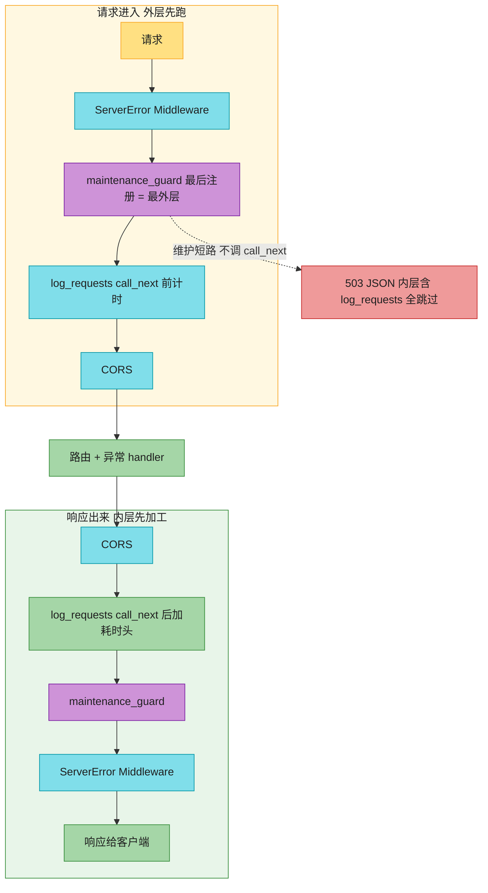
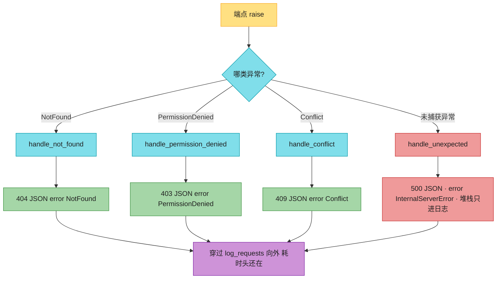

# Ch17 · 中间件、CORS、异常处理

> **预计**:0.5 天 ｜ **前置**:Ch16(依赖注入)｜ **M3 第一批(Ch13–17)收尾**
> **目标**:掌握 FastAPI 上生产的三类工程化能力——**中间件**(= Servlet Filter / Interceptor)、**全局异常处理**(= `@ControllerAdvice`)、**CORS** 跨域(= `@CrossOrigin` / CorsFilter)。
> 本章主线:「极客商城」商品 API 要上线了,架构组的投产 checklist 卡了你三道:① 每个请求要有**访问日志 + 耗时**;② 运维要能一键切**维护模式**(全站 503 但 /health 保活);③ 所有错误必须返回**统一格式** `{"error": 机器码, "message": 人话}`——不管 404、403、409 还是 500。前端同事还补了一句:联调时浏览器报 **CORS** 错,记得放行。

> 📐 **本教程的契约**:§17.2–§17.3 对应 2 个中间件,§17.4–§17.5 对应 4 个全局异常处理器,§17.6 对应 3 个抛业务异常的端点。§17.1 是开胃、§17.7 CORS 已配好(只读)、§17.8/§17.9 是坑与速查。卡住时按对应表回查小节。

---

## 🗺️ 本章地图(元学习 · 原则一)

读完这章 + 完成作业,你将能够:
- 说清中间件的**洋葱模型**:`call_next` 之前的代码在请求进入时跑,之后的在响应出来时跑
- 写**计时/日志中间件**:`await call_next(request)` 放行,拿到 response 后加响应头、记日志
- 写**短路中间件**:不调 `call_next` 直接返回响应,内层(含路由)全不执行;并说清**注册顺序**(后注册 = 外层 = 先执行)
- 设计**自定义业务异常体系**(404/403/409),用 `@app.exception_handler` 统一映射成同一套错误格式
- 注册**兜底 `Exception` 处理器**:500 也格式化,日志记完整堆栈,响应不泄露内部细节
- 说清 CORS 的配置与 `*` + credentials 的坑

**作业 ↔ 教程对应表**(学哪节,就去做哪题):

| 作业题 | 对应小节 | 核心知识点 |
|--------|----------|-----------|
| `log_requests` | §17.2 | 中间件洋葱模型:`await call_next` + 改响应头 + 访问日志 |
| `maintenance_guard` | §17.3 | 短路中间件:不调 call_next 直接返回 + 注册顺序 |
| `handle_not_found` | §17.4 | `@app.exception_handler` → 404 统一格式 |
| `handle_permission_denied` | §17.4 | 同上 → 403;异常实例携带上下文字段 |
| `handle_conflict` | §17.4 | 同上 → 409;创建冲突的标准码 |
| `handle_unexpected` | §17.5 | 兜底 `Exception` → 500;记堆栈 + 不泄露细节 |
| `get_product` | §17.6 | 端点 raise 业务异常,响应交给处理器 |
| `delete_product` | §17.6 | 先 404 再 403 的守卫顺序 |
| `create_product` | §17.6 | POST 冲突 → 409;201 创建 |

---

## ⏱️ 学习路径:费曼五步(约 45-60 分钟)

| 步 | 你要做 | 在哪做 |
|----|--------|--------|
| ① 预览猜(2分钟) | 下面 5 个 Spring 场景,猜 FastAPI 怎么写 | 本页 ① |
| ② 先动手 | 打开 `ch17_assignment.py`,**先试着写**(别通读) | assignment |
| ③ 提取+反馈 | 凭记忆写完 → `uv run pytest` 红绿 | test |
| ④ 费曼(2分钟) | 大白话讲清「洋葱模型、短路、统一错误格式」 | 本页 ④ |
| ⑤ 存闪卡 | 把 [`review.md`](./review.md) 的卡标复习日期 | review.md |

> 💡 **直接性原则**:别通读!先猜 ① → 去 ② 写作业 → **哪题卡了,回对应 § 查** → 改 → 再跑。
> 本章作业形态:`填中间件/处理器/端点函数体`。测试用 `TestClient` 发真 HTTP 语义请求;3 个业务异常处理器也被直接单测(它们就是普通函数)。

---

## ① 预览猜(2 分钟 · 激活你的 Java 直觉)

先别看答案,凭 Spring 经验猜:
1. Spring 用 `Filter` / `HandlerInterceptor` 在请求前后做横切(日志/计时/鉴权)。FastAPI 对应什么?
2. Filter 里不调 `chain.doFilter()` 直接写回响应(比如鉴权失败),FastAPI 中间件怎么「短路」?
3. Spring 用 `@ControllerAdvice` + `@ExceptionHandler` 把业务异常统一映射成错误响应。FastAPI 怎么注册?
4. 一个**没注册处理器的 bug 异常**(如 RuntimeError),用户应该看到堆栈吗?服务端又该在哪记堆栈?
5. 前端 `http://localhost:5173` 调后端 `http://localhost:8000` 被浏览器拦,后端要加什么响应头、怎么配?

> 猜完带着验证心态进正文。第 2 题的**短路**和第 3 题的**统一错误格式**是本章最高频考点。

---

## §17.1 为什么需要中间件与全局异常处理(开胃 · 不出题)🟢

没有这些机制时,商品 API 的每个端点都长这样——业务 1 行,横切 N 行:

```python
@app.get("/products/{product_id}")
def get_product(product_id: int):
    start = time.perf_counter()                 # 计时(每个端点抄一遍)
    try:
        if product_id not in PRODUCTS:
            return JSONResponse(status_code=404, content={"error": "NotFound", ...})  # 错误格式手写 N 处
        return PRODUCTS[product_id]
    except Exception as e:
        logger.exception("boom")                # 兜底(每个端点抄一遍)
        return JSONResponse(status_code=500, content={...})
    finally:
        logger.info("耗时 %.2fms", (time.perf_counter() - start) * 1000)
```

问题:计时 / 日志 / 错误格式化是**横切关注点**,抄 N 遍、改一处漏 N 处。FastAPI 的解法和 Spring 一样:**把横切逻辑下沉到框架层**——中间件管「请求前后」,异常处理器管「异常 → 响应」。

### Java 对照最小例

```java
// Spring:Filter 管前后,@ControllerAdvice 管异常
@Component
public class AccessLogFilter extends OncePerRequestFilter {
    protected void doFilterInternal(HttpServletRequest req, HttpServletResponse res, FilterChain chain) {
        long start = System.nanoTime();
        chain.doFilter(req, res);                          // 放行
        res.addHeader("X-Process-Time-ms", ...);           // 响应出来时加工
    }
}

@RestControllerAdvice
public class GlobalErrors {
    @ExceptionHandler(NotFoundException.class)
    public ResponseEntity<ErrorBody> notFound(NotFoundException e) {
        return ResponseEntity.status(404).body(new ErrorBody("NotFound", e.getMessage()));
    }
}
```

```python
# FastAPI:一个装饰器 + 一个函数,各搞定一件事
@app.middleware("http")
async def log_requests(request, call_next): ...      # §17.2,= Filter

@app.exception_handler(NotFoundError)
def handle_not_found(request, exc): ...              # §17.4,= @ControllerAdvice
```

> 🟢 **秒懂**:你在 Spring 里早就干过这些事,FastAPI 只是把它们压缩成「装饰器 + 函数」。本章真正的新知识只有三个:**`call_next` 的洋葱语义、短路写法、兜底 500 的安全纪律**。

---

## §17.2 中间件基础:洋葱模型与请求计时(对应:`log_requests`)🔴

中间件在**每个请求**前后执行,用于横切关注点(日志、计时、鉴权、CORS)。结构是**洋葱**——请求层层进入、响应层层出来:

```python
@app.middleware("http")
async def log_requests(request: Request, call_next):
    # —— 请求进来时执行(call_next 之前)——
    start = time.perf_counter()
    response = await call_next(request)     # 放行:交给下一层中间件/路由
    # —— 响应出来时执行(call_next 之后)——
    duration_ms = (time.perf_counter() - start) * 1000
    response.headers["X-Process-Time-ms"] = f"{duration_ms:.2f}"
    return response
```

### Java 对照最小例

```java
// Servlet Filter:chain.doFilter 之前 = 请求进,之后 = 响应出——和 call_next 一模一样
public void doFilter(ServletRequest req, ServletResponse res, FilterChain chain) {
    long start = System.nanoTime();
    chain.doFilter(req, res);               // 放行
    long took = (System.nanoTime() - start) / 1_000_000;
    ((HttpServletResponse) res).addHeader("X-Process-Time-ms", String.valueOf(took));
}
```

`chain.doFilter` ↔ `await call_next`,语义一一对应;差别只在 `call_next` 是 async,**必须 `await`**(Ch18 详讲异步)。

### 真实场景例(商城访问日志)

本章用模块级 `REQUEST_LOG: list[str]` 模拟访问日志,每处理完一个请求追加一行「方法 路径 -> 状态码」:

```text
GET /health 一次        -> 响应头含 X-Process-Time-ms;REQUEST_LOG == ["GET /health -> 200"]
GET /products/999(404)  -> 依然有耗时头!REQUEST_LOG 记 "GET /products/999 -> 404"
GET /health + /products/1 -> ["GET /health -> 200", "GET /products/1 -> 200"]
```

**为什么 404 也有耗时头?** 异常处理器(§17.4)在中间件的**内层**,404 响应生成后向外返回时仍会穿过你的中间件——洋葱模型最直观的证据,测试专门断言了这一点。

三个关键点:
1. `call_next(request)` 是「放行」,返回 `response`,你可以在 return 前**修改它**(加响应头)。
2. `call_next` **之前**的代码 = 请求进入时跑;**之后**的 = 响应出来时跑。
3. 中间件必须 `return` 一个响应——`call_next` 的返回值就是你往外交的东西。

❌ **错误写法 1**(忘 `await`,Java 老手第一反应):

```python
response = call_next(request)      # 拿到的是协程对象,不是响应!
response.headers[...] = ...        # AttributeError: 'coroutine' object has no attribute 'headers'
```

✅ **正确写法**:`response = await call_next(request)`。

❌ **错误写法 2**(用 `time.time()` 计时):

```python
start = time.time()   # 墙钟:NTP 校时/夏令时会跳变,算出的耗时可能是负数!
```

✅ **正确写法**:`time.perf_counter()`——单调钟,专为计时设计。

> 🟡 **Java 对比**:`time.perf_counter()` ≈ `System.nanoTime()`(单调、只管间隔),`time.time()` ≈ `System.currentTimeMillis()`(墙钟、会被校时影响)。计时永远用前者。

> ✅ 做 `log_requests`:`start` → `await call_next` → 算耗时 → 加 `X-Process-Time-ms` 头 → `REQUEST_LOG.append(...)` → `return response`。格式见 docstring,测试逐字符断言日志行。

---

## §17.3 短路中间件与注册顺序:维护模式(对应:`maintenance_guard`)🔴

中间件不是只能「放行 + 加工」——**不调 `call_next` 就是短路**:你自己返回一个响应,内层所有中间件和路由全不执行。

### Java 对照最小例

```java
// Filter 里的经典短路:鉴权失败直接写 401,不调 chain.doFilter
if (!valid(token)) {
    res.setStatus(401);
    res.getWriter().write("{\"error\":\"Unauthorized\"}");
    return;                                  // 不放行,Controller 根本不会执行
}
chain.doFilter(req, res);
```

```python
# FastAPI:不调 call_next,直接 return 响应
@app.middleware("http")
async def maintenance_guard(request: Request, call_next):
    if MAINTENANCE_MODE and request.url.path != "/health":
        return JSONResponse(
            status_code=503,
            content={"error": "Maintenance", "message": "系统维护中,请稍后重试"},
        )
    return await call_next(request)
```

### 真实场景例(商城维护模式)

运维半夜发版,开关 `MAINTENANCE_MODE = True` 一打:

```text
维护中 GET /products/1  -> 503 {"error": "Maintenance", ...};REQUEST_LOG 不增加、无耗时头
维护中 GET /health      -> 200(保活!负载均衡器靠它探活,挡掉会被摘流量)
恢复后 GET /products/1  -> 200
```

**为什么 `/health` 要豁免?** 维护模式的目的是挡业务流量,不是装死——LB/k8s 的健康检查必须继续返回 200,否则 Pod 会被误判下线。

### 注册顺序:后注册 = 外层 = 先执行

本章注册顺序是 CORS → `log_requests` → `maintenance_guard`。后注册的 `maintenance_guard` 落在洋葱最外层,请求进来时最先执行。

所以维护短路时,`log_requests` **根本轮不到跑**——测试断言了「`REQUEST_LOG` 为空、响应无 `X-Process-Time-ms`」,这就是「外层短路,内层全跳过」的证据。

> 🟡 **Java 对比**:和 Spring `FilterRegistrationBean.setOrder(...)` / Security 过滤器链同理——**越外层越先拦**。鉴权、维护开关这类「一刀切」逻辑要放外层。



**这张图要你看懂：**请求从上往下层层进入、响应从下往上层层出来;`maintenance_guard` 最后注册所以在最外层、最先执行。维护一短路就不调 `call_next`,内层的 `log_requests`(计时、访问日志)根本不会跑。

❌ **错误写法**(想短路却调了 `call_next`):

```python
if MAINTENANCE_MODE:
    response = await call_next(request)   # 业务照样执行了,503 只是贴上去的皮!
    response.status_code = 503
    return response
```

✅ **正确写法**:直接 `return JSONResponse(status_code=503, content={...})`,不碰 `call_next`。

> 🟡 **`JSONResponse` 第一位置参数是 `content`**,不是状态码。必须写关键字:`JSONResponse(status_code=503, content={...})`。写成 `JSONResponse(503, {...})` 会把 `503` 当成 body、`dict` 当成 status_code,直接 `TypeError`。

> ✅ 做 `maintenance_guard`:`MAINTENANCE_MODE and path != "/health"` → 直接返回 503 JSON;否则 `return await call_next(request)`。只读模块级开关不需要 `global`(只有赋值才要)。

---

## §17.4 业务异常体系 + 全局异常处理器(对应:`handle_not_found` / `handle_permission_denied` / `handle_conflict`)🔴

**问题**:端点里 `raise NotFoundError("商品", 999)`,你希望它自动变成「404 + 统一 JSON」,而不是 500 或框架默认错误体。

**解法**:① 定义业务异常类(携带上下文字段)→ ② `@app.exception_handler(异常类型)` 注册处理器 → ③ 端点只管 `raise`。

### Java 对照最小例

```java
@RestControllerAdvice
public class GlobalErrors {
    @ExceptionHandler(NotFoundException.class)
    public ResponseEntity<ErrorBody> notFound(NotFoundException e) {
        return ResponseEntity.status(404)
            .body(new ErrorBody("NotFound", e.getResource() + " " + e.getId() + " 不存在"));
    }
}
```

```python
from fastapi.responses import JSONResponse

@app.exception_handler(NotFoundError)
def handle_not_found(request: Request, exc: NotFoundError):
    # exc 就是端点抛出的异常实例;request 是请求对象(本例用不到)
    return JSONResponse(
        status_code=404,
        content={"error": "NotFound", "message": f"{exc.resource} {exc.id} 不存在"},
    )
```

### 真实场景例(商城统一错误格式)

架构组规定:**所有**错误响应都是 `{"error": 机器可读码, "message": 给人看的话}` 两键,前端只认这一套。本章的异常体系:

| 业务异常 | 状态码 | error | 触发场景(§17.6 端点) |
|---------|--------|-------|----------------------|
| `NotFoundError(resource, id)` | 404 | `"NotFound"` | 商品不存在(get/delete) |
| `PermissionDeniedError(username, action)` | 403 | `"PermissionDenied"` | 删别人的商品 |
| `ConflictError(resource, id)` | 409 | `"Conflict"` | 上架时 id 撞了 |

```text
GET /products/999                  -> 404 {"error": "NotFound", "message": "商品 999 不存在"}
DELETE /products/1(X-Username: bob)-> 403 {"error": "PermissionDenied", "message": "用户 bob 无权删除商品 1"}
POST /products {"id": 1, ...}      -> 409 {"error": "Conflict", "message": "商品 1 已存在"}
```

**好处**:业务代码只管 `raise`(干净),错误格式集中在一处(改格式只改处理器);异常实例**携带字段**(`resource`/`id`/`username`),处理器拼消息时直接用,比到处格式化字符串靠谱。

> 🟡 **和 Ch16 的 HTTPException 什么关系?** `HTTPException(404, detail=...)` 适合「抛一次就完」的简单场景;当**同一类异常在多处抛、要统一格式、要携带结构化字段**时,就毕业到自定义异常体系。Ch16 的鉴权 401 用 HTTPException 很合适;本章商城的三类业务错误需要统一格式,所以自定义。



**这张图要你看懂：**端点只管 `raise`,四种异常各进各的 handler,出口都是 `{"error","message"}`。handler 在中间件内层,所以 404 出来仍会穿过 `log_requests`,耗时头还在。

❌ **错误写法 1**(每个端点手写 JSONResponse):

```python
@app.get("/products/{product_id}")
def get_product(product_id: int):
    if product_id not in PRODUCTS:
        return JSONResponse(status_code=404, content={"error": "NotFound", ...})  # 第 1 份拷贝;改格式要改 N 处
```

✅ **正确写法**:端点 `raise NotFoundError(...)`,格式化交给全局处理器。

❌ **错误写法 2**(自定义异常命名 `PermissionError`):

```python
class PermissionError(Exception): ...   # 遮蔽了 Python 内置 PermissionError(OSError 子类)!
```

✅ **正确写法**:加业务前缀/后缀,如本章的 `PermissionDeniedError`。内置异常名不是你的命名空间。

> ✅ 做三个处理器:结构完全一样,只是状态码/error 码/message 模板不同(刻意练习,形成肌肉记忆)。`handle_not_found` → 404「商品 9 不存在」;`handle_permission_denied` → 403「用户 bob 无权删除商品 1」;`handle_conflict` → 409「商品 1 已存在」。测试会直接调用处理器(传 `None` 当 request)单测,也会走 HTTP 端到端验证。

---

## §17.5 兜底异常处理器:统一 500(对应:`handle_unexpected`)🟡

业务异常都有处理器了,但**程序 bug** 呢?端点 `raise RuntimeError("磁盘满了")`(脚手架 `/boom` 就这么干),没注册处理器时 FastAPI 返回 500 + 纯文本 `Internal Server Error`,日志里有没有堆栈全看运气。

生产要求两件事:**服务端记完整堆栈**(排查用)、**用户只看到通用话术**(安全——堆栈/磁盘路径/SQL 都是情报)。

```python
@app.exception_handler(Exception)          # 兜底:所有没专门处理器的异常
def handle_unexpected(request: Request, exc: Exception):
    logger.error("未处理异常: %s %s", request.method, request.url.path, exc_info=exc)
    #           ↑ exc_info=exc:把 exc 的完整 traceback 写进日志(Ch12 的 logging)
    return JSONResponse(
        status_code=500,
        content={"error": "InternalServerError", "message": "服务内部错误,请稍后重试"},
    )
```

### Java 对照最小例

```java
@ExceptionHandler(Exception.class)   // 兜底,等价物
public ResponseEntity<ErrorBody> unknown(Exception e, HttpServletRequest req) {
    log.error("未处理异常: {} {}", req.getMethod(), req.getRequestURI(), e);  // slf4j 最后参数是 Throwable → 记堆栈
    return ResponseEntity.status(500).body(new ErrorBody("InternalServerError", "服务内部错误,请稍后重试"));
}
```

`log.error(msg, e)` ↔ `logger.error(msg, exc_info=exc)`,连「堆栈给日志、话术给用户」的分工都一样。

### 真实场景例(商城 /boom 演练)

```text
GET /boom
  -> 响应:500 {"error": "InternalServerError", "message": "服务内部错误,请稍后重试"}
  -> 响应文本里绝不含 "磁盘"(细节不外泄,测试断言)
  -> 日志:ERROR 未处理异常: GET /boom + Traceback ... RuntimeError: 磁盘满了(测试用 caplog 断言)
```

❌ **错误写法**(把异常细节直接塞给用户):

```python
return JSONResponse(status_code=500, content={"error": "InternalServerError", "message": str(exc)})
# 用户看到 "磁盘满了" / "/data/shop/db.sqlite3 locked" / SQL 片段——等于把内部情报送出去
```

✅ **正确写法**:响应只有通用话术;细节走 `logger.error(..., exc_info=exc)`。

> ⚠️ **测试 500 的专用姿势**:`TestClient(app)` 默认会把服务端异常**重新抛出**(方便调试),你的测试根本看不到 500 响应。要测兜底处理器,必须 `TestClient(app, raise_server_exceptions=False)`。

> ✅ 做 `handle_unexpected`:一行 `logger.error(..., exc_info=exc)` + 返回 500 JSONResponse。两个测试会分别验证「不泄露」和「有堆栈日志」。

---

## §17.6 端点里抛业务异常:get_product / delete_product / create_product(对应三题)🟡

异常体系和处理器都就位后,端点代码反而最简单——**只管业务判断 + raise**,响应长什么样是处理器的事:

```python
@app.get("/products/{product_id}")
def get_product(product_id: int):
    if product_id not in PRODUCTS:
        raise NotFoundError("商品", product_id)     # → 被 §17.4 处理器映射成 404
    return PRODUCTS[product_id]
```

### 真实场景例(手算三个端点)

种子商品:1/2 是 alice 的,3 是 bob 的。

```text
GET /products/1                        -> 200 {"id": 1, "name": "机械键盘", "price": 599.0, "owner": "alice"}
GET /products/999                      -> 404 "商品 999 不存在"
GET /products/abc                      -> 422(路径参数类型校验,Ch15,根本进不了函数体)

DELETE /products/3(X-Username: bob)    -> 200 {"deleted": 3, "name": "降噪耳机"},再 GET 变 404
DELETE /products/1(X-Username: bob)    -> 403 "用户 bob 无权删除商品 1",商品还在
DELETE /products/1(不带 header)        -> 403 "用户 匿名 无权删除商品 1"
DELETE /products/999(X-Username: bob)  -> 404(先 404 再 403:不存在的商品不暴露归属)

POST /products {"id": 4, "name": "显示器", "price": 899, "owner": "alice"} -> 201,再 GET /products/4 能查到
再 POST 同 id                           -> 409 "商品 4 已存在",原商品没被覆盖
POST price=-1 或缺 owner                -> 422(ProductCreate 的 Field 校验,函数体不执行)
```

**delete_product 的守卫顺序**(和 Ch16 的订单详情同款):先查存在(404),再查权限(403)。顺序反了会泄露「这个 id 存在但不是你的」。

**create_product 为什么用 409 而不是 400?** 409 Conflict 的语义是「请求本身合法,但和服务器现有资源冲突」——id 撞了正是这个语义,比笼统的 400 精确,客户端可以据此提示「换个 id」。

❌ **错误写法**(业务错误用 200 + 错误体返回):

```python
@app.delete("/products/{product_id}")
def delete_product(product_id: int):
    if product_id not in PRODUCTS:
        return {"error": "NotFound"}   # HTTP 状态码是 200!前端/网关/监控全被骗
```

✅ **正确写法**:`raise NotFoundError(...)`——状态码语义是 HTTP 契约的一部分,监控告警、前端拦截器、CDN 缓存都靠它。

> 🟡 **身份从哪来?** 本章 `delete_product` 直接读 `X-Username` 头是为了聚焦异常处理;真实项目应该用 Ch16 的 `Depends(get_current_user)` 注入,绝不信客户端自报家门。Ch21 JWT 会把这套补齐。

> ✅ 做三个端点:`get_product` 一行守卫 + return;`delete_product` 404 守卫 → 403 守卫 → `del` + 返回确认;`create_product` 409 守卫 → 存 `PRODUCTS` → 返回(装饰器已写 `status_code=201`)。

---

## §17.7 CORS:跨域资源共享(脚手架,已配好)🟡

浏览器有**同源策略**:前端 `http://localhost:5173` 调后端 `http://localhost:8000`,默认被拦。后端要显式告诉浏览器「我允许这个源」:

```python
from fastapi.middleware.cors import CORSMiddleware

app.add_middleware(
    CORSMiddleware,
    allow_origins=["http://localhost:5173"],   # 允许的前端域名(生产别用 *)
    allow_methods=["*"],                        # 允许的 HTTP 方法
    allow_headers=["*"],                        # 允许的请求头
    # allow_credentials=True,                   # 允许带 cookie;注意:* + credentials 浏览器拒绝
)
```

带 `Origin: http://localhost:5173` 的请求会拿到响应头 `Access-Control-Allow-Origin: http://localhost:5173`;非简单请求(如带自定义头的 POST)前,浏览器会先发 **OPTIONS 预检**问「允许吗」,CORSMiddleware 自动应答。本章脚手架已配好,测试验证三件事:白名单源有头、`http://evil.com` 没头、预检 200。

> 🟡 **Java 对比**:= Spring `@CrossOrigin` / `CorsFilter` / `WebMvcConfigurer.addCorsMappings`。FastAPI 一个 `add_middleware` 搞定。
>
> ⚠️ **两个坑**:① `allow_origins=["*"]` + `allow_credentials=True` 不能同时用(浏览器规范禁止);② 生产环境限定具体域名,别图省事用 `*`——那等于把 API 向所有网站开放。

---

## §17.8 Java 老手常踩的坑 ⚠️

1. **`call_next` 必须 `await`**:它是 async,忘 await 得到协程对象,`.headers` 直接 AttributeError。
2. **`call_next` 之后的代码不是「总执行」**:内层抛异常时(如 `/boom` 的 RuntimeError),异常会穿过你的 `await call_next(request)` 往上抛,后面的计时/日志代码**被跳过**。要保证执行,学 Java 用 `try/finally`。(本章作业不要求,知道即可。)
3. **中间件顺序**:后注册 = 外层 = 先执行。「一刀切」逻辑(维护模式/鉴权)要放外层。
4. **短路 = 不调 `call_next`**:调了再改 status_code 是「贴皮」,业务照样执行了。
5. **计时用 `time.perf_counter()`**(= `System.nanoTime`),别用 `time.time()`(墙钟会跳)。
6. **自定义异常别撞内置名**:`PermissionError`、`ValueError` 都是内置异常,遮蔽了会让 `except` 行为诡异。
7. **测 500 要 `raise_server_exceptions=False`**:默认 TestClient 把服务端异常重抛,看不到响应。
8. **CORS `*` + credentials 冲突**:浏览器规范禁止;生产限定具体域名。
9. **业务异常(4xx)vs 程序异常(500)**:前者自定义异常 + 专门处理器;后者兜底 Exception 处理器 + 记堆栈 + 通用话术。

---

## §17.9 速查:FastAPI 横切机制 vs Java

| FastAPI | Java 对应 | 用途 | 本章 |
|---------|-----------|------|------|
| `@app.middleware("http")` + `call_next` | Servlet Filter / Interceptor | 请求前后横切(日志/计时) | `log_requests` |
| 不调 `call_next` 直接 return | Filter 里不写 `chain.doFilter` | 短路(维护/鉴权拦截) | `maintenance_guard` |
| `@app.exception_handler(BizError)` | `@ControllerAdvice` + `@ExceptionHandler` | 业务异常 → 4xx 统一格式 | 404/403/409 三处理器 |
| `@app.exception_handler(Exception)` | `@ExceptionHandler(Exception.class)` | 兜底 500:记堆栈 + 通用话术 | `handle_unexpected` |
| `add_middleware(CORSMiddleware)` | `@CrossOrigin` / CorsFilter | 跨域 | 脚手架 |
| `Depends`(Ch16) | `@Autowired` / Security 规则 | 鉴权/资源注入 | — |

---

## 📝 本章作业

| 任务 | 知识点 | 难度 |
|------|--------|------|
| `log_requests` | 中间件洋葱模型 + 计时 + 访问日志 | 🔴 |
| `maintenance_guard` | 短路中间件 + 注册顺序 | 🔴 |
| `handle_not_found` | 异常处理器 → 404 | 🟡 |
| `handle_permission_denied` | 异常处理器 → 403 | 🟡 |
| `handle_conflict` | 异常处理器 → 409 | 🟡 |
| `handle_unexpected` | 兜底 500 + 日志纪律 | 🔴 |
| `get_product` | 端点抛业务异常 | 🟢 |
| `delete_product` | 先 404 再 403 | 🟡 |
| `create_product` | 409 冲突 + 201 | 🟡 |

```bash
uv sync --extra web
uv run pytest 03_web_framework/ch17/test_ch17_assignment.py -v
```

---

## ✅ 自测

- [ ] 能画出洋葱模型:`call_next` 前后代码各在何时执行;为什么 404 响应也有耗时头
- [ ] 能手写短路中间件,并说清本章三个中间件的注册顺序与执行顺序
- [ ] 能用 `@app.exception_handler` 把业务异常映射成统一格式,说清它比每处手写 JSONResponse 好在哪
- [ ] 能说清兜底 500 的两条纪律:堆栈给日志、话术给用户;以及测试为什么要 `raise_server_exceptions=False`
- [ ] 知道 CORS 怎么配,以及 `*` + credentials 的坑
- [ ] 9 个作业全绿

## 🎓 费曼挑战

1. 「中间件的洋葱模型是什么?为什么维护模式短路时访问日志一行都没有?」— 重读 §17.2/§17.3
2. 「为什么用自定义异常 + 全局处理器,而不是每处手写 JSONResponse(404)?」— 重读 §17.4
3. 「`/boom` 抛 RuntimeError 后,响应和日志分别应该长什么样?为什么不能把 `str(exc)` 返回给用户?」— 重读 §17.5
4. 「`delete_product` 为什么先 404 再 403?顺序反了会泄露什么?」— 重读 §17.6

## 🧠 记忆闪卡 → [`review.md`](./review.md)

---

## ⏭️ 下一步:M3 第二批(Ch18–22)

Ch13–17 学完,你掌握了 FastAPI 的**基础全貌**:调 API(httpx)→ 写 API(FastAPI + Pydantic)→ 参数(路由/查询/分页)→ 依赖注入 → 中间件/异常/CORS。

下一批 **Ch18–22**:
- **Ch18** 异步 async/await(`call_next` 为什么要 `await`,到那里彻底讲透)
- **Ch19** SQLAlchemy 数据库 ORM(接真 DB,告别内存 PRODUCTS)
- **Ch20** 测试 API 进阶(TestClient + fixtures + 覆盖率)
- **Ch21** JWT 认证授权(本章 `X-Username` 头的正规军)
- **Ch22** 部署(uvicorn/gunicorn/Docker)+ Flask/Django 对比
