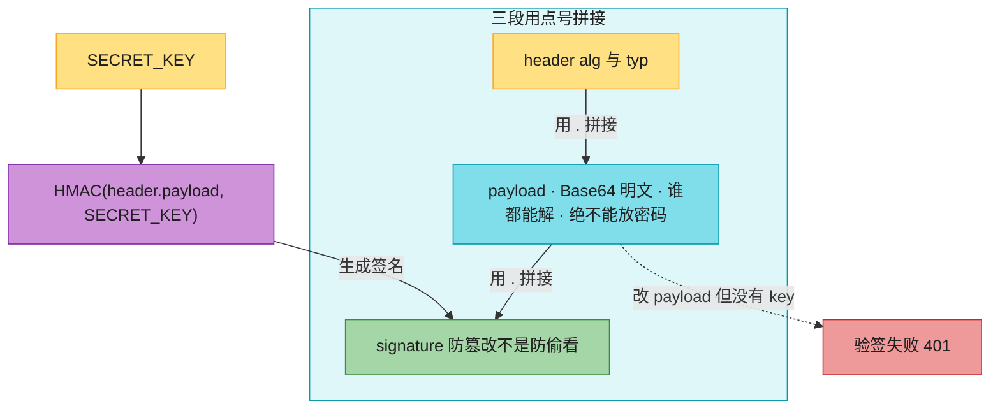
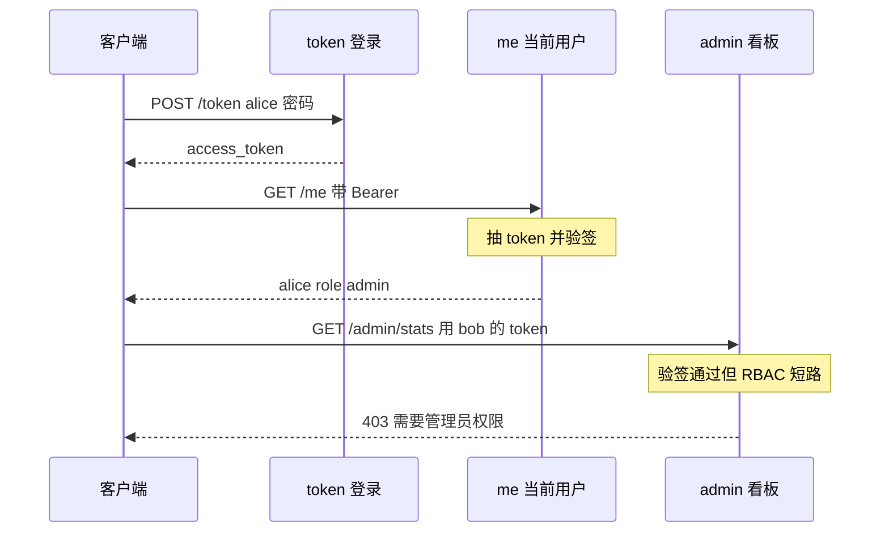

# Ch21 · 认证授权 JWT

> **预计**:1 天 ｜ **前置**:Ch16(依赖注入)、Ch17(中间件/异常)
> **目标**:给「极客商城运营后台」实现完整门禁——bcrypt 密码哈希、注册入库、jose 签发 JWT、OAuth2 密码流登录、依赖注入鉴权、RBAC 管理员专属接口。学完你能给任何 API 加上「登录 + 角色权限」。

> 📐 **本教程的契约**:讲过的才考,考的必讲过。§21.2–§21.5 对应作业十处填空。

---

## 🗺️ 本章地图

主线场景:商城后台有两类员工——**运营 alice(admin 角色)**、**客服 bob(user 角色)**。你要实现:
注册开账号 → 登录发 token → `/me` 验 token → `/admin/stats` 只有 admin 能进。

**作业 ↔ 教程对应表**:

| 作业填空 | 对应小节 | 核心知识点 |
|----------|----------|-----------|
| `hash_password` | §21.2 | bcrypt 哈希(慢哈希 + 随机盐) |
| `verify_password` | §21.2 | bcrypt 验证(明文 vs 哈希) |
| `register_user` | §21.2 | 注册:重名检查 + 哈希入库(不明文) |
| `create_access_token` | §21.3 | jose.jwt.encode + exp 过期 claim |
| `authenticate_user` | §21.4 | 查用户 + 验密码,统一返 None 防枚举 |
| `login` | §21.4 | OAuth2PasswordRequestForm + 发 token |
| `get_current_user` | §21.5 | Depends(oauth2_scheme) + jwt.decode 验签 |
| `read_current_user` | §21.5 | Depends(get_current_user) 受保护端点 |
| `require_admin` | §21.5 | RBAC:依赖嵌套依赖,403 vs 401 |
| `admin_dashboard` | §21.5 | 管理员专属端点 GET /admin/stats |

---

## ⏱️ 学习路径:费曼五步(约 90 分钟)

| 步骤 | 做什么 | 时间 |
|------|--------|------|
| ① 预览猜 | 先看下面 6 个问题,激活你的 Spring Security 直觉 | 5 min |
| ② 先动手 | 打开 `ch21_assignment.py`,不看答案先试着填 | 20 min |
| ③ pytest 红绿 | 跑测试,红→对照对应 §→改→绿,逐个点亮 | 40 min |
| ④ 费曼 | 合上教程,讲清 §21.1(为何无状态)、§21.5(依赖链如何短路) | 15 min |
| ⑤ 存闪卡 | 把 `review.md` 的 9 张卡过一遍,标记掌握度 | 10 min |

---

## ① 预览猜(先想,别急着翻答案)

1. Spring Security 一套 `SecurityFilterChain` + `UserDetailsService` + `PasswordEncoder` + `JwtFilter` 配下来几十行 bean。FastAPI 给 API 加登录,最少要几样东西?
2. 服务器**不存 session**,凭什么能「认出」第二次请求是同一个用户?
3. 一个 JWT 长这样 `xxx.yyy.zzz`(三段,点号分隔)。这三段分别是什么?为什么**不能**把密码放进去?
4. 数据库存密码,为什么不能存明文?为什么连 SHA-256 都不够、非要用故意很慢的 bcrypt?
5. 客户端登录拿到 token 后,后续请求怎么带?服务端用什么机制(Ch16 学过)统一拦截校验?
6. 「没登录」和「登录了但不是管理员」,HTTP 状态码应该分别是多少?

---

## §21.1 认证 vs 授权 + JWT 是什么(本节无填空,但贯穿全章)🟢

先厘清两个词(Java 老手也常混):

- **认证(Authentication,AuthN)**:你是谁?——验证身份(账号密码、token)。对应 Spring 的 `AuthenticationManager`。
- **授权(Authorization,AuthZ)**:你能干什么?——检查权限(是不是 admin)。对应 `@PreAuthorize("hasRole('ADMIN')")`。

本章两者都做:§21.2–§21.5 前半做**认证**(登录 + 验 token),§21.5 后半做**授权**(RBAC:admin 才能进 `/admin/stats`)。

### JWT 三段结构

JWT(JSON Web Token)就是一个**带签名的字符串**,用 `.` 分三段,每段都是 Base64URL 编码:



这张图要你看懂：三段用 `.` 拼接；payload 是 Base64 明文、谁都能解、绝不能放密码；签名是 HMAC(header.payload, SECRET_KEY)，防篡改不是防偷看；改 payload 但没有 key → 验签失败 401。

| 段 | 内容 | 解码后(Java 对照) |
|----|------|--------|
| **header** | 算法 + 类型 | `{"alg":"HS256","typ":"JWT"}` |
| **payload** | 业务数据,叫 **claims** | `{"sub":"alice","role":"admin","exp":1700000000}` |
| **signature** | `HMAC-SHA256(base64(header)+"."+base64(payload), SECRET_KEY)` | = jjwt 的 `signWith(key)` |

**真实场景例**:payload 是**明文**,任何人都能解码——你可以在 Python 里亲手验证:

```python
import base64
payload_b64 = "eyJzdWIiOiJhbGljZSIsInJvbGUiOiJhZG1pbiJ9"
base64.urlsafe_b64decode(payload_b64 + "==")   # 补回 padding
# → b'{"sub":"alice","role":"admin"}'   ← 不需要任何密钥就能看!
```

**关键认知**(面试高频):

- ❌ **错误写法**:payload 里放 `{"sub":"alice","password":"alice123"}` —— Base64 不等于加密,token 经手的人(浏览器、网关日志、抓包工具)全都能读到密码。
- ✅ **正确写法**:payload 只放**不敏感的身份标识**:`{"sub":"alice","role":"admin","exp":...}`。JWT 解决的是「**防篡改**」不是「防偷看」。

为什么防篡改?签名是服务端用 `SECRET_KEY` 对前两段算的 HMAC。攻击者改了 payload(比如把 `"role":"user"` 改成 `"admin"`),没有 key 就算不出新签名 → 服务端 `jwt.decode` 验签失败 → 401。这就是「**无状态(stateless)**」:服务端不存 session,每次只靠 key 重新验签就能确认 token 真实性。

> 🟢 **Java 对比**:Servlet 容器默认存 session(有状态),要无状态得显式配 `SessionCreationPolicy.STATELESS` + JWT Filter。FastAPI 一开始就没有 session 概念,token 全靠你自己发、自己验。

> 🤯 **无状态的权衡**:水平扩展时,有状态 session 要么粘性路由、要么共享存储(Redis);JWT **任何一台机器都能验**,加机器零成本。代价:token 发出去到 `exp` 前**无法主动作废**——退出登录只能客户端删 token,要「服务端踢人」得上黑名单(又变有状态了)。这是 JWT vs Session 的根本权衡,没有银弹。

---

## §21.2 密码哈希:bcrypt(对应:`hash_password` / `verify_password` / `register_user`)🔴

### 为什么存哈希、为什么不用 SHA-256

| 方案 | 数据库泄露后 |
|------|------|
| 存明文 | 所有人密码直接泄露。绝对不行。 |
| 存 `SHA-256(password)` | SHA-256 太快,GPU 一秒几亿次,彩虹表秒破。不行。 |
| 存 `bcrypt(password)` | **故意设计得慢**(cost 可调),暴力破解成本爆炸。✅ |

bcrypt 还**内置随机盐(salt)**:同一密码每次哈希结果都不同 → 攻击者没法用预计算的彩虹表。

### Python 写法(真实场景:商城后台开账号)

本章直接用官方 `bcrypt` 库(为什么不用 passlib,见本节末尾的坑)。骨架里已配好薄封装 `pwd_context`,对外两个方法:

```python
# 注册时:哈希一次,存库(模块加载时 alice/bob 的哈希就是这么算的)
hashed = pwd_context.hash("alice123")
# → "$2b$12$KIXQeJ..."  以 $2 开头的 bcrypt 串

# 登录时:明文 vs 库里哈希
ok = pwd_context.verify("alice123", hashed)   # True
ok = pwd_context.verify("wrong",    hashed)   # False
```

**错误对照 ① —— 明文入库**:

```python
# ❌ 错误写法:商城后台注册接口把明文存进 USERS
USERS[username] = {"username": username, "hashed_password": password, "role": role}

# ✅ 正确写法:存 hash_password(password) 的哈希串
USERS[username] = {"username": username, "hashed_password": hash_password(password), "role": role}
```

**错误对照 ② —— bcrypt 吃 bytes 不吃 str**(Java 老手直观上会忘):

```python
import bcrypt
# ❌ 错误写法:直接传 str → TypeError
bcrypt.hashpw("alice123", bcrypt.gensalt())

# ✅ 正确写法:encode/decode 固定动作(骨架的 CryptContext 已帮你做了)
bcrypt.hashpw("alice123".encode("utf-8"), bcrypt.gensalt()).decode("utf-8")
```

**一个反直觉点**:`hash_password("alice123")` 调两次,结果**不一样**(随机盐)。这不是 bug,是特性——所以验证时绝不能「再哈希一次比对相等」,必须用 `verify_password`:

```python
# ❌ 错误写法:hash_password(pwd) == user["hashed_password"]  → 永远是 False!
# ✅ 正确写法:verify_password(pwd, user["hashed_password"])
```

> 🟢 **Java 对比**:`pwd_context.hash / verify` ≈ Spring 的 `BCryptPasswordEncoder.encode / matches`。连方法语义都一一对应(matches 也是「明文 vs 哈希」而不是「再编码一次比对」)。

> ✅ **做 `hash_password` / `verify_password` 题**:各一行 return,调 `pwd_context.hash(...)` / `pwd_context.verify(...)`。
>
> ✅ **做 `register_user` 题**:重名 → `raise ValueError`;否则 `USERS[username] = {"username","hashed_password": hash_password(password),"role"}` → 返回 `{"username","role"}`(**绝不返回哈希**)。

> 🔴 **坑 —— passlib 与新 bcrypt 不兼容**:网上 99% 的 FastAPI 教程让你用 `passlib.CryptContext(schemes=["bcrypt"])`。但 **passlib 1.7.4 自 2020 年起没更新**,与 `bcrypt >= 4.1` 不兼容——passlib 内部探测代码会触发新版 bcrypt 的「密码不能超过 72 字节」检查,直接抛 `ValueError`。所以本章直接用官方 `bcrypt` 库(FastAPI 官方文档 2024 起也转向它),骨架套了个同方法名的薄封装——你的业务代码和 passlib 时代写法一致,换底层零成本。bcrypt 故意慢(cost=12 约 250ms),哈希耗时正常,别慌。

---

## §21.3 生成 JWT(对应:`create_access_token`)🟡

用 `python-jose` 编码。核心四行:

```python
from jose import jwt
from datetime import datetime, timedelta, timezone

to_encode = data.copy()                                          # 别改调用方的 dict
expire = datetime.now(timezone.utc) + timedelta(minutes=30)      # aware UTC!
to_encode.update({"exp": expire})                                # 标准过期 claim
token = jwt.encode(to_encode, SECRET_KEY, algorithm="HS256")
```

**真实场景例**(登录成功后给 alice 发 token):

```python
create_access_token({"sub": "alice", "role": "admin"})
# → "eyJhbGciOiJIUzI1NiJ9.eyJzdWIiOiJhbGljZSI...签名"
```

**五个关键点**:

1. **`sub`(subject)**:JWT 标准 claim,放用户标识(用户名/user id),约定俗成的「我是谁」。`role` 是我们自定义的 claim,为 §21.5 的 RBAC 铺路。
2. **`exp`(expiration)**:标准 claim。`jwt.decode` 会**自动检查过期**——过了 exp 直接抛 `JWTError`,你不用自己判时间。
3. **必须 `data.copy()`**:直接 `data["exp"] = ...` 会污染调用方的 dict——测试里 `assert data == {"sub": "alice"}` 就是拦这个的。
4. **`SECRET_KEY`**:HS256 是**对称**算法,签发验证同一把 key。**生产从环境变量读**(`os.environ["SECRET_KEY"]`),key 泄露 = 任何人都能伪造任意用户 token。

**错误对照 —— naive datetime**(Java 老手最易踩,`LocalDateTime.now()` 的思维惯性):

```python
# ❌ 错误写法:naive datetime(无时区),某些环境 token 立刻过期或永不过期
expire = datetime.now() + timedelta(minutes=30)

# ✅ 正确写法:带时区的 UTC
expire = datetime.now(timezone.utc) + timedelta(minutes=30)
```

**为什么不能信客户端改 payload**:攻击者把 token 的 payload 从 `"role":"user"` 改成 `"admin"` 重新 Base64 拼回去——没有 `SECRET_KEY` 算不出合法签名,`jwt.decode` 直接抛 `JWTError`。这就是签名存在的意义。

> 🟡 **Java 对比**:`jwt.encode(claims, key, algorithm=...)` ≈ jjwt 的 `Jwts.builder().setSubject("alice").claim("role","admin").setExpiration(...).signWith(key).compact()`。思路完全一样,语法更省。

> ✅ **做 `create_access_token` 题**:`data.copy()` → 算 `expire`(`expires_delta or timedelta(minutes=ACCESS_TOKEN_EXPIRE_MINUTES)`)→ `update({"exp": expire})` → `jwt.encode(to_encode, SECRET_KEY, algorithm=ALGORITHM)`。

---

## §21.4 OAuth2 密码流 + 登录端点(对应:`authenticate_user` / `login`)🔴

### 两个内置组件

```python
from fastapi.security import OAuth2PasswordBearer, OAuth2PasswordRequestForm

oauth2_scheme = OAuth2PasswordBearer(tokenUrl="token")   # 骨架已配好
```

- **`OAuth2PasswordBearer`** 本身是个**依赖**(Ch16)。放进 `Depends(...)`:请求带 `Authorization: Bearer <token>` → 提取 token 给你;没带 → 自动返 **401**(还加 `WWW-Authenticate: Bearer` 响应头)。`tokenUrl="token"` 只是告诉 Swagger UI「登录去 POST /token」,`/docs` 页面会多出 Authorize 按钮。
- **`OAuth2PasswordRequestForm`** 也是依赖,帮你解析登录表单,`form_data.username` / `form_data.password` 直接拿到。

**错误对照 —— 表单不是 JSON**(OAuth2 规范要求 `application/x-www-form-urlencoded`):

```bash
# ❌ 错误:发 JSON → FastAPI 解析不了表单字段 → 422
curl -X POST http://localhost:8000/token \
  -H "Content-Type: application/json" \
  -d '{"username":"alice","password":"alice123"}'

# ✅ 正确:表单提交 → 200 + {"access_token":"eyJ...","token_type":"bearer"}
curl -X POST http://localhost:8000/token \
  -d "username=alice&password=alice123"
```

> ⚠️ `OAuth2PasswordRequestForm` 解析表单依赖 `python-multipart` 库,没装会在**启动时**就报错(本项目 web extra 已带)。

### 登录端点全流程

```
客户端 POST /token (表单: username, password)
        │
        ▼
authenticate_user(username, password)   ← USERS.get + verify_password
        │
   ┌────┴────┐
  None     user dict
   │         │
   ▼         ▼
 401      create_access_token({"sub": username, "role": user["role"]})
 (带 WWW-      │
  Authenticate)▼
         {"access_token": token, "token_type": "bearer"}
```

**安全细节 —— 不区分「用户不存在」和「密码错」**:两种失败都返回同一个 401 + 同一句 `"用户名或密码错误"`。如果分别报「用户不存在」/「密码错误」,攻击者就能枚举出哪些用户名已注册(用户名枚举攻击)。`authenticate_user` 统一返 `None` 就是为了这个。

**401 响应带 `WWW-Authenticate: Bearer` 头**是 OAuth2 规范要求,提示客户端「请用 Bearer token 重新认证」。测试会断言这个头。

> ✅ **做 `authenticate_user` 题**:`USERS.get(username)` → 不存在或 `verify_password` 为 False → `return None` → 否则 `return user`。
>
> ✅ **做 `login` 题**:`authenticate_user(...)` → None 则 `raise HTTPException(401, ..., headers={"WWW-Authenticate": "Bearer"})` → 否则 `create_access_token({"sub","role"})` → 返回 `{"access_token","token_type":"bearer"}`。

> 🤯 **Java 对比**:Spring 密码流要配 `AuthenticationManager` + `UserDetailsService` + `PasswordEncoder` + `SecurityFilterChain` 一整套 bean。FastAPI **一个端点函数**搞定——验密码、发 token 全在你眼前。这就是「依赖注入即一切」的哲学。

---

## §21.5 验 token + RBAC(对应:`get_current_user` / `read_current_user` / `require_admin` / `admin_dashboard`)🔴

### 1. 鉴权依赖 `get_current_user`

```python
def get_current_user(token: str = Depends(oauth2_scheme)) -> dict:
    try:
        payload = jwt.decode(token, SECRET_KEY, algorithms=[ALGORITHM])
        username = payload.get("sub")
        if username is None or username not in USERS:
            raise HTTPException(401, "无效凭证", headers={"WWW-Authenticate": "Bearer"})
        return {"username": username, "role": USERS[username]["role"]}
    except JWTError:                     # 过期 / 签名错 / 格式错 都抛这个
        raise HTTPException(401, "无效凭证", headers={"WWW-Authenticate": "Bearer"}) from None
```

`jwt.decode` **同时做三件事**:解 Base64、**验签名**(错→`JWTError`)、**查 exp**(过期→`JWTError`)。所以 try/except 一个 `JWTError` 就兜住所有坏 token。

**为什么查 `username not in USERS`**(真实场景):alice 离职,管理员删了她的账号——但她的 token 还没过期,验签依然通过!所以解码后必须再确认「这个用户现在还存不存在」,否则已注销账号的 token 照样能用。

**为什么要返回 user dict 而不是只返回用户名**:§21.5 后半的 RBAC 需要 `role`。依赖返回 `{"username","role"}`,下游依赖和端点直接用,不用层层再查库。

### 2. 受保护端点 = `Depends(get_current_user)`

```python
@app.get("/me")
def read_current_user(current_user: dict = Depends(get_current_user)):
    return current_user
```

**魔法在于依赖链**:`/me` 依赖 `get_current_user` → 它又依赖 `oauth2_scheme`。

- token 有效 → `get_current_user` 返回用户 → 端点执行。
- token 无效/缺失 → 链中某层 `raise HTTPException(401)` → FastAPI **自动短路,端点函数根本不执行**。

**错误对照 —— 鉴权写在端点函数里**:

```python
# ❌ 错误写法:每个端点自己 if 鉴权——重复、易漏、违背 FastAPI 模式
@app.get("/me")
def read_current_user(token: str = Depends(oauth2_scheme)):
    payload = jwt.decode(token, ...)      # 每个端点都抄一遍
    if payload 无效: raise 401
    ...

# ✅ 正确写法:鉴权收敛进依赖,端点函数只剩业务
@app.get("/me")
def read_current_user(current_user: dict = Depends(get_current_user)):
    return current_user                   # 一行
```

> 🟢 **Java 对比**:依赖链 ≈ Spring 的 `OncePerRequestFilter` + `SecurityContextHolder`。区别在于 FastAPI 不用 ThreadLocal 隐式传「当前用户」,而是**显式函数参数**——并发安全天然成立,这也是鉴权代码比 Spring 短得多的根本原因。

### 3. RBAC:`require_admin` = 依赖嵌套依赖

认证(你是谁)解决后,授权(你够不够格)就是**再叠一层依赖**:

```python
def require_admin(current_user: dict = Depends(get_current_user)) -> dict:
    if current_user["role"] != "admin":
        raise HTTPException(status.HTTP_403_FORBIDDEN, "需要管理员权限")
    return current_user

@app.get("/admin/stats")
def admin_dashboard(admin: dict = Depends(require_admin)):
    return {"total_users": len(USERS), "admin": admin["username"]}
```

依赖链变成 `/admin/stats` → `require_admin` → `get_current_user` → `oauth2_scheme`,**逐层加码、每层短路**:

| 请求 | 在哪层被拦 | 状态码 |
|------|-----------|--------|
| 不带 token | `oauth2_scheme` | **401**(没认证) |
| token 有效,bob(user) | `require_admin` | **403**(已认证但没权限) |
| token 有效,alice(admin) | 全部通过 | 200 |

**401 vs 403 别再混**:401 = 未认证(你是谁?);403 = 已认证但权限不足(我知道你是谁,但你不够格)。Java 里对应 `AccessDeniedException`(403) vs `AuthenticationException`(401)。

> 🟢 **Java 对比**:`require_admin` ≈ `@PreAuthorize("hasRole('ADMIN')")`——Spring 用注解声明、AOP 拦截;FastAPI 用依赖声明、注入拦截,都是「声明式授权」。

> ✅ **做 `get_current_user` 题**:`jwt.decode` → 取 `sub` → None 或不在 USERS → 401 → 否则返回 `{"username","role"}`;`except JWTError` → 401(`from None`)。
>
> ✅ **做 `read_current_user` 题**:`return current_user`(一行)。
>
> ✅ **做 `require_admin` 题**:`role != "admin"` → 403;否则返回 `current_user`。
>
> ✅ **做 `admin_dashboard` 题**:`return {"total_users": len(USERS), "admin": admin["username"]}`(一行)。

---

## §21.6 整体流程串起来(对照图)



这张图要你看懂：登录发 token、带 token 读 `/me`、非 admin 打 `/admin/stats` 会在授权依赖上 403，鉴权不要写进端点 if。

---

## §21.7 Java 老手常踩的坑 ⚠️

1. **passlib 与新 bcrypt 不兼容**:passlib 1.7.4 + bcrypt ≥ 4.1 直接抛 `ValueError`。直接用官方 `bcrypt` 库(§21.2 详述)。
2. **payload 是明文不是加密**:`{"sub":"alice"}` 只是 Base64,谁都能解。**绝不放密码/敏感信息**;要加密得用 JWE(本章不涉及)。
3. **`SECRET_KEY` 硬编码**:演示无所谓,**生产必须 `os.environ["SECRET_KEY"]`**。key 泄露 = 任何人能伪造任意用户 token。
4. **token 无法主动作废**:JWT 无状态,到 `exp` 前一直有效。退出登录只能客户端删 token;要「踢人」得上黑名单(变有状态)。
5. **`exp` 用 naive datetime**:必须 `datetime.now(timezone.utc)`。naive 版本在某些环境让 token 立刻过期或永不过期。
6. **登录吃表单不吃 JSON**:`OAuth2PasswordRequestForm` 要 `application/x-www-form-urlencoded`;发 JSON → 422。且需装 `python-multipart`。
7. **鉴权要收敛进依赖**:端点函数里写 if 鉴权 = 重复 + 易漏。依赖链短路才是 FastAPI 模式(§21.5)。
8. **401 ≠ 403**:401 未认证(你是谁?);403 已认证没权限(你不够格)。`require_admin` 抛 403 不是 401。
9. **登录失败别区分原因**:「用户不存在」和「密码错」统一 401 + 同一句话,否则等于告诉攻击者哪些用户名已注册。
10. **bcrypt 故意慢**:`hash_password` 跑几十~几百毫秒是正常的(cost=12 约 250ms),防暴力破解的设计,别当性能 bug 修。

---

## 📝 本章作业

| 任务 | 知识点 | 难度 |
|------|--------|------|
| `hash_password` / `verify_password` | bcrypt 哈希与验证 | 🟢 |
| `register_user` | 重名检查 + 哈希入库 | 🟢 |
| `create_access_token` | jose.jwt.encode + exp | 🟡 |
| `authenticate_user` | 查用户 + 验密码,统一 None | 🟢 |
| `login`(POST /token) | OAuth2 密码流发 token | 🟡 |
| `get_current_user` | Depends(oauth2_scheme) + jwt.decode | 🔴 |
| `read_current_user`(GET /me) | 依赖注入受保护端点 | 🟢 |
| `require_admin` | RBAC:依赖嵌套 + 403 | 🟡 |
| `admin_dashboard`(GET /admin/stats) | 管理员专属端点 | 🟡 |

```bash
uv sync --extra web
uv run pytest 03_web_framework/ch21/test_ch21_assignment.py -v
```

38 个测试,全绿即通关。

---

## ✅ 自测清单

- [ ] 能说出 JWT 三段各是什么、为什么 payload 不能放密码(Base64 ≠ 加密)
- [ ] 能解释「无状态」:不存 session、靠 SECRET_KEY 验签;好处(水平扩展)与代价(无法作废)
- [ ] 能说清为什么用 bcrypt 而不是 SHA-256(慢哈希 + 随机盐),以及「同密码两次哈希不同」为什么不是 bug
- [ ] 能默写 `create_access_token` 四步:copy → aware UTC expire → update exp → encode
- [ ] 能说清 OAuth2 密码流:表单提交、401 带 `WWW-Authenticate: Bearer`、失败不区分原因
- [ ] 能解释依赖链短路:为什么 `read_current_user` 函数体只有一行
- [ ] 能分清 401 vs 403,并写出 `require_admin` 的嵌套依赖
- [ ] 38 个测试全绿

---

## 🎓 费曼挑战(合上教程讲,讲不清重读)

1. **「JWT 为什么叫无状态?相比 Spring Session 有什么好处和代价?」** —— 卡壳重读 §21.1。
2. **「为什么密码要用 bcrypt 而不是 SHA-256?bcrypt 慢为什么反而是优点?」** —— 卡壳重读 §21.2。
3. **「`jwt.decode` 自动做了哪几件事?为什么端点函数本身不需要写 if 鉴权?」** —— 卡壳重读 §21.5。
4. **「bob 带着合法 token 访问 /admin/stats,请求在依赖链的哪一层被拦?为什么是 403 不是 401?」** —— 卡壳重读 §21.5 的 RBAC 表。

---

## 🧠 记忆闪卡 → [`review.md`](./review.md)

---

## ⏭️ 下一步

学完 Ch21,你的 API 有了「门禁 + 角色」。自然的进阶:

- **Refresh Token**:access token 短期(15min)+ refresh token 长期(7天),access 过期用 refresh 换新,兼顾安全与体验。
- **接数据库**:本章 USERS 是内存 dict,生产换 SQLAlchemy(Ch19)+ users 表。
- **更细的权限**:从单一 role 到权限点(`order:write` / `refund:approve`),模式不变,还是依赖嵌套。
- **Ch22 部署**:uvicorn/gunicorn 多 worker 下,JWT 无状态的优势真正体现——不用共享 session。
