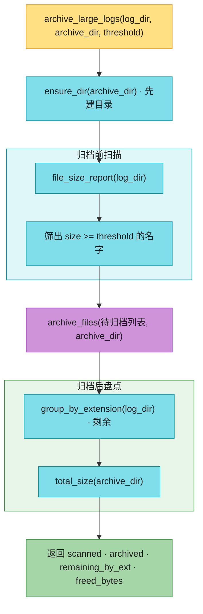

# Ch23 · 文件系统批量操作:pathlib / shutil

> **预计**:0.5 天 ｜ **前置**:Ch06(with/文件IO)、Ch02(dict)｜ **M4 开篇**
> **目标**:掌握 Python 运维脚本的头号武器——`pathlib`(现代路径 API)+ `shutil`(复制/移动/删目录)。写完这章,你能独立写出「扫文件 → 归类 → 归档」这类批处理脚本,代码量比 Java 的 `File`/`Files` 少一半。
> **本章主线**:你是后端负责人。服务器上 `/var/log/myapp` 日志目录天天膨胀,磁盘占用 90% 触发报警。你要写一个「**日志归档机器人**」:扫描日志 → 出大小报告 → 按类型归类 → 建归档目录 → 搬走超大日志 → 给当天日志加日期前缀 → 一键归档并输出报告。8 个函数全为这条主线服务。

> 📐 **本教程的契约**:§23.2–§23.7 每节**精确对应**作业里的函数,讲过的才考,考的必讲过。§23.1 是开胃、§23.8 是坑清单,讲透不出题。卡住时按对应表回查小节。

---

## 🗺️ 本章地图

读完这章 + 完成作业,你将能够:
- 用 `Path / "x"` 链式拼路径,说清它背后是哪个魔术方法
- 说清 `iterdir` / `glob` / `rglob` 的区别,以及为什么遍历结果必须 `is_file()` 过滤
- 用 `stat().st_size` 拿文件大小,一行字典推导生成大小报告
- 用 `suffix` + `setdefault` 按扩展名分组(= Java `computeIfAbsent`)
- 写幂等建目录 `mkdir(parents=True, exist_ok=True)`(= `mkdir -p`),说清两个参数各自防什么错
- 说清 `shutil.move` 在「目标不存在」时的反直觉行为,并养成「先建目录再 move」的肌肉记忆
- 用 `with_name` / `rename` 做批量重命名(logrotate 风格)
- 把 6 个小函数组装成真实归档工具——「小函数 + 组合」的 Pythonic 风格

**作业 ↔ 教程对应表**(学哪节,就去做哪题):

| 作业题 | 对应小节 | 核心知识点 |
|--------|----------|-----------|
| `list_files` | §23.2 | glob 匹配 + is_file 过滤 + sorted |
| `file_size_report` | §23.2 | iterdir + stat().st_size + 字典推导 |
| `group_by_extension` | §23.3 | Path.suffix + setdefault 分组 |
| `ensure_dir` | §23.4 | mkdir(parents=True, exist_ok=True) = `mkdir -p` |
| `total_size` | §23.4 | rglob 递归 + 生成器求和 |
| `archive_files` | §23.5 | shutil.move + 「先建目录」陷阱 |
| `add_date_prefix` | §23.6 | rename + with_name 批量重命名 |
| `archive_large_logs` | §23.7 | 综合:复用前 6 个函数组装归档机器人 |

---

## ⏱️ 学习路径:费曼五步(约 50 分钟)

| 步 | 你要做 | 在哪做 |
|----|--------|--------|
| ① 预览猜(2分钟) | 下面 5 个 Java 场景,猜 Python 怎么写 | 本页 ① |
| ② 先动手 | 打开 `ch23_assignment.py`,**先试着写**(别看教程) | assignment |
| ③ 提取+反馈 | 凭记忆写完 → `uv run pytest` 红绿 | test |
| ④ 费曼(2分钟) | 大白话讲清「is_file 过滤、move 陷阱、with_name」 | 本页 ④ |
| ⑤ 存闪卡 | 把 [`review.md`](./review.md) 的卡标复习日期 | review.md |

> 💡 **直接性原则**:别通读!先猜 ① → 去 ② 写作业 → **哪题卡了,回对应 § 查** → 改 → 再跑。

---

## ① 预览猜(先想,别急着翻答案)

1. Java 拼路径写 `Paths.get("a", "b", "c.txt")`,还要担心 `\` vs `/`。Python 怎么拼?为什么「用 `/` 运算符」是 Pythonic?
2. Java 列目录用 `File.listFiles()` 或 `Files.list(path)`。Python 的 `Path.iterdir()` / `glob()` 返回的是 `List` 吗?遍历出来的「条目」只有文件吗?
3. `mkdir -p`(不存在就建、存在不报错)在 Python 怎么一行写?不加参数会怎样?
4. 「把日志文件移到 archive 目录」——`shutil.move(f, dst)`,如果 `dst` **不存在**,会发生什么反直觉的事?
5. 把 `app.log` 改名为 `20260812_app.log`,除了字符串拼接,`Path` 有没有专门改文件名的方法?
6. 递归求一个目录所有文件总大小,Python 一行怎么写?(Java 要 `Files.walk` + filter + mapToLong + sum)

> 猜完带着验证心态进入正文。第 4 题的 move 陷阱是 🔴,踩过的人在生产上翻过车。

---

## §23.1 为什么用 pathlib 不用 os.path(开胃 · 不出题)🟡

Python 老代码里到处是 `os.path.join`、`os.path.exists`、`os.path.getsize`——一串**函数**,路径是字符串,操作全靠传参,丑且易错:

❌ **错误写法**(os.path 风格,新代码别这么写):

```python
import os

log_dir = "/var/log/myapp"
path = os.path.join(log_dir, "app.log")          # 字符串拼路径
if os.path.exists(path) and os.path.isfile(path):
    size = os.path.getsize(path)                  # 又一个函数
    name = os.path.basename(path)                 # 取文件名还要一个函数
```

✅ **正确写法**(pathlib,路径变**对象**,链式调用):

```python
from pathlib import Path

log_dir = Path("/var/log/myapp")
path = log_dir / "app.log"                       # 用 / 运算符拼路径!
if path.exists() and path.is_file():
    size = path.stat().st_size
    name = path.name
```

`Path` 对象常用属性/方法一览(真实场景:解析 `/var/log/myapp/app.log`):

```python
p = Path("/var/log/myapp/app.log")

p.name        # "app.log"             文件名(含扩展)
p.stem        # "app"                 文件名(不含扩展)
p.suffix      # ".log"                扩展名(含点)
p.parent      # Path("/var/log/myapp") 父目录
p.exists()    # True/False
p.is_file()   # 是文件吗
p.is_dir()    # 是目录吗
p.read_text(encoding="utf-8")         # 一行读完整文件(小文件用)
p.write_text("rotated", encoding="utf-8")
```

> 🟡 **Java 对比**:`Path` ≈ `java.nio.file.Path`,`/` 运算符 ≈ `Paths.get(...).resolve(...)` 合体。`p.name` ≈ `getFileName()`,`p.parent` ≈ `getParent()`。
>
> 🔴 **Python 特有**:`Path / "x"` 用除号拼路径,第一次见会愣——除号怎么能拼路径?因为 `Path` 重载了 `__truediv__`(Ch05 魔术方法)。这是运算符重载让 API 更优雅的教科书案例。

**结论**:新代码一律 `pathlib`,别碰 `os.path`(维护老项目才用)。

---

## §23.2 遍历与匹配:iterdir / glob / stat(对应:`list_files`、`file_size_report`)🟢

### Java 对照最小例

```java
// Java:列出 /var/log/myapp 下的 .log 文件
try (Stream<Path> s = Files.list(Paths.get("/var/log/myapp"))) {
    List<Path> logs = s.filter(p -> p.toString().endsWith(".log"))
                       .filter(Files::isRegularFile)
                       .collect(Collectors.toList());
}
```

```python
from pathlib import Path

log_dir = Path("/var/log/myapp")
logs = [p for p in log_dir.glob("*.log") if p.is_file()]   # 一行
```

### 三个遍历方法的区别

```python
d = Path("/var/log/myapp")

# 1) iterdir:遍历【顶层】所有条目(文件+子目录)= Java File.listFiles()
for entry in d.iterdir():
    print(entry)

# 2) glob(pattern):顶层通配符匹配(非递归)
for p in d.glob("*.log"):        # 只匹配顶层
    print(p)

# 3) rglob(pattern):【递归】通配,钻进所有子目录
for p in d.rglob("*.log"):       # 连 old/app.1.log 也能扫到
    print(p)
```

### 🔴 新手第一个坑:遍历结果包含子目录

❌ **错误写法**(把子目录当文件处理,后面 `stat` / 移动时逻辑全乱):

```python
for p in log_dir.glob("*"):
    print(p.name, "是文件吗?", p.suffix)   # 子目录 old/ 也会被列出来,suffix 是 ""
```

✅ **正确写法**(要文件就显式过滤):

```python
for p in log_dir.glob("*"):
    if p.is_file():          # 目录也是「条目」,必须过滤
        print(p.name)
```

> 🟢 **Java 对比**:`iterdir` ≈ `Files.list`,`glob` ≈ `Files.newDirectoryStream(glob)`,`rglob` ≈ `Files.walk` 后过滤。三者返回的都是**惰性迭代器/生成器**,不保证顺序——要稳定结果自己 `sorted`。

### 文件元信息:stat()

```python
p = Path("/var/log/myapp/app.log")
info = p.stat()          # os.stat_result(= Linux inode 信息 ≈ Java BasicFileAttributes)
info.st_size             # 字节数
info.st_mtime            # 修改时间(时间戳秒数)
```

### 真实场景例:给报警群发的「日志大小报告」

磁盘报警时,运维第一件事就是搞清楚「谁占的」:

```python
report = {p.name: p.stat().st_size for p in log_dir.iterdir() if p.is_file()}
# {"app.log": 17, "error.log": 11, "metrics.json": 11, "readme": 3}
```

### 作业实现要点

- `list_files`:`directory.glob(pattern)` → `is_file()` 过滤 → `sorted(..., key=按文件名)`。为什么要 sorted?文件系统返回顺序**不保证**(不同 OS/文件系统不同),排序让结果稳定、可测。
- `file_size_report`:遍历**顶层**用 `iterdir()`(不是 rglob),字典推导(Ch02)一行建 `{文件名: 字节数}`。

---

## §23.3 分组:Path.suffix + setdefault(对应:`group_by_extension`)🟡

运维常问:「这目录里 .log 有几个、.json 有几个?」——按扩展名分组。

### 先看 suffix 家族

```python
Path("app.log").suffix          # ".log"   含点
Path("readme").suffix           # ""       无扩展名 = 空串(不是 None!)
Path("app.1.log").suffix        # ".log"   只取【最后一个】点后
Path("app.1.log").suffixes      # [".1", ".log"]  要全部用 suffixes
Path("app.log").stem            # "app"    文件名去扩展
```

### Java 对照最小例

```java
// Java:按扩展名分组
Map<String, List<String>> groups = new HashMap<>();
for (Path p : files) {
    String ext = getExt(p);   // 还得自己写工具方法
    groups.computeIfAbsent(ext, k -> new ArrayList<>()).add(p.getFileName().toString());
}
```

```python
# Python:setdefault = computeIfAbsent
groups: dict[str, list[str]] = {}
for p in files:
    groups.setdefault(p.suffix, []).append(p.name)
```

### ❌ → ✅ 错误对照

❌ **错误写法**(Java 习惯直译,啰嗦):

```python
for p in files:
    ext = p.suffix
    if ext not in groups:            # 每次都要判断
        groups[ext] = []
    groups[ext].append(p.name)
```

✅ **正确写法**(setdefault 一行搞定「没有就初始化」):

```python
for p in files:
    groups.setdefault(p.suffix, []).append(p.name)
```

`groups.setdefault(key, [])`:key 不存在就先放空 list 并返回它,存在就直接返回现有 list——无论哪种情况,后面都能安全 `.append`。

### 真实场景例:归档前盘点日志目录

```python
groups = {}
for p in sorted(log_dir.iterdir(), key=lambda x: x.name):
    if p.is_file():
        groups.setdefault(p.suffix, []).append(p.name)
# {".json": ["metrics.json"], ".log": ["app.log", "error.log"], "": ["readme"]}
# 无扩展名的 readme 归到 "" 键下
```

> 🟡 **注意**:`suffix` 永远含点(或空串)。分组键是 `".log"` 不是 `"log"`;无扩展名文件的键是 `""`,不是 `None`——测试会考这个。
>
> 💡 Ch08 学过 `defaultdict(list)` 也能干这事,效果等价;`setdefault` 是字典原生方法,不用 import。

### 作业实现要点

- `group_by_extension`:只分组**顶层文件**(`iterdir` + `is_file`);为了组内文件名有序,遍历时先 `sorted(..., key=按名字)`;`setdefault(p.suffix, []).append(p.name)`。

---

## §23.4 建目录与递归:mkdir / rglob(对应:`ensure_dir`、`total_size`)🟢

### ensure_dir = `mkdir -p`

运维脚本第一步常常是「确保输出目录存在」。

### Java 对照最小例

```java
Files.createDirectories(Paths.get("/backup/logs/2026-08"));  // 幂等,存在不报错
```

```python
path = Path("/backup/logs/2026-08")
path.mkdir(parents=True, exist_ok=True)   # 幂等,等于 mkdir -p
```

### ❌ → ✅ 错误对照:两个参数各防一种错

❌ **错误写法**(裸 `mkdir()`,运维脚本里两个雷):

```python
Path("/backup/logs/2026-08").mkdir()
# 雷 1:/backup/logs 不存在 → FileNotFoundError(默认 parents=False,不管父目录)
# 雷 2:目录已存在       → FileExistsError(默认 exist_ok=False)
# 运维脚本天天跑,第二次运行必炸
```

✅ **正确写法**:

```python
path.mkdir(parents=True, exist_ok=True)
# parents=True :中间缺几层连几层一起建
# exist_ok=True:已存在就静默跳过(幂等)
```

> 🟡 **边界**:`exist_ok=True` 只对「已存在的是**目录**」宽容。如果同名**文件**已存在(比如 `/backup/logs` 是个文件),照样抛 `FileExistsError`——这其实是好事,早点暴露配置错误。

### total_size:递归求和

### Java 对照最小例

```java
long total = Files.walk(dir)
    .filter(Files::isRegularFile)
    .mapToLong(p -> p.toFile().length())
    .sum();                                  // 4 步链式
```

```python
total = sum(p.stat().st_size for p in directory.rglob("*") if p.is_file())  # 1 行
```

`rglob("*")` 递归遍历所有条目,返回的是**生成器**(惰性),大目录不会一次性全读进内存——`sum` 边遍历边累加。

### 真实场景例:归档后汇报「腾出了多少空间」

```python
freed = sum(p.stat().st_size for p in archive_dir.rglob("*") if p.is_file())
print(f"本次归档腾出 {freed / 1024 / 1024:.1f} MB")
```

### 作业实现要点

- `ensure_dir`:`mkdir(parents=True, exist_ok=True)`,然后**返回该 Path**(链式调用方便,§23.7 综合题会用到)。
- `total_size`:`rglob("*")` + `is_file()` + `sum(生成器)`。目录本身不占 `st_size` 统计(我们不算它),空目录自然贡献 0。

---

## §23.5 shutil:复制/移动/删目录(对应:`archive_files`)🔴

`pathlib` 管「路径与元信息」,真要**搬动文件**靠 `shutil`(shell utility,= shell 命令的 Python 版)。

| shutil 函数 | 作用 | shell 等价 |
|-------------|------|-----------|
| `shutil.copy2(src, dst)` | 复制文件(保留元数据) | `cp -p` |
| `shutil.copytree(src, dst)` | 递归复制整棵目录树 | `cp -r` |
| `shutil.move(src, dst)` | 移动/重命名 | `mv` |
| `shutil.rmtree(path)` | 递归删除整棵目录树 | `rm -rf` |
| `shutil.make_archive(...)` | 打包压缩(zip/tar) | `tar`/`zip` |

> 🟡 **Java 对比**:`shutil.move` ≈ `Files.move`;`shutil.rmtree` ≈ 递归 `Files.walkFileTree` + delete——Java 删目录树要写匿名内部类,Python 一行。

### 🔴 最大陷阱:shutil.move 的行为随 dst 而变

```python
shutil.move(str(f), str(archive_dir))
```

- `dst` 是**已存在的目录** → 把 `src` **移进**该目录(变成 `dst/src.name`)。✅ 这是我们想要的。
- `dst` **不存在** → 把 `src` **重命名成** `dst`(变成一个叫 `dst` 的**文件**!)。❌ 反直觉。

❌ **错误写法**(archive 目录不存在时,第一个文件被「改名」成 archive,后面全乱):

```python
for f in big_logs:
    shutil.move(str(f), "/backup/logs")   # /backup/logs 不存在?
    # 第一个文件变成【文件】/backup/logs;第二个文件再 move 时会覆盖或报错
```

✅ **正确写法**(先建目录,再移动):

```python
archive_dir.mkdir(parents=True, exist_ok=True)   # ⚠️ 必须先建!
for f in big_logs:
    shutil.move(str(f), str(archive_dir))         # 目标是目录 → 移进去
```

### 真实场景例:把超阈值的大日志搬到归档目录

```python
archive = Path("/backup/logs")
archive.mkdir(parents=True, exist_ok=True)
moved = 0
for f in big_logs:                       # 比如所有 >= 12 字节的 .log
    shutil.move(str(f), str(archive))    # f 原位置消失,archive/f.name 就位
    moved += 1
```

> 💡 `str()` 是因为 `shutil` 传统上接受字符串路径;新版本也接受 Path,但 `str()` 最稳、兼容所有版本。

### 作业实现要点

- `archive_files`:第一行先 `archive_dir.mkdir(parents=True, exist_ok=True)`(可以复用你写的 `ensure_dir`);再循环 `shutil.move` 并计数返回。空列表也要保证目录被建好。

---

## §23.6 批量重命名:rename / with_name(对应:`add_date_prefix`)🟡

归档前常要给日志加日期前缀(logrotate 风格):`app.log` → `20260812_app.log`。

### Java 对照最小例

```java
Files.move(p, p.resolveSibling("20260812_" + p.getFileName()));  // 改名=移动到同目录新名
```

```python
p.rename(p.with_name("20260812_" + p.name))   # with_name 换新名字,rename 落地
```

### Path 的「换部件」方法:先算新路径,再 rename

```python
p = Path("/var/log/myapp/app.log")

p.with_name("20260812_app.log")    # Path("/var/log/myapp/20260812_app.log")  换文件名
p.with_suffix(".txt")              # Path("/var/log/myapp/app.txt")           换扩展名
p.rename(p.with_name("20260812_app.log"))   # 真正落地:磁盘上改名
```

关键点:**`with_name` / `with_suffix` 只返回新 Path 对象,不动磁盘**;`rename(target)` 才真正改名(= `os.rename`,同文件系统内原子操作)。

### ❌ → ✅ 错误对照

❌ **错误写法**(字符串手工拼,分隔符/父目录全自己管):

```python
new = p.parent / ("20260812_" + p.name)   # 能跑,但啰嗦;更糟的是 str(p).replace(...) 容易误伤
p.rename(new)
```

✅ **正确写法**(语义清晰,Path 帮你管父目录):

```python
p.rename(p.with_name(f"{date_tag}_{p.name}"))
```

### 🟡 rename vs shutil.move,什么时候用哪个?

- `p.rename(target)`:同文件系统内改名/移动,**原子**;跨设备(如从本地盘到 NFS)会报 `OSError`。
- `shutil.move(src, dst)`:能跨设备(底层先 copy 再删),且目标是目录时自动移进去。
- 经验:**原地改名用 `rename`,搬到别的目录用 `shutil.move`**。

### 真实场景例:给当天所有 .log 加日期前缀

```python
for p in sorted(log_dir.glob("*.log")):      # 只处理顶层 .log
    if p.is_file():
        p.rename(p.with_name(f"20260812_{p.name}"))
# app.log → 20260812_app.log;error.log → 20260812_error.log
# metrics.json、readme 不动;old/app.1.log 也不动(非递归)
```

### 作业实现要点

- `add_date_prefix`:用 `glob("*.log")` 圈定范围(可以复用 `list_files`),逐个 `rename(with_name(...))`;返回**新路径**列表(排序后),方便调用方核对。

---

## §23.7 综合:日志归档机器人(对应:`archive_large_logs`)🔴

最后一题**不写新知识**,把前 6 个函数像积木一样拼成真实工具:「扫描日志目录,把 ≥ 阈值的文件搬进归档目录,输出一份报告」。

### 报告契约(测试按这个断言)

返回 dict,四个 key:

| key | 含义 | 来自 |
|-----|------|------|
| `"scanned"` | 扫描到的顶层文件数 | `len(file_size_report(...))` |
| `"archived"` | 成功归档的文件数 | `archive_files` 返回值 |
| `"remaining_by_ext"` | 归档后剩余文件按扩展名分组 | `group_by_extension(log_dir)` |
| `"freed_bytes"` | 归档目录总字节数 | `total_size(archive_dir)` |

> 🔴 **顺序有讲究**:必须先 `file_size_report`(归档前盘点)→ 再 `archive_files`(搬走)→ 最后 `group_by_extension(log_dir)`(归档**后**的剩余)。顺序反了,报告就对不上。
>
> 💡 注意阈值语义是 **`>=`**(「达到阈值就归档」),不是 `>`。

### 组装思路(调用关系)



**这张图要你看懂：先 `file_size_report` 盘点源目录并筛 `>=` 阈值，再 `archive_files` 搬走，最后才 `group_by_extension` 盘点剩余——顺序反了，报告对不上。**

这道题考察的不是新语法,而是**组合能力**——每个零件你都写过了,现在要按正确顺序调用、把前一个的输出当后一个的输入。这就是「小函数 + 组合」的 Pythonic 风格(Java 老手熟悉,但 Python 写起来更短)。

---

## §23.8 Java 老手常踩的坑 ⚠️

1. **忘 `is_file()` 过滤**:`glob("*")` 和 `iterdir()` 会把**子目录**也列出来。要文件必须 `if p.is_file()`。
2. **`shutil.move` 目标不存在**:不报错,而是**重命名**成那个名字的文件。移动到目录前务必 `mkdir`。
3. **`mkdir` 不加参数**:默认 `parents=False, exist_ok=False`——中间目录缺了报错、目录已存在也报错。运维脚本固定 `mkdir(parents=True, exist_ok=True)`。
4. **`exist_ok=True` 不是万能**:同名**文件**已存在时依然抛 `FileExistsError`。
5. **`with_name` 只算不动**:它返回新 Path,不落盘;要 `rename()` 才真正改名。
6. **遍历顺序不保证**:文件系统返回顺序因 OS 而异,要稳定输出就 `sorted`。
7. **`p.read_text()` 读大文件**:一次读全文件进内存。GB 级日志用 `open(p)` 逐行(Ch03 生成器)。
8. **`suffix` vs `suffixes`**:`Path("app.1.log").suffix == ".log"`(只最后一个),要全部用 `.suffixes`。

---

## 📝 本章作业

| 任务 | 知识点 | 难度 |
|------|--------|------|
| `list_files` | glob + is_file + sorted | 🟢 |
| `file_size_report` | iterdir + stat + 字典推导 | 🟢 |
| `group_by_extension` | suffix + setdefault 分组 | 🟡 |
| `ensure_dir` | mkdir(parents, exist_ok) | 🟢 |
| `total_size` | rglob 递归 + sum | 🟢 |
| `archive_files` | shutil.move + 先建目录陷阱 | 🔴 |
| `add_date_prefix` | rename + with_name | 🟡 |
| `archive_large_logs` | 综合:复用前 6 个函数 | 🔴 |

```bash
uv run pytest 04_devops_scripts/ch23/test_ch23_assignment.py -v
```

全绿 = 掌握 Ch23。

---

## ✅ 自测

- [ ] 能用 `Path / "x"` 拼路径,知道为什么用 `/` 运算符(`__truediv__` 运算符重载)
- [ ] 知道 `glob`/`iterdir` 会列出子目录,要文件得 `is_file()` 过滤
- [ ] 会写幂等建目录 `mkdir(parents=True, exist_ok=True)`,知道同名文件仍会报错
- [ ] 能说清 `shutil.move` 在「目标不存在」时的重命名行为,以及为什么要先建目录
- [ ] 知道 `with_name` 只算新路径、`rename` 才落盘;`rename` vs `shutil.move` 怎么选
- [ ] 8 个作业全绿

## 🎓 费曼挑战

1. 「同样是列目录,`iterdir`、`glob`、`rglob` 有什么区别?为什么 `glob("*")` 还会列出子目录?」— 重读 §23.2
2. 「`shutil.move(f, archive)` 如果 `archive` 目录还没建,会发生什么?为什么必须先 `mkdir`?」— 重读 §23.5
3. 「`with_name` 和 `rename` 各做什么?只调 `with_name` 磁盘会变吗?」— 重读 §23.6
4. 「`archive_large_logs` 里为什么不能先 `group_by_extension` 再 `archive_files`?」— 重读 §23.7

## 🧠 记忆闪卡 → [`review.md`](./review.md)

---

## ⏭️ 下一步:Ch24 进程与子进程

文件会搬了,接下来学「**调用外部命令 + 监控系统进程**」——`subprocess`(= Java `ProcessBuilder`)+ `psutil`(跨平台系统监控)。运维脚本第二大场景。
