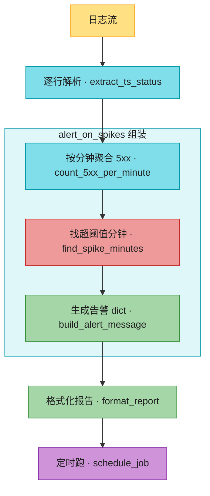

# Ch26 · 定时任务与日志分析:schedule + 聚合告警

> **预计**:0.5 天 ｜ **前置**:Ch10(正则)、Ch02(dict.get)、Ch03(推导式)｜ **M4 第 4 章**
> **目标**:监控告警的核心 pipeline——**解析日志 → 按分钟聚合 5xx → 超阈值告警 → 格式化报告 → 定时跑**。用 `schedule` 库做进程内定时(= Java `ScheduledExecutorService`),用正则 + dict 做流式聚合。
> **本章主线**:你是电商后端的 on-call 工程师。`nginx` 把 API 网关日志写到 `server.log`,最近半夜老出 5xx。你要写一个「**日志报警器**」:逐行解析日志 → 按分钟统计 5xx → 找出错误数超阈值的分钟 → 生成结构化告警 → 格式化成能发群的报告 → 每 5 分钟定时跑一次。7 个函数全为这条主线服务。

> 📐 **本教程的契约**:§26.2–§26.8 每节**精确对应**作业里的函数,讲过的才考,考的必讲过。§26.1 是开胃、§26.9 是坑清单,讲透不出题。卡住时按对应表回查小节。

---

## 🗺️ 本章地图

读完这章 + 完成作业,你将能够:
- 用 `re.compile` + `search` + 捕获组从日志行抠出「时间戳」和「状态码」
- 说清 `re.search` 和 `re.match` 的区别,以及日志解析为什么用 `search`
- 用 `counts.get(minute, 0) + 1` 一行做流式聚合(= Java `map.merge`)
- 用「推导式 + sorted」筛出超阈值分钟,并让结果稳定
- 把告警构造成 **dict** 而非字符串,说清「数据 vs 表现」为什么要分离
- 把 4 个小函数组装成完整 pipeline——「小函数 + 组合」的 Pythonic 风格
- 用 `schedule.every(n).minutes.do(f)` 做进程内定时,并说清它生产上的局限

**作业 ↔ 教程对应表**(学哪节,就去做哪题):

| 作业题 | 对应小节 | 核心知识点 |
|--------|----------|-----------|
| `extract_ts_status` | §26.2 | re.compile + search + 捕获组 + 切片截到分钟 |
| `count_5xx_per_minute` | §26.3 | 流式聚合 + dict.get(k, 0) 计数 |
| `find_spike_minutes` | §26.4 | 生成器推导 + sorted 筛超阈值 |
| `build_alert_message` | §26.5 | 构造可序列化的告警 dict + 严重度分级 |
| `alert_on_spikes` | §26.6 | 综合:复用前 4 个函数组装 pipeline |
| `format_report` | §26.7 | 把告警 dict 列表格式化成文本报告 |
| `schedule_job` | §26.8 | schedule.every(n).minutes.do(f) |

---

## ⏱️ 学习路径:费曼五步(约 50 分钟)

| 步 | 你要做 | 在哪做 |
|----|--------|--------|
| ① 预览猜(2分钟) | 下面 6 个问题,先猜答案 | 本页 ① |
| ② 先动手 | 打开 `ch26_assignment.py`,**先试着写**(别看教程) | assignment |
| ③ 提取+反馈 | 凭记忆写完 → `uv run pytest` 红绿 | test |
| ④ 费曼(2分钟) | 大白话讲清「search vs match、聚合、数据 vs 表现」 | 本页 ④ |
| ⑤ 存闪卡 | 把 [`review.md`](./review.md) 的卡标复习日期 | review.md |

> 💡 **直接性原则**:别通读!先猜 ① → 去 ② 写作业 → **哪题卡了,回对应 § 查** → 改 → 再跑。

---

## ① 预览猜(先想,别急着翻答案)

1. 监控告警为什么不能「看到一条 5xx 就报警」,而要「按分钟聚合 + 超阈值才告」?
2. 一行日志 `"2026-07-24T10:00:01 500 GET /x"`,怎么用正则把「时间戳」和「状态码」一次抠出来?用 `match` 还是 `search`?
3. 「按分钟计数」用 dict 怎么一行写?`counts.get(minute, 0) + 1` 对应 Java 的什么?
4. 为什么告警消息要构造成 `dict`,而不是直接 `print` 一个拼接好的字符串?
5. 「读日志 → 聚合 → 筛选 → 告警」这 4 步,如果每步都是一个函数,怎么串成一个 pipeline?
6. `schedule` 库怎么表达「每 5 分钟跑一次」?它和系统 cron、Java `ScheduledExecutorService` 什么关系?

> 猜完带着验证心态进入正文。第 4 题的「数据 vs 表现」是 🔴,是运维脚本好维护的关键。

---

## §26.1 监控告警 pipeline(开胃 · 不出题)🟡

监控脚本的核心是**聚合 + 阈值**,不是「单条告警」——单条 5xx 可能只是某个用户网抖了一下,**聚合后超阈值**才说明系统真出问题了:



**这张图要你看懂：** 日志先解析再按分钟聚合 5xx，只有超阈值的分钟才变成告警 dict；青框 `alert_on_spikes` 就是中间那三步组装；`format_report` 把 dict 渲染成文本、`schedule_job` 让整条 pipeline 定时跑——本章画到这里为止，真 webhook 是 Ch27。

每个环节都是一个**小函数**(可单独测),串起来就是完整 pipeline。这是运维脚本的典型架构:**每个函数只做一件事,靠组合取胜**。

> 🟡 **Java 对比**:Java 你可能用 ELK(Logstash 聚合 + Watcher 告警)或 Prometheus + Alertmanager 做这套。Python 用几十行 + 标准库就能跑一个轻量版,这就是「胶水语言」的舒适区——不适合替代 Prometheus,但够你在 5 分钟内给一个临时服务加上告警。

---

## §26.2 正则提取:re.search + 捕获组(对应:`extract_ts_status`)🟡

日志解析第一步:从一行里抠出「时间戳」和「状态码」。模块顶部**预编译**正则(Ch10 学过:`compile` 一次,循环里复用,性能好):

```python
import re
_TS_STATUS_RE = re.compile(r"(\d{4}-\d{2}-\d{2}T\d{2}:\d{2}:\d{2})\s+(\d{3})")
```

- `(\d{4}-\d{2}-\d{2}T\d{2}:\d{2}:\d{2})` 第 1 组捕获时间戳 `2026-07-24T10:00:01`。
- `\s+` 中间的空白(1 个或多个空格)。
- `(\d{3})` 第 2 组捕获 3 位状态码 `500`。
- 两组都加了 `()`,是**捕获组**,后面用 `m.group(1)` / `m.group(2)` 取。

### Java 对照最小例

```java
// Java:Pattern + Matcher,啰嗦得多
Pattern p = Pattern.compile("(\\d{4}-\\d{2}-\\d{2}T\\d{2}:\\d{2}:\\d{2})\\s+(\\d{3})");
Matcher m = p.matcher("2026-07-24T10:00:01 500 GET /api");
if (m.find()) {                       // find ≈ search
    String ts = m.group(1);           // 捕获组从 1 开始(0 是整个匹配)
    int status = Integer.parseInt(m.group(2));
}
```

```python
# Python:同样是「编译 + 找 + 取组」,但更短
m = _TS_STATUS_RE.search("2026-07-24T10:00:01 500 GET /api")
if m:
    ts = m.group(1)                   # "2026-07-24T10:00:01"
    status = int(m.group(2))          # 500(group 取出是 str,转 int)
```

### 🔴 关键抉择:search 还是 match?

日志目标在**行中间**(前面有时间戳),必须用 `search`(任意位置找),不能用 `match`(只从开头匹配):

❌ **错误写法**(用 `match`,目标不在行首就匹配不到):

```python
re.match(r"(\d{3})", "2026-07-24T10:00:01 500 GET /api")   # None!
# match 从【开头】找 3 位数字,但开头是日期不是状态码 → 匹配失败
```

✅ **正确写法**(用 `search`,在任意位置找):

```python
_TS_STATUS_RE.search("2026-07-24T10:00:01 500 GET /api")   # 命中
# search 扫整行,找到「时间戳 状态码」这对模式就返回 Match
```

### 截断到分钟 + 非法行返回 None

```python
def extract_ts_status(line: str) -> tuple[str, int] | None:
    m = _TS_STATUS_RE.search(line)
    if not m:
        return None                    # 非法行:不抛异常,返回 None
    ts, status = m.group(1), int(m.group(2))
    return ts[:16], status             # ts[:16] 截到分钟
```

- **非法行返回 None**:解析失败**不抛异常**,返回 None 让上游 `continue` 跳过。运维脚本绝不为一条脏数据崩掉(EAFP 风格)。
- `ts[:16]`:`"2026-07-24T10:00:01"`[:16] = `"2026-07-24T10:00"`(分钟级)。字符串切片同 Java `substring(0, 16)`,把「秒」砍掉,聚合同一分钟的数据。

### 真实场景例:解析 server.log 的两行

```python
extract_ts_status("2026-07-24T10:00:01 500 GET /api/orders")
#   -> ("2026-07-24T10:00", 500)         # 同一分钟 10:00:15 的那条,分钟也是它
extract_ts_status("this line is malformed")
#   -> None                              # 脏数据,上游跳过
```

> ✅ 做 `extract_ts_status`:`search` → 没匹配返 None → `m.group(1)`、`int(m.group(2))` → `ts[:16]` 截到分钟。

---

## §26.3 流式聚合:dict.get(k,0)+1(对应:`count_5xx_per_minute`)🟢

解析完每行,按分钟累加 5xx 次数。这是「逐行读 → 边读边计数」的**流式**处理,大文件也不会撑爆内存(虽然这里入参已是 list,思路一致)。

### Java 对照最小例

```java
// Java:按分钟计数,merge 一行
Map<String, Integer> counts = new HashMap<>();
counts.merge(minute, 1, Integer::sum);          // 不存在当 0,再 +1
// 或更啰嗦的:
counts.put(minute, counts.getOrDefault(minute, 0) + 1);
```

```python
# Python:get(k, 0) + 1,一行顶 Java 三行 containsKey 判断
counts[minute] = counts.get(minute, 0) + 1
```

`counts.get(minute, 0)`:key 不存在返回默认 `0`(不抛 `KeyError`),加 1 后赋值回去;key 存在就取出当前值加 1。

### ❌ → ✅ 错误对照

❌ **错误写法**(Java 习惯直译,啰嗦):

```python
if minute in counts:                 # 每次都要先判断
    counts[minute] += 1
else:
    counts[minute] = 1
```

✅ **正确写法**(`get(k, 0)` 一行搞定「不存在当 0」):

```python
counts[minute] = counts.get(minute, 0) + 1
```

### 完整实现

```python
def count_5xx_per_minute(lines: list[str]) -> dict[str, int]:
    counts: dict[str, int] = {}
    for line in lines:
        parsed = extract_ts_status(line)      # 复用 §26.2
        if parsed is None:                    # 脏数据跳过
            continue
        minute, status = parsed
        if 500 <= status < 600:               # 只有 5xx 才计数
            counts[minute] = counts.get(minute, 0) + 1
    return counts
```

### 真实场景例:用 server.log 验证

`server.log` 里 10:00 这一分钟有 5 个 5xx(500/500/503/500/502),10:01 有 1 个(500),还有 2xx/4xx 和一行脏数据:

```python
count_5xx_per_minute(lines)
#   -> {"2026-07-24T10:00": 5, "2026-07-24T10:01": 1}
#   2xx/4xx 不计入;脏行被 extract 返回 None 跳过
```

> 🟢 **Java 对比**:`counts[minute] = counts.get(minute, 0) + 1` ≈ `map.merge(minute, 1, Integer::sum)`。`500 <= status < 600` 是 Python 的**链式比较**,Java 得写 `status >= 500 && status < 600`。

> ✅ 做 `count_5xx_per_minute`:循环 → `extract_ts_status` 过滤 None → `500 <= status < 600` → `counts[minute] = counts.get(minute,0) + 1`。

---

## §26.4 阈值筛选:sorted + 推导(对应:`find_spike_minutes`)🟢

从聚合结果里找「错误数 ≥ 阈值」的分钟。

### Java 对照最小例

```java
// Java:筛 + 排序
List<String> spikes = counts.entrySet().stream()
    .filter(e -> e.getValue() >= threshold)
    .map(Map.Entry::getKey)
    .sorted()
    .collect(Collectors.toList());
```

```python
# Python:生成器推导 + sorted,一行
return sorted(m for m, c in counts.items() if c >= threshold)
```

### 逐段拆解

```python
def find_spike_minutes(counts: dict[str, int], threshold: int) -> list[str]:
    return sorted(m for m, c in counts.items() if c >= threshold)
    #            └─ 取分钟 m        └─ 筛条件:c >= threshold
    #   sorted(...) 让结果按分钟排序,稳定可测
```

- `counts.items()` → `(minute, count)` 键值对。
- 推导式筛 `c >= threshold`,只取 `m`(分钟)。
- `sorted`:dict 虽 3.7+ 保持插入序,但跨运行/跨构造方式可能不同;**排序让结果稳定**,告警报告才不会忽前忽后。

### ❌ → ✅ 错误对照

❌ **错误写法**(忘了排序,结果顺序依赖插入序,不稳定):

```python
return [m for m, c in counts.items() if c >= threshold]   # 顺序没保证
```

✅ **正确写法**(`sorted` 包住,稳定排序):

```python
return sorted(m for m, c in counts.items() if c >= threshold)
```

### 真实场景例

```python
counts = {"2026-07-24T10:00": 5, "2026-07-24T10:01": 1}
find_spike_minutes(counts, threshold=3)   # -> ["2026-07-24T10:00"]  只有 10:00 超标
find_spike_minutes(counts, threshold=1)   # -> ["2026-07-24T10:00", "2026-07-24T10:01"]
find_spike_minutes(counts, threshold=99)  # -> []                      没超标
```

> ✅ 做 `find_spike_minutes`:`sorted(m for m, c in counts.items() if c >= threshold)`。注意是 `>=`(达到阈值就告),不是 `>`。

---

## §26.5 告警消息:数据 vs 表现(对应:`build_alert_message`)🟢

告警消息构造成 **dict**,不直接 `print` 字符串——这是运维脚本最重要的设计习惯。

### 🔴 为什么用 dict 不用字符串?

❌ **错误写法**(直接拼字符串,格式锁死):

```python
def build_alert_message(minute, count, threshold):
    return f"警告!{minute} 发生 {count} 个 5xx(阈值 {threshold})"   # 一个字符串
# 想推 webhook?得重新解析字符串。想入库?没法按字段查。想改格式?改函数。
```

✅ **正确写法**(返回 dict,数据和表现分离):

```python
def build_alert_message(minute: str, count: int, threshold: int) -> dict:
    severity = "critical" if count >= threshold * 2 else "warning"
    return {
        "minute": minute,
        "count": count,
        "threshold": threshold,
        "severity": severity,
        "message": f"{minute} 5xx 错误数 {count} 超过阈值 {threshold}",
    }
```

**dict 能做什么**:能 `json.dumps` 推 webhook(Ch27)、能入库按字段查、能传给 `format_report`(§26.7)换着花样渲染。**字符串把格式锁死了**,dict 把「数据」留给下游决定怎么「表现」。

### severity 分级

```python
severity = "critical" if count >= threshold * 2 else "warning"
```

超阈值 **2 倍**算 critical(半夜打电话叫人),否则 warning(上班再处理)。分级让告警系统决定通知渠道。

### 真实场景例

```python
build_alert_message("2026-07-24T10:00", 5, 3)
#   -> {"minute": "2026-07-24T10:00", "count": 5, "threshold": 3,
#       "severity": "warning",                        # 5 < 3*2=6
#       "message": "2026-07-24T10:00 5xx 错误数 5 超过阈值 3"}
build_alert_message("2026-07-24T10:00", 6, 3)
#   -> {..., "severity": "critical", ...}             # 6 >= 3*2
```

> ✅ 做 `build_alert_message`:算 severity(2 倍阈值分界),返回含 5 个字段的 dict。

---

## §26.6 综合:组装告警 pipeline(对应:`alert_on_spikes`)🔴

最后一道大题**不写新知识**,把前 4 个函数像积木一样拼成完整 pipeline:「吃进日志行 → 吐出告警 dict 列表」。

### 组装思路(调用关系)

对照 §26.1 的图：青框 `alert_on_spikes` 吃进 `lines` + `threshold`，先 `count_5xx_per_minute` 得到 `{分钟: 错误数}`，再 `find_spike_minutes` 取出超阈值分钟，最后给每个分钟调 `build_alert_message` 吐出告警 dict 列表。

### 实现(列表推导串起三个函数)

```python
def alert_on_spikes(lines: list[str], threshold: int = 3) -> list[dict]:
    counts = count_5xx_per_minute(lines)                 # §26.3
    return [
        build_alert_message(m, counts[m], threshold)     # §26.5
        for m in find_spike_minutes(counts, threshold)   # §26.4
    ]
```

> 🔴 **关键点**:`counts[m]` 取回该分钟的错误数——`find_spike_minutes` 只返回分钟字符串,告警里要的 `count` 得回 `counts` 里查。这就是「前一个的输出是后一个的输入」。

### 真实场景例:用 server.log 跑完整 pipeline

```python
alerts = alert_on_spikes(lines, threshold=3)
# 10:00 有 5 个 5xx(>=3 超标),10:01 只有 1 个(不超标)
#   -> [{"minute": "2026-07-24T10:00", "count": 5, "threshold": 3,
#        "severity": "warning", "message": "..."}]        # 1 条告警

alerts = alert_on_spikes(lines, threshold=1)
# threshold=1 时 10:00 和 10:01 都超标
#   -> [ {...10:00...}, {...10:01...} ]                  # 2 条告警
```

这道题考察的不是新语法,而是**组合能力**——每个零件你都写过了,现在要按正确顺序调用、把数据从一环传到下一环。这就是「小函数 + 组合」的 Pythonic 风格。

> ✅ 做 `alert_on_spikes`:`counts = count_5xx_per_minute(lines)`,然后列表推导 `build_alert_message(m, counts[m], threshold) for m in find_spike_minutes(counts, threshold)`。

---

## §26.7 输出:格式化报告(对应:`format_report`)🟢

告警 dict 是「数据」,最终要变成人能看的「报告」。这一节把 dict 列表格式化成多行文本——对应大纲里「输出到文件/邮件/群」的简化版(真发 webhook 在 Ch27)。

### 数据 → 表现

```python
def format_report(alerts: list[dict]) -> str:
    if not alerts:
        return "✅ 系统正常:无 5xx 超阈值告警"
    lines = [f"🚨 5xx 告警报告(共 {len(alerts)} 条)"]
    for a in alerts:
        lines.append(f"[{a['severity']}] {a['minute']} 5xx={a['count']} (阈值 {a['threshold']})")
    return "\n".join(lines)
```

- **空列表**单独处理:返回「系统正常」,语义清晰,调用方不用判空。
- 每条告警一行,从 dict 里按 key 取值拼进字符串——**数据(alerts)和表现(文本)分离**,想换格式只改这个函数,pipeline 不动。
- `"\n".join(lines)`:把多行拼成一个字符串(= Java `String.join("\n", lines)`)。

### ❌ → ✅ 错误对照

❌ **错误写法**(在 `build_alert_message` 里就 print,数据和表现焊死):

```python
def build_alert_message(...):
    print(f"警告!...")     # 想改成发钉钉?得改这个函数,污染了「构造数据」的职责
```

✅ **正确写法**(构造归构造(dict),格式化归格式化(str),各司其职):

```python
alerts = alert_on_spikes(lines, threshold=3)   # 数据
report = format_report(alerts)                  # 表现
print(report)                                   # 想发群就 send_webhook(report)
```

### 真实场景例

```python
alerts = alert_on_spikes(lines, threshold=3)
print(format_report(alerts))
# 🚨 5xx 告警报告(共 1 条)
# [warning] 2026-07-24T10:00 5xx=5 (阈值 3)

print(format_report([]))
# ✅ 系统正常:无 5xx 超阈值告警
```

> ✅ 做 `format_report`:空列表返回正常文案;否则标题行(含条数)+ 每条一行 `[severity] minute 5xx=count (阈值 threshold)`,`"\n".join` 拼接。

---

## §26.8 定时执行:schedule(对应:`schedule_job`)🟡

前面都是「跑一次」的函数,`schedule` 库让它**定时跑**(进程内定时,= Java `ScheduledExecutorService`)。

### Java 对照最小例

```java
// Java:每 10 分钟跑一次 cleanup
ScheduledExecutorService ses = Executors.newScheduledThreadPool(1);
ses.scheduleAtFixedRate(cleanup, 0, 10, TimeUnit.MINUTES);
```

```python
# Python:声明式,直白得像英语
import schedule
schedule.every(10).minutes.do(cleanup)    # 每 10 分钟跑 cleanup
```

### 实现

```python
def schedule_job(func, every_minutes: int):
    import schedule
    return schedule.every(every_minutes).minutes.do(func)
```

`schedule.every(10).minutes.do(func)` 返回一个 `Job` 对象(`job.interval == 10`、`job.unit == "minutes"`),并注册进全局任务表。

### 要真正触发,得配事件循环

`do(func)` 只是**注册**,不会自己跑。要让任务到点触发,得有个循环不断检查:

```python
import time, schedule

schedule_job(cleanup, every_minutes=10)
while True:
    schedule.run_pending()    # 检查有没有到点的任务,有就跑
    time.sleep(1)
```

### schedule vs cron vs Java 定时器

| 方式 | 场景 | 特点 |
|------|------|------|
| **schedule 库** | 脚本进程内 | 简单声明式,但**进程挂了就停**(单点) |
| **系统 cron / systemd timer** | 生产部署 | 系统级可靠,不依赖你的进程活着 |
| **Java ScheduledExecutorService** | Java 应用内 | = schedule 库的 Java 等价,应用内定时 |

> 🟡 **Java 对比**:`schedule.every(n).minutes.do(f)` ≈ `ScheduledExecutorService.scheduleAtFixedRate(f, 0, n, MINUTES)`,Python 更声明式。
>
> ⚠️ **生产监控别只靠 schedule**(进程挂就停)。要么 systemd/supervisor 守护你的进程,要么直接用 cron/任务队列(Celery/ARQ)。schedule 适合**轻量单机**脚本。

> ✅ 做 `schedule_job`:函数内 `import schedule`,返回 `schedule.every(every_minutes).minutes.do(func)`。

---

## §26.9 Java 老手常踩的坑 ⚠️

1. **单条错误就报警**:偶发 5xx 会刷屏。要**聚合 + 阈值**(按分钟/窗口计数,超阈值才告)。
2. **`match` vs `search`**:`match` 只匹配**开头**,日志目标在行中间时用 `search`。
3. **非法行抛异常拖垮脚本**:解析失败返回 None / 跳过,别让一条脏数据崩掉整个脚本。
4. **忘 `sorted` 让结果不稳定**:dict 遍历顺序虽 3.7+ 保持插入序,但跨构造方式可能不同;排序后报告才一致。
5. **告警直接 print 字符串**:锁死格式。返回 dict,序列化后能推 webhook、入库、换格式。
6. **`counts[m]` 忘了回查**:`find_spike_minutes` 只返回分钟,告警要的 `count` 得回 `counts` 里取。
7. **schedule 进程挂就停**:生产用 schedule 要配 systemd/supervisor 守护,或用 cron/任务队列兜底。
8. **链式比较写顺手了**:`500 <= status < 600` 是 Python 特有,Java 得拆开写 `&&`。

---

## 📝 本章作业

| 任务 | 知识点 | 难度 |
|------|--------|------|
| `extract_ts_status` | re.search + 捕获组 + 截断 | 🟡 |
| `count_5xx_per_minute` | dict.get(k,0)+1 流式聚合 | 🟢 |
| `find_spike_minutes` | 推导 + sorted 筛阈值 | 🟢 |
| `build_alert_message` | 构造告警 dict + severity 分级 | 🟢 |
| `alert_on_spikes` | 综合:复用前 4 个函数 | 🔴 |
| `format_report` | 数据 → 文本报告 | 🟢 |
| `schedule_job` | schedule.every().minutes.do() | 🟡 |

```bash
uv run pytest 04_devops_scripts/ch26/test_ch26_assignment.py -v
```

全绿 = 掌握 Ch26。

---

## ✅ 自测

- [ ] 能说清监控告警 pipeline 的 6 个环节
- [ ] 会用 `re.search` + 捕获组抠字段,说清 search vs match,非法行返回 None
- [ ] 能用 `dict.get(k, 0) + 1` 一行做流式聚合(对应 Java merge)
- [ ] 说清告警为什么返回 dict 不 print 字符串(数据 vs 表现)
- [ ] 能把 4 个小函数组装成 `alert_on_spikes` pipeline
- [ ] 知道 schedule 库的局限(进程挂就停),生产怎么兜底
- [ ] 7 个作业全绿

## 🎓 费曼挑战

1. 「为什么监控不能单条告警,要按分钟聚合 + 阈值?」— 重读 §26.1
2. 「`re.match` 和 `re.search` 区别?日志解析为什么用 search?」— 重读 §26.2/§26.9
3. 「`build_alert_message` 为什么返回 dict 不返回字符串?这和 `format_report` 怎么配合?」— 重读 §26.5/§26.7
4. 「`alert_on_spikes` 里 `counts[m]` 是干嘛的?为什么不能只用 `find_spike_minutes` 的返回值?」— 重读 §26.6
5. 「`schedule` 库和系统 cron 各适合什么场景?为什么生产不能只靠 schedule?」— 重读 §26.8

## 🧠 记忆闪卡 → [`review.md`](./review.md)

---

## ⏭️ 下一步:Ch27 配置管理与系统监控

聚合告警会做了,最后把 M4 收尾——**系统巡检**:用 `pydantic-settings` 管配置,`psutil` 检查磁盘/CPU/内存水位,异常时把本章的告警**推 webhook**(钉钉/飞书)。把 Ch24 的 psutil + 本章的告警 pipeline + 配置管理串成生产级巡检脚本。
