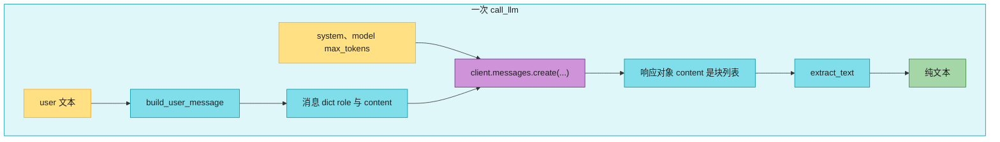
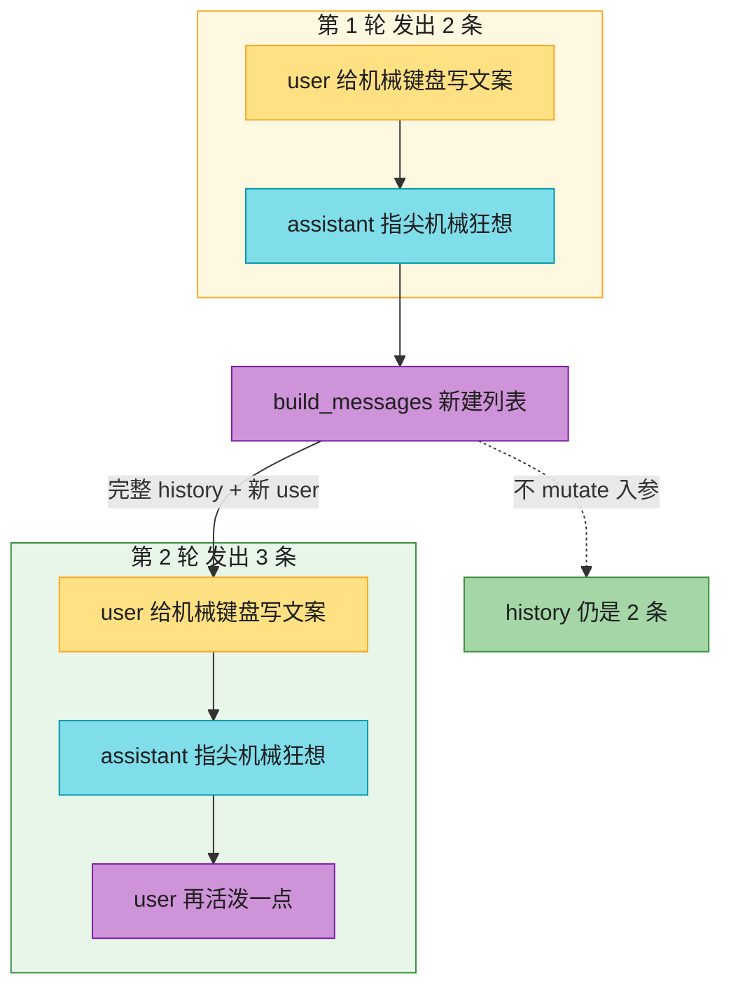

# Ch28 · LLM SDK 调用：Anthropic / OpenAI

> **预计**：1 天 ｜ **前置**：M1、Ch13(httpx 概念)｜ **M5 开篇**
> **目标**：学会用 Python SDK「调」LLM——发消息、解析响应、估 token、算成本、加重试。和 Java 调 REST API 本质一样，但 SDK 把 HTTP/JSON 封装成了方法调用，体验像调本地函数。

> 📐 **本教程的契约**：§28.2–§28.8 对应作业 7 个函数。**作业不调真实 API**（用 FakeClient 离线测），真实用法（配 API key）在 §28.9 有完整示例。
> 🎯 **主线场景**：电商后台要做一个「**商品营销文案生成器**」——读 `products.json` 里的商品，调 LLM 生成带货文案，支持多轮改写、控制成本、扛住网络抖动。整章围绕它展开。

---

## 🗺️ 本章地图

**作业 ↔ 教程对应表**：

| 作业 | 对应小节 | 核心知识点 |
|------|----------|-----------|
| `extract_text` | §28.2 | 解析 LLM 响应（`.content` 的多种形态）+ duck typing |
| `build_user_message` | §28.3 | messages 列表结构 + role/content |
| `call_llm` | §28.4 | client.messages.create 同步调用 + 参数传递 |
| `estimate_tokens` | §28.5 | token 估算（计费/上下文窗口意识） |
| `estimate_cost` | §28.5 | 按模型单价算一次调用的成本 |
| `build_messages` | §28.6 | 多轮对话历史拼接 + 不 mutate 入参 |
| `with_retry` | §28.7 | 网络调用的重试（EAFP + 错误过滤） |
| `generate_product_description` | §28.8 | **综合**：串起前面所有函数，完成业务闭环 |

---

## ⏱️ 学习路径：费曼五步（约 60 分钟)

① 预览猜 → ② 写 assignment（7 个函数）→ ③ pytest 红绿 → ④ 费曼 → ⑤ 存闪卡。

---

## ① 预览猜

1. Java 调一个 AI API 要 `HttpClient` + 拼 JSON body + Jackson 反序列化。Python 的 `anthropic` / `openai` SDK 把它简化成什么？
2. 模型返回的文本藏在响应对象的哪个字段？为什么不是直接的字符串？
3. 多轮对话，客户端要每次把「全部历史」发给模型吗？为什么？（提示：LLM 无状态）
4. 「1000 个 token」大概是多少英文单词？多少中文字？（计费和上下文窗口都靠它）
5. 调 LLM 一次花多少钱怎么算？（输入 token 单价 × 输入数 + 输出单价 × 输出数）
6. 网络调用必失败，你的代码怎么扛？（重试——和 Ch24 subprocess 一个套路）

---

## §28.1 SDK vs 裸 HTTP 🟡

调 LLM 两种方式：

- **裸 HTTP**（httpx/requests）：自己拼 `POST /v1/messages`，自己解析 JSON，自己管鉴权/重试/流式。灵活但啰嗦。
- **官方 SDK**：`client.messages.create(...)`，SDK 帮你拼请求、解析响应、处理鉴权/重试/流式。**日常用 SDK**。

❌ **错误写法（裸 HTTP 硬刚）**：

```python
# 别这么干：自己拼请求、自己管 key、自己解析嵌套 JSON
import httpx
resp = httpx.post(
    "https://api.anthropic.com/v1/messages",
    headers={"x-api-key": "sk-ant-...", "anthropic-version": "2023-06-01"},
    json={"model": "claude-3-5-sonnet-20241022", "max_tokens": 1024,
          "messages": [{"role": "user", "content": "你好"}]},
)
text = resp.json()["content"][0]["text"]   # 结构变了就崩
```

✅ **正确写法（用 SDK）**：

```python
from anthropic import Anthropic
client = Anthropic()                       # 自动读 ANTHROPIC_API_KEY 环境变量
resp = client.messages.create(
    model="claude-3-5-sonnet-20241022",
    max_tokens=1024,
    system="你是电商文案助手",
    messages=[{"role": "user", "content": "给机械键盘写一句广告词"}],
)
print(resp.content[0].text)                # 模型回复
```

> 🟡 **Java 对比**：SDK ≈ `OkHttp` + Jackson + Resilience4j 三合一，压成一个方法调用；响应对象是强类型的（像 Java 的 DTO）。OpenAI SDK 用法几乎一样，换 `client.chat.completions.create(...)`，响应取 `resp.choices[0].message.content`。

**🔴 鉴权铁律**：API key **绝不写进代码**，走环境变量（`ANTHROPIC_API_KEY` / `OPENAI_API_KEY`）或 `.env`（Ch12/Ch22 讲过）。SDK 默认读环境变量，所以代码里看不到明文 key。

> 🔴 **本作业不调真实 API**：为了离线可测、不花钱、CI 能跑，作业用 **FakeClient**（只要带 `.messages.create()` 的鸭子类型对象）。真实用法见 §28.9。

---

## §28.2 解析响应：extract_text 🟡

模型回复**不是直接字符串**，而是结构化对象（因为可能有多段文本、工具调用、思考等）。

**Java 对照最小例**：

```python
resp = client.messages.create(...)
resp.content            # [TextBlock(type="text", text="你好"), ...]  ← 列表!
resp.content[0].text    # "你好"
```

**为什么是列表？** 一次回复可能有多个内容块（文本 + 工具调用 + 引用），所以 `content` 是**块的列表**。这和 Java 里一个 HTTP 响应可能返回多个 part 是类似的。

**真实场景例**：电商文案生成器拿到响应后，要把文本抽出来存数据库。但 anthropic 返回 block 列表、有些 mock 直接给字符串、有些给 dict 列表——`extract_text` 要兼容这三种形态，用 duck typing：

```python
def extract_text(response) -> str:
    content = getattr(response, "content", response)   # 没有 .content 就把 response 本身当内容
    if isinstance(content, str):
        return content
    parts = []
    for block in content:
        text = getattr(block, "text", None)
        if text is None and isinstance(block, dict):
            text = block.get("text")
        if text:
            parts.append(text)
    return "".join(parts)
```

- `getattr(response, "content", response)`：有 `.content` 取它，没有就把 response 本身当内容（兼容字符串入参）。这是 duck typing 的容错套路——「不问类型，只看有没有这个属性」。

❌ **错误写法（假设永远是 anthropic 风格）**：

```python
def extract_text_bad(response):
    return response.content[0].text   # 传个字符串或 dict 就 AttributeError
```

✅ **正确写法**：上面那个 `getattr` 容错的版本。

> ✅ 做 `extract_text`：`getattr(response,"content",response)` → str 直接返回 → 否则遍历取 `.text`/`["text"]` 拼接。

---

## §28.3 构造消息：build_user_message 🟢

LLM API 的对话单位是 **message**：`{"role": "...", "content": "..."}`。`role` 常见取值：

- `"user"`：用户/调用方说的话
- `"assistant"`：模型上一轮的回复
- （system 在 anthropic 里单独传，不进 messages；openai 是 `{"role":"system"}` 放 messages 里）

**Java 对照最小例**：

```python
msg = {"role": "user", "content": "你好"}
# 等价 Java: Map.of("role","user","content","你好")，但 Python dict 更轻
```

**真实场景例**：电商文案生成器要构造「给这个商品写文案」的用户消息：

```python
product = {"name": "机械键盘", "price": 599.0, "category": "电脑外设"}
prompt = f"给商品写一句 20 字内带货文案：{product['name']}，{product['category']}，¥{product['price']}"
msg = build_user_message(prompt)
# -> {"role": "user", "content": "给商品写一句 20 字内带货文案：机械键盘，电脑外设，¥599.0"}
```

**为什么单独抽一个函数？** 消息结构是整个 API 的基础构件，抽出来保证构造逻辑只有一处（DRY），以后要加字段（如 `name`）只改这里。

> ✅ 做 `build_user_message`：`return {"role": "user", "content": content}`。

---

## §28.4 发请求：call_llm 🟢

**Java 对照最小例**：

```python
def call_llm(client, system, user, model="claude-3-5-sonnet-20241022", max_tokens=1024):
    response = client.messages.create(
        model=model, system=system, max_tokens=max_tokens,
        messages=[{"role": "user", "content": user}],
    )
    return extract_text(response)          # 复用 §28.2
```

- `client.messages.create(...)`：**同步**调用，阻塞到模型返回（几秒）。SDK 也有异步版（`AsyncAnthropic`，Ch18 学的 async）。
- 参数：`model`（用哪个模型）、`system`（设定角色/规则）、`messages`（对话）、`max_tokens`（最多生成多少 token，防超长 + 控成本）。

**真实场景例**：生成单条商品文案：

```python
client = Anthropic()
desc = call_llm(
    client,
    system="你是电商文案助手，回答简洁有力",
    user="给商品写一句 20 字内带货文案：机械键盘，电脑外设，¥599",
    max_tokens=100,
)
print(desc)   # "指尖机械狂想，敲击即享受！"
```

**为什么要复用 `extract_text`？** 解析逻辑和调用逻辑分离——**小函数组合**，不要把解析塞进调用里。这样换 SDK（anthropic → openai）只改 `extract_text`。



**这张图要你看懂：**一次 `call_llm` 是三条小函数串起来：`build_user_message` 造消息 dict，`client.messages.create(...)` 换回结构化响应，`extract_text` 再从 `content` 块列表抽出纯文本。

> ✅ 做 `call_llm`：`client.messages.create(model/system/max_tokens/messages=[build_user_message(user)])` → `extract_text(response)`。

---

## §28.5 token 与成本：estimate_tokens / estimate_cost 🟡

**token** 是 LLM 计费和上下文窗口的基本单位（≈ 一个词根）。不是字符、不是单词，是模型分词后的单元。

- 粗估：英文约 **4 字符 ≈ 1 token**；中文约 **1 字 ≈ 1-2 token**。
- 精确：用 `tiktoken` 库（openai 模型）或 SDK 的 `client.messages.count_tokens(...)`（anthropic）。

**Java 对照最小例**：

```python
def estimate_tokens(text):
    return max(1, len(text) // 4)          # 粗估，够用于「这段会不会超窗口」的判断
```

**真实场景例**：电商后台要批量给 10 个商品生成文案，先估一下会不会超预算：

```python
prompt = "给商品写文案：机械键盘..."     # 假设 200 字符
in_tokens = estimate_tokens(prompt)      # 50
out_tokens = 100                          # max_tokens 上限
# 一次调用大约 50 + 100 = 150 token
```

**为什么要关心 token**：

- **计费**：按「输入 token + 输出 token」分别收钱，单价不同（输出通常更贵，因为生成更耗算力）。
- **上下文窗口**：模型一次能吃进的 token 有上限（如 200k）。历史 + 当前消息超了就「遗忘」最早的。

**成本估算**：知道单价就能算一次调用花多少钱。以 Claude 3.5 Sonnet 为例，输入 \$3 / 百万 token，输出 \$15 / 百万 token：

```python
# 价格表：(每 token 美元)
PRICING = {
    "claude-3-5-sonnet-20241022": (3e-6, 15e-6),
    "claude-3-haiku-20240307":    (0.25e-6, 1.25e-6),
}

def estimate_cost(model, input_tokens, output_tokens):
    in_price, out_price = PRICING[model]
    return input_tokens * in_price + output_tokens * out_price
```

**真实场景例**：算一下批量生成 10 条文案的总成本：

```python
cost_one = estimate_cost("claude-3-5-sonnet-20241022", 50, 100)
# = 50*3e-6 + 100*15e-6 = 0.00015 + 0.0015 = 0.00165 美元 ≈ 1分钱
print(f"10 条文案约 ${cost_one * 10:.5f}")   # $0.01650
```

❌ **错误认知**：「token 数 = 字符数」。错！`"hello world"` 11 个字符 ≈ 2 token，不是 11。

✅ **正确认知**：token 是分词单元，粗估 `len(text)//4`，精确用 `tiktoken`。

> ✅ 做 `estimate_tokens`：`return max(1, len(text) // 4)`（空串至少 1）。
> ✅ 做 `estimate_cost`：查 `PRICING[model]` 得 `(in_price, out_price)`，返回 `input_tokens*in_price + output_tokens*out_price`。

---

## §28.6 多轮对话：build_messages 🟡

**关键认知**：LLM 是**无状态**的——它不记得上一句。多轮对话靠**客户端每次把全部历史发过去**。

**Java 对照最小例**：

```python
def build_messages(history, user):
    return [*history, {"role": "user", "content": user}]
```

- 每次请求的 `messages` = 完整历史 + 新消息。模型靠这些历史「恢复」上下文。
- `role` 交替：`user`（用户）/ `assistant`（模型上轮回复）。多轮就是 user↔assistant 来回。
- **历史越长，token 越多，越贵**（§28.5）——所以有「上下文窗口」上限和「记忆截断」策略（Ch30 Memory 讲）。

**真实场景例**：文案生成器支持「改写」——用户对第一版不满意，说「再活泼一点」，模型要基于上一版改写：

```python
history = [
    {"role": "user",      "content": "给机械键盘写文案"},
    {"role": "assistant", "content": "指尖机械狂想，敲击即享受！"},
]
msgs = build_messages(history, "再活泼一点，加个 emoji")
# -> 3 条：原 2 条 + 新 user 消息。把这 3 条发给模型，它知道要改写上一版。
```

> ⚠️ **别 mutate 入参**：`return [*history, ...]` 新建列表，不 `history.append(...)`。`append` 会改坏调用方的 history（可变默认参数陷阱，Ch02）。

❌ **错误写法（改坏调用方的列表）**：

```python
def build_messages_bad(history, user):
    history.append({"role": "user", "content": user})   # 调用方的 history 被改了!
    return history
```

✅ **正确写法**：`return [*history, {"role": "user", "content": user}]`——返回新列表，原 history 不动。这对应 Java 里别直接改别人传进来的 List。



**这张图要你看懂：**LLM 无状态，第 2 轮不能只发新 user；要把第 1 轮那 2 条完整叠上新消息变成 3 条一起发出。`build_messages` 新建列表，入参 history 仍是 2 条。

> ✅ 做 `build_messages`：`return [*history, build_user_message(user)]`。

---

## §28.7 重试：with_retry 🟡

网络调用必失败（超时、限流 429、服务端 5xx）。重试是标配——和 Ch24 `run_command_safely` 同一个 EAFP 套路。

**Java 对照最小例**：

```python
def with_retry(func, attempts=3, errors=Exception):
    last = None
    for _ in range(attempts):
        try:
            return func()
        except errors as e:
            last = e
    raise last
```

**真实场景例**：批量生成 10 个商品文案，中间某次调用被限流（429），重试 3 次扛过去：

```python
client = Anthropic()
desc = with_retry(
    lambda: call_llm(client, "你是文案助手", "给机械键盘写文案"),
    attempts=3,
    errors=Exception,   # 生产里收窄到具体的 RateLimitError / APITimeoutError
)
```

**`errors` 参数的意义**：指定「哪些异常算可重试」。生产里你只想重试**瞬时错误**（超时/429/5xx)，不重试 400（参数错，重试也没用——是你请求本身就错了）。

❌ **错误写法（重试所有错误）**：

```python
# 400 参数错误重试 100 次也是 400，纯属浪费钱和时间
with_retry(lambda: call_llm(client, "S", "U"), attempts=100, errors=Exception)
```

✅ **正确写法**：只重试瞬时错误，且加退避。

```python
# 真实 SDK 里有具体异常类型，只重试它们
from anthropic import RateLimitError, APITimeoutError
with_retry(lambda: call_llm(...), attempts=3, errors=(RateLimitError, APITimeoutError))
```

**指数退避**：生产里第 2 次等 1s、第 3 次等 2s、第 4 次等 4s……避免猛打服务端。SDK/`tenacity` 库自带，这里手写理解原理（`time.sleep(2 ** n)`）。

> 🟡 **Java 对比**：= Spring Retry `@Retryable` / Resilience4j。Python 手写也就 6 行（EAFP 简洁）。

> ✅ 做 `with_retry`：`for _ in range(attempts): try return func() except errors as e: last=e` → `raise last`。

---

## §28.8 综合：generate_product_description 🔴

把前面所有函数串起来，完成业务闭环——**这就是 SYLLABUS 里的「商品描述生成器」**。

**业务需求**：输入一个商品 dict（来自 `products.json`）和语气（`tone`，如「活泼」「专业」「文艺」)，输出一段营销文案。要求：

1. 根据商品信息 + tone 构造 prompt
2. 调 LLM（带重试，扛网络抖动）
3. 返回文案文本

**思路（组合前面的小函数）**：

```python
def generate_product_description(client, product, tone="活泼"):
    prompt = (
        f"给商品写一段{tone}风格的带货文案（30字内）："
        f"{product['name']}，品类{product['category']}，价格¥{product['price']}"
    )
    return with_retry(
        lambda: call_llm(client, "你是电商文案助手", prompt, max_tokens=100),
        attempts=3,
    )
```

- 复用 `call_llm`（发请求 + 解析）→ `with_retry`（加重试）。
- **这就是 Python 的「组合优于继承」**：不需要搞一个 `ProductDescriptionGenerator extends AbstractLLMService`，几个小函数一拼就是业务。

**真实场景例**：批量给 `products.json` 里所有商品生成文案：

```python
import json
from anthropic import Anthropic

client = Anthropic()
products = json.load(open("assets/mock_data/products.json"))
for p in products:
    desc = generate_product_description(client, p, tone="活泼")
    print(f"{p['name']}: {desc}")
```

> ✅ 做 `generate_product_description`：拼 prompt（含 tone/name/category/price）→ `with_retry(lambda: call_llm(...), attempts=3)`。

---

## §28.9 真实用法示例（讲透，带 API key)

```python
import os
from anthropic import Anthropic

client = Anthropic()                      # 读环境变量 ANTHROPIC_API_KEY

def ask(question: str) -> str:
    return with_retry(
        lambda: call_llm(client, "你是一个简洁的 Python 助手", question),
        attempts=3,
    )

if __name__ == "__main__":
    # export ANTHROPIC_API_KEY=sk-ant-...
    print(ask("用一行 Python 反转字符串"))
```

- API key 通过 `ANTHROPIC_API_KEY` 环境变量给（不写代码里）。
- `with_retry` 包住调用，瞬时错误自动重试。
- **OpenAI SDK 同理**：

```python
from openai import OpenAI
client = OpenAI()                         # 读 OPENAI_API_KEY
resp = client.chat.completions.create(
    model="gpt-4o",
    messages=[{"role": "user", "content": "你好"}],
)
print(resp.choices[0].message.content)    # 注意字段路径和 anthropic 不同
```

---

## §28.10 Java 老手常踩的坑 ⚠️

1. **API key 写进代码 / 进 git**：泄漏即烧钱。走环境变量，`.env` 加 `.gitignore`。
2. **以为模型有记忆**：LLM 无状态，多轮必须每次发全部历史（否则它「失忆」)。
3. **不设 `max_tokens`**：模型可能输出超长，既慢又贵。设上限。
4. **不重试**：网络抖动直接报错给用户。生产必加重试（带退避）。
5. **重试所有错误**：400（参数错）重试也没用，只重试瞬时错误（429/5xx/超时）。
6. **裸 HTTP 硬刚**：能用 SDK 就别手拼 JSON（鉴权、重试、流式、新字段 SDK 都帮你处理了）。
7. **同步调用阻塞**：高并发场景用 `AsyncAnthropic`(Ch18)，别在 async 函数里调同步 client（会阻塞事件循环）。
8. **token 当字符数算**：token 是分词单元，英文 4 字符 ≈ 1 token，别按字符数估成本。

---

## 📝 本章作业

| 任务 | 知识点 | 难度 |
|------|--------|------|
| `extract_text` | 解析响应 + duck typing | 🟡 |
| `build_user_message` | messages 结构 | 🟢 |
| `call_llm` | 同步调用 + 复用 | 🟢 |
| `estimate_tokens` | token 估算 | 🟢 |
| `estimate_cost` | 按单价算成本 | 🟡 |
| `build_messages` | 多轮 messages + 不 mutate | 🟡 |
| `with_retry` | 重试（EAFP) | 🟡 |
| `generate_product_description` | **综合**（串起所有） | 🔴 |

```bash
uv run pytest 05_ai_framework/ch28/test_ch28_assignment.py -v
```

全绿 = 掌握 Ch28。

---

## ✅ 自测

- [ ] 知道为什么用 SDK 不用裸 HTTP，以及 API key 走环境变量
- [ ] 能从 `.content` 列表里抽出文本（duck typing 兼容多形态）
- [ ] 理解 LLM 无状态，多轮靠每次发全部历史
- [ ] 知道 token 是计费/上下文单位，会粗估 + 按单价算成本
- [ ] 会写带 `errors` 过滤的重试，知道为什么只重试瞬时错误
- [ ] 能把小函数组合成 `generate_product_description` 完成业务闭环
- [ ] 7 个作业全绿

## 🎓 费曼挑战

1. 「为什么模型回复的 `content` 是列表而不是字符串？」— 重读 §28.2
2. 「LLM 是无状态的」对客户端代码意味着什么？— 重读 §28.6
3. 「为什么重试要区分错误类型？哪些错误重试也没用？」— 重读 §28.7/§28.10
4. 「为什么 `generate_product_description` 不需要写成一个类？」— 重读 §28.8

## 🧠 记忆闪卡 → [`review.md`](./review.md)

---

## ⏭️ 下一步：Ch29 Prompt 工程 + 结构化输出

会「调」了，接下来学「**怎么问**」——Prompt 设计（few-shot/CoT)+ 用 Pydantic 强制 LLM 返回结构化 JSON，告别手写正则解析。
