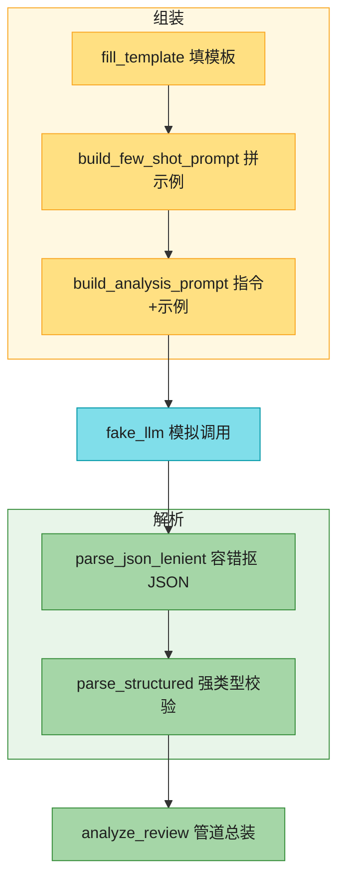

# Ch29 · Prompt 工程与结构化输出

> **预计**:0.5 天 ｜ **前置**:Ch28(LLM SDK 调用)、Ch14(Pydantic 模型)、Ch10(正则)｜ **M5 第二章**
> **目标**:① 掌握让模型稳定输出的三大 Prompt 套路——**模板填充、few-shot、CoT**;② 用 **Pydantic** 把 LLM 吐出的(带噪声的)文本解析成**强类型对象**,彻底告别手写正则解析。
> 本章主线:你是「极客商城」AI 组工程师。运营提了需求:每天几千条用户评论,人工打标太慢,要用 LLM 把每条评论分析成 `{sentiment, score, pros, cons}` 结构化结果,入库存表。你的任务:搭一条**生产级评论分析管道**——组装 Prompt → 调 LLM(本章用录制响应 `fake_llm` 模拟)→ 容错抠 JSON → 强类型校验。

> 📐 **本教程的契约**:讲过的才考,考的必讲过。§29.2–§29.8 每节对应一道作业题,卡住时按「作业 ↔ 教程对应表」回查。

---

## 🗺️ 本章地图(元学习 · 原则一)

读完这章 + 完成作业,你将能够:
- 用 `str.format_map` + 容错 dict 填 Prompt 模板,**缺失占位符不炸**
- 说清 **few-shot** 为什么比 zero-shot 稳(完形填空效应),能组装示例 + 待答 query
- 把「指令 + few-shot 示例」拼成完整分析 Prompt
- 从带 ```` ```json ```` 围栏 / 前后解释文字的**噪声文本**里稳定抠出 JSON
- 用 Pydantic `model_validate` 把 dict 变成**带类型校验**的模型实例
- 用 **CoT**(思维链)让模型对复杂题先推理再作答
- 把以上所有件串成一条 `analyze_review` 管道

**作业 ↔ 教程对应表**(学哪节,就去做哪题):

| 作业题 | 对应小节 | 核心知识点 |
|--------|----------|-----------|
| `fill_template` | §29.2 | `format_map` + `__missing__` 容错 |
| `build_few_shot_prompt` | §29.3 | few-shot 示例组装,结尾留「输出:」 |
| `build_analysis_prompt` | §29.4 | 指令 + few-shot 组合(综合①) |
| `parse_json_lenient` | §29.5 | 带噪声文本抠 JSON(围栏优先) |
| `parse_structured` | §29.6 | JSON → Pydantic 模型,类型校验 |
| `build_cot_prompt` | §29.7 | CoT:先推理后答案 |
| `analyze_review` | §29.8 | **综合②:整条分析管道** |

**脚手架**(不用填,读它理解):`ReviewAnalysis`(Pydantic 结果模型)、`ANALYSIS_INSTRUCTION`(分析指令常量)、`FEW_SHOT_EXAMPLES`(两条示例)、`FAKE_LLM_RESPONSES`(录制响应表)、`fake_llm`(模拟 Ch28 的 LLM 调用)。

---

## ⏱️ 学习路径:费曼五步(约 50 分钟)

| 步 | 你要做 | 在哪做 |
|----|--------|--------|
| ① 预览猜(2分钟) | 下面 5 个问题,凭 Java 经验猜 | 本页 ① |
| ② 先动手 | 打开 `ch29_assignment.py`,**先试着写**(别通读) | assignment |
| ③ 提取+反馈 | 凭记忆写完 → `uv run pytest` 红绿 | test |
| ④ 费曼(2分钟) | 大白话讲清「为什么不能直接 json.loads LLM 输出」 | 本页 ④ |
| ⑤ 存闪卡 | 把 [`review.md`](./review.md) 的卡标复习日期 | review.md |

> 💡 **直接性原则**:别通读!先猜 ① → 去 ② 写作业 → **哪题卡了,回对应 § 查** → 改 → 再跑。
> 本章作业形态:`填函数体`,纯字符串 + Pydantic,**不调真实 LLM**——`fake_llm` 返回「录制好的」响应(故意带噪声),测的就是你的解析鲁棒性。

---

## ① 预览猜(2 分钟 · 激活你的 Java 直觉)

先别看答案,凭经验猜:
1. Java 里 `String.format("Hi %s", name)`;Python 用 `{name}` 占位符填模板时,**少给一个值**会怎样——报错还是留空?
2. 同一个 LLM,为什么「给 2 个 输入→输出 示例」比「干巴巴一句指令」输出格式稳定得多?
3. 模型返回 `好的,这是结果:\n```json\n{"score": 5}\n```\n希望有帮助!`——直接 `json.loads` 会怎样?
4. Java 里 JSON → 对象用 Jackson `readValue`;Python 里带**类型校验**的反序列化用什么?
5. 问模型「238×47=?」它常瞎猜;加一句什么话能显著提升准确率?

> 猜完带着验证心态进正文。第 3 题的「噪声抠 JSON」和第 4 题的「Pydantic 结构化」是本章最高频考点。

---

## §29.1 为什么 Prompt 是工程,不是玄学(开胃 · 不出题)🟡

LLM 的输出质量**强依赖你怎么问**。同一个模型,两种问法:

```text
❌ 差的问法:「分析这个评论」
   → 模型返回一段散文:「这位用户对产品总体满意,但也提到了价格问题……」
   → 你想程序化处理?傻眼,散文没法入库。

✅ 好的问法:「输出 JSON:{"sentiment": "正面/负面/中性", "score": 1-5},示例:……」
   → 模型返回 {"sentiment": "正面", "score": 4} → 直接解析入库。
```

> 🟡 **Java 对比**:Prompt 之于 LLM,= SQL 之于数据库。同一个库,SQL 写得好才出对的结果;Prompt 是「**给 LLM 的 SQL**」——用可复制的套路,稳定地把模型输出变成程序能消费的东西。

本章 7 个函数,就是这条「**组装 → 调用 → 解析**」管道上最常用的 7 个零件:



**这张图要你看懂：上半组装 Prompt（填模板 → 拼示例 → 指令+示例），中间 `fake_llm` 模拟调用，下半容错抠 JSON 再 Pydantic 强类型校验；`analyze_review` 把这三段收成一条管道。**

---

## §29.2 模板填充:fill_template 🟢

Prompt 里总有可变部分(用户输入、商品信息),用模板 + 占位符管理,别到处拼字符串。

### Java 对照最小例

```java
// Java:位置占位符,类型靠 %s/%d,少传参数 → MissingFormatArgumentException
String prompt = String.format("分析这条评论:%s", review);
// 或 MessageFormat:"分析这条评论:{0}" —— 占位符是数字下标,可读性差
```

```python
# Python:命名占位符,可读性好
"分析这条评论:{review}".format(review="键盘好用")      # 方式一:format
"分析这条评论:{review}".format_map({"review": "键盘好用"})  # 方式二:format_map(传 dict)
```

### 🟡 缺失占位符的容错(关键差异)

Prompt 模板常有**可选字段**(有时有商品类目、有时没有)。普通 `format` 遇到没给的占位符会**抛 `KeyError`**,一个可选字段就炸掉整个调用:

❌ **错误写法**(缺失键直接炸):

```python
template = "评论:{review}\n类目:{category}"
template.format(review="好用")        # KeyError: 'category' —— 生产线上一颗雷
```

✅ **正确写法**(自定义 dict,缺失键返回空串):

```python
class _Safe(dict):
    def __missing__(self, key):   # dict 查不到键时,Python 会调这个方法
        return ""

template = "评论:{review}\n类目:{category}"
template.format_map(_Safe({"review": "好用"}))   # → "评论:好用\n类目:"  不炸,缺省为空
```

- `format_map(d)` 用 dict 的键填 `{占位符}`;查键走的是 `d[key]` 协议,`dict.__missing__` 正是「查不到时的兜底钩子」。
- `**kwargs` 收关键字参数成 dict,再包一层 `_Safe` 即可兼得两种便利。

### 真实场景例(评论分析模板)

```python
REPORT_TEMPLATE = "商品:{sku}\n评论:{review}\n历史均分:{avg_score}"

fill_template(REPORT_TEMPLATE, sku="KB-001", review="手感绝了", avg_score=4.2)
# → "商品:KB-001\n评论:手感绝了\n历史均分:4.2"

fill_template(REPORT_TEMPLATE, sku="KB-001", review="手感绝了")   # 忘了 avg_score?
# → "商品:KB-001\n评论:手感绝了\n历史均分:"   不炸,留空 —— 调用方少传一个字段不该是事故
```

> ✅ 做 `fill_template`:定义 `class _Safe(dict)` 重写 `__missing__` 返回 `""` → `template.format_map(_Safe(kwargs))`。

---

## §29.3 few-shot:build_few_shot_prompt 🟡

模型「照葫芦画瓢」的能力极强。给它几个**输入→输出**示例,它就懂你要的格式和风格了——这叫 **few-shot**;不给示例干问叫 **zero-shot**。

### 为什么给示例更稳(完形填空效应)

LLM 的本质是「续写最可能的下文」。把 Prompt 组织成「示例1、示例2、待答的新输入」,模型会像做完形填空一样,**按示例的格式**续写答案:

```text
输入:苹果
输出:水果

输入:牛肉
输出:肉类

输入:胡萝卜
输出:          ← 留空!模型看到「输出:」就自动接着写「蔬菜」
```

> 🟡 **Java 对比**:没有语法对应物。类比带新同事:你说一百句规范,不如给他看两个做好的样例。**格式要求越严格,示例越不能省。**

### 组装规则

```python
def build_few_shot_prompt(examples, query):
    parts = []
    for inp, out in examples:
        parts.append(f"输入:{inp}\n输出:{out}")      # 每个示例:输入/输出对齐
    parts.append(f"输入:{query}\n输出:")             # 结尾留「输出:」不写答案
    return "\n\n".join(parts)                        # 示例间空行分隔
```

`build_few_shot_prompt([("苹果","水果"),("牛肉","肉类")], "胡萝卜")` 的产物(逐字符):

```text
输入:苹果\n输出:水果\n\n输入:牛肉\n输出:肉类\n\n输入:胡萝卜\n输出:
```

❌ **错误写法 1**(zero-shot 想要特定格式):

```python
prompt = f"把「{query}」分类成 JSON"   # 模型可能返回散文、可能键名乱起、可能加解释
```

✅ **正确写法**:给 1-3 个示例,格式在示例里「演」给它看。

❌ **错误写法 2**(结尾把答案也写了):

```python
parts.append(f"输入:{query}\n输出:待定")   # 模型可能照抄「待定」,或格式被带偏
```

✅ **正确写法**:结尾停在 `输出:` ——答案位置**留空**。

> 🟡 示例数量:1-3 个通常够。太多费 token(每条都计费),还可能让模型过拟合示例的风格而忽略真实指令。

> ✅ 做 `build_few_shot_prompt`:循环拼 `输入:{inp}\n输出:{out}`,结尾追加 `输入:{query}\n输出:`,`"\n\n".join`。

---

## §29.4 组装完整分析 Prompt:build_analysis_prompt(综合①)🟡

真实 Prompt = **角色/指令** + **few-shot 示例** + **待处理的输入**。骨架里已备好两个常量(读一眼,不用填):

```python
ANALYSIS_INSTRUCTION = (
    "你是电商评论分析助手。把用户评论分析成 JSON,格式:\n"
    '{"sentiment": "正面/负面/中性", "score": 1-5的整数, "pros": [优点列表], "cons": [缺点列表]}'
)

FEW_SHOT_EXAMPLES = [
    ("物流很快,键盘手感一流,就是贵了点",
     '{"sentiment": "正面", "score": 4, "pros": ["物流快", "手感好"], "cons": ["价格偏高"]}'),
    ("用了一周就坏了,客服还推三阻四",
     '{"sentiment": "负面", "score": 1, "pros": [], "cons": ["质量差", "售后差"]}'),
]
```

组装就是**指令在上、示例在下**,中间空行隔开:

```python
def build_analysis_prompt(review_text: str) -> str:
    return ANALYSIS_INSTRUCTION + "\n\n" + build_few_shot_prompt(FEW_SHOT_EXAMPLES, review_text)
```

`build_analysis_prompt("屏幕效果惊艳")` 的产物:

```text
你是电商评论分析助手。把用户评论分析成 JSON,格式:
{"sentiment": "正面/负面/中性", "score": 1-5的整数, "pros": [优点列表], "cons": [缺点列表]}

输入:物流很快,键盘手感一流,就是贵了点
输出:{"sentiment": "正面", "score": 4, "pros": ["物流快", "手感好"], "cons": ["价格偏高"]}

输入:用了一周就坏了,客服还推三阻四
输出:{"sentiment": "负面", "score": 1, "pros": [], "cons": ["质量差", "售后差"]}

输入:屏幕效果惊艳
输出:
```

❌ **错误写法**(把 Prompt 各处手拼、散落代码里):

```python
resp1 = call_llm(f"分析下:{review},要JSON")          # A 处一种写法
resp2 = call_llm(f"你是助手,分析{review}输出json")    # B 处另一种写法 → 格式漂移,解析端崩溃
```

✅ **正确写法**:Prompt 组装收敛到**一个函数**,全系统共用——格式只有一个事实来源(single source of truth),改格式只改一处。

> 🤔 **为什么值得单独一题**:这题没有任何新语法,但它是「工程化 Prompt」的核心习惯——**Prompt 是代码,不是字符串常量**。集中管理、可测试、可复用。

> ✅ 做 `build_analysis_prompt`:`ANALYSIS_INSTRUCTION + "\n\n" + build_few_shot_prompt(FEW_SHOT_EXAMPLES, review_text)`。一行,但顺序和分隔符要对。

---

## §29.5 容错 JSON 提取:parse_json_lenient 🔴

这是 LLM 工程里**最常踩的坑**。你让模型返回 JSON,它实际返回的常常长这样(本章 `FAKE_LLM_RESPONSES` 就是按这三种真实噪声录制的):

```text
噪声 A:Markdown 围栏(LLM 的「好心排版」)
    好的,这是分析结果:
    ```json
    {"sentiment": "正面", "score": 5}
    ```
    希望对你有帮助!

噪声 B:裸 JSON,但前后夹解释文字
    分析如下:{"sentiment": "中性", "score": 3}。以上供参考

噪声 C:干净 JSON(理想情况,别指望)
    {"sentiment": "负面", "score": 1}
```

### Java 对照最小例

```java
// Jackson 对「脏」文本一样崩——Java 里你会先 substring 掐头去尾
objectMapper.readValue("结果:{} 完", Map.class);   // JsonParseException
// Python 里 json.loads 同样严格,所以需要「先抠再解析」
```

### ✅ 正确写法:两级兜底

```python
import json, re

def parse_json_lenient(text):
    # 第一级:优先找 ```json {...} ``` 围栏(模型刻意排版的部分最可信)
    m = re.search(r"```(?:json)?\s*(\{.*?\})\s*```", text, re.S)
    if m:
        return json.loads(m.group(1))
    # 第二级:找最外层 {...}(贪婪,跨行)
    m = re.search(r"\{.*\}", text, re.S)
    return json.loads(m.group(0) if m else text)
```

逐点拆解:
- ```` ```(?:json)? ````:围栏开头,`json` 语言标记**可有可无**(噪声 A 的两种变体都覆盖)。
- `(\{.*?\})`:捕获组,**非贪婪** `.*?`——碰到围栏结尾的 ` ``` ` 就停,不会多吃。
- `re.S`(DOTALL):让 `.` 匹配换行符——JSON 常是多行的,**漏了它就匹配不到**。
- 第二级 `\{.*\}` 用**贪婪**:从第一个 `{` 一路到最后一个 `}`,把嵌套对象整个包住。
- 连 `{` 都没有?退回 `json.loads(text)` 让它正常抛异常——解析失败就该抛,别吞。

❌ **错误写法 1**(直接 `json.loads` 原始文本):

```python
json.loads('结果:\n```json\n{"score": 5}\n```')   # JSONDecodeError —— 生产线上一崩一片
```

❌ **错误写法 2**(手写一堆 replace/strip 抠):

```python
text.replace("```json", "").replace("```", "").strip()   # 脆!模型换个说法就废
```

✅ 用上面的**两级正则**:先信围栏,再信花括号。

> 🔴 **知道局限**:文本里有**多组并列** `{...}` 时(如 `{"a":1} 和 {"b":2}`),贪婪匹配会把两组包在一起导致解析失败。生产上的正解是**从源头消除噪声**——用 SDK 的结构化输出 / 工具调用强制模型只返回 JSON(§29.6 延伸阅读),`parse_json_lenient` 是兜底,不是银弹。

> ✅ 做 `parse_json_lenient`:`re.search(围栏正则, text, re.S)` → 命中取 `group(1)`;否则 `re.search(r"\{.*\}", text, re.S)` → 取 `group(0)`;都没有就 `json.loads(text)` 抛错。

---

## §29.6 Pydantic 结构化:parse_structured 🟡

抠出 dict 只是半程。`data["sentiment"]` 这种**字符串键 + 无校验**的写法,重构时全靠猜。把它变成**强类型对象**(Ch14 的 Pydantic):

### Java 对照最小例

```java
// Java:Jackson + JSR-303,编译期类型 + 校验注解
Review review = objectMapper.readValue(json, Review.class);  // 类型不符 → JsonProcessingException
```

```python
# Python:Pydantic v2,model_validate 把 dict 变成模型实例
from pydantic import BaseModel

class Review(BaseModel):
    sentiment: str
    score: int

r = Review.model_validate({"sentiment": "正面", "score": "5"})
r.score        # 5 —— 注意:字符串 "5" 被自动转成 int(Pydantic 的智能矫正)
r.sentiment    # IDE 有补全,重命名有重构 —— dict 给不了你这些
```

### 真实场景例(本章的 ReviewAnalysis)

骨架里给定的结果模型:

```python
class ReviewAnalysis(BaseModel):
    sentiment: str        # "正面" / "负面" / "中性"
    score: int            # 1-5
    pros: list[str]       # 优点列表,没有则为 []
    cons: list[str]       # 缺点列表
```

组合 §29.5,`parse_structured` 一行串联:

```python
def parse_structured(json_str, model_cls):
    data = parse_json_lenient(json_str)      # 先容错抠 dict
    return model_cls.model_validate(data)    # 再强类型校验
```

它替你挡住两类脏数据:

```python
parse_structured('{"sentiment":"正面","score":"不是数字","pros":[],"cons":[]}', ReviewAnalysis)
# ValidationError:score 要 int,给了无法转换的字符串 → 抛

parse_structured('{"sentiment":"正面","pros":[],"cons":[]}', ReviewAnalysis)
# ValidationError:缺 score 字段 → 抛
```

❌ **错误写法**(dict 直接用 + 手工校验):

```python
data = parse_json_lenient(text)
if "score" in data and isinstance(data["score"], int):   # 每个字段写一遍,维护噩梦
    ...
return data["sentiment"]    # 键名打错一个字母?运行到这才炸
```

✅ **正确写法**:模型类即契约。字段缺了、类型错了,`model_validate` **当场**抛 `ValidationError`,错误信息还带字段名。

> 🟡 **Pydantic 的矫正 vs 校验**:`"5"` → `5` 能转就转(宽容);`"不是数字"` → `5` 转不了才抛(严格)。这个「先尝试转换」的行为和 Jackson 很像。

> 📖 **延伸阅读(不考)**:Anthropic / OpenAI SDK 支持原生结构化输出(`response_format` 指定 JSON Schema,或 tool use 强制按 schema 返回),从**源头**保证 JSON 合法,连 §29.5 的容错都可以省掉。Ch32 讲 Agent 时会用到 tool use。

> ✅ 做 `parse_structured`:`parse_json_lenient(json_str)` 取 dict → `model_cls.model_validate(data)` 返回。

---

## §29.7 CoT:build_cot_prompt 🟢

复杂推理题(数学、逻辑、多步计算),直接问答案模型容易瞎猜。**Chain-of-Thought(CoT)**:要求模型**先把推理过程写出来**,再给答案——准确率大幅提升(有论文背书)。

### 最小例

```text
❌ 直接问:
Q:小明买 3 件单价 47 元的商品,满 100 减 20,实付多少?
A:121 元          ← 模型可能直接瞎蒙,错了你也不知道它怎么错的

✅ CoT 问法:
Q:……同上…… 请【一步步思考】:先用 <推理> 标签列出推理步骤,再用 <答案> 标签给出最终答案。
A:<推理>3×47=141;141>100,减 20;141-20=121</推理><答案>121</答案>
   ↑ 推理摆在这,错了你能定位是哪步错;而且「写出来」本身就让模型更准
```

关键短语:「**一步步思考**」/ 英文「**Let's think step by step**」——一句话触发模型的推理模式,成本为零,收益显著。

### 组装

```python
def build_cot_prompt(question: str) -> str:
    return (
        f"请【一步步思考】后回答下面的问题:\n\n{question}\n\n"
        f"先用 <推理> 标签列出推理步骤,再用 <答案> 标签给出最终答案。"
    )
```

- `<推理>` `<答案>` 是**结构化标签**——程序化抽取答案部分时,正则 `<答案>(.*?)</答案>` 一抠一个准(和 §29.5 的容错提取一个思路)。
- CoT 与 few-shot 可叠加:示例里也带推理过程,模型会学着推。

> 🔴 **新版模型**:Claude / GPT 高端模型有内置的 extended thinking(扩展推理),不用手写 CoT 提示。但理解 CoT 原理仍有价值:老模型要用、成本控制时要用、**排查模型答错的原因**时更要看它的推理链。

> ✅ 做 `build_cot_prompt`:返回含「一步步思考」+ 原问题 + 「先 `<推理>` 后 `<答案>`」要求的模板字符串。要素齐全即可,字面不必与教程逐字相同。

---

## §29.8 综合②:analyze_review 一条管道串起来 🔴

前面 6 个零件,现在总装成主线需求——**评论情感分析器**:

```python
def analyze_review(review_text: str) -> ReviewAnalysis:
    prompt = build_analysis_prompt(review_text)   # ① 组装 Prompt(指令+few-shot)
    raw = fake_llm(prompt)                        # ② 调 LLM(本章用录制响应模拟)
    return parse_structured(raw, ReviewAnalysis)  # ③ 容错抠 JSON + 强类型校验
```

### fake_llm:用「录制响应」代替真实调用(脚手架,读它)

真实 `call_llm`(Ch28)要 API key、要网络、还**每次返回都可能不同**——没法写确定性测试。工程解法:**录制回放**(类比 Java 的 WireMock / MockWebServer):

```python
FAKE_LLM_RESPONSES = {
    "屏幕效果惊艳,续航给力,值得推荐":
        '好的,这是分析结果:\n```json\n{"sentiment": "正面", "score": 5, "pros": ["屏幕好", "续航强"], "cons": []}\n```\n希望对你有帮助!',
    "用了一个月就坏了,售后还不给换,气死":
        '{"sentiment": "负面", "score": 1, "pros": [], "cons": ["质量差", "售后差"]}',
    "中规中矩,能用,价格还行":
        '分析如下:{"sentiment": "中性", "score": 3, "pros": ["价格合理"], "cons": []}。以上供参考',
}

def fake_llm(prompt: str) -> str:
    for review, response in FAKE_LLM_RESPONSES.items():
        if review in prompt:      # prompt 里包含哪条已知评论,就返回它对应的录制响应
            return response
    return '{"sentiment": "中性", "score": 3, "pros": [], "cons": []}'   # 未知评论的兜底
```

注意三条录制响应**故意**对应 §29.5 的三种噪声:围栏、前后夹文、干净 JSON。你的 `parse_json_lenient` 必须三种都扛住,`analyze_review` 才能过。

### 管道的账

| 评论 | 噪声类型 | 预期 `ReviewAnalysis` |
|------|---------|----------------------|
| 屏幕效果惊艳,续航给力,值得推荐 | ```` ```json ```` 围栏 + 前后文 | sentiment=正面, score=5, pros=[屏幕好,续航强], cons=[] |
| 用了一个月就坏了,售后还不给换,气死 | 干净 JSON | sentiment=负面, score=1, pros=[], cons=[质量差,售后差] |
| 中规中矩,能用,价格还行 | 前后夹文 | sentiment=中性, score=3, pros=[价格合理], cons=[] |
| 没见过的评论 | 兜底干净 JSON | sentiment=中性, score=3, pros=[], cons=[] |

❌ **错误写法**(每个调用点自己拼、自己解):

```python
# 运营系统里:
p = "分析" + review + "要JSON"; d = json.loads(call_llm(p)) ...
# 客服系统里:
p2 = f"你是助手,分析{review}"; d2 = json.loads(call_llm(p2)) ...
# → 格式漂移、解析逻辑重复 N 份、任何一处模型输出变了全线崩溃
```

✅ **正确写法**:一条管道函数收口——组装、调用、解析各自可单测,换真实 LLM 时只需把 `fake_llm` 换成 Ch28 的 `call_llm`,**其余一行不动**。

> ✅ 做 `analyze_review`:三行——`build_analysis_prompt` → `fake_llm` → `parse_structured(raw, ReviewAnalysis)`。顺序错了测试会教你做人。

---

## §29.9 Java 老手常踩的坑 ⚠️

1. **直接 `json.loads` LLM 的输出**:模型常带围栏/前后文,必崩。先 `parse_json_lenient` 抠,再 loads。
2. **手写正则解析所有字段**:脆、不可维护。抠出 JSON 后交给 Pydantic `model_validate`,正则只负责「找 JSON」这一件事。
3. **zero-shot 就想要严格格式**:格式要求越严格,越要给 few-shot 示例——「演一遍」胜过「说一百句」。
4. **few-shot 结尾把答案写上**:答案位留空(`输出:`),写了模型可能照抄。
5. **模板缺失占位符就炸**:用 `_Safe(dict)` 的 `__missing__` 容错,一个可选字段不该炸掉整个 Prompt。
6. **复杂题不让模型推理**:CoT 一句「一步步思考」免费提升准确率;加 `<推理>/<答案>` 标签还能程序化抽取。
7. **Prompt 字符串散落各处**:集中成模板常量 + 组装函数(单一事实来源),改格式只改一处。
8. **测试真调 LLM**:不可重现、要钱、要网。用录制响应(WireMock 思路)把「管道逻辑」和「模型行为」分开测。

---

## §29.10 速查:Prompt 工程 ↔ Java 世界对照

| Python / LLM 工程 | Java 对应 | 说明 |
|-------------------|-----------|------|
| `str.format_map(_Safe(d))` | `String.format` / `MessageFormat` | 命名占位符 + 缺失容错 |
| few-shot 示例 | (无对应;类比:给同事看样例) | 用示例「演」格式 |
| CoT「一步步思考」 | (无对应) | 触发推理模式的零成本短语 |
| `json.loads` | Jackson `readValue(String)` | 对脏文本都严格,都要先抠 |
| `parse_json_lenient` 两级正则 | 手写 `substring` 掐头去尾 | 围栏优先 → 裸 `{}` 兜底 |
| `model_cls.model_validate(d)` | `readValue(json, Cls)` + JSR-303 | dict → 强类型 + 校验 |
| `fake_llm` 录制回放 | WireMock / MockWebServer | 管道逻辑可确定性测试 |
| 结构化输出(延伸阅读) | (Jackson Schema 之类) | 从源头强制合法 JSON |

---

## 📝 本章作业

| 任务 | 知识点 | 难度 |
|------|--------|------|
| `fill_template` | format_map + `__missing__` 容错 | 🟢 |
| `build_few_shot_prompt` | few-shot 组装 + 留空答案位 | 🟡 |
| `build_analysis_prompt` | 指令 + few-shot 组合 | 🟢 |
| `parse_json_lenient` | 带噪声抠 JSON(三种噪声) | 🔴 |
| `parse_structured` | Pydantic 校验 + 类型矫正 | 🟡 |
| `build_cot_prompt` | CoT 模板 + 结构化标签 | 🟢 |
| `analyze_review` | **综合:整条分析管道** | 🔴 |

```bash
uv sync --extra ai
uv run pytest 05_ai_framework/ch29/test_ch29_assignment.py -v
```

期望:30+ 个测试全绿 = 掌握 Ch29。

---

## ✅ 自测清单

- [ ] 会用 `format_map` + `_Safe.__missing__` 做容错模板填充
- [ ] 说清 few-shot 为什么比 zero-shot 稳(完形填空),会组装示例 + 留空答案位
- [ ] 会把「指令 + 示例」拼成完整分析 Prompt,并说清为什么要集中管理
- [ ] 三种噪声(围栏/夹文/干净)都能抠出 JSON,知道 `re.S` 和非贪婪/贪婪的分工
- [ ] 会用 `model_validate` 做强类型校验,知道「能转则转、转不了才抛」
- [ ] 会写 CoT 模板,说清「一步步思考」为什么有用
- [ ] 能把管道串成 `analyze_review`,并说清 `fake_llm` 的工程意义(录制回放)
- [ ] 30+ 个测试全绿

---

## 🎓 费曼挑战(合上教程讲清「为什么」)

1. **「为什么不能直接 `json.loads` LLM 的输出?两级兜底正则各自防什么?正解(银弹)是什么?」**
   — 卡壳重读 §29.5。(关键词:围栏、前后文、`re.S`、非贪婪、结构化输出从源头解决)

2. **「few-shot 为什么比 zero-shot 稳?结尾的『输出:』为什么必须留空?」**
   — 卡壳重读 §29.3。(关键词:完形填空、续写本质、照抄答案)

3. **「`model_validate` 比 `data["score"]` 手工取值强在哪?『"5" 能转、"不是数字" 才抛』是什么行为?」**
   — 卡壳重读 §29.6。(关键词:类型矫正 vs 校验、模型类即契约、IDE 补全)

4. **「`analyze_review` 里为什么用 `fake_llm` 而不是真调 API?换成真实 LLM 时要改哪几行?」**
   — 卡壳重读 §29.8。(关键词:录制回放、确定性测试、只换一行调用)

---

## 🧠 记忆闪卡 → [`review.md`](./review.md)

---

## ⏭️ 下一步:Ch30 LangChain 基础

管道会搭了,但「组装 → 调用 → 解析」每条链都手写很重复。**LangChain** 用 LCEL(`prompt | model | parser`)把这种管道**声明式**拼起来,像 Unix 管道——你会看到本章的 `analyze_review` 用 LCEL 写只要一行。
