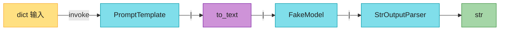

# Ch30 · LangChain 基础:LCEL

> **预计**:1 天 ｜ **前置**:Ch28(LLM SDK)、Ch29(Prompt/结构化输出)、Ch05(运算符重载)｜ **M5 第 3 章**
> **目标**:掌握 LangChain 的 **LCEL**(LangChain Expression Language)——把「渲染 prompt → 调模型 → 解析输出」这条链用 `prompt | model | parser` **声明式**拼起来,像 Unix 管道。顺便拿到批量、流式、记忆这些生产刚需。

> 📐 **本教程的契约**:§30.2–§30.8 每节对应一道作业题,卡住按「作业 ↔ 教程对应表」回查。**作业不调真实 LLM**:model 那一步用 `RunnableLambda` 包一个普通函数当 FakeModel;真实用法(ChatAnthropic 换上去)见 §30.9。
> 🎯 **主线场景**:你是「极客商城」AI 组工程师。Ch29 的评论分析器上线了,运营又提需求:① 做一个**客服问答机器人**,基于对话历史回答用户问题(带 3 轮记忆);② 每天几千条评论,要**批量**过一遍分析链。两件事都要用 LCEL 重写 Ch28/29 那种「手写三步」的老代码。

---

## 🗺️ 本章地图

读完这章 + 完成作业,你将能够:
- 说清 LCEL 是什么、`|` 为什么能串联组件(运算符重载)
- 用 `PromptTemplate.from_template` 建模板,并知道 `invoke` 返回的不是 str 而是 PromptValue
- 用 `RunnableLambda` 把任意函数包成可 `|` 串联的步骤(FakeModel 就靠它)
- 组装 `prompt | model | parser` 链并 `invoke` / `batch` 执行
- 理解 LLM 记忆 = 客户端维护 messages 列表,并把历史渲染进 prompt
- 把以上组合成「带记忆的客服问答」`chat_once`
- 能判断「何时直接 SDK、何时上 LangChain」

**作业 ↔ 教程对应表**(学哪节,就去做哪题):

| 作业题 | 对应小节 | 核心知识点 |
|--------|----------|-----------|
| `build_prompt` | §30.2 | PromptTemplate.from_template / PromptValue |
| `as_runnable` | §30.3 | RunnableLambda:普通函数 → Runnable |
| `build_chain` | §30.4 | LCEL `\|` 管道组装 + PromptValue→str 适配 |
| `run_chain` | §30.5 | chain.invoke 单条执行 |
| `batch_run` | §30.6 | chain.batch 批量执行(一次跑多条) |
| `append_turn` | §30.7 | 记忆原理:messages 列表 append,不 mutate |
| `format_history` | §30.7 | 把 messages 渲染成文本塞进 prompt |
| `chat_once` | §30.8 | **综合**:带记忆的客服问答(复用前面全部) |

---

## ⏱️ 学习路径:费曼五步(约 60 分钟)

| 步 | 你要做 | 在哪做 |
|----|--------|--------|
| ① 预览猜(2分钟) | 下面 5 个问题,凭 Java 经验猜 | 本页 ① |
| ② 先动手 | 打开 `ch30_assignment.py`,**先试着写**(别通读教程) | assignment |
| ③ 提取+反馈 | 凭记忆写完 → `uv run pytest` 红绿 | test |
| ④ 费曼(2分钟) | 大白话讲清「build_chain 里为什么要加 to_text」 | 本页 🎓 |
| ⑤ 存闪卡 | 把 [`review.md`](./review.md) 的卡标复习日期 | review.md |

> 💡 **直接性原则**:别通读!先猜 ① → 去 ② 写作业 → 哪题卡了回对应 § 查 → 改 → 再跑。

---

## ① 预览猜(2 分钟 · 激活你的 Java 直觉)

1. Java 8 Stream 是 `list.stream().map(f).filter(g).collect(...)`;如果 LangChain 把「prompt、model、parser」都做成能用 `a | b | c` 串联的组件,你猜它背后用了 Python 的什么机制?(Ch05 学过)
2. 你调 `prompt.invoke({"q": "你好"})`,觉得返回的是字符串 `str` 吗?(剧透:不是,这会坑到你)
3. 一个普通 Python 函数 `lambda s: s.upper()` 能直接 `|` 进 LCEL 管道吗?如果不能,要包一层什么?
4. LLM 本身无状态(Ch28),「带记忆的对话」在代码层面到底是个什么数据结构?
5. 要批量处理 1000 条评论,你会写 `for` 循环逐条 `invoke`,还是希望框架给你一个 `batch` 方法?后者有什么好处?

---

## §30.1 LCEL 是什么:Runnable 与 `|` 🟡

**LCEL**(LangChain Expression Language)是 LangChain 的**声明式**链语法。核心思想一句话:**每个组件都是 `Runnable`,用 `|` 串起来,数据从左流到右**:

```python
chain = prompt | model | parser
result = chain.invoke({"q": "你好"})   # prompt 渲染 → model 调用 → parser 解析
```

**Java 对照**:这就是组件级的 Java Stream / Reactor——`flux.map(f).filter(g)` 链式声明,执行时数据流过每个阶段。LCEL 把「map/filter」换成了「prompt/model/parser」这种 LLM 流水线的阶段。

**`|` 为什么能串联?** `Runnable` 类重载了 `__or__` / `__ror__`(Ch05 的运算符重载):

```python
# a | b  等价于  a.__or__(b),返回一个新的 RunnableSequence
prompt | model          # RunnableSequence(prompt, model)
prompt | model | parser # RunnableSequence(RunnableSequence(prompt, model), parser)
```

> 🔴 理解了「`|` = 运算符重载返回新 Runnable」就不会被魔法迷惑:`chain` 本身还是一个 Runnable,可以继续 `|` 下去。

**为什么用 LCEL(而不是手写三步)**:
- **统一接口**:所有组件都有 `invoke`(单条)/ `batch`(批量)/ `stream`(流式)。FakeModel 和真 ChatModel 可互换,链结构不变。
- **自带能力**:重试(`.with_retry`)、并发、回调可观测……声明一次全都有。
- **一眼看懂数据流**,改链就是改 `|` 的顺序。

> 🔴 **本作业不调真实 LLM**:model 步用 `RunnableLambda` 包一个普通函数(FakeModel)。真实场景把这一步换成 `ChatAnthropic`/`ChatOpenAI` 即可,链的其余部分一行不动(§30.9)。


**这张图要你看懂：** `|` 是 `__or__` 运算符重载，每次返回新 Runnable；`invoke` 时数据从左流到右。

---

## §30.2 PromptTemplate:`build_prompt` 🟢

LangChain 里 prompt 是个**对象**,不是裸字符串。用 `PromptTemplate.from_template` 从 `{占位符}` 模板创建:

**Java 对照最小例**:

```python
from langchain_core.prompts import PromptTemplate

p = PromptTemplate.from_template("回答:{q}")
p.invoke({"q": "你好"})                # ⚠️ StringPromptValue,不是 str!
p.invoke({"q": "你好"}).to_string()    # "回答:你好"
p.format(q="你好")                     # "回答:你好"(.format 直接返回 str)
```

- 模板里 `{q}` 是占位符,`invoke` 时按 dict 填值(像 Java `String.format`/`MessageFormat`,但按名字不按位置)。
- 多占位符:`PromptTemplate.from_template("{greeting},{name}")`,invoke 传 `{"greeting":"Hi","name":"Bob"}`。

⚠️ **最大的坑**:`invoke` 返回 **`StringPromptValue` 对象**,不是 `str`!这是 LCEL 的统一接口——组件之间传的是结构化对象(真实 ChatModel 能直接吃 PromptValue,还能区分 system/user 角色)。要纯文本就 `.to_string()`,或干脆用 `.format(...)`。

**真实场景例**:客服机器人的模板(作业里的 `QA_TEMPLATE`):

```python
QA_TEMPLATE = "你是极客商城的客服。\n{history}用户问:{question}\n客服答:"
p = PromptTemplate.from_template(QA_TEMPLATE)
p.invoke({"history": "", "question": "有货吗"}).to_string()
# "你是极客商城的客服。\n用户问:有货吗\n客服答:"
```

❌ **错误写法(把 PromptValue 当 str 用)**:

```python
result = p.invoke({"q": "你好"})
print(result + "!")        # TypeError:StringPromptValue 不支持 +
send_to_fake_model(result) # FakeModel 里 f"{result}" 渲染成对象 repr,乱码
```

✅ **正确写法**:`p.invoke({...}).to_string() + "!"`,或 `p.format(q="你好")`。

> ✅ 做 `build_prompt`:一行 `return PromptTemplate.from_template(template)`。别小看它——把「建模板」收敛成一个函数,以后换 `ChatPromptTemplate` 只改这里。

---

## §30.3 RunnableLambda:`as_runnable` 🟡

普通函数**不能**直接 `|` 进管道——只有 `Runnable` 才行。`RunnableLambda` 把任意 `f(x) -> y` 包成 Runnable 步骤:

**Java 对照最小例**:

```python
from langchain_core.runnables import RunnableLambda

up = RunnableLambda(lambda s: s.upper())
up.invoke("abc")                       # "ABC"

chain = up | RunnableLambda(lambda s: s + "!")
chain.invoke("hi")                     # "HI!"  ——包成 Runnable 后就能 | 串了
```

> 🟡 **Java 对比**:像把 `Function<String,String>` 适配成 Stream 的一个 stage;`RunnableLambda` 就是「函数 → Runnable」的适配器。

**真实场景例**:本章的 **FakeModel**——一个假装是 LLM 的普通函数(收 prompt 字符串、返回回答字符串):

```python
fake_model = RunnableLambda(lambda s: f"亲,已收到:{s}")
fake_model.invoke("用户问:有货吗")     # "亲,已收到:用户问:有货吗"
```

这就是**统一接口**的威力:管道里这一步是 `RunnableLambda`(离线测试、不花钱、CI 能跑),上线时换成 `ChatAnthropic(model=...)`,链的其他部分**一行不动**。

❌ **错误写法(直接塞普通函数)**:

```python
chain = prompt | (lambda s: s.upper())   # lambda 不是 Runnable,| 直接 TypeError
```

✅ **正确写法**:`prompt | RunnableLambda(lambda s: s.upper())`——先包再串。

> ✅ 做 `as_runnable`:一行 `return RunnableLambda(fn)`。

---

## §30.4 管道组装:`build_chain` 🔴

核心一步:用 `|` 把 prompt → model → parser 串成一条链:

**Java 对照最小例**:

```python
from langchain_core.output_parsers import StrOutputParser

def build_chain(prompt, model_runnable, parser):
    to_text = RunnableLambda(lambda v: v.to_string() if hasattr(v, "to_string") else str(v))
    return prompt | to_text | model_runnable | parser

chain = build_chain(
    PromptTemplate.from_template("Q:{q}"),
    RunnableLambda(lambda s: f"A:{s}"),
    StrOutputParser(),
)
chain.invoke({"q": "你好"})   # "A:Q:你好"
```

数据流:`{"q":"你好"}` → prompt 渲染出 `StringPromptValue("Q:你好")` → `to_text` 转成 `"Q:你好"` → FakeModel 拼成 `"A:Q:你好"` → `StrOutputParser` 原样输出字符串。

⚠️ **为什么中间要 `to_text` 适配?** prompt 步输出的是 `StringPromptValue`(§30.2)。**真实 ChatModel 原生能直接吃 PromptValue**;但我们的 FakeModel 是个只会 `f"{s}"` 拼接的普通函数,遇到 PromptValue 会渲染成对象 repr(乱码)。所以加一步 `to_text` 把 PromptValue 转成纯字符串。

> 🔴 这是「模拟 vs 真实」的差异:**真实链 `prompt | ChatAnthropic | StrOutputParser` 不需要 `to_text`**(见 §30.9)。教程这么写是为了让 FakeModel 能跑通——顺带教你一招:管道里随时可以插一个 `RunnableLambda` 做「数据适配」。



**这张图要你看懂：** 教学链在 FakeModel 前多一步 `to_text`（PromptValue 转 str）；真实链 `prompt | ChatAnthropic | StrOutputParser` 可拿掉它。

`hasattr(v, "to_string")` 是 duck typing(Ch28 用过):有 `to_string` 就用它(PromptValue),没有就 `str(v)` 兜底——这样 `to_text` 对字符串输入也安全。

**真实场景例**:批量分析评论的链(model 步返回 JSON 字符串,§30.6 会批量跑它):

```python
analysis_chain = build_chain(
    PromptTemplate.from_template("分析评论:{review}"),
    fake_model,            # 上线换 ChatAnthropic
    StrOutputParser(),
)
```

❌ **错误写法(漏掉 to_text,FakeModel 收到 PromptValue)**:

```python
chain = prompt | model_runnable | parser
chain.invoke({"q": "你好"})   # FakeModel 里 f"{v}" 得到对象 repr,不是 "Q:你好"
```

✅ **正确写法**:`prompt | to_text | model_runnable | parser`。

> ✅ 做 `build_chain`:先定义 `to_text`,再 `return prompt | to_text | model_runnable | parser`。

---

## §30.5 单条执行:`run_chain` 🟢

`chain.invoke(variables)` 按顺序跑完整条链,返回最终结果:

**Java 对照最小例**:

```python
chain = build_chain(p, model, StrOutputParser())
chain.invoke({"q": "你好"})        # "A:Q:你好" —— 一次 invoke = 渲染+调用+解析
```

> 🟡 **Java 对比**:`invoke` ≈ Stream 的**终止操作**(`collect`)——前面 `|` 只是声明,`invoke` 才真正执行。

**真实场景例**:客服机器人回答一个问题:

```python
answer = chain.invoke({"history": "", "question": "支持七天无理由吗?"})
# FakeModel 收到渲染好的完整 prompt 字符串,返回它的"回答"
```

**为什么单抽 `run_chain` 函数?** 一是语义化(读代码的人一眼知道「这是跑一次链」);二是以后要加日志、计时、重试,只改这一处——**小函数组合**的老道理(Ch28 §28.4 同理)。

> ✅ 做 `run_chain`:一行 `return chain.invoke(variables)`。

---

## §30.6 批量执行:`batch_run` 🟢

运营要批量处理评论:**别写 `for` 循环逐条 `invoke`**——LCEL 所有 Runnable 自带 `batch`:

**Java 对照最小例**:

```python
chain.batch([{"q": "a"}, {"q": "b"}, {"q": "c"}])
# ["A:Q:a", "A:Q:b", "A:Q:c"]   —— 一次调用跑三条,返回 list
```

- `batch` 内部用线程池**并发**执行(真实场景下调 LLM 是 IO 密集,并发提速明显),比 for 循环快。
- 输入是 `list[dict]`(每个元素是一条链的 variables),输出是 `list[结果]`,顺序与输入一一对应。
- 空列表 → 空列表,不炸。

> 🟡 **Java 对比**:`flux.parallel().map(...)` / 批量 `CompletableFuture`。LCEL 的 `batch` 把这层并发封装掉了,业务代码看不到线程。

**真实场景例**:把 Ch29 的评论分析链跑在全天评论上:

```python
reviews = ["物流很快,手感一流", "用一周就坏了", "中规中矩"]
inputs = [{"review": r} for r in reviews]
results = chain.batch(inputs)     # 3 条分析结果,顺序对应
```

❌ **错误写法(逐条 invoke,放弃并发)**:

```python
results = [chain.invoke({"review": r}) for r in reviews]   # 慢,且不是框架级批量
```

✅ **正确写法**:`chain.batch([{"review": r} for r in reviews])`。

> ✅ 做 `batch_run`:一行 `return chain.batch(inputs)`。

---

## §30.7 对话记忆:`append_turn` / `format_history` 🟡

**关键认知**(Ch28 强调过):LLM **无状态**。「记忆」= 客户端维护一个 messages 列表,每轮追加,下次请求**把全部历史塞进 prompt** 一起发。

**`append_turn`:追加一轮(不 mutate 入参)**

```python
def append_turn(history, user, assistant):
    return [*history, {"role": "user", "content": user},
                      {"role": "assistant", "content": assistant}]

append_turn([], "你好", "你好呀")
# [{"role":"user","content":"你好"}, {"role":"assistant","content":"你好呀"}]
```

❌ **错误写法(mutate 入参,可变默认参数陷阱 Ch02)**:

```python
def append_turn_bad(history, user, assistant):
    history.append({"role": "user", "content": user})   # 调用方的 history 被改坏!
    return history
```

✅ **正确写法**:`return [*history, {...}, {...}]` 返回新列表——对应 Java 里别直接改传进来的 List。

**`format_history`:把 messages 渲染成文本**

链的 prompt 是字符串模板,得先把 messages 列表渲染成文本(每轮两行:用户/客服):

```python
history = [
    {"role": "user", "content": "有货吗"},
    {"role": "assistant", "content": "有的"},
]
format_history(history)   # "用户:有货吗\n客服:有的\n"  —— 空历史返回 ""
```

拼进 `QA_TEMPLATE` 的 `{history}` 占位符,模型就能「看到」之前聊过什么。

**真实场景例**:三轮对话后,prompt 实际长这样:

```
你是极客商城的客服。
用户:有货吗
客服:有的
用户:发什么快递
客服:顺丰
用户问:今天能发吗
客服答:
```

> 🔴 **生产注意**:历史全发 → token 爆炸 + 超上下文窗口。生产用「窗口记忆」(只留最近 N 轮)或「摘要记忆」(旧对话压缩成摘要)。LangChain 有 `RunnableWithMessageHistory` 自动管历史(§30.9 简介),这里手写是为了理解原理。

> ✅ 做 `append_turn`:`[*history, {user}, {assistant}]`,不 mutate。
> ✅ 做 `format_history`:遍历 messages,`user`→`"用户:{c}"`、`assistant`→`"客服:{c}"`,每行 `\n` 结尾,`"\n"` join 后补尾部换行(或逐行收集再拼);空列表返回 `""`。

---

## §30.8 综合:`chat_once` 🔴

收尾综合题:**带记忆的客服问答**——复用前面全部函数,一轮问答的业务闭环:

```python
def chat_once(model_runnable, question, history):
    prompt = build_prompt(QA_TEMPLATE)                       # §30.2
    chain = build_chain(prompt, model_runnable, StrOutputParser())  # §30.4
    answer = run_chain(chain, {                              # §30.5
        "history": format_history(history),                  # §30.7
        "question": question,
    })
    return answer, append_turn(history, question, answer)    # §30.7
```

一轮做四件事:① 渲染历史进 prompt → ② 组链 → ③ 执行拿回答 → ④ 把这轮 user/assistant 追加进历史,返回 `(回答, 新历史)`。

**为什么返回新历史而不是改入参?** 调用方(比如一个 CLI 循环)自己持有 `history`,每轮 `history = chat_once(model, q, history)[1]` 显式更新——**不可变数据**风格,没有隐藏副作用(对应 Java 的 unmodifiableList 思路)。

**真实场景例**(CLI 多轮对话):

```python
history = []
while True:
    q = input("你: ")
    answer, history = chat_once(fake_model, q, history)
    print("客服:", answer)
```

这就是「商品客服问答机器人」的最小内核——FakeModel 换成真 ChatModel 就是生产版(§30.9)。

> ✅ 做 `chat_once`:严格按上面四步组合,**不要自己重写** build_prompt/build_chain/run_chain/append_turn 的逻辑(考的就是「复用」)。

---

## §30.9 真实用法示例(讲透,带 API key)

把 FakeModel 换成真模型,链结构不变——**统一接口的价值就在这里**:

```python
from langchain_anthropic import ChatAnthropic
from langchain_core.prompts import PromptTemplate
from langchain_core.output_parsers import StrOutputParser

prompt = PromptTemplate.from_template("用一句话解释:{concept}")
model = ChatAnthropic(model="claude-3-5-sonnet-20241022")  # 真模型,原生吃 PromptValue
chain = prompt | model | StrOutputParser()                 # 真·三步链,无需 to_text

print(chain.invoke({"concept": "闭包"}))
print(chain.batch([{"concept": "装饰器"}, {"concept": "生成器"}]))  # 批量一样用
# chain.stream({...})  流式输出(打字机效果)
```

- 真链**不需要 `to_text`**:`ChatAnthropic` 直接接受 PromptValue(还能区分角色)。
- API key 走环境变量 `ANTHROPIC_API_KEY`(Ch28 的鉴权铁律,不写进代码)。
- **记忆自动化**:生产里用 `RunnableWithMessageHistory` 包住链,它自动把历史塞进 prompt、自动 append——原理就是 §30.7 你手写的那套。

```python
from langchain_core.runnables.history import RunnableWithMessageHistory
# with_history = RunnableWithMessageHistory(chain, get_session_history, ...)
# 本章不考,知道有这东西即可(延伸阅读)
```

---

## §30.10 直接用 SDK 还是 LangChain?🟡

工程判断(别无脑上 LangChain):

| 场景 | 选择 | 理由 |
|------|------|------|
| 一问一答、简单调用 | **直接 SDK**(Ch28) | 轻、可控、少一层抽象,调试直观 |
| RAG / Agent / 多步流水线 / 流式 / 记忆 | **LangChain** | 链式组装 + 自带批量/流式/重试,省大量胶水代码 |
| 快速原型验证 | LangChain | 换模型、换 prompt 只改一个组件 |
| 长期维护的核心链路 | 视团队 | LangChain 抽象层多、版本变化快,调试要钻进去 |

> 🟡 趋势观察:不少人回归「SDK + 手写胶水」。本章教你**懂** LCEL,不是让你什么都用 LangChain——拿着锤子看啥都是钉子是大忌。

---

## §30.11 Java 老手常踩的坑 ⚠️

1. **以为 `prompt.invoke` 返回 str**:它返回 `StringPromptValue`。要文本用 `.to_string()` / `.format()`。
2. **FakeModel 直接吃 PromptValue**:普通函数 `f"{v}"` 把 PromptValue 渲染成 repr 乱码。真实 ChatModel 才原生处理 PromptValue——模拟链记得加 `to_text` 适配。
3. **把普通函数直接 `|` 进管道**:lambda 不是 Runnable,先 `RunnableLambda(fn)` 包一层。
4. **忘 `|` 背后是运算符重载**:`a | b` = `a.__or__(b)` 返回新 RunnableSequence。理解了就不觉得魔法。
5. **批量场景手写 for + invoke**:放弃并发。用 `chain.batch(inputs)`。
6. **记忆无限增长**:历史全发 → token 爆炸。生产用窗口/摘要记忆,或 `RunnableWithMessageHistory`。
7. **滥用 LangChain**:简单调用也套 LangChain,徒增抽象和调试难度。SDK 能搞定就 SDK。

---

## 📝 本章作业

| 任务 | 知识点 | 难度 |
|------|--------|------|
| `build_prompt` | PromptTemplate / PromptValue | 🟢 |
| `as_runnable` | RunnableLambda | 🟡 |
| `build_chain` | LCEL `\|` + PromptValue 适配 | 🔴 |
| `run_chain` | chain.invoke | 🟢 |
| `batch_run` | chain.batch 批量 | 🟢 |
| `append_turn` | 记忆原理 + 不 mutate | 🟡 |
| `format_history` | messages → prompt 文本 | 🟡 |
| `chat_once` | **综合**:带记忆问答(复用全部) | 🔴 |

```bash
uv sync --extra ai
uv run pytest 05_ai_framework/ch30/test_ch30_assignment.py -v
```

全绿 = 掌握 Ch30。

---

## ✅ 自测

- [ ] 懂 LCEL `|` 是声明式管道,背后靠 `__or__` 运算符重载
- [ ] 知道 `PromptTemplate.invoke` 返回 PromptValue 不是 str
- [ ] 会用 RunnableLambda 把普通函数包成可串联的步骤
- [ ] 能组装 `prompt | model | parser` 链,并说清 to_text 适配为什么存在
- [ ] 会用 `chain.batch` 批量执行,知道它并发、顺序对应
- [ ] 理解记忆 = 维护 messages 列表 + 渲染进 prompt
- [ ] 能把小函数组合成 `chat_once` 完成带记忆问答
- [ ] 能判断何时 SDK 何时 LangChain
- [ ] 8 个作业全绿

## 🎓 费曼挑战

1. 「LCEL 的 `|` 为什么能串联组件?」— 重读 §30.1
2. 「为什么 build_chain 里要加 to_text?真实链需要吗?」— 重读 §30.4/§30.9
3. 「batch 和 for 循环逐条 invoke 有什么区别?」— 重读 §30.6
4. 「chat_once 为什么返回新历史而不是改入参?」— 重读 §30.8
5. 「什么时候该用 LangChain,什么时候直接 SDK?」— 重读 §30.10

## 🧠 记忆闪卡 → [`review.md`](./review.md)

---

## ⏭️ 下一步:Ch31 RAG 实战

会调(Ch28)、会问(Ch29)、会串(Ch30)。接下来 RAG——让 LLM 基于【你的文档】回答:文档切片 → 向量化 → 检索 top-k → 拼上下文 → 回答。客服机器人马上就能查商品手册了。
