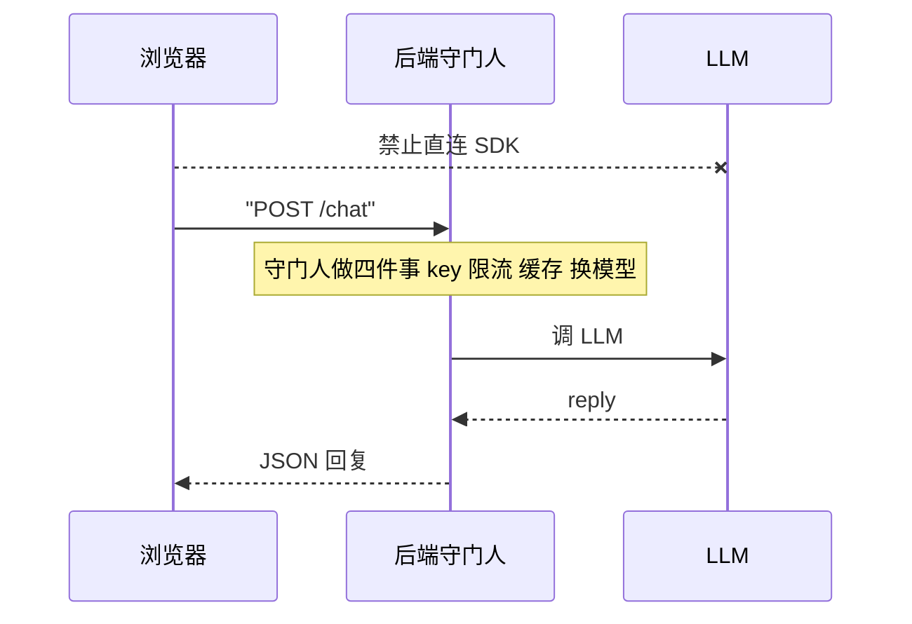
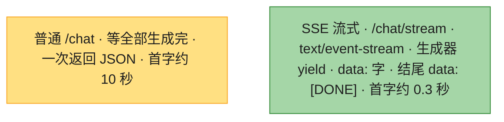

# Ch33 · 用 FastAPI 封装 AI 服务

> **预计**：0.5–1 天 ｜ **前置**：Ch14（FastAPI+Pydantic）、Ch16（Depends）、Ch18（async）、Ch28（LLM SDK）｜ **M5 收官章** ⭐
> **目标**：把 Ch31 的 RAG / Ch32 的 Agent 这类「AI 能力」包装成**生产级 HTTP API**——前端只管 `POST /chat`，不用关心背后是哪家模型、怎么鉴权、怎么限流、烧了多少 token。这是「AI 工程化」的核心一课。

> 🎯 **主线场景**：你是「极客商城」AI 组工程师。Ch32 的客服 Agent 在内部跑通了，老板要把它开放给小程序和 App。评审会上被连环拷问：① API key 能发给前端吗？② 有人拿脚本一夜刷你 10 万次怎么办？③ 同一个问题被问一万遍，LLM 就重算一万遍？④ 月底账单怎么解释？⑤ 用户盯着转圈 10 秒体验好吗？——这一章就是逐个给出工程答案，并落成可跑的代码。

> 📐 **本教程的契约**：§33.3–§33.9 对应作业 8 个函数，卡住按「作业 ↔ 教程对应表」回查。**作业不调真实 LLM**：默认注入 `EchoLLM`（离线 echo），测试用假 LLM 覆盖。真实用法（接 Anthropic SDK）在 §33.11 有完整示例。

---

## 🗺️ 本章地图

读完这章 + 完成作业，你将能够：

- 说清为什么 AI 能力必须封装成后端 API，而不是把 SDK 甩给前端
- 用 `Depends` + `dependency_overrides` 注入/替换 LLM（= Spring `@Autowired` + `@MockBean`）
- 给 AI 服务装上三个生产件：**token 成本估算**、**精确缓存**、**限流 429**
- 用 `StreamingResponse` + 生成器做 SSE 流式输出，首字 0.3 秒
- 知道长耗时任务的归宿：异步化 + 任务队列（Celery/ARQ）

**作业 ↔ 教程对应表**（学哪节，就去做哪题）：

| 作业函数 | 对应小节 | 核心知识点 | 难度 |
|----------|----------|-----------|------|
| `get_llm` | §33.3 | Depends 依赖注入 + `dependency_overrides` 可替换 | 🟡 |
| `estimate_tokens` | §33.4 | token 成本估算（计费/看板的度量基础） | 🟢 |
| `chat_logic` | §33.5 | 逻辑/路由分离 + 响应携带 usage | 🟢 |
| `chat_with_cache` | §33.6 | 精确缓存 + dict 解包 + 可观测标记 | 🟡 |
| `allow_request` | §33.7 | 计数限流 + 429 语义 | 🟡 |
| `handle_health` | §33.8 | 健康检查端点（探活不烧钱） | 🟢 |
| `handle_chat` | §33.8 | **综合**：限流 → 缓存 → 逻辑 的路由装配 | 🟡 |
| `handle_chat_stream` | §33.9 | SSE 流式（StreamingResponse + 生成器） | 🔴 |

> 综合征用：**Ch14**（Pydantic/TestClient）、**Ch16**（Depends）、**Ch18**（async）、**Ch28**（LLM 调用）——这一章是把前面学的招式串成一套连招。

---

## ⏱️ 学习路径：费曼五步（约 70 分钟）

| 步 | 你要做 | 在哪做 |
|----|--------|--------|
| ① 预览猜（2 分钟） | 下面 5 个问题，凭 Java 经验猜 | 本页 ① |
| ② 先动手 | 打开 `ch33_assignment.py`，**先试着写**（别通读教程） | assignment |
| ③ 提取+反馈 | 凭记忆写完 → `uv run pytest` 红绿 | test |
| ④ 费曼（2 分钟） | 大白话讲清「为什么限流要放在缓存前面」 | 本页 🎓 |
| ⑤ 存闪卡 | 把 [`review.md`](./review.md) 的卡标复习日期 | review.md |

> 💡 **直接性原则**：别通读！先猜 ① → 去 ② 写作业 → 哪题卡了回对应 § 查 → 改 → 再跑。

---

## ① 预览猜（2 分钟 · 激活你的 Java 直觉）

1. 前端要调你的 AI 能力，**为什么不直接把 LLM SDK + API key 暴露给前端**？（提示：想想你会把数据库 JDBC 连接串发给前端吗）
2. 测试时不想真打 LLM（慢、贵、CI 不稳），怎么把 LLM「换掉」？（提示：Spring 的 `@MockBean`）
3. 同一句话「支持 7 天无理由退货吗」一天被问 8000 次，LLM 每次都重算——你的第一反应优化是什么？
4. LLM 回复要 10 秒，怎么让用户 0.3 秒就看到第一个字开始「蹦」？（提示：流式 / 打字机）
5. K8s 每 5 秒探活你的服务，你让它探 `/chat` 还是单独开个端点？为什么？

---

## §33.1 为什么 AI 要封装成 API（而不是前端直连 SDK）🟢

把 LLM 调用收敛到后端 API 层，和当年「前端不直连数据库、必须经过后端」是**同一个道理**：

| 脏活 | 如果前端直连 LLM | 封装成后端 API 后 |
|------|-----------------|-------------------|
| API key | 发给每个客户端 = 裸奔，泄露即破产 | 只存在服务端环境变量（Ch28 铁律） |
| 限流防刷 | 做不了，脚本一夜刷光额度 | 服务端统一拦截（§33.7） |
| 缓存省钱 | 每个客户端各算各的，重复烧钱 | 服务端共享缓存（§33.6） |
| 换模型 | 所有端发版 | 改一行 `get_llm`（§33.3） |
| 计费/看板 | 无从统计 | 每次调用记 token（§33.4） |

> 🟡 **Java 对比**：= 你绝不会把 `DataSource` 注入到前端 JS 里，而是包一层 REST Controller。LLM 就是新时代的「数据库」——慢、贵、要鉴权，所以必须有个服务端守门人。这一章学的就是怎么写这个守门人。



**这张图要你看懂：** 浏览器只打 `POST /chat`，绝不直连 SDK；API key、限流、缓存、换模型全由后端守门人做完，再去调 LLM。

---

## §33.2 LLM 协议与默认实现：EchoLLM 🟡

全章的 LLM 都遵守一个**协议**：「有个 `ask(query) -> str` 方法」。

**Java 对照最小例**——你熟悉的面向接口编程：

```java
interface ChatService { String ask(String query); }

class EchoServiceImpl implements ChatService {          // 默认实现，离线可跑
    public String ask(String query) { return "echo:" + query; }
}
class AnthropicServiceImpl implements ChatService {     // 生产实现，真调 API
    public String ask(String query) { /* client.messages.create(...) */ }
}
```

**Python 业务例**——鸭子类型，连 interface 都不用写：

```python
class EchoLLM:
    """默认离线实现：原样回声，不连网、不花钱、CI 友好。"""
    def ask(self, query: str) -> str:
        return f"echo:{query}"

EchoLLM().ask("机械键盘有货吗")     # -> "echo:机械键盘有货吗"
EchoLLM().ask("")                   # -> "echo:"
```

为什么默认是个「假」LLM？

- **离线可跑**：CI、单元测试、本地调试都不连网、不烧钱。
- **定义协议**：任何带 `ask(query) -> str` 的对象都能注入（duck typing，§32.2 见过）。生产换成内部调 `client.messages.create(...)` 的真实现（§33.11），**路由代码一行不改**。

> 🟡 **Java 对比**：Python 没有 `interface` 关键字也能「面向接口编程」——「只要会叫就是鸭子」。想显式约束可以写 `typing.Protocol`（Ch07），本章教学版省略。

---

## §33.3 依赖注入：get_llm（对应：`get_llm`）🟡

**Java 对照最小例**——三件套一一对应：

| FastAPI | Spring Boot |
|---------|-------------|
| `def get_llm()` 依赖函数 | `@Configuration` 里的 `@Bean` 方法 |
| `llm: EchoLLM = Depends(get_llm)` | 构造器注入 `@Autowired ChatService llm` |
| `app.dependency_overrides[get_llm] = ...` | 测试里 `@MockBean` / `@TestConfiguration` 替换 Bean |

**Python 业务例**——极客商城客服 API 的注入与替换：

```python
def get_llm() -> EchoLLM:
    return EchoLLM()                        # 默认离线实现，生产换成真 SDK 封装

@app.post("/chat")
def handle_chat(body: ChatRequest, llm: EchoLLM = Depends(get_llm)):
    ...                                     # FastAPI 自动调 get_llm()，把返回值塞给 llm

# 测试时：注入假 LLM，全程离线
app.dependency_overrides[get_llm] = lambda: _MockLLM()
# 之后所有 Depends(get_llm) 拿到的都是 _MockLLM 实例

# 生产时：读环境变量决定用谁，路由代码零改动
def get_llm():
    if os.getenv("LLM_PROVIDER") == "anthropic":
        return AnthropicLLM()
    return EchoLLM()
```

> 🔴 **为什么必须包成依赖，而不是写死？** ❌ 错误写法：

```python
# ❌ 路由里直接 new：测试没法替换（只能真打 LLM，慢/贵/不稳），换模型要翻遍所有路由
@app.post("/chat")
def handle_chat(body: ChatRequest):
    llm = EchoLLM()
    return {"reply": llm.ask(body.query)}
```

✅ 正确写法：`llm: EchoLLM = Depends(get_llm)`。把「用哪个实现」的决策**推迟到组装时/测试时**——这就是 DI 的全部价值。

> ⚠️ **测试完必须清理 override**：`app.dependency_overrides.clear()`，否则这个用例的假 LLM 会**泄漏**到下一个用例（全局字典污染）。本章测试用 fixture 的 teardown 自动清理，你在 §33.8 会看到。

> ✅ 做 `get_llm`：就一行 `return EchoLLM()`。重点不在代码，在**理解它为什么是个依赖**。

---

## §33.4 成本估算：estimate_tokens（对应：`estimate_tokens`）🟢

LLM 按 token 计费。老板月底问「烧了多少钱」，你不能两手一摊——**每次调用都要记 token 数**，攒出成本看板。

**Java 对照最小例**——真实 token 数以 API 返回的 usage 为准：

```java
// Java：调完 API 读 usage，类似 JDBC executeUpdate 返回影响行数
AnthropicResponse resp = client.messages().create(...);
long total = resp.getUsage().getInputTokens() + resp.getUsage().getOutputTokens();
meterRegistry.counter("llm.tokens").increment(total);
```

**Python 业务例**——教学版离线，没有真 API 的 usage，用**字符数近似**：

```python
def estimate_tokens(text: str) -> int:
    return max(1, len(text) // 2)

estimate_tokens("")                  # -> 1   （空调用也保底记 1，防除零/防白嫖）
estimate_tokens("你好")               # -> 1   （2 字符）
estimate_tokens("echo:你好")          # -> 3   （7 字符）
estimate_tokens("机械键盘还有货吗")     # -> 4   （8 字符）
estimate_tokens("echo:机械键盘还有货吗")  # -> 6  （13 字符）
```

规则说明（教学约定，写死在 docstring 里）：**每 2 个字符 ≈ 1 token，至少记 1**。依据是经验值——英文 1 token ≈ 4 字符，中文 1 token ≈ 0.5~1 字，取保守的 2 字符/ token 便于手算。生产环境别估算，直接读 SDK 返回的 `resp.usage`（§33.11），或用 `tiktoken` 精确数。

> 🔴 **`max(1, ...)` 防什么？** ❌ 错误写法：`len(text) // 2`——空回复记 0 token，成本看板漏账；某些下游用 token 数做分母还会除零。✅ 保底 1：一次调用再短也是一次调用。

> ✅ 做 `estimate_tokens`：`return max(1, len(text) // 2)`。

---

## §33.5 逻辑层：chat_logic（对应：`chat_logic`）🟢

**Java 对照最小例**——Controller 薄、Service 厚，你的肌肉记忆：

```java
@Service
class ChatService {
    ChatReply chat(String query) {
        String reply = llm.ask(query);
        return new ChatReply(reply, estimateTokens(reply));   // 业务：回复 + 计费
    }
}
```

**Python 业务例**：

```python
def chat_logic(llm, query: str) -> dict:
    reply = llm.ask(query)
    return {"reply": reply, "tokens": estimate_tokens(reply)}

chat_logic(EchoLLM(), "你好")
# -> {"reply": "echo:你好", "tokens": 3}
chat_logic(EchoLLM(), "机械键盘还有货吗")
# -> {"reply": "echo:机械键盘还有货吗", "tokens": 6}
```

刻意从路由里拆出来，三个理由：

1. `llm` 是**入参**（不直接 `EchoLLM()`），测试传假对象就行——**不 import FastAPI，纯函数**，`pytest` 直接调。
2. 路由 `handle_chat` 只管「接 HTTP + 调它」，职责单一。
3. 业务变复杂（加历史、加缓存、加计费）时改 `chat_logic`，路由不动。

**为什么响应里带 `tokens`？** 两个用处：① 服务端写日志/看板，成本可追踪（§33.4）；② 返回给前端展示「本次消耗」，像 ChatGPT 的用量提示。一个字段同时服务成本和用户体验。

> 🟡 **Java 对比**：= Service 层 `chat()` vs Controller 层。注意 Python 里 Service 可以只是一个**模块级函数**——不需要 `@Service` 注解、不需要类，函数本身就是可注入的单位。

> ✅ 做 `chat_logic`：`reply = llm.ask(query)`，然后 `return {"reply": reply, "tokens": estimate_tokens(reply)}`。

---

## §33.6 缓存：chat_with_cache（对应：`chat_with_cache`）🟡

「支持 7 天无理由退货吗」一天被问 8000 次——**答案一个字都不会变，LLM 却重算 8000 次**。这是 AI 服务最大的浪费源。

**Java 对照最小例**：

```java
@Cacheable(cacheNames = "chat", key = "#query")     // Spring Cache + Caffeine/Redis
public ChatReply chat(String query) { ... }
```

**Python 业务例**——教学版用一个 dict 当缓存（生产换 Redis，接口一样）：

```python
def chat_with_cache(llm, query: str, cache: dict) -> dict:
    if query in cache:
        return {**cache[query], "cached": True}     # 命中：不调 LLM，标 cached
    result = chat_logic(llm, query)                  # 未命中：真调（烧钱的那次）
    cache[query] = result                            # 存的时候不带 cached 标记
    return {**result, "cached": False}

cache = {}
chat_with_cache(EchoLLM(), "你好", cache)
# -> {"reply": "echo:你好", "tokens": 3, "cached": False}   ← 真调 LLM
chat_with_cache(EchoLLM(), "你好", cache)
# -> {"reply": "echo:你好", "tokens": 3, "cached": True}    ← 缓存命中，LLM 零调用
cache["你好"]
# -> {"reply": "echo:你好", "tokens": 3}                    ← 缓存里只存结果，不含 cached
```

两个新语法点：

- `{**d, "cached": True}`：dict 解包合并（Ch02 学过 `**`）——把 `d` 的键值摊开，再盖上 `cached`。等价于 Java 的 `new HashMap<>(d)` + `put("cached", true)`。
- `"reply" in result` 风格的命中判断用 `query in cache`：`dict` 的 `in` 查的是**键**。

> 🔴 **为什么缓存里不存 `cached` 标记？** ❌ 错误写法：

```python
# ❌ 把带标记的整包塞进缓存：第二次命中取出来，cached 永远是第一次存的 False
cache[query] = {**result, "cached": False}
return cache[query]
```

✅ 正确写法：**缓存只存「纯净结果」**（`{"reply", "tokens"}`），`cached` 是「这一次请求」的元信息，**返回时**现加。这和你在 Java 里不把 `@Transient` 字段存进缓存是同一个分寸。

> 🟡 **缓存键只按 `query`、与用户无关**：客服 FAQ 场景合理（答案对所有人一样）。但如果对话涉及用户隐私（「我的订单」），缓存键要带 `user` 甚至禁用缓存——把 A 的订单答给 B 就是事故。

> ✅ 做 `chat_with_cache`：`if query in cache` 命中返回 `{**cache[query], "cached": True}`；否则 `result = chat_logic(llm, query)` → `cache[query] = result` → 返回 `{**result, "cached": False}`。

---

## §33.7 限流：allow_request（对应：`allow_request`）🟡

LLM 烧钱，一个脚本哥一夜能把你额度刷穿。API 层必须在**最前面**挡人。

**Java 对照最小例**：

```java
@RateLimiter(name = "chat", fallbackMethod = "tooBusy")   // Resilience4j
// 或 bucket4j：Bandwidth.simple(3, Duration.ofMinutes(1))
```

**Python 业务例**——教学版用**计数器限流**（每用户最多 N 次，无时间窗，确定性好测）：

```python
def allow_request(ledger: dict, user: str, limit: int) -> bool:
    used = ledger.get(user, 0)
    if used >= limit:
        return False                        # 超限：拒绝，计数不再涨
    ledger[user] = used + 1                 # 放行：计数 +1
    return True

ledger = {}
allow_request(ledger, "u1001", 2)   # -> True   ledger == {"u1001": 1}
allow_request(ledger, "u1001", 2)   # -> True   ledger == {"u1001": 2}
allow_request(ledger, "u1001", 2)   # -> False  超限，ledger 不再涨
allow_request(ledger, "u1002", 2)   # -> True   换个用户，独立配额
```

逐个拆：

- `ledger.get(user, 0)`：老用户取已用次数，新用户从 0 起（Ch02 `dict.get` 容错，避免 `KeyError`）。
- 超限时**不**再 `+1`：拒绝的请求不该消耗配额，否则计数会失去语义（「已放行数」变成「尝试数」）。
- 返回 `bool` 而不是抛异常：**限额判断是业务决策**，把「拒绝后怎么办」留给调用方（路由层转成 429，见 §33.8）。

> 🟡 **超限时该回什么？** ❌ 错误写法：返回 200 + `{"error": "太忙了"}`——调用方看到 200 以为成功，前端直接渲染报错文案。✅ 正确写法：HTTP **429 Too Many Requests**（语义化状态码，客户端/网关能识别并自动重试）。FastAPI 里 `raise HTTPException(status_code=429, detail="...")`，§33.8 落地。

> 🟡 **为什么教学版用计数器而不是时间窗？** 真实限流是「每分钟 N 次」的滑动窗口/令牌桶（slowapi 库 ≈ bucket4j），但依赖时钟的测试又慢又脆（要等窗口滑过）。计数版逻辑同构、行为确定，先把「挡在缓存前、超限 429」的骨架学扎实，生产再换 `slowapi` 一行接入。

> ✅ 做 `allow_request`：`used = ledger.get(user, 0)`；`used >= limit` 返回 `False`；否则 `ledger[user] = used + 1`，返回 `True`。

---

## §33.8 路由装配：handle_health / handle_chat（对应：同名函数）🟡

前面四个零件（注入、估算、缓存、限流）都是纯函数，这一节把它们**装配**成 HTTP 端点。

### handle_health（健康检查）🟢

```python
@app.get("/health")
def handle_health():
    return {"status": "ok"}
```

**为什么不探 `/chat`？** K8s/ELB 每 5 秒探一次活，探 `/chat` 会真打 LLM——**探活也烧钱**，一天 17280 次。健康检查必须「轻量、零外部依赖」。

### handle_chat（聊天路由 · 本章综合题）🟡

```python
RATE_LIMIT = 3                          # 教学版：每用户 3 次，便于测试触发 429（生产按分钟配额）
REQUEST_LEDGER: dict[str, int] = {}     # 限流账本（教学版用模块级 dict，生产换 Redis）
CHAT_CACHE: dict[str, dict] = {}        # 响应缓存（同上）

@app.post("/chat")
def handle_chat(body: ChatRequest, llm: EchoLLM = Depends(get_llm)):
    if not allow_request(REQUEST_LEDGER, body.user, RATE_LIMIT):
        raise HTTPException(status_code=429, detail="请求太频繁，请稍后再试")
    return chat_with_cache(llm, body.query, CHAT_CACHE)
```

**装配顺序就是防御纵深**，两行不能换：

1. **先限流**：管你是新问还是旧问，先数你一次——恶意脚本刷重复的已知问题（必中缓存）也照样被挡。
2. **后缓存**：放行之后才查缓存，命中就省一次 LLM 调用。

❌ 错误写法（顺序颠倒）：先查缓存再限流——缓存命中的请求「免费」了，脚本哥拿同一个 query 无限刷，你的服务被打满、账本却显示他很乖。

**HTTPException**：FastAPI 的内置异常，`raise HTTPException(status_code=429, detail="...")` 会被框架捕获，转成 `429 {"detail": "..."}` 的 JSON 响应。= Spring 的 `ResponseStatusException` 或 `@ControllerAdvice` 统一异常（Ch17 讲过）。

一次完整请求的命运（`POST /chat {"query": "你好", "user": "u1001"}`）：

| 步骤 | 发生什么 | 结果 |
|------|---------|------|
| ① Pydantic 校验 | 缺 `query` / 类型错 | **422**，后面全不走 |
| ② 限流 | `u1001` 已用 ≥ 3 | **429** `{"detail": "请求太频繁，请稍后再试"}` |
| ③ 缓存 | 命中 | 200，`cached: true`，**LLM 零调用** |
| ④ 逻辑 | 未命中 | 200，`{"reply": "echo:你好", "tokens": 3, "cached": false}` |

> 🟡 **模块级状态的测试卫生**：`REQUEST_LEDGER` / `CHAT_CACHE` 是模块级全局 dict——教学版图省事，但测试之间会**互相污染**（上个用例刷满了配额，下个用例直接 429）。本章测试用 autouse fixture 在每个用例前 `clear()`。生产环境这两个东西都该放 Redis（多实例共享 + TTL 自动过期），路由里通过 Depends 注入，就又回到可替换的老套路。

> ✅ 做 `handle_health`：`return {"status": "ok"}`。做 `handle_chat`：先 `allow_request(REQUEST_LEDGER, body.user, RATE_LIMIT)`，不通过 `raise HTTPException(status_code=429, detail="请求太频繁，请稍后再试")`；通过则 `return chat_with_cache(llm, body.query, CHAT_CACHE)`。

---

## §33.9 SSE 流式：handle_chat_stream（对应：`handle_chat_stream`）🔴

LLM 生成慢（几秒到十几秒）。普通 `/chat` 要等**全部生成完**才一次性返回，用户盯着转圈。**SSE（Server-Sent Events）** 让后端「边产边发」，前端实现打字机效果，首字 0.3 秒。

**Java 对照最小例**：

```java
@GetMapping("/chat/stream")
public SseEmitter chat(@RequestParam String q) {
    SseEmitter emitter = new SseEmitter();
    executor.submit(() -> { for (char c : answer.toCharArray()) emitter.send(c); });
    return emitter;
}
// 或 WebFlux：return Flux<ServerSentEvent>
```

**Python 业务例**——生成器天然就是「惰性产值」，和流式绝配：

```python
from fastapi.responses import StreamingResponse

@app.post("/chat/stream")
def handle_chat_stream(body: ChatRequest, llm: EchoLLM = Depends(get_llm)):
    def gen():
        text = llm.ask(body.query)              # 真实场景：换成 SDK 的流式接口
        for ch in text:
            yield f"data: {ch}\n\n"             # SSE 协议：每条 "data: <内容>\n\n"
        yield "data: [DONE]\n\n"                # 结束标记（OpenAI 风格约定）
    return StreamingResponse(gen(), media_type="text/event-stream")
```

注入的假 LLM 回 `MOCK:hi` 时，响应体逐字蹦出：

```
data: M\n\ndata: O\n\ndata: C\n\ndata: K\n\ndata: :\n\ndata: h\n\ndata: i\n\ndata: [DONE]\n\n
```

四个要点：

1. `StreamingResponse` 收一个**生成器**：FastAPI 边 `yield` 边往连接写，不等全部产完（Ch03 生成器的惰性在这里兑现成用户体验）。
2. `media_type="text/event-stream"` 是 SSE 协议 Content-Type；消息格式 `data: <内容>\n\n`（`\n\n` 是一条消息的结束符）。
3. 结尾的 `data: [DONE]` 是 OpenAI 沿袭下来的**结束约定**——前端读到它就知道流结束了（流式 HTTP 没有天然的「最后一条」标记）。
4. 前端用 `EventSource` 或 `fetch + ReadableStream` 消费。

> 🔴 **两个必踩的坑**：❌ 忘了 `media_type`——默认 `application/json`，前端按 JSON 解析一整串 `data: ...` 直接炸。❌ `return llm.ask(...)` 整串返回——那和普通 JSON 没区别，「流式」了个寂寞。✅ 生成器 + 逐字 `yield` + `text/event-stream` 三件套缺一不可。

> 🟢 **普通 JSON vs SSE**：

| | 普通 `/chat` | SSE `/chat/stream` |
|---|---|---|
| 首字延迟 | 等满 10s | 0.3s 开始蹦 |
| 协议 | `application/json` | `text/event-stream` |
| 前端 | `fetch().then(r=>r.json())` | `EventSource` / `ReadableStream` |
| 适用 | 后台任务、非交互 | ChatGPT 式聊天 UI |



**这张图要你看懂：** 普通 `/chat` 干等到全文生成完才一次返回 JSON；`/chat/stream` 用生成器边 `yield` 边推 `data: …\n\n`，最后一条 `data: [DONE]` 宣告结束。

> 🟡 教学版聚焦 SSE 机制本身，流式端点**没有**接限流/缓存——生产上它一样要限流（§33.7 的 `allow_request` 原样可用），缓存则要按「流式 chunks」维度重做，属于进阶话题。

> ✅ 做 `handle_chat_stream`：内层 `def gen()`：`text = llm.ask(body.query)`，`for ch in text: yield f"data: {ch}\n\n"`，最后 `yield "data: [DONE]\n\n"`；外层 `return StreamingResponse(gen(), media_type="text/event-stream")`。

---

## §33.10 延伸阅读：异步并发与队列削峰（了解，作业不考）🟡

> 本节是**延伸阅读**，作业不考。建立意识即可，实战在你的 M5 毕业项目里。

**① 同步调用阻塞 worker**：`EchoLLM.ask` 是同步函数，放在 `def`（非 async）路由里，FastAPI 自动把它丢进线程池执行，不阻塞事件循环——本章代码能跑就靠这个机制。但如果你手写 `async def` 路由却在里面调同步 SDK，**整个事件循环被卡住**，所有并发请求陪葬。✅ 正确姿势二选一：

```python
# 姿势 A：路由保持 def（同步），FastAPI 自动进线程池
@app.post("/chat")
def handle_chat(...): ...

# 姿势 B：路由用 async def，就配异步 SDK（Ch18）
from anthropic import AsyncAnthropic
@app.post("/chat")
async def handle_chat(...):
    resp = await client.messages.create(...)
```

**② 队列削峰**：生成周报、批量总结这种**分钟级**任务，别让 HTTP 请求挂着等。改成任务队列（Celery / ARQ ≈ Java 的 RabbitMQ + `@Async`）：

```
POST /tasks/summarize   -> 202 {"task_id": "t-123"}     立即返回，任务入队
GET  /tasks/t-123       -> {"status": "running"}        客户端轮询
GET  /tasks/t-123       -> {"status": "done", "result": "..."}
```

---

## §33.11 真实用法：接 Anthropic SDK

作业全程用 `EchoLLM` 离线跑。上线时只需把 `get_llm` 的返回值换成真实现——**路由、缓存、限流、SSE 代码全部零改动**，这就是 §33.3 依赖注入的回报：

```python
import os
from anthropic import Anthropic

class AnthropicLLM:
    """真实实现：内部调 Anthropic SDK（Ch28）。接口与 EchoLLM 一致：ask(query) -> str。"""
    def __init__(self):
        self.client = Anthropic()               # 自动读 ANTHROPIC_API_KEY 环境变量

    def ask(self, query: str) -> str:
        resp = self.client.messages.create(
            model="claude-sonnet-4-5",
            max_tokens=1024,
            messages=[{"role": "user", "content": query}],
        )
        return resp.content[0].text

def get_llm():
    if os.getenv("LLM_PROVIDER") == "anthropic":
        return AnthropicLLM()                   # 生产
    return EchoLLM()                            # 本地/CI 默认离线
```

三个生产提醒：

- **token 数别估算了**：真实 SDK 返回 `resp.usage`（`input_tokens` / `output_tokens`），用它替换 §33.4 的 `estimate_tokens`，成本看板才准。
- **流式换真源**：`_gen` 里改成 `with client.messages.stream(...) as s: for text in s.text_stream: yield f"data: {text}\n\n"`，逐 token 推。
- **API key 走环境变量**（Ch28 铁律），代码里永无明文。

---

## §33.12 Java 老手常踩的坑 ⚠️

1. **把 LLM 写死在路由里**（`llm = EchoLLM()`）→ 测试没法替换、换模型改一堆地方。**永远走 `Depends`**。
2. **测试真打 LLM** → CI 慢、不稳、烧钱。**永远 `dependency_overrides` 注入假 LLM**。
3. **忘了清理 `dependency_overrides`** → 假 LLM 泄漏到下一个用例。fixture teardown 里 `app.dependency_overrides.clear()`。
4. **模块级全局状态不重置** → 限流账本/缓存在用例间残留，测试顺序一换就挂。autouse fixture 里 `clear()`；生产换 Redis。
5. **先缓存后限流** → 缓存命中的请求不计数，脚本哥用同一个 query 白嫖到死。**限流永远在最前**。
6. **超限返回 200 + 错误文案** → 客户端以为成功。**用 429 状态码**，语义化才能被网关/客户端识别。
7. **缓存里存 `cached` 标记** → 命中后标记永远是旧值。**缓存只存纯净结果，元信息返回时现加**。
8. **SSE 忘了 `media_type`** → 前端按 JSON 解析就炸。必须 `text/event-stream`；结尾补 `data: [DONE]`。
9. **健康检查探 `/chat`** → 探活也烧 LLM 钱。`/health` 零外部依赖。
10. **async 路由里调同步 SDK** → 事件循环被卡死，并发全灭。要么 `def` 路由（自动线程池），要么 `async def` + `AsyncAnthropic`（§33.10）。

---

## 📝 本章作业

| 任务 | 知识点 | 难度 |
|------|--------|------|
| `get_llm` | Depends 依赖 + 可替换 | 🟡 |
| `estimate_tokens` | token 成本估算 | 🟢 |
| `chat_logic` | 逻辑/路由分离 + usage | 🟢 |
| `chat_with_cache` | 精确缓存 + dict 解包 | 🟡 |
| `allow_request` | 计数限流 + 429 | 🟡 |
| `handle_health` | 健康检查端点 | 🟢 |
| `handle_chat` | **综合**：限流→缓存→逻辑装配 | 🟡 |
| `handle_chat_stream` | SSE 流式 | 🔴 |

```bash
uv run pytest 05_ai_framework/ch33/test_ch33_assignment.py -v
```

全绿 = 掌握 Ch33。

**实现提示**：

- `get_llm`：`return EchoLLM()`。
- `estimate_tokens`：`max(1, len(text) // 2)`。
- `chat_logic`：先 `reply = llm.ask(query)`，再组 `{"reply": ..., "tokens": estimate_tokens(reply)}`。
- `chat_with_cache`：`query in cache` 命中返回 `{**cache[query], "cached": True}`；否则走 `chat_logic`、存缓存、标 `False`。
- `allow_request`：`ledger.get(user, 0)`，超限 `False`，否则 `+1` 返回 `True`。
- `handle_chat`：先限流（429 用 `HTTPException`），再 `chat_with_cache`。
- `handle_chat_stream`：生成器逐字 `yield f"data: {ch}\n\n"`，结尾 `yield "data: [DONE]\n\n"`，`StreamingResponse(gen(), media_type="text/event-stream")`。

---

## ✅ 自测

- [ ] 能说清「为什么 LLM 要包成依赖」（可替换、可测试）
- [ ] 会用 `app.dependency_overrides` 注入假 LLM 做离线测试，并知道要清理
- [ ] 能手算 `estimate_tokens("echo:你好") = 3`，并说清 `max(1, ...)` 防什么
- [ ] 理解 `chat_logic` 和 `handle_chat` 为什么要拆
- [ ] 能说清「为什么缓存里不存 `cached` 标记」
- [ ] 能说清「为什么限流放在缓存前面」，以及超限该回什么状态码（429）
- [ ] 知道 Pydantic 校验失败返回 422（不是 400）
- [ ] 能写出生成器 + `StreamingResponse` + `text/event-stream` 三件套，知道 `[DONE]` 约定
- [ ] 知道长耗时 AI 任务的归宿：async SDK / 任务队列（§33.10）
- [ ] 8 个作业全绿

## 🎓 费曼挑战

1. 「为什么不把 LLM 写死在路由里？`Depends` 给我们换了什么？」— 重读 §33.3
2. 「限流为什么必须在缓存前面？顺序反了会出什么事？」— 重读 §33.8
3. 「`cached` 标记为什么不能存进缓存？」— 重读 §33.6
4. 「SSE 流式相比一次性 JSON，延迟和体验差在哪？三件套是什么？」— 重读 §33.9
5. 「AI 服务上线前，你要加哪四样生产件？」（成本/缓存/限流/异步）— 重读 §33.4–§33.10

## 🧠 记忆闪卡 → [`review.md`](./review.md)

---

## ⏭️ 下一步：M5 毕业 🎓

Ch28–Ch33 走完一遍：**调 LLM（Ch28）→ Prompt 工程（Ch29）→ LangChain（Ch30）→ RAG（Ch31）→ Agent（Ch32）→ 封装成生产服务（Ch33）**——你已经能独立搭一个「生产级 AI 应用」了。

M5 毕业项目建议（挑一个做）：

- 把 Ch31 的 RAG 接进本章骨架：`chat_logic` 里先 `search_knowledge_base` 拼上下文再调 LLM，`/chat/stream` 流出带溯源编号的答案。
- 给 `/chat/stream` 补上限流（`allow_request` 原样复用），再用 `slowapi` 替换计数版，体会教学版和生产版的差距。

之后进入 **M6 LeetCode 实战（Ch34+）**——用 Pythonic 方式刷题，体验「Python 3 行 = Java 15 行」的爽感。
