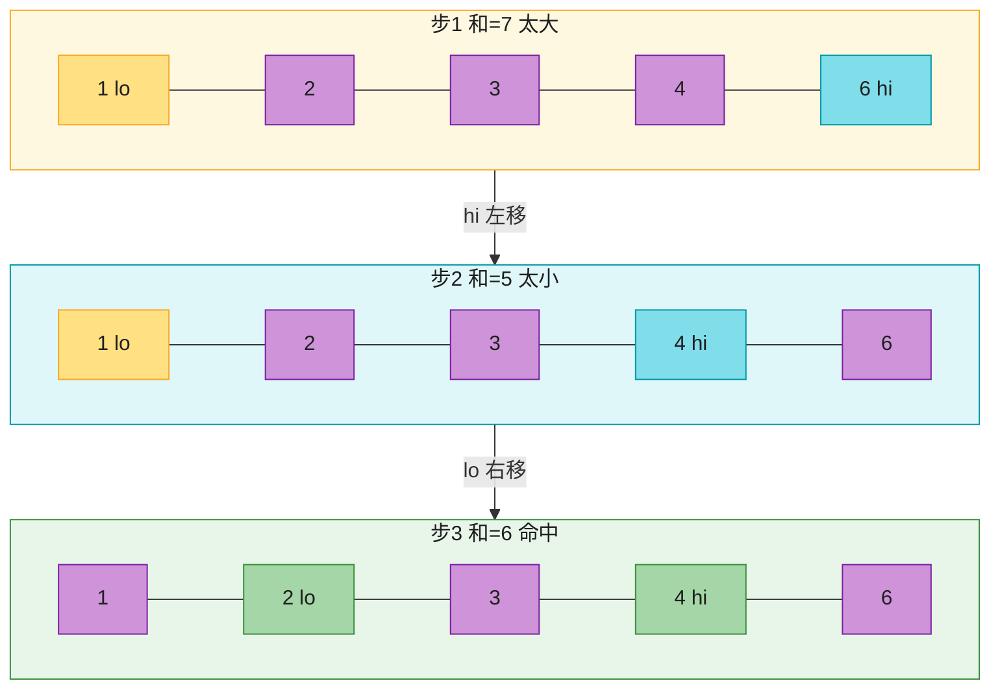
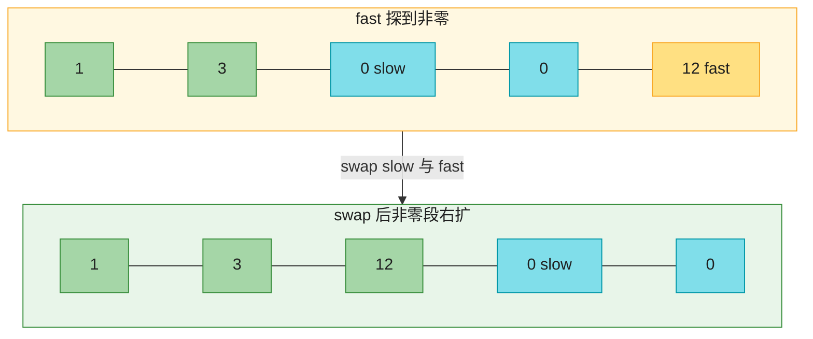
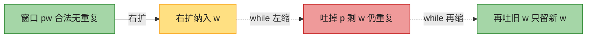
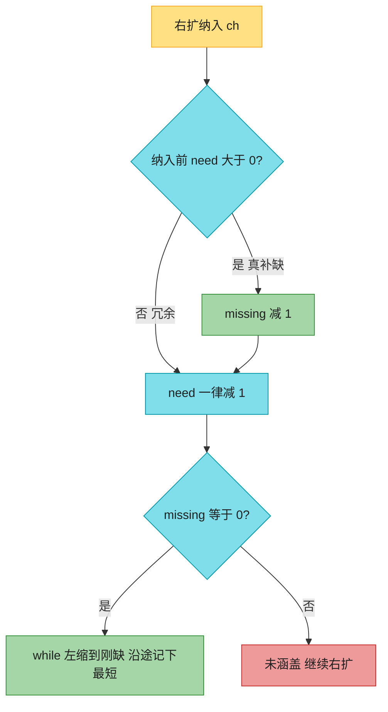

# Ch35 · 双指针 / 滑动窗口

> **预计**:1 天 ｜ **前置**:Ch34(stdlib 五件套)、Ch02(数据结构)｜ **M6 高频套路**
> **目标**:吃透数组/字符串题的两大杀手锏——**双指针**(对撞 / 快慢)和**滑动窗口**(两指针夹一段区间)。配合 Python 的切片 + `set` / `Counter`,代码比 Java 短一半。
> 这是 LeetCode 出场频率最高的一类手法:LC3 / LC11 / LC15 / LC76 / LC209 / LC283 / LC424 全是它的变体。

> 📐 **本教程的契约**:§35.2–§35.8 每节**精确对应**一道作业题,讲过的才考、考的必讲过。§35.1(总览)/ §35.9(通用模板)/ §35.10(坑清单)讲透不出题。卡住时按对应表回查小节。
> **纯 stdlib**(`set` / `collections.Counter`),不装任何外部库。

---

## 🗺️ 本章地图

读完这章 + 完成作业,你将能够:
- 说清双指针三种形态(对撞 / 快慢 / 滑动窗口)各适合什么题
- 用对撞双指针把「有序数组找 pair」从 O(n²) 压到 O(n)
- 用快慢指针**原地**重排数组(LC283 移动零)
- 用「移动短板」的贪心论证秒 LC11 盛水容器
- 用「窗口 + set」写 LC3,并解释嵌套 while 为什么是 O(n)
- 用「窗口 + 单调性」写 LC209,说清为什么前提是**正整数**
- 用「排序 + 固定 + 对撞」写 LC15,并做对**两处去重**
- 用「窗口 + Counter + missing 计数」拿下 LC76(Hard)

**作业 ↔ 教程对应表**(学哪节,就去做哪题):

| 作业题 | 对应小节 | 核心知识点 |
|--------|----------|-----------|
| `two_sum_sorted` | §35.2 | 对撞双指针原型(有序数组找 pair) |
| `move_zeroes` | §35.3 | 快慢指针原地分区(LC283 移动零) |
| `max_area` | §35.4 | LC11 盛水容器(对撞 + 贪心移动短板) |
| `length_of_longest_substring` | §35.5 | LC3 无重复子串(滑动窗口 + set) |
| `min_sub_array_len` | §35.6 | LC209 长度最小子数组(滑窗 + 正数单调性) |
| `three_sum` | §35.7 | LC15 三数之和(排序 + 对撞 + 两处去重) |
| `min_window` | §35.8 | LC76 最小覆盖子串 Hard(滑窗 + Counter) |

---

## ⏱️ 学习路径:费曼五步(约 100 分钟)

| 步 | 你要做 | 在哪做 |
|----|--------|--------|
| ① 预览猜(3分钟) | 下面 7 个问题,先猜答案 | 本页 ① |
| ② 先动手 | 打开 `ch35_assignment.py`,**先试着写**(别看教程) | assignment |
| ③ 提取+反馈 | 凭记忆写完 → `uv run pytest` 红绿 | test |
| ④ 费曼(3分钟) | 大白话讲清「移动短板 / 均摊 O(n) / 两处去重 / missing」 | 本页 ④ |
| ⑤ 存闪卡 | 把 [`review.md`](./review.md) 的卡标复习日期 | review.md |

> 💡 **直接性原则**:别通读!先猜 ① → 去 ② 写作业 → **哪题卡了,回对应 § 查** → 改 → 再跑。

---

## ① 预览猜(先合上教程想 30 秒)

1. 「双指针」不是 C 的指针!是两个**下标**变量。为什么两个下标能把 O(n²) 的双重 for 降下来?
2. 一个**有序**数组找两数之和等于 target,能不能不嵌套 for?两端往中间走,每步该动哪头?
3. 把数组里的 0 都移到末尾且**不开新数组**,遍历中 `remove(0)` 行不行?为什么慢、为什么会错?
4. 盛水容器两块板,你只能拿掉一块——拿掉**高的**还是**矮的**?为什么?
5. 找「不含重复字符的最长子串」,右指针扩张、左指针什么时候收缩?用 `if` 还是 `while`?
6. LC209 的滑动窗口为什么要求数组**全是正整数**?有负数会怎样?
7. 「最小覆盖子串」里 `need[c]` 计数为正/零/负各代表什么?为什么还要一个 `missing` 总数?

> 想不出没关系——带着这些问题往下读,每读完一节回来对答案。

---

## §35.1 双指针三种形态总览 🟢

「双指针」= 两个**下标变量**在数组/字符串上按某种规则移动。常见三种形态:

| 形态 | 两指针怎么走 | 本章题 | 更多典型题 |
|------|--------------|--------|-----------|
| **对撞**(相向) | 一头一尾,往中间逼 | `two_sum_sorted`、`max_area`、`three_sum` | LC167、LC125 回文串、LC42 接雨水 |
| **快慢**(同向) | 都从左边出发,快的探路、慢的落定 | `move_zeroes` | LC26 去重、LC27 移除元素 |
| **滑动窗口**(同向夹区间) | `[left, right]` 夹一段窗口,右扩左缩 | `length_of_longest_substring`、`min_sub_array_len`、`min_window` | LC424、LC1004 |

> 🟢 **Java 老手秒懂**:Java 里就是 `int lo = 0, hi = n - 1; while (lo < hi) {...}`。逻辑完全一样,Python 只是语法更短。

**为什么双指针能省时间**:朴素做法「枚举所有 (i,j) 对」是 O(n²);双指针**每次只动一个指针**,且每个元素至多被两端各访问一次 → **均摊 O(n)**。精髓是「**不回头**」:一旦指针移动,被排除的状态就永久排除(能证明更优解不在其中),绝不回退重查。

```python
# 同一个「找 pair」问题,两种写法对比
# ❌ 暴力:枚举所有 (i,j) 对,O(n²)
for i in range(n):
    for j in range(i + 1, n):
        ...

# ✅ 双指针:两个下标各走一遍,O(n)
lo, hi = 0, n - 1
while lo < hi:
    ...
```

---

## §35.2 对撞双指针原型:two_sum_sorted 🟡

> 这是对撞双指针的**最小原型**。理解它,后面 LC11 / LC15 一通百通。

**问题**:在一个**已排序**数组里,找两个数之和等于 target,返回这两个值。

**例**:`[1,2,3,4,6]` 找 6 → `[2,4]`;`[1,2,3,9]` 找 8 → 不存在 → `None`。

### ❌ 暴力 O(n²)

```python
for i in range(n):
    for j in range(i + 1, n):
        if nums[i] + nums[j] == target:
            return [nums[i], nums[j]]
```

嵌套 for,数组一大就爆。n=10⁵ 时要比较 ~50 亿对。

### ✅ 对撞双指针 O(n)

```python
def two_sum_sorted(nums, target):
    lo, hi = 0, len(nums) - 1
    while lo < hi:
        s = nums[lo] + nums[hi]
        if s == target:
            return [nums[lo], nums[hi]]
        if s < target:
            lo += 1   # 和太小 → 需要更大的数 → 左边进(右端已是当前最大)
        else:
            hi -= 1   # 和太大 → 需要更小的数 → 右边退
    return None
```

**逐步推演** `[1,2,3,4,6]`, target=6:

| lo | hi | s=nums[lo]+nums[hi] | 判断 | 动作 |
|----|----|--------------------|------|------|
| 0 | 4 | 1+6=7 | > 6 | hi-- |
| 0 | 3 | 1+4=5 | < 6 | lo++ |
| 1 | 3 | 2+4=6 | == 6 | 返回 [2,4] ✅ |

**为什么对**(排序是前提):
- 和太小时,`hi` 已是当前可选最大值,`nums[lo]` 配任何 ≤ `hi` 的数都不够 → `nums[lo]` 永久出局,`lo++`;
- 和太大时同理,`nums[hi]` 永久出局,`hi--`;
- 每步淘汰一个数,最多 n 步收敛。

> 🟡 **Java 对比**:逻辑与 Java 逐字同构。差异:Python 返回 `None` 很自然;Java 要返回 `null` 或 `Optional<int[]>`。

> ⚠️ **前提是有序**!无序数组用对撞会漏解——必须先 `sort()`。LC1 两数之和要返回**原下标**,排序后下标乱了,所以只能用 HashMap(Ch36 讲)。



**这张图要你看懂：** 和太大就把右端永久淘汰（hi 左移），和太小就把左端永久淘汰（lo 右移）；本例三步对撞到 `[2,4]`。

> ✅ **做 `two_sum_sorted`**:`lo,hi = 0, n-1`;和小 `lo+=1`、和大 `hi-=1`、等返回。O(n) / O(1)。

---

## §35.3 快慢指针原地分区:move_zeroes(LC283)🟡

**题面**:把数组里所有 `0` 移到末尾,**非零元素保持相对顺序**,必须**原地**修改(不开新数组),返回改好的数组。

**例**:`[0,1,0,3,12]` → `[1,3,12,0,0]`;`[0,0,1]` → `[1,0,0]`。

### ❌ 错误写法一:遍历中 remove

```python
for x in nums:
    if x == 0:
        nums.remove(x)   # O(n)!且边遍历边改长度,会跳过元素
        nums.append(0)
```

`list.remove` 是 **O(n)**(找到 + 整体前移),循环里调 → 整体 O(n²);而且遍历中改列表长度会让迭代器跳元素,直接错。

### ❌ 错误写法二:开新数组拼接

```python
return [x for x in nums if x != 0] + [0] * nums.count(0)
```

结果对,但**不是原地**——面试官会追问「O(1) 空间怎么做」。

### ✅ 快慢指针 O(n) / O(1)

```python
def move_zeroes(nums):
    slow = 0                      # slow = 下一个非零该放的位置
    for fast in range(len(nums)): # fast 探路,找非零
        if nums[fast] != 0:
            nums[slow], nums[fast] = nums[fast], nums[slow]  # 交换
            slow += 1
    return nums
```

**语义**:`nums[0 .. slow-1]` 始终是「已就位的非零段」,`nums[slow .. fast-1]` 是「已甩到中间的零段」。fast 每找到一个非零,就把它和 slow 处的零(或自己)交换,非零段扩一格。

**逐步推演** `[0,1,0,3,12]`:

| fast | nums[fast] | 动作 | 数组 | slow |
|------|-----------|------|------|------|
| 0 | 0 | 跳过 | `[0,1,0,3,12]` | 0 |
| 1 | 1 | swap(0,1) | `[1,0,0,3,12]` | 1 |
| 2 | 0 | 跳过 | `[1,0,0,3,12]` | 1 |
| 3 | 3 | swap(1,3) | `[1,3,0,0,12]` | 2 |
| 4 | 12 | swap(2,4) | `[1,3,12,0,0]` | 3 |

> 🟡 **Java 对比**:Java 交换要三行 `int t=a[i]; a[i]=a[j]; a[j]=t;`,Python **元组交换一行** `a[i], a[j] = a[j], a[i]`——右边先打包成元组再解包,无需临时变量。

> 🔴 **Python 特有坑**:「原地修改 list」别用 `nums = ...` 重新赋值——那只是让**局部变量**指向新列表,调用方的旧列表纹丝不动。要原地就改元素(`nums[i] = x` / swap / 切片赋值)。

**同类题套路**:LC26(删除有序数组重复项)同样「slow 落定、fast 探路」,只是落定条件换成「与新值不同」。

### 复杂度
- 时间 O(n):fast 走一遍,每个元素至多交换一次。
- 空间 O(1):原地。



**这张图要你看懂：** `slow` 左侧是已就位的非零段，`slow` 到 `fast` 之间是甩到中间的零；fast 探到非零就和 slow 交换，非零段扩一格。

> ✅ **做 `move_zeroes`**:`slow=0`;`for fast`:非零就 `swap(nums[slow], nums[fast])` 且 `slow+=1`;返回 nums。O(n) / O(1)。

---

## §35.4 对撞 + 贪心:max_area(LC11)🟡

**题面**:n 条竖线,第 i 条高度 `height[i]`;两线 + x 轴围成容器,求最大盛水量。盛水 = `宽 × min(两线高度)`(短板决定水位,水从短板溢出)。

**例**:`[1,8,6,2,5,4,8,3,7]` → 49(选 idx1 高 8 和 idx8 高 7,宽 7 × min(8,7) = 49)。

### ❌ 暴力 O(n²)

枚举所有 (i,j) 算面积取最大。n=10⁵ 直接超时。

### ✅ 对撞双指针 O(n)

```python
def max_area(height):
    lo, hi = 0, len(height) - 1
    area = 0
    while lo < hi:
        area = max(area, (hi - lo) * min(height[lo], height[hi]))
        if height[lo] < height[hi]:
            lo += 1      # 移动【短】的一边
        else:
            hi -= 1
    return area
```

**核心贪心:每次移动较短的一边。** 为什么?

面积 `= 宽 × min(h_lo, h_hi)`,每次循环**宽一定变小**(两指针在靠近)。要让面积有变大的希望,**min(高度) 必须变大**才能扳回宽的损失:

- 若移动**长边**:宽变小,但 min 被短边卡死不变(短边还在原地)→ 面积只会更小,**毫无希望**;
- 若移动**短边**:宽变小,但新边可能更高 → min 可能变大,**有希望**。

所以「移动长边」的整批方案被证明不可能更优,一步全剪掉 → O(n)。

**逐步推演** `[1,8,6,2,5,4,8,3,7]` 前几步:

| lo | hi | 宽 | min | 面积 | 移动 |
|----|----|----|-----|------|------|
| 0 | 8 | 8 | 1 | 8 | 左短,lo++ |
| 1 | 8 | 7 | 7 | **49** | 右短,hi-- |
| 1 | 7 | 6 | 3 | 18(不更新) | 右短,hi-- |
| 1 | 6 | 5 | 8 | 40(不更新) | 右短,hi-- |
| … | | | | | 后续都 < 49 |

> 🟡 **Java 对比**:`Math.max` / `Math.min` 在 Python 是内置 `max` / `min`,且可一次比多个值 `min(a, b, c)`。

> ⚠️ **常见坑**:
> 1. 水位由 `min` 不是 `max` 决定——**矮**板卡水位。
> 2. 移动条件是 `height[lo] < height[hi]`(比**高度**),别和循环条件 `lo < hi`(比下标)搞混。
> 3. 两边一样高时移动哪边都行(约定 `else: hi -= 1`)。

### 复杂度
- 时间 O(n):两指针合计最多走 n 步。空间 O(1)。

> ✅ **做 `max_area`**:对撞;每步 `area = max(area, 宽×min)`;移动**短**边。O(n) / O(1)。

---

## §35.5 滑动窗口入门:length_of_longest_substring(LC3)🔴

**题面**:找字符串中**不含重复字符**的最长**子串**的长度。

**例**:`"abcabcbb"` → 3(`"abc"`);`"bbbbb"` → 1;`"pwwkew"` → 3(`"wke"`)。

> 「子串」= 连续;「子序列」= 可不连续(Ch39 动态规划)。本题要连续的。

### ❌ 暴力 O(n³)

枚举所有子串 O(n²),每个检查是否含重复 O(n)。超时。

### ✅ 滑动窗口 + set O(n)

```python
def length_of_longest_substring(s):
    chars = set()                    # 窗口内已出现的字符
    left = 0                         # 窗口左端(收缩)
    best = 0
    for right, ch in enumerate(s):   # right = 窗口右端(扩张)
        while ch in chars:           # 新字符与窗口内重复 → 左端收缩
            chars.remove(s[left])
            left += 1
        chars.add(ch)                # 窗口重新无重复,放入新字符
        best = max(best, right - left + 1)
    return best
```

**窗口语义**:`s[left .. right]` 始终是**无重复字符**的子串。
- **右扩**(`for right`):每步尝试把 `s[right]` 纳入窗口;
- **左缩**(`while ch in chars`):若 `s[right]` 已在窗口中,左端不断吐出字符,直到把那个重复字符踢掉;
- **更新答案**:窗口合法后,`right - left + 1` 取 max。

**逐步推演** `"pwwkew"`:

| right | ch | 收缩动作 | 窗口 | best |
|-------|----|---------|------|------|
| 0 | p | 无 | `"p"` | 1 |
| 1 | w | 无 | `"pw"` | 2 |
| 2 | w | 吐 s[0]=p(left→1),仍重复,吐 s[1]=w(left→2) | `"w"` | 2 |
| 3 | k | 无 | `"wk"` | 2 |
| 4 | e | 无 | `"wke"` | **3** |
| 5 | w | 吐 s[2]=w(left→3) | `"kew"` | 3 |

**为什么嵌套 while 还是 O(n)**?别数嵌套,数**每个元素的总访问次数**:
- `right` 只前进 n 次;
- `left` 全程**总共**也只前进 ≤ n 次(每个字符至多被 `add` / `remove` 各一次);

总操作 ≤ 2n → **均摊 O(n)**。这是滑动窗口最重要的复杂度论证方式,面试必问。

> 🔴 **Python 特有**:
> - `enumerate(s)` 同时拿下标和字符;Java 要 `for (int i=0; i<n; i++) char c = s.charAt(i);`。
> - `set` 的 `in` / `add` / `remove` 都是 O(1)(hash 表)= Java `HashSet`。
> - `chars.remove(s[left])` 删的是**值**不是索引,别和 `list.remove` 混(list 的 remove 是 O(n))。

> ⚠️ **常见坑**:
> 1. 收缩用 `if` 不用 `while`:`if` 只吐一个,`"pwwkew"` 在第二个 w 处会残留重复。
> 2. 用 `list` 当窗口:`in` 变 O(n),整体退化 O(n²)。
> 3. 返回**长度**不是子串本身。

### 复杂度
- 时间 O(n)(均摊);空间 O(min(n, 字符集大小))。



**这张图要你看懂：** 右扩碰到重复必须 `while` 一直吐到新字符不在窗口里——`if` 只吐一次，`"pwwkew"` 会残留两个 `w`。

> ✅ **做 `length_of_longest_substring`**:窗口 `set`;右扩;重复则 `while` 左缩;`add`;`best = max(best, 宽)`。O(n)。

---

## §35.6 窗口求「最短满足」:min_sub_array_len(LC209)🟡

**题面**:**正整数**数组 `nums` 和目标 `target`,找和 **≥ target** 的**最短连续子数组**,返回其长度;不存在返回 0。

**例**:`target=7, nums=[2,3,1,2,4,3]` → 2(`[4,3]`);`target=4, nums=[1,4,4]` → 1(`[4]`);`target=11, nums=[1,1,1,1,1,1,1,1]` → 0。

### ❌ 暴力 O(n²)

```python
for i in range(n):
    s = 0
    for j in range(i, n):
        s += nums[j]
        if s >= target:
            best = min(best, j - i + 1)
            break
```

每个起点都要重新累加,大量重复计算。

### ✅ 滑动窗口 O(n)

```python
def min_sub_array_len(target, nums):
    left = 0
    window_sum = 0
    best = float("inf")              # 哨兵:没找到的标志
    for right, x in enumerate(nums):
        window_sum += x              # 右扩
        while window_sum >= target:  # 窗口已满足 → 左缩,逼出更短
            best = min(best, right - left + 1)
            window_sum -= nums[left]
            left += 1
    return 0 if best == float("inf") else best
```

**与 LC3 的两个关键差异**(滑窗不是背模板,是理解条件):

1. **合法条件换皮**:LC3 的「合法」是「无重复」(用 set 判),LC209 是「和 ≥ target」(用整数判)。模板骨架不变,变的只是「窗口状态」和「合法定义」。
2. **更新答案的位置**:LC3 在 while **之后**更新(while 把窗口缩到合法,出来后窗口才合法);LC209 在 while **里面**更新(while 的每次迭代窗口都是合法的,每次都要抢答)。

**为什么前提是正整数(单调性)**:正数保证「右扩让 sum 只增、左缩让 sum 只减」——窗口左缩是在**确定性地逼近**更短答案,缩过头(s < target)后只需等右扩补回来,left 永不回头。若有负数,左缩后 sum 可能因负数又变大,单调性破坏,滑动窗口失效(那时要用前缀和 + 单调队列,Ch36/37 延伸阅读)。

**逐步推演** `target=7, nums=[2,3,1,2,4,3]`:

| right | +x 后 sum | while 收缩过程 | best |
|-------|----------|----------------|------|
| 3 | 2+3+1+2=8 | 8≥7:记 len4,吐 2 → sum=6 停 | 4 |
| 4 | 6+4=10 | 记 len4,吐 3 → 7;记 len3,吐 1 → 6 停 | 3 |
| 5 | 6+3=9 | 记 len3,吐 2 → 7;记 len2,吐 4 → 3 停 | **2** |

> 🟡 **Java 对比**:Java 用 `int best = Integer.MAX_VALUE;` 哨兵,Python 用 `float("inf")`(Ch34 学过)——任何有限长度都比它小,比较语义干净;最后 `0 if best == float("inf") else best` 区分「没找到」。

> ⚠️ **常见坑**:
> 1. 答案更新写在 while 外 → 漏掉收缩途中的更短窗口。
> 2. 哨兵用 `0` 或 `-1` 当「没找到」→ 和合法答案混淆;用 `inf` 最后判一次最干净。
> 3. 数组为空 → for 不进、best 仍是 inf → 返回 0,天然安全。

### 复杂度
- 时间 O(n):right 走 n 次,left 全程总共走 ≤ n 次(同 LC3 的均摊论证)。空间 O(1)。

> ✅ **做 `min_sub_array_len`**:右扩累加;`while sum >= target` 内更新 best 并左缩;哨兵 `inf`,最后 `0 if best == inf else best`。O(n) / O(1)。

---

## §35.7 排序 + 对撞:three_sum(LC15)🟡

**题面**:找数组中所有**不重复**的三元组 `[a,b,c]` 使 `a+b+c == 0`。

**例**:`[-1,0,1,2,-1,-4]` → `[[-1,-1,2],[-1,0,1]]`;`[0,0,0]` → `[[0,0,0]]`。

### 难点
1. 三重 for 是 O(n³),n=3000 就 270 亿,必爆;
2. **去重**:`[-1,0,1]` 可能由不同下标组合出多次,结果只能保留一个。

### ✅ 排序 + 固定一个 + 对撞双指针 O(n²)

```python
def three_sum(nums):
    nums.sort()
    res = []
    n = len(nums)
    for i in range(n - 2):
        if i > 0 and nums[i] == nums[i - 1]:   # 去重①:同首数上一轮已找全
            continue
        lo, hi = i + 1, n - 1
        while lo < hi:
            s = nums[i] + nums[lo] + nums[hi]
            if s == 0:
                res.append([nums[i], nums[lo], nums[hi]])
                while lo < hi and nums[lo] == nums[lo + 1]:  # 去重②:越过相邻相同值
                    lo += 1
                while lo < hi and nums[hi] == nums[hi - 1]:
                    hi -= 1
                lo += 1
                hi -= 1
            elif s < 0:
                lo += 1
            else:
                hi -= 1
    return res
```

**思路拆解**:
1. **排序** O(n log n):有序才能对撞,且相同值相邻、三元组天然升序,去重变容易;
2. **固定首数 `nums[i]`**:剩两数之和要等于 `-nums[i]` → 退化成 §35.2 的 `two_sum_sorted`;
3. **对撞找后两数**:`lo = i+1, hi = n-1`;和负 `lo++`、和正 `hi--`、命中收录;
4. **两处去重**(本题灵魂):
   - **去重①(固定 i)**:`nums[i] == nums[i-1]` 就 `continue`——同一首数的三元组,上一轮 i 已全部找出,这轮必然重复;
   - **去重②(命中后)**:lo/hi 各自越过相邻重复值,否则下一轮又收录一模一样的三元组。

**为什么去重①和 `i-1` 比而不是 `i+1`**:和 `i-1` 比 = 「这个值当首数已经搜过了,跳过本轮」;和 `i+1` 比 = 预判下轮,会**漏解**——如 `[-2,0,0,2,2]`,i=0 时 nums[0]=-2 ≠ nums[1]=0 没问题,但若数组是 `[-1,-1,2]`,和 i+1 比会在 i=0 处误跳,丢掉 `[-1,-1,2]` 这个合法解。记住:**看身后,不看身前**。

> 🟡 **Java 对比**:Java 同款逻辑,`List<List<Integer>>` + `Arrays.asList(a,b,c)` 啰嗦;Python `res.append([a,b,c])` 直接加 list。

> ⚠️ **常见坑**:
> 1. 只做去重①不做去重② → 结果混入重复三元组(`[-1,0,1]` 出现多次)。
> 2. 忘排序 → 对撞的前提(有序)不成立,直接错。
> 3. 命中后忘记 `lo += 1; hi -= 1`(去重 while 之后还要各走一步)→ 死循环。
> 4. `range(n - 2)`:不足 3 个数自然不进循环,返回 `[]`。

### 复杂度
- 时间 O(n²):外层 n × 内层对撞 O(n);排序 O(n log n) 被吸收。空间 O(log n)(Timsort 栈,结果不计)。

> ✅ **做 `three_sum`**:`sort`;固定 i(去重①:`nums[i]==nums[i-1]` 跳过);对撞 lo/hi;命中后去重②再各走一步。O(n²)。

---

## §35.8 滑窗巅峰:min_window(LC76 · Hard)🔴

**题面**:在 `s` 中找涵盖 `t` 所有字符(**含重复次数**)的最短子串;没有返回 `""`。

**例**:`min_window("ADOBECODEBANC", "ABC")` → `"BANC"`;`min_window("a", "aa")` → `""`(a 不够)。

> 滑动窗口的巅峰题。拆开看就是 LC3 的升级:LC3 窗口要「无重复」,这题窗口要「涵盖 t」。

### ❌ 暴力 O(n² × 检查)

枚举所有子串,每个检查是否涵盖 t。n=10⁵ 必爆。

### ✅ 滑动窗口 + Counter O(|s| + |t|)

```python
from collections import Counter

def min_window(s, t):
    if not t or not s:
        return ""
    need = Counter(t)                 # 各字符还缺几个
    missing = len(t)                  # 总缺口(增量维护,免每次 sum)
    left = 0
    start, length = 0, len(s) + 1     # 最优窗口;length 初值 = 找不到的哨兵
    for right, ch in enumerate(s):
        # 1) 右扩
        if need[ch] > 0:              # 这个字符真缺 → 补缺
            missing -= 1
        need[ch] -= 1                 # 不管缺不缺都 -1(负数 = 冗余)
        # 2) 已涵盖 t → 左缩到刚不满足,沿途更新最短
        while missing == 0:
            if right - left + 1 < length:
                start, length = left, right - left + 1
            need[s[left]] += 1        # 左端字符出窗口
            if need[s[left]] > 0:     # 出完变成「缺」→ 缺口 +1
                missing += 1
            left += 1
    return s[start:start + length] if length <= len(s) else ""
```

**`need[c]` 的三种语义**(本题灵魂):

| `need[c]` | 含义 | 左缩时丢 c 的后果 |
|-----------|------|------------------|
| > 0 | t 还**缺** c 这么多个 | 缺口 +1,窗口变非法 |
| == 0 | 刚好够 | 变 1 → 缺口 +1,窗口变非法 |
| < 0 | 窗口里 c **冗余**了 | 仍 ≤ 0,窗口保持合法,可放心丢 |

**`missing` 是什么**:「还差的总字符数」。每次 while 都算 `sum(need.values())` 太慢,用整数**增量维护**:
- 右扩:`need[ch] > 0` 才 `missing -= 1`(只有真补缺才算数;冗余字符再来一个不减少缺口);
- 左缩:出窗口后 `need[s[left]] > 0`(从 ≤0 变正,即「刚变缺」)才 `missing += 1`。

`missing == 0` ⟺ 窗口已涵盖 t。

**逐步推演** `s="ADOBECODEBANC", t="ABC"` 的关键时刻:

- right 走到 idx5(C)时,窗口 `"ADOBEC"` 首次 `missing == 0`(len 6,记为候选);
- 左缩:吐 A(missing 1)停;
- right 走到 idx10(A):missing 回 0;左缩一路吐到 idx4(此时窗口 `"BECODEBA"` …沿途更新),继续缩到 `"BANC"`(left=9,right=12 时)……最终最短 = `"BANC"`(len 4)。

**哨兵 `length = len(s) + 1`**:没找到合法窗口时 `length` 保持 `len(s)+1 > len(s)`,最后 `if length <= len(s)` 判否返回 `""`。设成 `len(s)` 会把「整个 s 就是答案」和「没找到」搞混。

> 🔴 **Python 特有**:
> - `Counter(t)` 一行统计频次;Java 要 `Map<Character,Integer>` + `merge(c,1,Integer::sum)`。
> - **`Counter` 访问不存在的 key 返回 0 而不是 KeyError**——代码里 `need[ch]` 读 s 的任意字符都安全,这是敢直接 `need[ch] -= 1` 的底气。Java `HashMap.get` 返回 `null` 直接 NPE,必须 `getOrDefault(c, 0)`。普通 `dict` 也会 KeyError——本题必须用 `Counter`(或 `defaultdict(int)`)。
> - 切片 `s[start:start+length]` 一行取子串 = Java `s.substring(...)`。

> ⚠️ **常见坑**:
> 1. 用普通 dict → `need[ch]` 遇新字符 KeyError。
> 2. `missing` 维护错:只在 `need[ch] > 0` 时减——负数是冗余,不减缺口。
> 3. 左缩用 `if` → 只缩一次,漏最短;必须 `while` 缩到「刚不满足」。
> 4. 答案用循环结束时的 left/right → 那是最新窗口不是最优;要单独记 `start/length`。
> 5. 哨兵初值设 `len(s)` → 找不到时误返回整个 s。

### 复杂度
- 时间 O(|s| + |t|):right 走 |s|,left 全程 ≤ |s|(均摊论证同 LC3);建 Counter O(|t|)。
- 空间 O(|t| 不同字符数)。



**这张图要你看懂：** 右扩只有 `need[ch] > 0` 才算补缺（`missing -= 1`）；`missing == 0` 后 `while` 左缩，一直缩到刚又不满足才停，沿途抢最短。

> ✅ **做 `min_window`**:`need=Counter(t)`,`missing=len(t)`;右扩(`need[ch]>0` 才减 missing,再 `need[ch]-=1`);`while missing==0` 左缩(出窗口 `+=1`,变正则 `missing+=1`),沿途记最短;哨兵 `length=len(s)+1`。O(|s|+|t|)。

---

## §35.9 滑动窗口通用模板(万能骨架)

LC3 / LC209 / LC76 是同一个模板换「窗口状态」和「合法条件」:

```python
def sliding_window(seq):
    state = ...          # 窗口状态:set / int 和 / Counter
    left = 0
    best = ...
    for right, x in enumerate(seq):
        纳入(x, state)                  # 1) 右扩
        while 窗口不合法 or 窗口可优化:   # 2) 左缩
            更新(best)                  #    求最短:在 while 内更新(LC209/LC76)
            吐出(seq[left], state)
            left += 1
        更新(best)                      # 3) 求最长:在 while 后更新(LC3)
    return best
```

| 题 | 窗口状态 | 「合法 / 可优化」条件 | 更新位置 | 求什么 |
|----|---------|----------------------|---------|--------|
| LC3 | `set` | 右端字符已在 set → 不合法 | while 后 | 最长 |
| LC209 | `int` 和 | sum ≥ target → 可更短 | while 内 | 最短 |
| LC76 | `Counter` + missing | missing == 0 → 可更短 | while 内 | 最短 |

> 🧠 **判断该不该用滑动窗口的口诀**:「**求连续子数组/子串的极值,且窗口有单调性——右扩使条件变好、左缩使条件变差(或反之)**」→ 滑动窗口。LC209 的「正整数」就是在买这个单调性。

---

## §35.10 Java 老手常踩的坑 ⚠️

1. **把「双指针」当 C 指针**:Python/Java 里都是**下标整数**,不是内存地址。
2. **无序数组上对撞**:LC15 必须先 `sort()`;有序是对撞的前提。
3. **原地题重新赋值**:`nums = [x for x in nums ...]` 只改局部变量指向,调用方的列表没变;原地要改元素(swap / 切片赋值)。
4. **遍历中 `list.remove`** :O(n) + 跳元素;快慢指针才是原地分区的正解。
5. **滑窗收缩用 `if` 不用 `while`**:只吐一次,残留非法。必须缩到合法/刚不合法。
6. **窗口状态用 `list`**:`in` / `remove` 是 O(n),整体退化 O(n²);用 `set` / `Counter`(O(1))。
7. **LC15 漏一处去重**:去重①(固定 i,和 `i-1` 比)+ 去重②(命中后 lo/hi 越相邻重复),缺一不可。
8. **LC76 用普通 dict**:访问不存在的 key 直接 KeyError;`Counter` 自动补 0。
9. **答案用循环结束的指针**:滑动窗口的最优解要单独变量记(`best` / `start,length`),循环结束的指针位置不是答案。

---

## 📝 本章作业

| 任务 | 知识点 | 难度 |
|------|--------|------|
| `two_sum_sorted` | 对撞双指针原型 | 🟡 |
| `move_zeroes` | 快慢指针原地分区(LC283) | 🟡 |
| `max_area` | 对撞 + 贪心移动短板(LC11) | 🟡 |
| `length_of_longest_substring` | 滑动窗口 + set(LC3) | 🔴 |
| `min_sub_array_len` | 滑窗求最短 + 正数单调性(LC209) | 🟡 |
| `three_sum` | 排序 + 对撞 + 两处去重(LC15) | 🟡 |
| `min_window` | 滑窗 + Counter + missing(LC76 Hard) | 🔴 |

```bash
uv run pytest 06_leetcode/ch35/test_ch35_assignment.py -v
```

全绿 = 掌握 Ch35 的双指针 / 滑动窗口套路。

---

## ✅ 自测

- [ ] 能说清「对撞 / 快慢 / 滑动窗口」三种形态各适合什么题
- [ ] 能手推 `move_zeroes([0,1,0,3,12])` 的 slow/fast 轨迹
- [ ] 能解释 LC11 为什么「移动短边」(贪心正确性证明)
- [ ] 能徒手写 LC3,并解释嵌套 while 为什么是 O(n)
- [ ] 能说清 LC209 为什么要求正整数(单调性),以及它和 LC3 更新答案位置的差异
- [ ] 能说清 LC15 的**两处**去重各干嘛,去重①为什么和 `i-1` 比
- [ ] 能解释 LC76 的 `need[c]` 正/零/负三种语义,`missing` 为什么不能用 sum 替代
- [ ] 7 个作业全绿

## 🎓 费曼挑战

1. 「LC283 为什么 swap 而不是直接赋值覆盖?`nums=sorted(...)` 为什么不算原地?」— 重读 §35.3
2. 「LC11 盛水容器为什么移动短边?移动长边会怎样?」— 重读 §35.4
3. 「LC3 嵌了 while 为什么 O(n)?LC209 求最短,更新答案为什么写 while 里面?」— 重读 §35.5 / §35.6
4. 「LC209 换个条件——数组里有负数,滑动窗口为什么就死了?」— 重读 §35.6
5. 「LC15 不排序能做吗?两处去重各自的作用?」— 重读 §35.7
6. 「LC76 的 `need[c]` 为负数代表什么?`missing` 为什么不直接 sum?」— 重读 §35.8
7. 「什么样的题该用滑动窗口?」— 重读 §35.9 口诀

## 🧠 记忆闪卡 → [`review.md`](./review.md)

---

## ⏭️ 下一步:Ch36 哈希表 / 前缀和

双指针/滑动窗口玩的是「下标」。下一章换武器——**哈希表**(`dict` / `Counter`)用 O(1) 查找把两数之和、字母异位词分组、和为 K 的子数组一网打尽;再加**前缀和**把子数组和问题降到 O(n)(顺便解决本章 LC209 负数版)。从「指针夹逼」到「哈希映射」。
