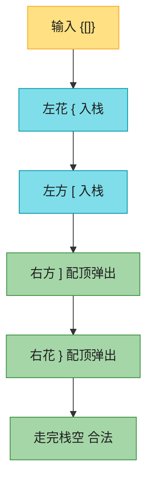
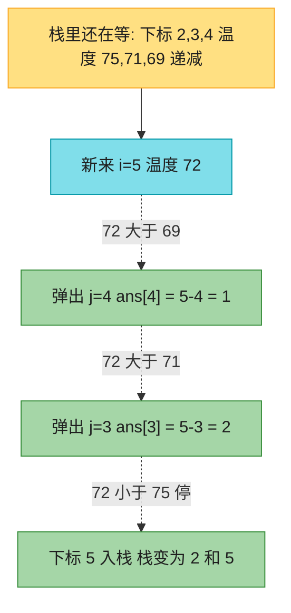
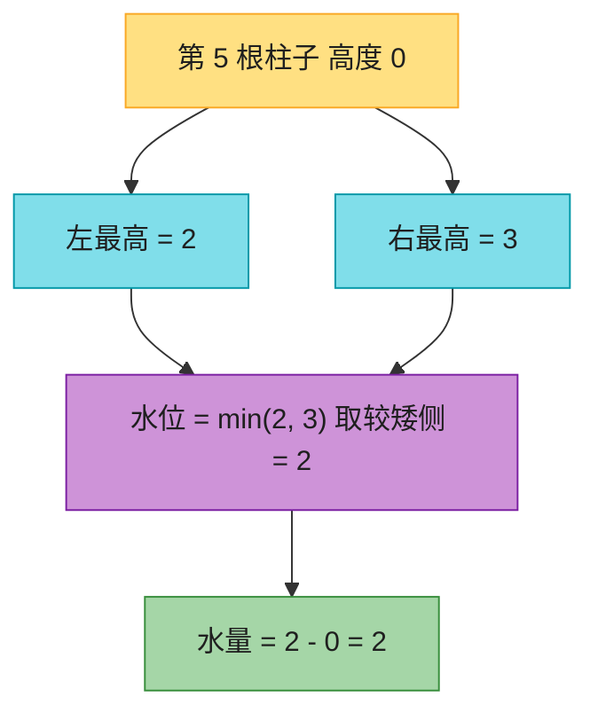

# Ch37 · 栈 / 队列 / 单调栈(LeetCode 高频)

> **预计**:1 天 ｜ **前置**:Ch34(Python 刷题利器)、Ch35(双指针/滑动窗口)｜ **M6 重点**
> **目标**:掌握「栈/队列」在 LeetCode 里的四大套路——**配对嵌套**、**表达式求值**、**辅助栈 O(1) 取最值**、**单调栈求下一个更大**——并用它们干掉 LC20 / LC1047 / LC150 / LC155 / LC232 / LC739 / LC42 七道高频题。

> 📐 **本教程的契约**:§37.2–§37.8 每节**精确对应**一道作业题,讲过的才考、考的必讲过。§37.1(总览)/ §37.9(坑清单)讲透不出题。卡住时按对应表回查小节。
> **纯 stdlib**(`list` 当栈、`collections.deque` 当队列),不装任何外部库。

---

## 🗺️ 本章地图

读完这章 + 完成作业,你将能够:
- 说清为什么 `list` 能当栈、`list.pop(0)` 为什么不能当队列
- 用「栈 + dict 反向映射」写括号配对,并说出三个失败点
- 看出 LC1047「相邻消除」和 LC20「括号配对」是**同一个模式**
- 用栈求逆波兰表达式,并避开 Python 除法的**向零取整大坑**
- 用「辅助栈同步增减」实现 O(1) 取最小值,讲清为什么同步 pop 正确
- 用「双栈互倒」把两个 LIFO 拼出一个 FIFO,并论证均摊 O(1)
- 默写单调栈模板(存下标、破坏单调就弹、弹出时结算),论证均摊 O(n)
- 用「每列水 = min(左右最高) - 自身」+「矮侧定型」拿下接雨水 Hard

**作业 ↔ 教程对应表**(学哪节,就去做哪题):

| 作业题 | 对应小节 | 核心知识点 |
|--------|----------|-----------|
| `is_valid_parens` | §37.2 | 栈 + dict 配对(LC20 有效的括号) |
| `remove_adjacent_duplicates` | §37.3 | 配对变体:相邻消除(LC1047) |
| `eval_rpn` | §37.4 | 栈求逆波兰式 + 除法向零坑(LC150) |
| `make_min_stack_class` | §37.5 | 辅助栈 = O(1) 取最值(LC155) |
| `make_my_queue_class` | §37.6 | 双栈造队列,均摊 O(1)(LC232) |
| `daily_temperatures` | §37.7 | 单调递减栈存下标(LC739) |
| `trap` | §37.8 | 对撞双指针 / 单调栈(LC42 Hard) |

---

## ⏱️ 学习路径:费曼五步(约 100 分钟)

| 步 | 你要做 | 在哪做 |
|----|--------|--------|
| ① 预览猜(3分钟) | 下面 7 个问题,先猜答案 | 本页 ① |
| ② 先动手 | 打开 `ch37_assignment.py`,**先试着写**(别看教程) | assignment |
| ③ 提取+反馈 | 凭记忆写完 → `uv run pytest` 红绿 | test |
| ④ 费曼(3分钟) | 大白话讲清「LIFO 配对 / 同步弹 / 倒栈均摊 / 矮侧定型」 | 本页 ④ |
| ⑤ 存闪卡 | 把 [`review.md`](./review.md) 的卡标复习日期 | review.md |

> 💡 **直接性原则**:别通读!先猜 ① → 去 ② 写作业 → **哪题卡了,回对应 § 查** → 改 → 再跑。

---

## ① 预览猜(先合上教程想 30 秒)

1. 给一个字符串 `"([)]"`,怎么用栈判断括号是否合法?为什么 `([)]` 不合法、`{[]}` 合法?
2. `"abbaca"` 每次消掉一对相邻相同字符,消完还会产生新的相邻——用栈怎么做?和括号配对像不像?
3. 逆波兰式 `["2","1","+","3","*"]` 为什么是「遇数字就压栈、遇运算符就弹两个」?弹出的两个数,哪个是左操作数?
4. 一个普通栈,要**每次 O(1)** 拿到当前栈里最小值,能做到吗?(提示:再开一个栈,空间换时间。)
5. 只给你两个栈(LIFO),怎么拼出一个队列(FIFO)?倒来倒去,为什么还是均摊 O(1)?
6. 「下一个更大的元素」暴力是 O(n²) 双重循环。能不能 O(n)?——栈里存什么、什么时候弹?
7. LC42 接雨水:一根柱子能接多少水,由什么决定?能不能不「整体模拟」,而是「每根柱子单独算」?

> 想不出没关系——带着这些问题往下读,每读完一节回来对答案。

---

## §37.1 Python 里的栈与队列 🟢

Python **没有专门的 Stack 类**——直接拿 `list` 当栈用,天生就是 LIFO:

```python
stack = []
stack.append(10)   # push,  O(1) 均摊
stack.append(20)
stack[-1]          # peek 栈顶,不删 -> 20
stack.pop()        # pop,   O(1) 均摊 -> 20
```

> 🟢 **Java 对比**:Java 要么 `Deque<Integer> stack = new ArrayDeque<>();`(官方推荐),要么 `LinkedList`。**别再用遗留的 `Stack` 类**——它继承 `Vector` 全方法加锁,慢。Python 直接 `list`,省心。

**「均摊 O(1)」是什么**:list 尾部 append 偶尔触发扩容(申请两倍空间、整体拷贝),单次最坏 O(n);但摊到 n 次操作上,平均每次还是 O(1)。Java 的 `ArrayList.add` 同理。单调栈的 O(n) 也是「均摊」论证,§37.7 会用到这个思想。

栈的真实场景到处都是,都是「**最近的最先处理**」:

```python
# 场景:编辑器的「撤销」—— 最后做的操作最先撤销
undo_stack = []
undo_stack.append("输入'hello'")
undo_stack.append("加粗")
undo_stack.append("粘贴图片")
undo_stack.pop()          # Ctrl+Z:撤销「粘贴图片」,不是撤销最早的输入
```

**队列**则是 FIFO(先进先出):消息队列、BFS、打印机任务。Python 里当队列用 `collections.deque`:

```python
from collections import deque
q = deque([1, 2, 3])
q.append(4)        # 入队(右)O(1)
q.popleft()        # 出队(左)O(1) -> 1
```

⚠️ **本章第一大坑,先记住**:

```python
# ❌ 错误:拿 list 当队列
q = [1, 2, 3]
q.pop(0)           # O(n)!整段前移,数据量大必超时

# ✅ 正确:队列/双端一律 deque
from collections import deque
q = deque([1, 2, 3])
q.popleft()        # O(1)
```

本章 7 道题里前 5 题用 `list` 当栈,`daily_temperatures` 也用 list 栈,`trap` 用双指针(连栈都不用);`make_my_queue_class` 是「用栈造队列」的面试套路(生产环境直接用 deque,别真的手写)。

---

## §37.2 套路一·配对嵌套:LC20 `is_valid_parens` 🟢

> 给定一个只含 `()[]{}` 的字符串,判断是否合法。合法 = ① 同类型配对 ② 嵌套顺序正确。

**为什么用栈?** 栈的「后进先出」**天然对应**「最近未闭合的左括号」。遇到右括号,要配对的就是**最近那个左括号**——正是栈顶。这是栈最经典的应用:**处理「配对 / 嵌套 / 最近关系」**。

合法串 `"{[]}"` 的走法：左括号入栈、右括号配栈顶则弹；走完栈空才是 True。

交叉非法的 `([)]` 为什么不行?走到 `)` 时栈顶是 `[`(刚才压的),不是 `(`,直接 False——**栈保住了嵌套顺序**。

**最小实现**:

```python
def is_valid_parens(s: str) -> bool:
    stack = []
    pairs = {")": "(", "]": "[", "}": "{"}   # 右 -> 期望的左
    for ch in s:
        if ch in pairs.values():              # 左括号:入栈
            stack.append(ch)
        elif ch in pairs:                     # 右括号:查栈顶
            if not stack or stack[-1] != pairs[ch]:
                return False
            stack.pop()
    return len(stack) == 0                    # 走完必须栈空
```

- **技巧**:dict `{')':'(', ...}` **反向映射**,一行表达「右括号 → 它对应的左括号」,避免 `if ch == ')': expect = '('` 的 elif 长链。
- **三个失败点**(背下来,面试要说):① 右括号来了栈空(没有左括号可配,如 `")"`);② 栈顶不匹配(`"(]"`);③ 走完栈非空(左括号没闭合,如 `"("`)。

**真实场景例**:JSON/代码解析器查语法,第一件事就是查括号配对。下面这个 mini 检查器就是 LC20 的套壳:

```python
def check_json_braces(text: str) -> bool:
    """只查 {} 和 [] 是否配对(引号转义等真实细节从略)。"""
    return is_valid_parens("".join(c for c in text if c in "()[]{}"))

check_json_braces('{"a": [1, 2]}')   # True
check_json_braces('{"a": [1, 2]')    # False:栈里剩 { 没闭合
```

**Java 老手易错对照**:

```python
# ❌ 忘了「走完检查栈空」—— "(" 会误判 True
for ch in s:
    ...
return True                      # 漏了!左括号没闭合也发现不了

# ✅ 走完栈必须空
return len(stack) == 0           # 或 return not stack
```

> 🟢 **Java 秒懂**:`Deque<Character> stack = new ArrayDeque<>();` + `Map` 配对表,逻辑 1:1。Java 多写一堆类型,Python 一个 dict 搞定。
> 🔴 **Python 特有**:`ch in pairs` 直接判键;`pairs.values()` 判值。只有 3 对括号,`in values()` 是 O(3) 常数,不用纠结。

**复杂度**:时间 O(n)(每字符进出栈至多一次),空间 O(n)(最坏全是左括号)。



**这张图要你看懂：左括号只入栈，右括号只跟栈顶配对并弹出；全部扫完后栈必须空，才算合法。**

> ✅ 做 `is_valid_parens`:栈 + dict 反向映射;左入栈,右查栈顶匹配则弹;走完栈必须空。

---

## §37.3 配对变体·相邻消除:LC1047 `remove_adjacent_duplicates` 🟢

> 给一个字符串,反复删除「相邻的两个相同字符」,直到不能再删。返回最终串。例:`"abbaca"` → 删 `bb` 得 `"aaca"` → 删 `aa` 得 `"ca"`。

**关键洞察**:消掉一对后,**两边剩下的字符会变成新邻居**,可能继续消(`"abba"` 删 `bb` 后 `"aa"` 还能消)。「新邻居」= 栈顶!这和括号配对是**同一个模式**:遍历,遇到和栈顶「配得上」的,就弹出栈顶结算;配不上,就入栈等待。

```
输入 "a b b a c a"
  a   栈空,入栈          栈=[a]
  b   栈顶 a ≠ b,入栈    栈=[a, b]
  b   栈顶 b == b,弹!    栈=[a]        <- 消掉 "bb"
  a   栈顶 a == a,弹!    栈=[]         <- 消掉 "aa"
  c   入栈               栈=[c]
  a   栈顶 c ≠ a,入栈    栈=[c, a]
答案 = "".join(栈) = "ca" ✅
```

**最小实现**(和 LC20 只差「配对条件」一行):

```python
def remove_adjacent_duplicates(s: str) -> str:
    stack = []
    for ch in s:
        if stack and stack[-1] == ch:   # 和栈顶「配得上」-> 弹出结算
            stack.pop()
        else:
            stack.append(ch)            # 配不上 -> 入栈等待
    return "".join(stack)               # 栈里剩下的就是最终串
```

**对照 LC20**:括号配对是「右括号 vs 栈顶左括号,查 dict」;相邻消除是「新字符 vs 栈顶同字符,直接比」。**「遇栈顶结算」的骨架一模一样**——以后看到「配对/抵消/消除」类题,先想栈。

**Java 老手易错对照**:

```python
# ❌ 用 str.replace 循环消:每轮 O(n) 扫全串,最坏 O(n²)
while "aa" in s or "bb" in s ...:   # 要写 26 种?直接放弃
    s = s.replace(...)

# ✅ 栈一趟 O(n),消消乐天然是栈
```

> 🟢 **Java 对比**:Java 用 `StringBuilder` 当栈(`deleteCharAt(length-1)` 当 pop),或者直接 `ArrayDeque<Character>` 再拼串。Python 的 `list` + `"".join` 干净利落。
> 🔴 **Python 特有**:`"".join(stack)` 把字符 list 拼成字符串——Python 字符串不可变,**攒 list 再 join 是标准姿势**(Java 的 StringBuilder 同理)。

**复杂度**:时间 O(n),空间 O(n)。

> ✅ 做 `remove_adjacent_duplicates`:栈顶 == 当前字符就弹,否则压;最后 `"".join(stack)`。

---

## §37.4 套路二·表达式求值:LC150 `eval_rpn` 🟢

> 逆波兰表达式(后缀表达式):运算符跟在操作数**后面**。`["2","1","+","3","*"]` = `(2+1)*3` = 9。求值,结果向零取整。

**为什么栈天然适合**:后缀表达式的含义就是「**遇到运算符时,对它前面最近的两个数运算**」——「最近的两个」= 栈顶两个。遇数字压栈,遇运算符弹两个、算完压回去:

```
tokens = ["2", "1", "+", "3", "*"]
  "2"   数字入栈        栈=[2]
  "1"   数字入栈        栈=[2, 1]
  "+"   弹 1(右),弹 2(左),2+1=3 压回   栈=[3]
  "3"   数字入栈        栈=[3, 3]
  "*"   弹 3,弹 3,3*3=9 压回          栈=[9]
走完,栈底 = 9 ✅
```

**完整实现**:

```python
def eval_rpn(tokens: list[str]) -> int:
    stack = []
    ops = {"+", "-", "*", "/"}
    for tok in tokens:
        if tok not in ops:
            stack.append(int(tok))          # 数字:入栈
        else:
            b = stack.pop()                 # 先弹的是【右】操作数!
            a = stack.pop()                 # 后弹的才是左操作数
            if tok == "+":
                stack.append(a + b)
            elif tok == "-":
                stack.append(a - b)         # 顺序:a - b,不是 b - a
            elif tok == "*":
                stack.append(a * b)
            else:  # "/"
                stack.append(int(a / b))    # 向零取整,不是 a // b!
    return stack[0]
```

🔴 **Python 特有两大坑,这题全是坑**:

**坑 1:除法向零取整**。题目要求和 Java 一样「向零取整」,但 Python 的 `//` 是**向下取整**(地板除),负数会错:

```python
# ❌ 错误:a // b 向下取整,负数翻车
-6 // 132        # -1   (数学上 -0.045,向下取整到 -1)
6 // -132        # -1

# ✅ 正确:int(a / b) 向零取整(先转 float 再截断)
int(-6 / 132)    # 0    (-0.045 向零截断)
int(6 / -132)    # 0
```

> 🟡 **Java 对比**:Java 的 `int / int` 天生就是向零取整,`6 / -132 == 0`。Java 老手带着这个直觉写 `//` 就中招——这是 Python 数值语义和 Java 最不一样的地方之一。(本题数值小,float 精度无忧;极大整数请用「符号 + 整除绝对值」手写。)

**坑 2:减/除的操作数顺序**。栈是 LIFO,**先弹出来的是右操作数**:

```python
# ❌ 顺序搞反:弹出的第一个当左操作数
b, a = stack.pop(), stack.pop()   # 变量名写对,但有人写成 a, b
stack.append(b - a)               # "3","4","-" 算出 1,其实是 3-4=-1

# ✅ 记住:先弹 = 右(b),后弹 = 左(a)
b = stack.pop()
a = stack.pop()
stack.append(a - b)
```

**真实场景例**:逆波兰式不是玩具——计算器、JVM 字节码栈式求值、`logstash` 配置,全是它。理解本题 = 理解「栈式虚拟机」的求值核心。

**复杂度**:时间 O(n),空间 O(n)。

> ✅ 做 `eval_rpn`:数字入栈;运算符弹两个(**先右后左**);除法 `int(a / b)` 向零取整;走完栈底是答案。

---

## §37.5 套路三·辅助栈:LC155 `make_min_stack_class` 🟡

> 设计一个栈,`push` / `pop` / `top` / `get_min` 全部 **O(1)**。

**难点在 `get_min`**。普通栈 `top` 是 O(1)(看末尾),但「最小值」要遍历——O(n)。怎么 O(1)?

**核心思想:空间换时间,再加一个「辅助栈」。** 维护一个与主栈**同步增减**的 `mins` 栈,`mins[-1]` 始终 = **当前主栈里所有元素的最小值**:

```
push 序列: -2, 0, -3
主栈:      [-2]    [-2, 0]    [-2, 0, -3]
辅助栈:    [-2]    [-2, -2]   [-2, -2, -3]   <- 每步 append min(val, 当前最小)
get_min -> 辅助栈顶 = -3   ✅ O(1)
pop -3:   主栈、辅助栈同步 pop -> 辅助栈顶变 -2 -> get_min = -2 ✅
```

**为什么同步 pop 就对?** 辅助栈的每一层,记录的是「**到这一层为止**的最小值」。弹掉栈顶元素后,剩下的最小值正好是辅助栈的新栈顶——它记录的就是「到上一层为止的最小值」。两个栈的「历史」完全对齐。

**完整实现**(注意:作业要求写成工厂函数 `make_min_stack_class()`,原因见下):

```python
def make_min_stack_class():
    class MinStack:
        def __init__(self):
            self.stack = []     # 主栈
            self.mins = []      # 辅助栈:栈顶 = 当前最小值

        def push(self, val):
            self.stack.append(val)
            self.mins.append(val if not self.mins else min(val, self.mins[-1]))

        def pop(self):
            self.stack.pop()
            self.mins.pop()     # 同步 pop,别忘!

        def top(self):
            return self.stack[-1]

        def get_min(self):
            return self.mins[-1]   # O(1)

    return MinStack
```

> 📌 **为什么是 `make_min_stack_class()` 工厂函数而不是顶格 class?** 和 Ch05 同一模式:类定义在函数体内、返回类对象,测试 `MinStack = make_min_stack_class()` 后照常 `MinStack()` 实例化。这样每题自包含、可单独质检,web 端也能给每题独立编辑器。类体里的代码和你平时写的 class 完全一样。

**第二个例子**(验证「最小值弹出后能回退」):

```python
MinStack = make_min_stack_class()
ms = MinStack()
ms.push(5); ms.push(3); ms.push(4)
ms.get_min()   # 3
ms.pop()       # 弹掉 4
ms.get_min()   # 还是 3
ms.pop()       # 弹掉 3
ms.get_min()   # 回到 5 —— 辅助栈「记得」历史
```

**变体(省空间进阶,了解)**:辅助栈只在「新最小值出现或等于当前最小」时压栈,pop 时按值判断是否同步弹——省掉重复最小值的冗余。面试写「双栈同步」版最稳、最不易错,本章就用它。

**Java 老手易错对照**:

```python
# ❌ get_min 每次 min(self.stack) —— O(n),题目要求 O(1),面试挂
def get_min(self):
    return min(self.stack)

# ❌ pop 只弹主栈,忘弹辅助栈 —— get_min 读到「上一世」的最小值
def pop(self):
    self.stack.pop()            # 辅助栈没同步,数据错乱

# ✅ 双栈同生共死:push 一起压,pop 一起弹
```

> 🟡 **Java 对比**:Java 同样两个 `ArrayDeque<Integer>`。注意 Java 装箱 `Integer` 比较用 `.equals` 别用 `==`(缓存池外的值会翻车),Python `int` 无此坑。
> 🔴 **Python 特有**:`min(val, self.mins[-1])` 一行;空栈判断 `if not self.mins`(空 list 为 falsy)。

**复杂度**:四操作全 O(1);空间 O(n)(辅助栈与主栈等长——空间翻倍是换 O(1) 的代价)。

> ✅ 做 `make_min_stack_class`:函数体内定义 MinStack,主栈 + 辅助栈同步增减;`push` 压 `min(val, 顶)`,`pop` 同步弹;`return MinStack`。

---

## §37.6 队列登场·用栈造队列:LC232 `make_my_queue_class` 🟡

> 只用两个栈(LIFO)实现队列的 `push` / `pop` / `peek` / `empty`(FIFO)。——面试经典,考的是「均摊 O(1)」的论证。

**核心思想:两个栈,一进一出。** `in_stack` 负责收新元素(队尾),`out_stack` 负责出队(队头)。栈是 LIFO,**倒一次顺序就翻回来**——把 `in_stack` 全倒进 `out_stack`,最老的元素就到 `out_stack` 栈顶了:

```
push 1,2,3:  in=[1,2,3]  out=[]
pop():       out 空 -> 把 in 倒过来: in=[]  out=[3,2,1]  <- 1 在栈顶
             弹 out 栈顶 -> 1 ✅(最先来的先出)
push 4:      in=[4]      out=[3,2]       <- out 不空,不倒!
pop():       弹 out -> 2 ✅(注意不是 4!FIFO 保住了)
```

**铁律:只有 `out_stack` 空了才倒**。不空时直接弹——`out_stack` 里的顺序还是对的。如果每次 pop 都倒,in 里新来的 4 会被翻到队头前面,FIFO 就破了。

**完整实现**:

```python
def make_my_queue_class():
    class MyQueue:
        def __init__(self):
            self.in_stack = []    # 队尾:收新元素
            self.out_stack = []   # 队头:从这里出队

        def push(self, x):
            self.in_stack.append(x)

        def _shift(self):
            """out 空时把 in 全倒过来(顺序翻转,最老的到栈顶)。"""
            if not self.out_stack:
                while self.in_stack:
                    self.out_stack.append(self.in_stack.pop())

        def pop(self):
            self._shift()
            return self.out_stack.pop()

        def peek(self):
            self._shift()
            return self.out_stack[-1]

        def empty(self):
            return not self.in_stack and not self.out_stack

    return MyQueue
```

**为什么是均摊 O(1)?**(面试必答)每个元素一生只经历:进 `in` 一次、`in` 倒出一次、进 `out` 一次、`out` 弹出一次——**4 次操作,n 个元素 4n 次**,摊到每次 pop/push 是 O(1)。虽然单次 pop 可能触发整栈倒(O(n)),但摊还后很便宜——和 §37.1 的 list 扩容均摊是同一个思想。

```python
Q = make_my_queue_class()
q = Q()
q.push(1); q.push(2); q.push(3)
q.pop()      # 1(倒栈发生在这)
q.push(4)
q.pop()      # 2(不空不倒,直接弹)
q.peek()     # 3
q.empty()    # False
```

**Java 老手易错对照**:

```python
# ❌ 每次 pop 都把 in 倒到 out,再把 out 倒回 in —— 每次 O(n),失去意义
def pop(self):
    while len(self.in_stack) > 1:
        self.out_stack.append(self.in_stack.pop())
    x = self.in_stack.pop()
    while self.out_stack:                    # 又倒回去,白折腾
        self.in_stack.append(self.out_stack.pop())
    return x

# ✅ 双栈分工 + out 空才倒,均摊 O(1)
```

> 🟡 **Java 对比**:Java 两个 `ArrayDeque<Integer>`,逻辑 1:1。
> 💡 **生产 vs 面试**:真写代码用 `collections.deque`(§37.1),这题是面试套路——考你「均摊分析」和「顺序翻转」的直觉。

**复杂度**:push O(1);pop/peek 均摊 O(1);空间 O(n)。

> ✅ 做 `make_my_queue_class`:in 收、out 出;`out` 空了才把 `in` 全倒过来;`empty` = 两栈都空;`return MyQueue`。

---

## §37.7 套路四·单调栈:LC739 `daily_temperatures` 🟡

> 给定每天温度,`ans[i]` = 第 i 天之后**第一个比它高**的温度隔几天;没有则 0。

**暴力是 O(n²)**:对每个 i 往右扫找第一个更大的。能 O(n) 吗?——**单调栈**,LC 第一大套路之一。

**单调栈的核心思想**(务必吃透):

> 维护一个栈,栈里元素**按某种单调性排列**。遍历新元素时,**只要它破坏了单调性,就反复弹栈**——每弹一个,就「结算」一个答案。每个元素最多入栈一次、出栈一次,均摊 O(n)。

**为什么单调?** 栈里存的是「**还没找到答案的下标**」——它们在等一个更高温。栈内温度保持**单调递减**:新来的比栈顶大,栈顶就**等到答案了**,该弹;弹到栈顶 ≥ 新来的为止,新来的入栈继续等。

以 `temps = [73, 74, 75, 71, 69, 72, 76, 73]` 为例：72 会连续弹出 69、71 并结算距离；76 再弹出 72、75。走完仍留在栈里的没等到更高，`ans` 默认 0。最终 `ans = [1, 1, 4, 2, 1, 1, 0, 0]`。

**完整实现**:

```python
def daily_temperatures(temps: list[int]) -> list[int]:
    n = len(temps)
    ans = [0] * n                  # 默认 0(没等到)
    stack = []                     # 存【下标】,对应温度单调递减
    for i in range(n):
        while stack and temps[i] > temps[stack[-1]]:
            j = stack.pop()
            ans[j] = i - j         # 第 j 天等到了第 i 天
        stack.append(i)
    return ans
```

**关键点**:
1. **栈存下标,不是温度**——答案要算距离 `i - j`,必须存下标。
2. **单调性是「弹」出来的**,不是刻意排序:新元素 > 栈顶就弹,弹完自然单调。
3. **弹出时才结算答案**;入栈时不算(还没等到)。
4. 遍历完**留在栈里的**永远没等到,`ans` 默认 0 无需处理。

**均摊 O(n) 怎么看穿嵌套循环?** 外层 for 是 n 次;内层 while 看似最坏 O(n),但**每个下标一生最多入栈一次、出栈一次**——while 的总执行次数 ≤ n。合计 2n,O(n)。这和 §37.6 倒栈的均摊是同一个论证套路。

**Java 老手易错对照**:

```python
# ❌ 栈里存「温度」不存下标 —— 算出「下一个更高温是几度」,题要的是「隔几天」
stack.append(temps[i])
ans[?] = ...   # 没下标,i - ? 算不了

# ✅ 存下标,温度用 temps[stack[-1]] 现查
```

```python
# ❌ 双重 for 暴力 O(n²),n=10^5 直接超时
for i in range(n):
    for j in range(i + 1, n):
        if temps[j] > temps[i]: ...

# ✅ 单调栈一趟,均摊 O(n)
```

> 🟡 **Java 对比**:`Deque<Integer> stack = new ArrayDeque<>();`,逻辑一致。Java 写 `while (!stack.isEmpty() && temps[i] > temps[stack.peek()])`。
> 🔴 **Python 特有**:`ans = [0] * n` 一行初始化(Java 要 `new int[n]`);`stack[-1]` 负索引看栈顶。

**复杂度**:时间 O(n)(每下标入/出栈至多一次,while 总次数 ≤ n);空间 O(n)。



**这张图要你看懂：栈只存还没等到更高温度的下标，且保持递减；新来的更热就把栈顶弹出，用 `ans[j]=i-j` 写下隔了几天。**

> ✅ 做 `daily_temperatures`:单调递减栈存下标;新温度 > 栈顶就弹并 `ans[j]=i-j`;留下的默认 0。

> 💡 **模板举一反三**:把 `>` 改 `<`、存下标改存值,就能解 LC496 下一个更大元素、LC503 环形下一个更大、LC42 接雨水(下节)。**「下一个更大/更小」就想到单调栈**。

---

## §37.8 单调栈进阶·接雨水:LC42 `trap` 🔴

> 给定每根柱子的高度,返回能接多少雨水。经典 Hard。

**先理解每根柱子能接多少水**——破题关键:

> 第 i 根柱子上方能接的水 = **`min(它左边的最高, 它右边的最高) - 它自身高度`**,负则取 0。

为什么?一根柱子能存水,左边要有更高的挡、右边也要有更高的挡,水位由**两侧较矮的一侧**决定(木桶效应),再减去自己占的高度。

以高度 `[0, 1, 0, 2, 1, 0, 1, 3, 2, 1, 2, 1]` 为例：第 5 根（高 0）左最高 2、右最高 3，水量 `min(2, 3) - 0 = 2`；逐列取正后求和得 6。

### 思路 A:对撞双指针(推荐,O(1) 空间)

预计算「左 max 数组」「右 max 数组」是 O(n) 时间 O(n) 空间,能过。但**双指针**把空间压到 O(1):

```python
def trap(height: list[int]) -> int:
    if not height:
        return 0
    left, right = 0, len(height) - 1
    left_max, right_max = height[left], height[right]
    water = 0
    while left < right:
        if height[left] < height[right]:
            left_max = max(left_max, height[left])
            water += left_max - height[left]   # 必然 ≥ 0
            left += 1
        else:
            right_max = max(right_max, height[right])
            water += right_max - height[right]
            right -= 1
    return water
```

**为什么双指针正确?**(本题最难的点)

哪边矮就处理哪边。假设 `height[left] < height[right]`:第 `left` 根柱子的**右侧一定存在 ≥ `height[right]` 的柱子**(就是 right 本身)。所以第 `left` 根的水位**完全由它左侧的 `left_max` 决定**——右侧有更高的挡着,水不会从右边漏。于是 `water += left_max - height[left]`,然后 `left` 右移。`else` 分支对称。

一句话:**矮的那侧已经「定型」了**——另一侧必有更高柱子挡着,水位只看本侧 max。

### 思路 B:单调栈(进阶,O(n) 空间)

按行结算的另一种方式:遍历柱子维护**单调递减栈**(存下标)。新柱子比栈顶高 → 形成「凹槽」:弹栈顶当「凹槽底」,新栈顶是「左壁」,新柱子是「右壁」,凹槽水 = `(min(左壁, 右壁) - 底) × 宽`,弹出多次累加。双指针更直观,作业推荐双指针;单调栈版当模板理解。

> 🔴 **Hard 之所以 Hard**:不在代码长,在「想到每根柱子的水 = min(左右最高) - 自身」这个**视角切换**——从「整体接水」切到「逐列算」。一旦想通,代码很短。

**Java 老手易错对照**:

```python
# ❌ 硬模拟「一层层填水」:按水位逐层扫描,代码又长又容易边界错
level = 1
while ...:  # 每层找左右边界,数一数能填几格 —— 别走这条路

# ✅ 视角切换:逐列算,min(左右最高) - 自身
```

> 🟡 **Java 对比**:`int left = 0, right = height.length - 1;` 双指针 1:1 翻译。

**复杂度**:双指针 时间 O(n)、空间 **O(1)** ✅(最优);单调栈 O(n)/O(n);预处理数组 O(n)/O(n)。



**这张图要你看懂：每根柱子的水量 = `min(左最高, 右最高) - 自身高度`；为负记 0，逐列加总就是整槽雨水。**

> ✅ 做 `trap`:对撞双指针;`height[left] < height[right]` 处理左(`water += left_max - height[left]`),否则处理右;空/单元素返回 0。

---

## ⚠️ §37.9 Java 老手常踩的坑(❌→✅ 对照)

1. **拿 list 当队列**:

```python
q.pop(0)            # ❌ O(n) 整段前移
q = deque(...); q.popleft()   # ✅ O(1)
```

2. **逆波兰除法用 `//`**:`//` 向下取整,负数翻车;`int(a / b)` 才向零(= Java 直觉)。

3. **括号配对忘查栈空**:`"("` 走完栈非空,必须 `return len(stack) == 0`。

4. **MinStack 的 pop 忘同步弹辅助栈**:两栈同生共死,弹一个必须弹另一个。

5. **单调栈存「值」忘存「下标」**:LC739 要算距离 `i - j`,存值算不了。

6. **MyQueue 每次 pop 都来回倒栈**:只有 `out` 空才倒,否则 O(n) 还破 FIFO。

7. **接雨水硬模拟水位填充**:切到「逐列算 = min(左右最高) - 自身」,代码极简。

8. **双指针接雨水搞不清处理哪侧**:记「**矮的那侧定型**」。

9. **Java 侧两个坑**:别用遗留 `Stack` 类(继承 Vector 全加锁),用 `ArrayDeque`;装箱 `Integer` 比较用 `.equals` 别用 `==`——Python 都没有这些烦恼。

---

## 📊 复杂度速查

| 题 | 做法 | 时间 | 空间 |
|----|------|------|------|
| LC20 括号 | 栈 + dict | O(n) | O(n) |
| LC1047 相邻消除 | 栈(配对变体) | O(n) | O(n) |
| LC150 逆波兰 | 栈求值 | O(n) | O(n) |
| LC155 MinStack | 辅助栈同步 | O(1) 每操作 | O(n) |
| LC232 栈造队列 | 双栈互倒 | 均摊 O(1) 每操作 | O(n) |
| LC739 每日温度 | 单调栈存下标 | O(n) 均摊 | O(n) |
| LC42 接雨水 | 对撞双指针 | O(n) | **O(1)** |
| LC42 接雨水 | 单调栈 | O(n) | O(n) |

---

## 📝 本章作业

| 任务 | 知识点 | 难度 |
|------|--------|------|
| `is_valid_parens` | 栈 + dict 配对 | 🟢 |
| `remove_adjacent_duplicates` | 配对变体:相邻消除 | 🟢 |
| `eval_rpn` | 栈求值 + 向零取整 | 🟢 |
| `make_min_stack_class` | 辅助栈 O(1) 取最值 | 🟡 |
| `make_my_queue_class` | 双栈造队列 | 🟡 |
| `daily_temperatures` | 单调栈存下标 | 🟡 |
| `trap` | 对撞双指针 / 单调栈 | 🔴 |

```bash
uv run pytest 06_leetcode/ch37/test_ch37_assignment.py -v
```

全绿 = 你掌握了 Ch37。

> 📌 **`make_min_stack_class` / `make_my_queue_class` 是工厂函数**:函数体内定义类、返回类(Ch05 同模式)。测试先 `MinStack = make_min_stack_class()` 拿到类,再 `MinStack()` 实例化连续调用。

---

## ✅ 自测

- [ ] 能说清「栈为什么天然适合配对/消除」(LIFO = 最近的先结算)
- [ ] 会用 dict 反向映射简化括号配对表,说出三个失败点
- [ ] 能讲清 `int(a/b)` 与 `a//b` 在负数下的差别(向零 vs 向下)
- [ ] 能讲清 MinStack 辅助栈原理:为什么 `pop` 同步弹就正确
- [ ] 能讲清 MyQueue 为什么「out 空才倒」,并论证均摊 O(1)
- [ ] 能默写单调栈模板(存下标、破坏单调就弹、弹出时结算),论证均摊 O(n)
- [ ] 能讲清接雨水「逐列 = min(左右最高) - 自身」+ 双指针「矮侧定型」
- [ ] 知道 `list.pop(0)` 是 O(n),队列必须用 `deque`
- [ ] 7 个作业全绿

## 🎓 费曼挑战

1. 「为什么 `([)]` 不合法、`{[]}` 合法?用栈走一遍。」— 重读 §37.2
2. 「LC1047 和 LC20 骨架哪里一样?『遇栈顶结算』还能解什么题?」— 重读 §37.3
3. 「`eval_rpn(["6","-132","/"])` 为什么是 0 不是 -1?」— 重读 §37.4
4. 「MinStack 不用辅助栈能 O(1) 取最小吗?为什么必须空间换时间?」— 重读 §37.5
5. 「两个栈拼队列,每个元素一生被操作几次?为什么均摊 O(1)?」— 重读 §37.6
6. 「单调栈有 for 套 while,为什么是 O(n)?」— 重读 §37.7
7. 「接雨水双指针:`height[left]<height[right]` 时,左侧水位为什么只看 `left_max`?」— 重读 §37.8

## 🧠 记忆闪卡 → [`review.md`](./review.md)

---

## ⏭️ 下一步:Ch38 二叉树 / DFS / BFS

栈解决了「线性序列里的配对/最近更大」;队列解决了「FIFO 调度」。下一步二叉树——把「栈/队列」升级为「递归(隐式栈)」和「BFS(显式队列)」:前中后序 DFS 用递归栈,层序 BFS 用 deque。树是递归数据结构,DFS 是它的灵魂。
