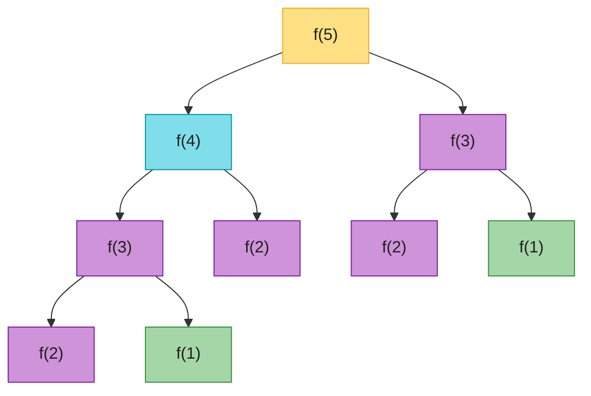
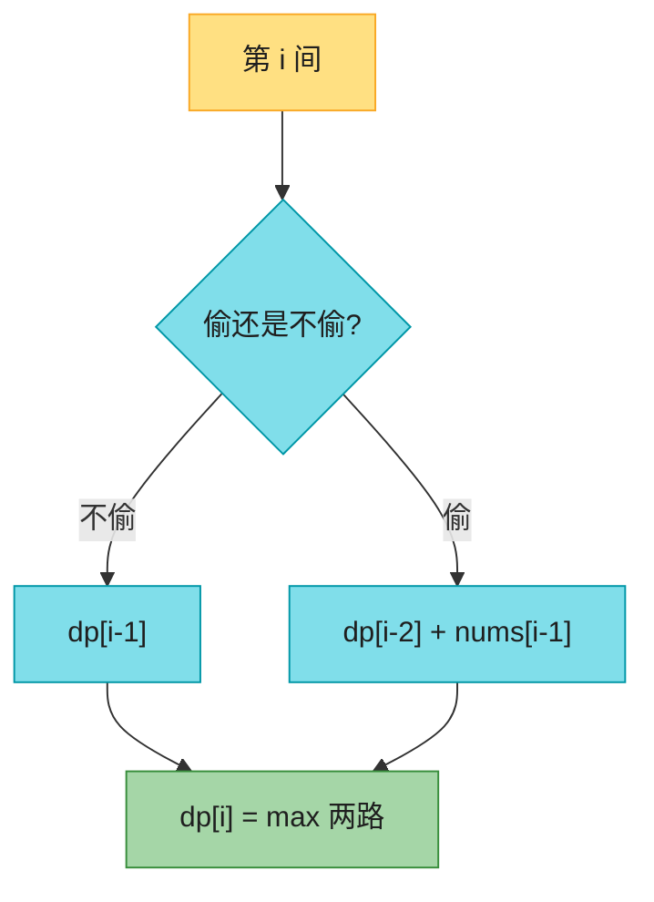
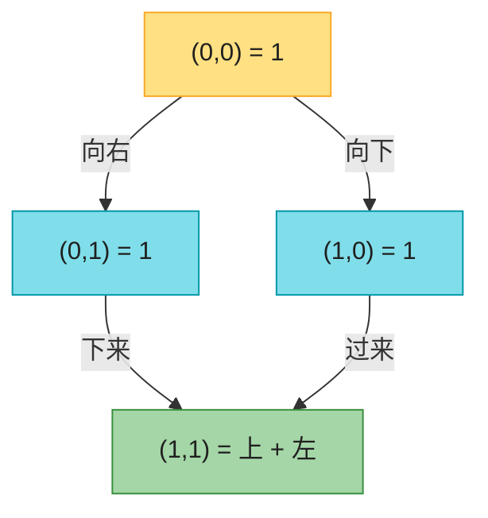
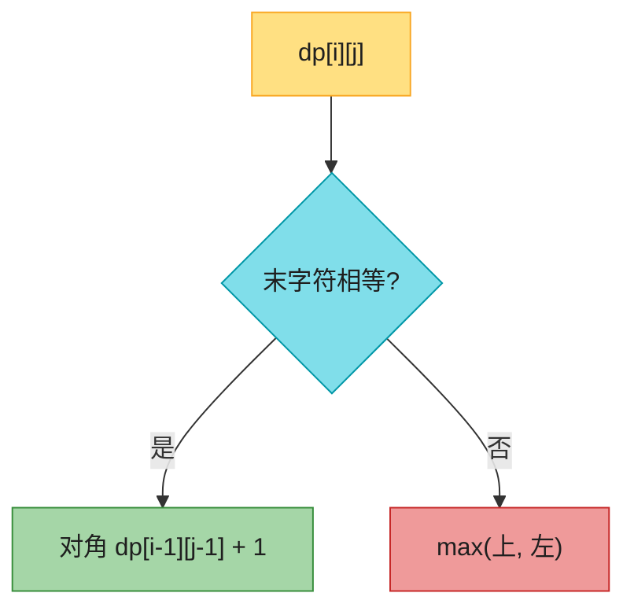

# Ch39 · 动态规划(Dynamic Programming)

> **预计**:1-2 天 ｜ **前置**:Ch34(刷题利器:`@lru_cache`/`bisect`)、Ch36(前缀和的状态思想)、Ch38(递归/树) ｜ **M6 核心**
> **目标**:拿下面试最高频的算法主题——动态规划。掌握**两把写法**(自顶向下记忆化 / 自底向上填表)+ **六大原型**(一维递推、以 i 结尾、选/不选、完全背包、LIS 区间、二维双串),8 道 LeetCode 经典题从 Easy 递进到 Hard。

> 📐 **本教程的契约**:§39.2–§39.9 每节**精确对应**作业里的一个函数,讲过的才考,考的必讲过。§39.1 是开胃、§39.10/§39.11 是总结与坑清单,讲透不出题。卡住时按对应表回查小节。纯 stdlib(`functools.lru_cache` / `bisect` / `math.comb`),不 import 外部库。

---

## 🗺️ 本章地图

读完这章 + 完成作业,你将能够:
- 一眼识别 DP 题的三个信号(求最值 / 求方案数 / 求可行性),背出**四步套路**:状态 → 转移 → 边界 → 顺序与答案位置
- 用 `@lru_cache` 一行把指数级裸递归砍成 O(n),说清 Java 里要怎么手动做同样的事
- 用「以 i 结尾」的状态定义秒杀最大子数组和,并把这个定义迁移到 LIS
- 用「选 / 不选」拆解打家劫舍,说清它和爬楼梯「长得像、本质不同」在哪
- 用「哨兵 = 理论上界 + 1」写 coin_change,说清为什么不能贪心
- 用「第一行 / 第一列全 1」初始化二维计数表,顺手用 `math.comb` 一行验算
- 画出 LCS / 编辑距离的二维表,把增删改三种操作对到「上 / 左 / 左上」三个邻居

**作业 ↔ 教程对应表**(学哪节,就去做哪题):

| 作业(函数) | 对应小节 | 核心知识点 | LC 题号 | 难度 |
|------|----------|-----------|---------|------|
| `climb_stairs` | §39.2 | 一维递推 + `@lru_cache` 记忆化 | LC70 | 🟢 |
| `max_sub_array` | §39.3 | 「以 i 结尾」状态 + 滚动变量(Kadane) | LC53 | 🟡 |
| `rob` | §39.4 | 「选 / 不选」:`dp[i]=max(dp[i-1], dp[i-2]+x)` | LC198 | 🟡 |
| `coin_change` | §39.5 | 完全背包求最少 + 哨兵 `amount+1` | LC322 | 🟡 |
| `length_of_lis` | §39.6 | 一维区间 DP,答案在 `max(dp)` | LC300 | 🟡 |
| `unique_paths` | §39.7 | 二维计数,边界行 / 列全 1 | LC62 | 🟡 |
| `longest_common_subsequence` | §39.8 | 二维双串:相等 +1,否则 max(上,左) | LC1143 | 🟡 |
| `min_distance` | §39.9 | 编辑距离(Hard):增删改 ↔ 上 / 左 / 左上 | LC72 | 🔴 |

---

## ⏱️ 学习路径:费曼五步(约 100 分钟)

| 步 | 你要做 | 在哪做 |
|----|--------|--------|
| ① 预览猜(5分钟) | 下面 8 个问题,先猜答案 | 本页 ① |
| ② 先动手 | 打开 `ch39_assignment.py`,**先试着写**(别看教程) | assignment |
| ③ 提取+反馈 | 凭记忆写完 → `uv run pytest` 红绿 | test |
| ④ 费曼(3分钟) | 大白话讲清「状态 + 转移 + 边界」 | 本页 ④ |
| ⑤ 存闪卡 | 把 [`review.md`](./review.md) 的卡标复习日期 | review.md |

> 💡 **直接性原则**:别通读!先猜 ① → 去 ② 写作业 → **哪题卡了,回对应 § 查** → 改 → 再跑。

---

## ① 预览猜(先想,别急着翻答案)

1. 爬楼梯:每次爬 1 或 2 步,到第 5 阶有几种走法?裸递归算 `f(45)` 为什么会慢到天荒地老?
2. 最大子数组和:数组 `[-2,1,-3,4,-1,2,1,-5,4]`,「以每个元素结尾的最大和」这个中间量能怎么推出答案?
3. 打家劫舍:不能偷相邻两家,`[2,1,1,2]` 贪心「见大就偷」会偷出几?最优是几?
4. 零钱兑换:面额 `[1,3,4]` 凑 6,贪心选 4+1+1 = 3 枚,但最优解是几枚?这暴露了贪心什么问题?
5. 最长递增子序列:`dp[i]` 定义成「以 `nums[i]` 结尾」和定义成「前 i 个」,哪种好转移?答案分别在表的哪一格?
6. 不同路径:m×n 网格只能向右 / 向下,第一行和第一列的格子各有几种走法?为什么是 1?
7. 最长公共子序列 vs 编辑距离:两个字符串的二维 DP,状态转移几乎同构,区别在哪一格?
8. 编辑距离:把 `"horse"` 变成 `"ros"`,增 / 删 / 改三种操作分别对应二维表的哪三个邻居?

> 猜完带着验证心态进入正文。第 8 题是 🔴 Hard,是本章的毕业考。

---

## §39.1 DP 是什么 + 什么时候用(不出题)🟡

**动态规划**的本质一句话:**把大问题拆成子问题,记住每个子问题的答案,避免重复计算**。

它和分治(如归并排序)的区别:分治的子问题**互不重叠**,DP 的子问题**大量重叠**。看斐波那契的裸递归树(`f(5)`):



**这张图要你看懂：** 紫色的 `f(3)` / `f(2)` 各出现多次——同一子问题被重复计算；绿的 `f(1)` 是边界，黄的 `f(5)` 是起点。缓存后每个只算一次，O(2ⁿ) 砍成 O(n)。

`f(5)` 要算 `f(4)+f(3)`,`f(4)` 又算 `f(3)+f(2)`——`f(3)` 被重复计算,越往下重复越多,总调用次数 O(2ⁿ)。**子问题大量重叠 = DP 的信号**;把每个 `f(k)` 的答桉缓存起来,重复节点直接查表,就砍成 O(n)。

### 识别一道题是不是 DP(三个信号)

| 信号 | 典型问法 | 本章对应 |
|------|----------|----------|
| **求最值**(最大 / 最小 / 最长 / 最少) | 「最少硬币」「最长子序列」「最大和」 | §39.3/§39.5/§39.6/§39.8/§39.9 |
| **求方案数**(有多少种) | 「爬楼梯几种走法」「几条路径」 | §39.2/§39.7 |
| **求可行性**(能不能) | 「能不能凑成 target」 | 延伸阅读(LC416) |

外加两个理论前提:**最优子结构**(大问题的最优解由子问题最优解拼成)+ **无后效性**(未来的决策只看当前状态,不关心怎么走到这的)。满足这些,DP 基本跑不掉。

### 两把写法(背下来)

| 写法 | 思路 | Python 利器 | Java 怎么写 |
|------|------|------------|-------------|
| **自顶向下(记忆化搜索)** | 从大问题出发递归,顺手把算过的子问题缓存 | `@lru_cache(None)` 一行搞定 | 手写 `int[] memo = new int[n+1]; Arrays.fill(memo, -1);` 再判「算过没」 |
| **自底向上(迭代填表)** | 从最小子问题开始,一格一格填 DP 表 | `dp = [0] * (n + 1)` | 同样 `int[] dp = new int[n+1];` |

```java
// Java 记忆化:缓存要自己维护
int[] memo = new int[n + 1];
Arrays.fill(memo, -1);
int f(int k) {
    if (k <= 2) return k;
    if (memo[k] != -1) return memo[k];   // 查缓存
    memo[k] = f(k - 1) + f(k - 2);       // 算完存缓存
    return memo[k];
}
```

```python
# Python 记忆化:装饰器自动维护「参数 → 返回值」的缓存 dict
from functools import lru_cache

@lru_cache(None)
def f(k: int) -> int:
    if k <= 2:
        return k
    return f(k - 1) + f(k - 2)
```

**选择原则**:能写出递推关系的优先自底向上(常数小、无栈溢出);递归关系天然直观的(爬楼梯、树形 DP)用 `@lru_cache` 爽一把。面试里**先讲记忆化(好想到),再优化成填表(省栈空间)**,是标准叙事。

> 🟡 **Java 对比**:Java 也有记忆化,但要你**自己维护 memo 数组**、判「-1 = 没算过」、手动填值。Python 的 `@lru_cache` 是装饰器,自动用一个 dict 缓存「参数 → 返回值」,你只管写干净的递归。这是 Python 刷 DP 题最大的爽点。

> ✅ **本章贯穿口诀**:**状态定义 + 转移方程 + 边界**。每道题先问三连:① `dp[i]`(或 `dp[i][j]`)代表什么?② 它从哪些状态转移来?③ 最小的、可以直接回答的边界值是几?

---

## §39.2 爬楼梯:climb_stairs(LC70)🟢

**题目**:每次能爬 1 或 2 步,爬到第 `n` 阶共有多少种不同走法?(`n >= 1`)

### 为什么这么做

关键洞察——**只看最后一步**:到达第 `n` 阶,最后一步要么从第 `n-1` 阶爬 1 步、要么从第 `n-2` 阶爬 2 步(没有别的可能)。所以:

```
f(n) = f(n-1) + f(n-2)
f(1) = 1   # 只能 1
f(2) = 2   # 1+1 或 2
```

这就是**斐波那契数列**。§39.1 的递归树已经演示:裸递归是 O(2ⁿ) 地狱,记忆化后 O(n)。

### Java 对照最小例

```java
// Java:记忆化要手写 memo 数组
public int climbStairs(int n) {
    int[] memo = new int[n + 1];
    return f(n, memo);
}
int f(int k, int[] memo) {
    if (k <= 2) return k;
    if (memo[k] != 0) return memo[k];
    memo[k] = f(k - 1, memo) + f(k - 2, memo);
    return memo[k];
}
```

```python
from functools import lru_cache

def climb_stairs(n: int) -> int:
    @lru_cache(None)
    def f(k: int) -> int:
        if k <= 2:                      # 边界:f(1)=1, f(2)=2
            return k
        return f(k - 1) + f(k - 2)      # 转移方程
    return f(n)
```

**亮点**:递归函数 `f` 加 `@lru_cache(None)` 后,`f(3)` 第一次算完会被缓存,之后再调直接返回——你写的代码和裸递归**长得一模一样**,只多一行装饰器。

> 为什么在函数内部再定义 `f` 而不是直接装饰 `climb_stairs`?——把缓存和公开 API 解耦,每次调用 `climb_stairs` 拿到全新缓存,避免多次调用间互相污染(可选习惯,直接装饰 `climb_stairs` 也对)。

### 自底向上写法(对比理解)

```python
def climb_stairs(n: int) -> int:
    if n <= 2:
        return n
    dp = [0] * (n + 1)
    dp[1], dp[2] = 1, 2
    for i in range(3, n + 1):
        dp[i] = dp[i - 1] + dp[i - 2]
    return dp[n]
```

还能优化空间到 O(1):只留两个变量滚动(`a, b = b, a + b`),面试先讲表、再提滚动。

### 手推验证(已验证)

```
n:      1   2   3   4   5   6  ...  10
f(n):   1   2   3   5   8   13 ...  89
```

```python
climb_stairs(1)   # 1
climb_stairs(2)   # 2  —— 1+1, 2
climb_stairs(3)   # 3  —— 1+1+1, 1+2, 2+1
climb_stairs(5)   # 8
climb_stairs(10)  # 89
climb_stairs(45)  # 1836311903 —— 记忆化后毫秒级;裸递归要等几年
```

### ❌ 错误写法 → ✅ 正确写法

```python
# ❌ 裸递归不记忆化——LC 上 n=45 直接超时
def f(k):
    if k <= 2:
        return k
    return f(k - 1) + f(k - 2)     # O(2^n),f(45) 约 18 亿次调用

# ❌ 边界写成 f(0)=0, f(1)=1 再从 f(2) 推——答案一样,但多绕一层,容易写错
# ✅ f(1)=1, f(2)=2 直接当边界,最不容易错

# ✅ @lru_cache 一把梭
@lru_cache(None)
def f(k):
    if k <= 2:
        return k
    return f(k - 1) + f(k - 2)     # O(n),每个子问题只算一次
```

> 🟢 **Java 秒懂**:自底向上版几乎 1:1 翻译(`int[] dp = new int[n+1];`)。
> 🟡 **差异**:`@lru_cache` 是 Python 独有的优雅;Java 记忆化要手写 memo。
> ⚠️ **坑**:`@lru_cache` 只能缓存**可哈希**的参数(int/str/tuple 行,list 不行)。遇到要缓存「数组状态」的题,把 list 转 tuple,或改成缓存下标版 `f(i)`。

**复杂度**:时间 O(n)(每个子问题只算一次);空间 O(n)(递归栈 + 缓存;滚动优化可到 O(1))。

---

## §39.3 最大子数组和:max_sub_array(LC53)🟡

**题目**:给定整数数组(可含负数),找一个**连续**子数组,使其和最大,返回这个最大和。

### 为什么这么做 —— 「以 i 结尾」的状态定义

暴力的「枚举所有子数组」是 O(n²)。DP 的切入点是一个精妙的状态定义:

```
dp[i] = 以 nums[i] 结尾的连续子数组的最大和
```

注意不是「前 i 个里」的最大和——「以 i 结尾」强制子数组**必须包含** `nums[i]`,这样转移才成立:

```
dp[i] = max(nums[i], dp[i-1] + nums[i])
        ↑ 前面那段是负的,不如自己单干    ↑ 接上前面那段
```

直观理解:扫到 `nums[i]` 时,问「前面以 `nums[i-1]` 结尾的最大和 `dp[i-1]` 值不值得接?」——`dp[i-1]` 是负的就把前面的包袱全扔了,从 `nums[i]` 重新开始;否则接上。**负数前缀,果断扔**。

答案不是 `dp[-1]`,而是 **`max(dp)`**——最大子数组可以以任何位置结尾。

### Java 对照最小例

```java
// Java Kadane:两个变量滚动
int best = nums[0], cur = nums[0];
for (int i = 1; i < nums.length; i++) {
    cur = Math.max(nums[i], cur + nums[i]);   // ← Python: max(x, cur + x)
    best = Math.max(best, cur);
}
return best;
```

```python
def max_sub_array(nums: list[int]) -> int:
    best = cur = nums[0]              # cur = dp[i-1](滚动),best = max(dp)
    for x in nums[1:]:
        cur = max(x, cur + x)         # 以 x 结尾的最大和:单干 or 接上
        best = max(best, cur)         # 全局最大
    return best
```

这就是著名的 **Kadane 算法**——「以 i 结尾」状态 + 滚动变量,空间 O(1)。

### 手推验证(已验证)

走一遍 `[-2, 1, -3, 4, -1, 2, 1, -5, 4]`:

| i | x | cur = max(x, cur+x) | best |
|---|---|----------------------|------|
| 0 | -2 | -2 | -2 |
| 1 | 1 | max(1, -1) = **1**(扔掉 -2) | 1 |
| 2 | -3 | max(-3, -2) = -2 | 1 |
| 3 | 4 | max(4, 2) = **4**(扔掉负包袱) | 4 |
| 4 | -1 | max(-1, 3) = 3 | 4 |
| 5 | 2 | max(2, 5) = 5 | 5 |
| 6 | 1 | max(1, 6) = 6 | 6 |
| 7 | -5 | max(-5, 1) = 1 | 6 |
| 8 | 4 | max(4, 5) = 5 | **6** |

答案是 6,对应子数组 `[4, -1, 2, 1]`。

```python
max_sub_array([-2, 1, -3, 4, -1, 2, 1, -5, 4])  # 6  —— [4,-1,2,1]
max_sub_array([1])                               # 1
max_sub_array([5, 4, -1, 7, 8])                  # 23 —— 整个数组全要
max_sub_array([-2, -1])                          # -1 —— 全负时取「最大的一个」
max_sub_array([8, -19, 5, -4, 20])               # 21 —— [5,-4,20]
```

### ❌ 错误写法 → ✅ 正确写法

```python
# ❌ 答案取 dp[-1]——最大子数组不一定以末尾结尾
#    反例:[8, -19, 5, -4, 20] 末尾结尾的和是 5-4+20=21…碰巧对?
#    再换 [5, 4, -100, 1]:最大是 [5,4]=9,但以结尾算是 -94。dp[-1] 错!

# ❌ best / cur 初始化成 0——全负数数组会错答 0
best, cur = 0, 0
max_sub_array([-2, -1])   # 返回 0(正确是 -1):0 表示「空子数组」,题面不许选空

# ✅ 用首元素初始化,从第二个元素开始扫;答案全程 max(dp)
best = cur = nums[0]
```

> 🟢 **Java 秒懂**:Kadane 两语言逐行同构,`Math.max` → `max`。
> ⚠️ **坑**:① **连续 ≠ 子序列**——本题要求连续(子数组),§39.6 的 LIS 是子序列(不连续),状态定义长得像、约束完全不同,别串。② 全负数数组是边界之王:初始化 `nums[0]` 而不是 `0`。③ 记住这个「以 i 结尾」的定义——它是 §39.6 LIS 的直垫。

**复杂度**:时间 O(n);空间 O(1)(滚动变量;开 `dp` 表写也行,O(n),面试先讲表)。

---

## §39.4 打家劫舍:rob(LC198)🟡

**题目**:一排房子,每间有现金 `nums[i]`;小偷**不能偷相邻两家**(会触发警报),求最多能偷多少。

### 为什么这么做 —— 每间房「选 / 不选」

对第 `i` 间房只有两种决策,分别指向不同的子问题:

```
dp[i] = 前 i 间房(到下标 i-1)能偷到的最大值
dp[i] = max(
    dp[i-1],            # 不偷第 i 间 → 最优 = 前 i-1 间的最优
    dp[i-2] + nums[i-1] # 偷第 i 间 → 不能偷第 i-1 间,接上「前 i-2 间的最优」
)
边界:dp[0] = 0(没房子),dp[1] = nums[0](只有一间,偷)
```

这就是 DP 第二大原型「**选 / 不选**」:每个元素做一次二元决策,转移取两者 max。和爬楼梯对比:爬楼梯求**方案数**用 `+`,这题求**最值**用 `max`——长得像,本质不同。

### 为什么贪心不行

直觉「见大的就偷,跳过邻居」会翻车:`[2, 1, 1, 2]` 贪心偷第 0 间(2)→ 跳过 1 → 偷第 2 间(1)→ 共 3;但最优是**偷第 0 和第 3 间 = 4**。局部最优 ≠ 全局最优,老老实实 DP。

### Java 对照最小例

```java
int prev2 = 0, prev1 = 0;             // dp[i-2], dp[i-1]
for (int x : nums) {
    int cur = Math.max(prev1, prev2 + x);
    prev2 = prev1;
    prev1 = cur;
}
return prev1;
```

```python
def rob(nums: list[int]) -> int:
    prev2 = prev1 = 0                 # dp[i-2], dp[i-1](滚动)
    for x in nums:
        prev2, prev1 = prev1, max(prev1, prev2 + x)
    return prev1
```

> 🔴 **Python 特有**:`prev2, prev1 = prev1, max(...)` 一行完成「先算新值、再整体平移」——元组解包先算右边再同时赋值,Java 必须引入临时变量 `cur` 三步走。DP 滚动数组在 Python 里全是这个味道。



**这张图要你看懂：** 每间房只有两路——不偷继承 `dp[i-1]`，偷则跳过邻居接 `dp[i-2]+x`；答案是两路的 max，不是每次都偷。

### 手推验证(已验证)

走一遍 `[2, 7, 9, 3, 1]`(dp[0]=0,从 dp[1] 填):

| i | nums[i-1] | dp[i] = max(dp[i-1], dp[i-2]+nums[i-1]) |
|---|-----------|------------------------------------------|
| 1 | 2 | max(0, 0+2) = 2 |
| 2 | 7 | max(2, 0+7) = 7(偷第 2 间,放弃第 1 间) |
| 3 | 9 | max(7, 2+9) = 11(偷 1、3 间) |
| 4 | 3 | max(11, 7+3) = 11(不偷第 4 间) |
| 5 | 1 | max(11, 11+1) = **12**(偷 1、3、5 间:2+9+1) |

```python
rob([1, 2, 3, 1])          # 4  —— 1+3
rob([2, 7, 9, 3, 1])       # 12 —— 2+9+1
rob([2, 1, 1, 2])          # 4  —— 贪心反例:2+2,不是 2+1
rob([])                    # 0
rob([5])                   # 5
rob([6, 6, 4, 8, 4, 3, 3, 10])  # 27 —— 6+8+3+10
```

### ❌ 错误写法 → ✅ 正确写法

```python
# ❌ 贪心「见大就偷」
#    [2,1,1,2] → 偷 nums[0]+nums[2] = 3(正确是 4)

# ❌ 转移写成 dp[i] = dp[i-2] + nums[i](每次都偷)——漏了「不偷更优」的分支
#    [2,7,9,3,1] → 会错算成 2+9+1=12…碰巧对?换 [1,100,2]:每次都偷得 1+2=3,正确 100

# ✅ 两个分支取 max;用滚动变量省空间
prev2, prev1 = prev1, max(prev1, prev2 + x)
```

> 🟢 **Java 秒懂**:逻辑完全一致,只是滚动赋值从三行变一行。
> ⚠️ **坑**:① 空数组返回 0(`prev1` 初值 0 天然处理)。② 环形版(LC213,首尾相邻)是变体:拆成「偷头不偷尾」和「偷尾不偷头」两次直线版取 max——本章不出题,知道思路即可。③ 别和爬楼梯混淆:`+` 求方案数,`max` 求最值。

**复杂度**:时间 O(n);空间 O(1)(滚动;dp 表版 O(n))。

---

## §39.5 零钱兑换:coin_change(LC322)🟡

**题目**:给定硬币面额 `coins` 和金额 `amount`,凑成该金额的**最少硬币数**;凑不出返回 `-1`。每种硬币**无限个**(完全背包)。

### 为什么这么做 —— 为什么不能贪心

直觉是「每次挑最大面额尽量多拿」(贪心)。但贪心**会出错**:

```
coins=[1,3,4], amount=6
贪心: 4 + 1 + 1 = 3 枚   ← 错!
最优: 3 + 3     = 2 枚   ✓
```

贪心只顾眼前,会错过「两个 3 比 4+1+1 更优」的组合。**必须穷举所有子问题**——这就是 DP。

### 状态定义 + 转移

```
dp[i] = 凑成金额 i 所需的最少硬币数
转移: dp[i] = min( dp[i - coin] + 1 )   for coin in coins, if coin <= i
        ↑ 用一枚面额 coin 后,剩下的 i-coin 已经是最优,再 +1(这枚)
边界: dp[0] = 0     (金额 0 不需要硬币)
```

**哨兵技巧**:无法凑出的金额怎么表示?把 `dp` 初始化成 `amount + 1`(一个「不可能的大值」)——因为最优答案最多用 `amount` 个 1 元硬币,真实答案**绝不可能超过 `amount`**。所以 `amount+1` 就是「无穷大」的替身。最后看 `dp[amount]`,若仍 `> amount` 说明不可达,返回 `-1`。

> 这是 DP 题里**最常见的哨兵模式**:用「理论上界 +1」代替 `float('inf')`,避免 `inf + 1 = inf` 的比较混乱,也保持 int 类型干净。

### Java 对照最小例

```java
int[] dp = new int[amount + 1];
Arrays.fill(dp, amount + 1);          // 哨兵
dp[0] = 0;
for (int i = 1; i <= amount; i++) {
    for (int c : coins) {
        if (c <= i) {
            dp[i] = Math.min(dp[i], dp[i - c] + 1);
        }
    }
}
return dp[amount] > amount ? -1 : dp[amount];
```

```python
def coin_change(coins: list[int], amount: int) -> int:
    MAX = amount + 1                        # 哨兵 = 不可能的大值
    dp = [MAX] * (amount + 1)
    dp[0] = 0                               # 边界
    for i in range(1, amount + 1):
        for c in coins:
            if c <= i and dp[i - c] + 1 < dp[i]:
                dp[i] = dp[i - c] + 1
    return dp[amount] if dp[amount] != MAX else -1
```

### 手推验证(已验证)

走一遍 `coins=[1,2,5], amount=11`,dp 表填完长这样:

```
金额 i:  0   1   2   3   4   5   6   7   8   9   10  11
dp[i]:   0   1   1   2   2   1   2   2   3   3   2   3
                    ↑               ↑           ↑
                 2+2              5+1         5+5+1? 看下面
```

`dp[11]`:三种硬币分别看 `dp[10]+1=3`、`dp[9]+1=4`、`dp[6]+1=3`,取 min = **3**(5+5+1)。

```python
coin_change([1, 2, 5], 11)   # 3  —— 5+5+1
coin_change([1, 3, 4], 6)    # 2  —— 3+3,贪心反例
coin_change([2], 3)          # -1 —— 凑不出
coin_change([1], 0)          # 0  —— 金额 0 不要硬币
coin_change([5, 10], 3)      # -1 —— 面额都比 amount 大
coin_change([186, 419, 83, 408], 6249)  # 20 —— LC 官方大用例
```

### ❌ 错误写法 → ✅ 正确写法

```python
# ❌ 直接 return dp[amount]——不可达时返回的是哨兵 amount+1,不是 -1
return dp[amount]                       # coin_change([2],3) → 4(错!)

# ❌ 哨兵用 float('inf') 再 +1——inf+1 还是 inf,min 比较能跑通,
#    但最后 dp[amount] 变成 inf(浮点),和 int 混用容易出幺蛾子
dp = [float('inf')] * (amount + 1)

# ❌ 内层忘了 if c <= i——dp[i-c] 下标变负,Python 负索引绕到表尾,错得无声无息
for c in coins:
    dp[i] = min(dp[i], dp[i - c] + 1)   # i=1, c=5 → dp[-4] 不报错但全错!

# ✅ 哨兵 amount+1 + 边界 dp[0]=0 + 内层判 c<=i + 收尾判 >amount 返回 -1
```

> 🟢 **Java 秒懂**:`int[] dp = new int[amount+1]; Arrays.fill(dp, amount+1);` 双层 for 一模一样。
> ⚠️ **坑**:① 忘了 `amount=0` 返回 0(`dp[0]=0` 天然处理,但收尾判断别写成 `dp[amount] >= MAX` 以外的东西)。② 这题是**完全背包**(硬币无限,内层正序);0-1 背包(每件一次,内层倒序)见延伸阅读 LC416。③ Python 负索引不抛异常——`dp[-4]` 静默拿到表尾元素,这是和 Java 数组越界直接炸最大的不同,调试极痛。

**复杂度**:时间 O(amount × len(coins));空间 O(amount)。

---

## §39.6 最长递增子序列:length_of_lis(LC300)🟡

**题目**:给定整数数组,返回**严格递增子序列**的最大长度(子序列**不要求连续**,但要保序)。

### 为什么这么做 —— 复用 §39.3 的「以 i 结尾」

注意两个限定:**严格递增**(`nums[j] < nums[i]`,不能等于)+ **不连续**(可跳着选,区别于 §39.3 的子数组必须连续)。

状态定义直接抄 §39.3 的作业——以「位置 i 结尾」:

```
dp[i] = 以 nums[i] 结尾的 LIS 长度
转移: dp[i] = max( dp[j] + 1 )   for all j < i 且 nums[j] < nums[i]
边界: dp[i] = 1   (至少包含 nums[i] 自己)
答案: max(dp)     (LIS 可能以任意位置结尾,取全局最大)
```

为什么不定成「前 i 个的 LIS」?因为新来一个 `nums[i]` 时,「前 i-1 个的 LIS」没告诉你 LIS 的**末尾值**是几,没法判断 `nums[i]` 能不能接上去。「以 i 结尾」把末尾钉死在 `nums[i]`,可接性一目了然——**状态定义要带上「转移需要的信息」**,这是 DP 设计的第一课。

### Java 对照最小例

```java
int n = nums.length;
int[] dp = new int[n];
Arrays.fill(dp, 1);                   // 每个元素自身是长度 1
int best = 1;
for (int i = 0; i < n; i++) {
    for (int j = 0; j < i; j++) {
        if (nums[j] < nums[i]) {
            dp[i] = Math.max(dp[i], dp[j] + 1);
        }
    }
    best = Math.max(best, dp[i]);
}
return best;
```

```python
def length_of_lis(nums: list[int]) -> int:
    if not nums:
        return 0
    n = len(nums)
    dp = [1] * n                      # 边界:每个元素自身是长度 1 的 LIS
    for i in range(n):
        for j in range(i):
            if nums[j] < nums[i] and dp[j] + 1 > dp[i]:
                dp[i] = dp[j] + 1
    return max(dp)
```

### 手推验证(已验证)

走一遍 `[10, 9, 2, 5, 3, 7, 101, 18]`:

| i | nums[i] | 能接在谁后面 (j) | dp[i] |
|---|---------|------------------|-------|
| 0 | 10 | (无) | 1 |
| 1 | 9 | (无,9<10 不成立) | 1 |
| 2 | 2 | (无) | 1 |
| 3 | 5 | 2(2<5) | dp[2]+1 = 2 |
| 4 | 3 | 2(2<3) | dp[2]+1 = 2 |
| 5 | 7 | 2,5,3 | max(1,2,2)+1 = 3 |
| 6 | 101 | 前面全部 | 3+1 = 4 |
| 7 | 18 | 前面全部 | 3+1 = 4 |

`max(dp) = 4`,LIS 如 `[2,3,7,101]`。注意 `dp[-1]` 碰巧也是 4——换 `[1,2,3,0]` 就露馅:LIS 是 `[1,2,3]` 长 3,但 `dp[-1]`(以 0 结尾)只有 1。

```python
length_of_lis([10, 9, 2, 5, 3, 7, 101, 18])  # 4
length_of_lis([0, 1, 0, 3, 2, 3])            # 4 —— [0,1,2,3]
length_of_lis([7, 7, 7, 7])                  # 1 —— 严格递增,相等不算
length_of_lis([1, 2, 3, 0])                  # 3 —— 答案不在末尾!max(dp)≠dp[-1]
length_of_lis([])                            # 0
length_of_lis([3, 4, -1, 0, 6, 2, 3])        # 4 —— [-1,0,2,3]
```

### ❌ 错误写法 → ✅ 正确写法

```python
# ❌ return dp[-1]——LIS 不一定以最后一个元素结尾
#    反例:length_of_lis([1,2,3,0]) → dp=[1,2,3,1],dp[-1]=1(正确是 3)

# ❌ 空数组直接 max(dp)——max([]) 抛 ValueError
return max(dp)                        # length_of_lis([]) 炸了

# ❌ 用 <= 当「递增」——变成非递减,[7,7,7,7] 会错答 4(正确是 1)
if nums[j] <= nums[i]: ...

# ✅ 空数组先返回 0;严格递增用 <;答案 max(dp)
```

### 进阶:O(n log n) 的 patience sorting(面试加分,作业不要求)

维护数组 `tails`,`tails[k]` = 长度为 k+1 的所有递增子序列的**最小末尾**。每来一个新数,用 `bisect_left` 找它该替换 / 追加的位置:

```python
import bisect

def length_of_lis_fast(nums: list[int]) -> int:
    tails = []
    for x in nums:
        i = bisect.bisect_left(tails, x)   # 第一个 >= x 的位置
        if i == len(tails):
            tails.append(x)                # x 比所有末尾都大 → 接长
        else:
            tails[i] = x                   # 替换,让末尾更小(未来更好接)
    return len(tails)
```

注意 `tails` **不是真实的 LIS**(只是长度对)。直觉:末尾越小,未来能接的数越多,所以贪心地把每个位置替换成更小的值。作业写 O(n²) 版本即可,被追问「能不能更快」时甩出这版。

> 🟡 **差异**:Java 的二分要自己写或用 `Arrays.binarySearch`(返回负数表示插入点,要 `-i-1` 转换);Python 直接 `bisect.bisect_left`,语义清晰。
> ⚠️ **坑**:答案是 `max(dp)` 不是 `dp[-1]`;空数组返回 0;严格用 `<`,题改「非递减」才用 `<=`。

**复杂度**:DP 版时间 O(n²),空间 O(n);进阶版 O(n log n)。

---

## §39.7 不同路径:unique_paths(LC62)🟡

**题目**:m 行 n 列的网格,从左上角走到右下角,每步只能**向右或向下**,共有多少条不同路径?

### 为什么这么做 —— 二维计数 DP 的入门模型

到任何格子 `(i, j)`,最后一步要么从**上方** `(i-1, j)` 下来,要么从**左方** `(i, j-1)` 过来:

```
dp[i][j] = dp[i-1][j] + dp[i][j-1]
边界: 第一行 / 第一列全 1 —— 只能一直向右 / 一直向下,各只有 1 种走法
答案: dp[m-1][n-1]
```

这是爬楼梯的二维推广:爬楼梯是「上一步 + 上两步」,这里是「上方 + 左方」。**方案数用 `+`**(和 rob 的最值用 `max` 对照着记)。

### Java 对照最小例

```java
int[][] dp = new int[m][n];
for (int i = 0; i < m; i++) dp[i][0] = 1;   // 第一列
for (int j = 0; j < n; j++) dp[0][j] = 1;   // 第一行
for (int i = 1; i < m; i++) {
    for (int j = 1; j < n; j++) {
        dp[i][j] = dp[i - 1][j] + dp[i][j - 1];
    }
}
return dp[m - 1][n - 1];
```

```python
def unique_paths(m: int, n: int) -> int:
    dp = [[1] * n for _ in range(m)]   # 第一行/列天然全 1,初始化一步到位
    for i in range(1, m):
        for j in range(1, n):
            dp[i][j] = dp[i - 1][j] + dp[i][j - 1]
    return dp[m - 1][n - 1]
```

> 初始化技巧:边界「第一行 / 列全 1」正好就是整张表的初始值,`[[1]*n for _ in range(m)]` 一步建好,循环从 `(1,1)` 开始填——比 Java 少写两个边界 for。



**这张图要你看懂：** 第一行、第一列只能直走，所以全是 1；内格 `(1,1)` 的方案数 = 上方下来的 + 左方过来的。

### 手推验证(已验证)

3×3 的 dp 表:

```
1   1   1
1   2   3
1   3   6      ← dp[2][2] = 3+3 = 6
```

```python
unique_paths(3, 7)    # 28
unique_paths(3, 2)    # 3
unique_paths(1, 1)    # 1  —— 不用走
unique_paths(1, 5)    # 1  —— 单行只有一条路
unique_paths(10, 10)  # 48620
```

**数学彩蛋**:路径共走 `m+n-2` 步,其中选 `m-1` 步向下——组合数 `C(m+n-2, m-1)`:

```python
from math import comb
unique_paths = lambda m, n: comb(m + n - 2, m - 1)   # 一行秒杀,可用来验算 DP 表
```

面试写 DP 版(考察目标),提一句组合数学版(展示视野)。

### ❌ 错误写法 → ✅ 正确写法

```python
# ❌ 二维表用 [[0]*n]*m——* 复制是浅拷贝,m 行指向同一对象,改一格全列变
dp = [[0] * n] * m
dp[0][0] = 1                          # 整列的 [i][0] 全变 1!(§39.8 还会踩)

# ✅ 列表推导式每行独立
dp = [[1] * n for _ in range(m)]

# ❌ 边界忘了全 1(默认 0)——第一行/列算成 0 条路径,整张表跟着全 0
# ✅ dp[i][0] = dp[0][j] = 1:「只能一直向右/向下」就是 1 种走法
```

> 🔴 **Python 特有**:`[[1]*n for _ in range(m)]` 的写法必须形成肌肉记忆——`[x]*n` 对**不可变**元素(int 1)安全,但 `[[...]]*m` 让 m 行指向**同一行对象**。Java 的 `new int[m][n]` 天然每行独立,没有这问题。这是 Java 老手写 Python 二维表的第一大坑,§39.8/§39.9 还要用。
> ⚠️ **坑**:`m=1` 或 `n=1` 时答案 1——`dp[m-1][n-1]` 天然返回 `dp[0][0]=1`,不用特判。

**复杂度**:时间 O(m×n);空间 O(m×n)(滚动数组可压到 O(n))。

---

## §39.8 最长公共子序列:longest_common_subsequence(LC1143)🟡

**题目**:两个字符串 `text1`、`text2` 的**最长公共子序列**长度(可不连续,但保序)。

### 为什么这么做 —— 两个串互相比,升到二维

§39.3–§39.6 都是单序列一维 DP;两个序列要同时消耗,状态自然升维:

```
dp[i][j] = text1 的前 i 个字符 与 text2 的前 j 个字符 的 LCS 长度
```

转移看最后那对字符 `text1[i-1]` 和 `text2[j-1]`(用 i-1 是因为字符串下标从 0,而 dp 从 1 开始,留出「空前缀」边界):

```
若 text1[i-1] == text2[j-1]:   # 这对字符相等,配对收尾
    dp[i][j] = dp[i-1][j-1] + 1
否则:                          # 不等,至少有一个不进 LCS,各退一格取较大
    dp[i][j] = max(dp[i-1][j], dp[i][j-1])
边界: dp[0][*] = dp[*][0] = 0   # 空串和任何串的 LCS = 0
答案: dp[len1][len2]
```

### Java 对照最小例

```java
int[][] dp = new int[len1 + 1][len2 + 1];   // 第 0 行/列默认 0,Java 自动
for (int i = 1; i <= len1; i++) {
    for (int j = 1; j <= len2; j++) {
        if (text1.charAt(i - 1) == text2.charAt(j - 1)) {
            dp[i][j] = dp[i - 1][j - 1] + 1;
        } else {
            dp[i][j] = Math.max(dp[i - 1][j], dp[i][j - 1]);
        }
    }
}
return dp[len1][len2];
```

```python
def longest_common_subsequence(text1: str, text2: str) -> int:
    len1, len2 = len(text1), len(text2)
    # dp 表开 (len1+1) x (len2+1),第 0 行/列全 0(空前缀边界)
    dp = [[0] * (len2 + 1) for _ in range(len1 + 1)]
    for i in range(1, len1 + 1):
        for j in range(1, len2 + 1):
            if text1[i - 1] == text2[j - 1]:
                dp[i][j] = dp[i - 1][j - 1] + 1
            else:
                dp[i][j] = max(dp[i - 1][j], dp[i][j - 1])
    return dp[len1][len2]
```



**这张图要你看懂：** 末字符相等就走左上对角 +1（配对收进 LCS）；不等则至少舍掉其中一个，取上方、左方的较大值。

### 手推验证(已验证)

走一遍 `"abcde"` vs `"ace"`(行是 abcde,列是 ace):

```
      ""  a   c   e
  ""   0  0   0   0
  a    0  1   1   1     # a==a → dp[0][0]+1 = 1
  b    0  1   1   1     # b 不配 → max(上,左)
  c    0  1   2   2     # c==c → dp[1][1]+1 = 2
  d    0  1   2   2     # 不配
  e    0  1   2   3     # e==e → dp[4][2]+1 = 3
```

`dp[5][3] = 3`,答案 3(即 `"ace"`)。

```python
longest_common_subsequence("abcde", "ace")     # 3 —— "ace"
longest_common_subsequence("abc", "abc")       # 3
longest_common_subsequence("abc", "def")       # 0
longest_common_subsequence("ezupkr", "ubmrapg")  # 2 —— "ur"/"up"
longest_common_subsequence("", "abc")          # 0 —— 边界行直接命中
longest_common_subsequence("aab", "ab")        # 2 —— "ab"
```

### ❌ 错误写法 → ✅ 正确写法

```python
# ❌ 二维表浅拷贝大坑(§39.7 刚踩过,这题是重灾区)
dp = [[0] * (len2 + 1)] * (len1 + 1)
# 所有行是同一对象!填 dp[1][1]=1 后,dp[2][1]、dp[3][1]…全变 1

# ✅ 列表推导式,每行独立
dp = [[0] * (len2 + 1) for _ in range(len1 + 1)]

# ❌ 表开 len1 x len2,循环里直接比 text1[i]——i=0 时算「空前缀」无处安放,
#    dp[i-1][j-1] 在 i=0 时负下标静默绕到表尾(§39.5 的负索引坑二维版)
# ✅ 表开 (len1+1) x (len2+1),字符用 [i-1]/[j-1] 对齐,循环从 1 开始
```

> 🟢 **Java 秒懂**:`int[][] dp = new int[len1+1][len2+1];` 几乎逐字翻译,Java 默认 0 还省了初始化。
> 🔴 **Python 特有**:二维 list 初始化坑——Java 的 `new int[][]` 天然每行独立,Python 必须列表推导式。这是本章被测试反复验证的一点。
> ⚠️ **坑**:① 相等时是 `dp[i-1][j-1] + 1`(斜上方),别写成 `dp[i][j] + 1`(自引用死循环值)。② `text1[i-1]` 的 `-1` 别漏,字符串和 dp 表错开一位。

**复杂度**:时间 O(len1 × len2);空间 O(len1 × len2)(滚动数组可压到 O(min(len1,len2)))。

---

## §39.9 编辑距离:min_distance(LC72 Hard)🔴

**题目**:把 `word1` 变成 `word2`,最少需要几次**单字符操作**?操作有三种:**插入 / 删除 / 替换**一个字符。

### 为什么这么做 —— LCS 的升级版

二维 DP 的天花板题之一。和 LCS 几乎同构:相等时「白嫖」不操作,不等时**多了替换**这个选项。状态:

```
dp[i][j] = word1 前 i 个字符 变成 word2 前 j 个字符 的最少操作数
```

转移:

```
若 word1[i-1] == word2[j-1]:   # 这对字符已相等,白嫖,不操作
    dp[i][j] = dp[i-1][j-1]
否则:                          # 不等,三选一取最小 +1
    dp[i][j] = 1 + min(
        dp[i-1][j],      # 删除 word1[i-1]    (word1 退一格)
        dp[i][j-1],      # 插入(在 word1 尾部加 word2[j-1],word2 退一格)
        dp[i-1][j-1],    # 替换 word1[i-1] 成 word2[j-1]
    )
边界:
    dp[i][0] = i   # word1 前 i 个全删了 → 空串
    dp[0][j] = j   # 空串插入 j 个字符 → word2 前 j 个
```

**三种操作怎么对应三个邻居**(画表秒懂):
- `dp[i-1][j]` 是**上方** → word1 多消耗一个字符(删掉它)。
- `dp[i][j-1]` 是**左方** → word2 多匹配一个(在 word1 插入它)。
- `dp[i-1][j-1]` 是**左上** → 两个指针都前进(替换,或相等时白嫖)。

### Java 对照最小例

```java
int[][] dp = new int[len1 + 1][len2 + 1];
for (int i = 0; i <= len1; i++) dp[i][0] = i;   // 全删
for (int j = 0; j <= len2; j++) dp[0][j] = j;   // 全插
for (int i = 1; i <= len1; i++) {
    for (int j = 1; j <= len2; j++) {
        if (word1.charAt(i - 1) == word2.charAt(j - 1)) {
            dp[i][j] = dp[i - 1][j - 1];        // 白嫖
        } else {
            dp[i][j] = 1 + Math.min(dp[i - 1][j - 1],
                         Math.min(dp[i - 1][j], dp[i][j - 1]));
        }
    }
}
return dp[len1][len2];
```

```python
def min_distance(word1: str, word2: str) -> int:
    len1, len2 = len(word1), len(word2)
    dp = [[0] * (len2 + 1) for _ in range(len1 + 1)]
    for i in range(len1 + 1):              # 边界:全删
        dp[i][0] = i
    for j in range(len2 + 1):              # 边界:全插
        dp[0][j] = j
    for i in range(1, len1 + 1):
        for j in range(1, len2 + 1):
            if word1[i - 1] == word2[j - 1]:
                dp[i][j] = dp[i - 1][j - 1]          # 白嫖
            else:
                dp[i][j] = 1 + min(
                    dp[i - 1][j],        # 删
                    dp[i][j - 1],        # 插
                    dp[i - 1][j - 1],    # 替
                )
    return dp[len1][len2]
```

### 手推验证(已验证)

完整走一遍 `"horse"` → `"ros"`(行是 horse,列是 ros):

```
      ""  r   o   s
  ""   0  1   2   3
  h    1  1   2   3
  o    2  2   1   2     # o==o → 白嫖 dp[1][1]=1
  r    3  2   2   2     # r==r → 白嫖 dp[2][0]=2
  s    4  3   3   2     # s==s → 白嫖 dp[3][2]=2
  e    5  4   4   3     # e≠s → 1+min(2,4,3)=3
```

`dp[5][3] = 3`,对应操作链 `horse → rorse(删h) → rose(删r) → ros(改e→s…实际路径:删h、删r、把e换成s…)`——标准答案:删 `h`、删 `r`… 不重要,表说了算:**3 次**。

```python
min_distance("horse", "ros")           # 3
min_distance("intention", "execution") # 5
min_distance("kitten", "sitting")      # 3 —— 换k→s、换e→i、末尾插g
min_distance("flaw", "lawn")           # 2 —— 删f、末尾插n
min_distance("abc", "abc")             # 0 —— 全白嫖
min_distance("", "a")                  # 1 —— 边界 dp[0][1]=1
min_distance("a", "")                  # 1 —— 边界 dp[1][0]=1
```

### ❌ 错误写法 → ✅ 正确写法

```python
# ❌ 边界不填(默认 0)——「全删/全插」被算成 0 次
#    min_distance("abc", "") → 0(正确是 3)

# ❌ 字符相等时也 +1——白嫖变收费,答案偏大
if word1[i-1] == word2[j-1]:
    dp[i][j] = dp[i-1][j-1] + 1       # min_distance("abc","abc") → 3(错!)

# ❌ min 里漏掉「替换」分支 dp[i-1][j-1]——退化成只能增删
#    min_distance("a","b") → 2(删+插;正确是 1,直接替换)

# ✅ 相等白嫖不加 1;不等 1+min(删,插,替) 三个分支;边界显式填 i/j
```

> 🟢 **Java 秒懂**:二维 `int[][]`,三层填表逻辑完全一致。Hard 的「难」在**想到状态定义**,不在语言。
> ⚠️ **坑**:① 边界 `dp[i][0]=i`、`dp[0][j]=j` 必须显式填。② 相等时 `dp[i-1][j-1]` **不加 1**。③ `min` 里**三个**分支,漏「替换」就退化成另一道题(只有增删的编辑距离 = `len1 + len2 - 2*LCS`——正好把 §39.8 串起来了)。

**复杂度**:时间 O(len1 × len2);空间 O(len1 × len2)(滚动数组可压到 O(min(len1,len2)))。

---

## §39.10 DP 通用方法论 + 原型速查(不出题)

### 解 DP 题的四步套路(背下来)

1. **定义状态**:`dp[i]` / `dp[i][j]` 代表什么?一句话说清,且要「无后效」(转移需要的信息都在状态里——§39.6 LIS 为什么钉住结尾)。
2. **写转移方程**:`dp[i]` 从哪些状态来?方案数用 `+`,最值用 `max`/`min`。
3. **定边界 + 初始值**:最小子问题直接给答案(`dp[0]=0`、`f(1)=1`),不可达用哨兵(`amount+1`)。
4. **确定计算顺序 + 答案位置**:自底向上从小填大;答案在 `dp[n]`?还是 `max(dp)`(§39.3/§39.6)?

### 六大原型速查表

| 原型 | 代表题 | 状态 | 转移核心 | 答案位置 |
|------|--------|------|----------|----------|
| 一维递推(斐波那契型) | 爬楼梯 §39.2 | `dp[i]` = 到 i 的方案数 | `dp[i-1]+dp[i-2]` | `dp[n]` |
| 以 i 结尾(连续) | 最大子数组 §39.3 | `dp[i]` = 以 i 结尾的最大和 | `max(x, dp[i-1]+x)` | `max(dp)` |
| 选 / 不选 | 打家劫舍 §39.4 | `dp[i]` = 前 i 间的最大值 | `max(dp[i-1], dp[i-2]+x)` | `dp[n]` |
| 完全背包(求最少) | 零钱兑换 §39.5 | `dp[i]` = 凑 i 的最少硬币 | `min(dp[i-c]+1)` | `dp[amount]`(判哨兵) |
| 以 i 结尾(不连续) | LIS §39.6 | `dp[i]` = 以 i 结尾的 LIS | `max(dp[j]+1)`, j<i | `max(dp)` |
| 二维计数 | 不同路径 §39.7 | `dp[i][j]` = 到 (i,j) 的路径数 | `上+左` | `dp[m-1][n-1]` |
| 双串公共(LCS 类) | LCS §39.8 | `dp[i][j]` = 前 i × 前 j | 相等 +1,否则 max(上,左) | `dp[len1][len2]` |
| 双串变换(编辑距离类) | Edit §39.9 | `dp[i][j]` = i→j 的代价 | 相等白嫖,否则 1+min(删,插,替) | `dp[len1][len2]` |

---

## §39.11 Java 老手常踩的坑 ⚠️(不出题)

1. **裸递归不记忆化**:斐波那契、爬楼梯写裸递归 → O(2ⁿ) 超时。要么 `@lru_cache`,要么填表(§39.2)。
2. **`@lru_cache` 缓存了不可哈希参数**:list 不能 hash → TypeError;要缓存就把 list 转 tuple,或改成下标版 `f(i)`(§39.2)。
3. **「以 i 结尾」答案取错位置**:最大子数组、LIS 的答案都是 `max(dp)` 不是 `dp[-1]`(§39.3/§39.6,测试专门考 `[1,2,3,0]`)。
4. **Kadane 初始化成 0**:全负数数组错答 0;用 `nums[0]` 初始化(§39.3)。
5. **rob 和爬楼梯搞混**:方案数用 `+`(爬楼梯、unique_paths),最值用 `max`(rob);「每次都偷」漏掉不偷分支(§39.4)。
6. **贪心误用**:coin_change 的 `[1,3,4]` 凑 6、rob 的 `[2,1,1,2]`——贪心翻车反例张口要能背(§39.4/§39.5)。
7. **哨兵漏判 -1**:coin_change 不可达返回哨兵本身;`amount+1` 判据收尾(§39.5)。
8. **Python 负索引静默绕表**:`dp[i-c]` 忘判 `c<=i`,Java 数组越界会炸,Python 拿表尾元素继续算,错得无声无息(§39.5)。
9. **二维表 `[[0]*w]*h` 浅拷贝**:所有行同一对象,改一格整列变;必须 `[[0]*w for _ in range(h)]`(§39.7/§39.8/§39.9 连用三次)。
10. **编辑距离三操作漏分支 / 相等时 +1**:相等白嫖不加 1;`min` 必须含「替换」(§39.9)。

---

## 📚 延伸阅读(本章不出题)

- **LC416 分割等和子集**:0-1 背包求可行性——`dp[j] = dp[j] or dp[j-x]`,**内层倒序**(每件只能用一次;对照 coin_change 完全背包内层正序)。会了 coin_change 这就是变体。
- **LC213 打家劫舍 II(环形)**:首尾相邻 → 拆成「偷头不偷尾」「偷尾不偷头」两次 §39.4 直线版取 max。
- **LC1143 空间优化**:LCS / 编辑距离的 dp 表每行只依赖上一行,滚动数组压到 O(min(len1,len2))——面试追问「空间能不能更小」的标准答案。
- **LC139 单词拆分**:「以 i 结尾」状态 + 字典查询,`dp[i] = any(dp[j] and s[j:i] in dict)`,缝合 DP 与哈希表(Ch36)。

---

## 📝 本章作业

| 任务 | 知识点 | 难度 |
|------|--------|------|
| `climb_stairs` | 一维递推 + `@lru_cache` | 🟢 |
| `max_sub_array` | 「以 i 结尾」+ 滚动变量 | 🟡 |
| `rob` | 「选 / 不选」+ 滚动变量 | 🟡 |
| `coin_change` | 完全背包求最少 + 哨兵 | 🟡 |
| `length_of_lis` | 一维区间 DP,`max(dp)` | 🟡 |
| `unique_paths` | 二维计数,边界全 1 | 🟡 |
| `longest_common_subsequence` | 二维双串 DP | 🟡 |
| `min_distance` | 编辑距离 Hard | 🔴 |

```bash
uv run pytest 06_leetcode/ch39/test_ch39_assignment.py -v
```

全绿 = 你掌握了 Ch39。

---

## ✅ 自测

- [ ] 能背出 DP 四步套路:状态 → 转移 → 边界 → 顺序/答案位置
- [ ] 会用 `@lru_cache` 写记忆化,说清它怎么把 O(2ⁿ) 砍成 O(n),以及它的参数必须可哈希
- [ ] Kadane:知道 `cur = max(x, cur+x)` 的「扔包袱」直觉,全负数用 `nums[0]` 初始化
- [ ] rob:能写 `max(prev1, prev2+x)`,背出贪心反例 `[2,1,1,2]`
- [ ] coin_change:说清为什么不能贪心(`[1,3,4]` 凑 6),会写哨兵 `amount+1` 判 `-1`
- [ ] LIS:`dp[i]` 是「以 i 结尾」,答案是 `max(dp)` 不是 `dp[-1]`
- [ ] unique_paths:第一行/列全 1,`dp[i][j]=上+左`,会画 3×3 表
- [ ] 二维表会用 `[[0]*w for _ in range(h)]` 避免 `*h` 浅拷贝坑
- [ ] 编辑距离三操作能对到表的「上/左/左上」,相等时白嫖不 +1,边界 `dp[i][0]=i`/`dp[0][j]=j` 显式填
- [ ] 8 个作业全绿

## 🎓 费曼挑战

1. 「爬楼梯裸递归为什么会慢到爆炸?`@lru_cache` 怎么救?Java 里你得怎么手动做这件事?」— 重读 §39.1/§39.2
2. 「最大子数组和与 LIS 都用『以 i 结尾』,为什么这样定义?答案为什么都在 `max(dp)`?」— 重读 §39.3/§39.6
3. 「rob 和爬楼梯的转移方程长得像,一个用 `max` 一个用 `+`,本质区别是什么?」— 重读 §39.2/§39.4
4. 「零钱兑换为什么不能贪心?`amount+1` 这个哨兵为什么不影响答案正确性?」— 重读 §39.5
5. 「写 Python 二维 DP 表,`[[0]*w]*h` 会出什么 bug?为什么?」— 重读 §39.7/§39.8
6. 「LCS 和编辑距离的状态转移几乎一样,区别在哪一格?为什么编辑距离相等时不 +1?」— 重读 §39.8/§39.9

## 🧠 记忆闪卡 → [`review.md`](./review.md)

---

## ⏭️ 下一步:Ch40 回溯 / 贪心 + 综合

DP 解决「求最值/方案数且子问题重叠」。接下来 **回溯**(DFS 枚举所有可能:全排列、组合、N 皇后)+ **贪心**(每步局部最优 = 全局最优的特定题型)。这两类和 DP 互补:回溯是「穷举所有方案」,贪心是「不回头地选」,DP 是「重叠子问题求最优」。凑齐 M6 工具箱。
