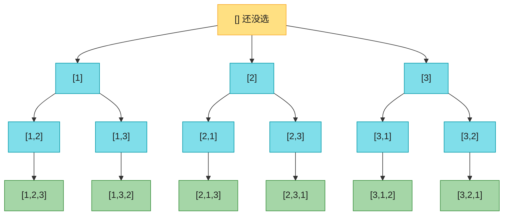
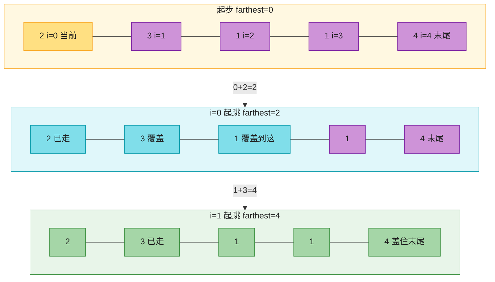
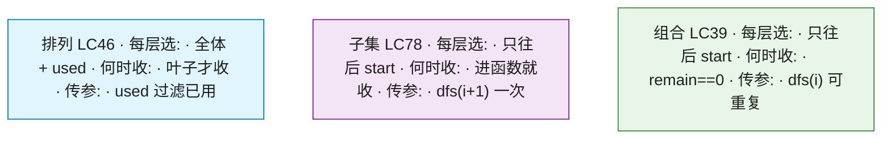

# Ch40 · 回溯 / 贪心 + 综合

> **预计**:1 天 ｜ **前置**:Ch34(刷题利器)、Ch38(树/DFS/BFS)、Ch39(DP) ｜ **M6 收官 · 全项目最后一章**
> **目标**:拿下 LeetCode 两大思想——**回溯(Backtracking)** 与 **贪心(Greedy)**。回溯是 Ch38 DFS 的延伸:在一棵隐式决策树上「选 → 走 → 撤销」,枚举**所有解**;贪心是另一条路:每步取局部最优、不回头,只要**一个最优解**。

> 📐 **本教程的契约**:§40.2–§40.7 每节**精确对应**一道作业题(LC46 / 78 / 39 / 47 / 121 / 55),讲过的才考、考的必讲过。§40.1(两大哲学 + 回溯通用模板)/ §40.8(对比与选型)/ §40.9(坑清单)讲透不出题。卡住时按对应表回查小节。
> **纯 stdlib**,零 import,Pyodide 可跑。

> 🎯 **Java 老手的直觉**:回溯你在 Java 里写过——`list.add(x); dfs(); list.remove(list.size()-1)`,最后那行 `remove` 写漏就是经典 bug。Python 的 `path.pop()` 默认弹末尾,语义更干净,但**撤销配对、收集时 copy** 这两件事一样都不能少。贪心两题(股票/跳跃)Java/Python 几乎同构,重点是体会「**什么时候敢用贪心**」。

---

## 🗺️ 本章地图

读完这章 + 完成作业,你将能够:

- 默写回溯通用骨架 `for 选择: 做选择; dfs(); 撤销选择`,说清为什么收集时必须 `path.copy()`
- 用「used 标记数组」解全排列,说清为什么排列题不能只用 start 下标
- 用「start 只往后选」解子集,说清为什么子集**进函数就收**而排列**等叶子才收**
- 用「排序 + break 剪枝 + `dfs(i)` 可重复选」解组合总和
- 用「排序 + 同层去重」解含重复元素的全排列 II(本章回溯综合题)
- 用「维护历史最低价」一次遍历解股票,用「维护最远可达」一次遍历解跳跃游戏
- 面对新题,用 §40.8 选型表判断该用回溯 / 贪心 / DP

**作业 ↔ 教程对应表**(学哪节,就去做哪题):

| 作业题 | 对应小节 | LeetCode | 核心知识点 | 难度 |
|--------|----------|----------|-----------|------|
| `permute` | §40.2 | LC46 | 回溯模板 + used 标记,叶子收集 | 🟡 |
| `subsets` | §40.3 | LC78 | 回溯 + start 去重,每个节点都收集 | 🟡 |
| `combination_sum` | §40.4 | LC39 | 回溯 + 排序剪枝 + `dfs(i)` 可重复选 | 🟡 |
| `permute_unique` | §40.5 | LC47 | 回溯综合:复用 permute 骨架 + 排序 + 同层去重 | 🔴 |
| `max_profit` | §40.6 | LC121 | 贪心:维护历史最低价 `min_price` | 🟢 |
| `can_jump` | §40.7 | LC55 | 贪心:维护最远可达 `farthest` | 🟢 |

> 标记说明:🟢 Java 老手秒懂;🟡 有差异/易错;🔴 思路较绕。

---

## ⏱️ 学习路径:费曼五步(约 100 分钟)

| 步 | 你要做 | 在哪做 |
|----|--------|--------|
| ① 预览猜(3 分钟) | 下面 ① 的 6 个问题,先凭经验猜 | 本页 ① |
| ② 先动手 | 打开 `ch40_assignment.py`,**先不看教程自己写** | assignment |
| ③ pytest 红绿 | `uv run pytest 06_leetcode/ch40/test_ch40_assignment.py -v` | test |
| ④ 费曼(5 分钟) | 大白话讲清「为什么要 copy」「子集为什么进函数就收」「组合为什么传 i」「排列 II 怎么去重」「跳跃为什么能贪心」 | 本页 ④ |
| ⑤ 存闪卡 | 把 [`review.md`](./review.md) 的卡标复习日期 | review.md |

> 💡 **直接性原则**:别通读!先猜 ① → 去 ② 写作业 → **哪题卡了,回对应 § 查** → 改 → 再跑。

---

## ① 预览猜(先合上教程想 1 分钟)

先别看答案,猜一猜(猜错记得更牢):

1. `[1,2,3]` 的全排列有 6 个。你会怎么**系统地**枚举,保证不重不漏?(提示:递归 + 撤销)
2. 回溯收集答案时,`res.append(path)` 和 `res.append(path.copy())` 有区别吗?什么区别?(提示:path 只有一份)
3. 子集问题 `[1,2,3]` 有 8 个子集。它和全排列的回溯区别在哪——是只在叶子收集,还是每个节点都收集?
4. 组合总和 `[2,3,6,7]` 凑 7,元素**可重复用**。递归下一层该传 `i` 还是 `i+1`?如果数组里有重复元素呢?
5. 股票 `[7,1,5,3,6,4]` 只许一次交易,怎么**一次遍历**、不用嵌套循环就算出最大利润?
6. 跳跃游戏 `[2,3,1,1,4]`,能不能不 DFS、只维护一个「最远能到哪」的变量就判断能否到末尾?

> 猜完带着验证心态进入下面的 §40.x。

---

## §40.1 两大枚举哲学 + 回溯通用模板(讲透)🟡

### 回溯是什么

**回溯(Backtracking)** = DFS + 撤销选择。本质是「在一棵隐式的决策树上做 DFS:每做一个选择就往下走一层,走到底(或走不通)就回退,**撤销**刚才的选择,换下一个选择」。

以全排列 `[1,2,3]` 为例,决策树长这样:



**这张图要你看懂：**黄根是空路径；每层从没用过的数里挑一个填位置；6 个绿叶子就是 3! 个排列。走完 `[1,2]→[1,2,3]` 回退时要把 `3` pop 掉，才能走 `[1,3]`。

DFS 走完整棵树 = 枚举所有排列。「撤销」发生在:走完 `[1,2]→[1,2,3]` 回退到 `[1,2]` 时,要把 `3` 从 path 里弹掉,才能继续走 `[1,3]`。

### 回溯通用模板(背下来)

```python
def backtrack(path, 选择列表):
    if 满足结束条件:
        res.append(path.copy())     # 收集:必须 copy!path 只有一份
        return
    for 选择 in 选择列表:
        if 剪枝条件:
            continue                # 或 break(排序后)
        path.append(选择)           # 做选择
        backtrack(path, ...)        # 往下走
        path.pop()                  # 撤销选择 ← 「回溯」就指这一步
```

### Java 对照(骨架完全同构)

```java
void backtrack(List<Integer> path, ...) {
    if (满足结束条件) { res.add(new ArrayList<>(path)); return; }  // copy
    for (选择 : 选择列表) {
        if (剪枝) continue;
        path.add(选择);              // 做选择
        backtrack(path, ...);
        path.remove(path.size() - 1); // 撤销:必须弹末尾
    }
}
```

> 🟡 **Java 对比**:`path.copy()` ↔ `new ArrayList<>(path)`;`path.pop()` ↔ `path.remove(path.size()-1)`。Python `pop()` 默认弹末尾,少一个「写错下标」的坑;Java 那行 `remove(size-1)` 是出了名的易漏。逻辑 100% 同构。

> 🔴 **为什么要撤销?** `path` 是**所有递归分支共享的同一个可变对象**。你在 `[1]` 分支里 append 了 `2`,不 pop 就回退的话,兄弟分支 `[2]` 看到的 path 是脏的。Java 同理——这不是 Python 特性,是回溯的本质。**`append`/`pop`、`used=True`/`used=False` 永远成对出现**。

### 贪心是什么

**贪心(Greedy)** = 每一步都取**局部最优**,不回溯、不枚举,期望局部最优堆出全局最优。通常 O(n) 一次遍历。

| | 回溯 | 贪心 |
|---|------|------|
| 思想 | 穷举所有解(决策树 DFS) | 每步取局部最优 |
| 复杂度 | 指数级(答案本身多) | 通常 O(n) |
| 何时用 | 题目要**所有方案**(排列/组合/子集) | 能证明「局部最优 = 全局最优」 |
| 模板 | `for: append; dfs; pop` | 维护一两个变量扫一遍 |

> **本章为什么把回溯和贪心放一起**:它们是 LeetCode 的「两大枚举哲学」——回溯「全都要」,贪心「只取一个」。刷到题先问:这题要**所有方案**还是**一个最优解**?方向想清楚再下笔(§40.8 给完整选型表)。

---

## §40.2 全排列 permute(LC46)🟡

**题面**:给一个**无重复**数组 `nums`,返回所有全排列。顺序不限。

```
输入: nums = [1,2,3]
输出: [[1,2,3],[1,3,2],[2,1,3],[2,3,1],[3,1,2],[3,2,1]]   # 共 3! = 6 个

输入: nums = [1]
输出: [[1]]
```

### 为什么这么做

n 个位置,每个位置从「还没用过的元素」里挑一个 → 这就是 §40.1 那棵决策树。用 `used[i]` 标记 `nums[i]` 是否已在当前路径上,跳过已用的,递归到 `len(path) == n`(叶子)就收集一份。

> **为什么用 used 而不是 start 下标?** 排列**顺序敏感**:`[1,2]` 和 `[2,1]` 是两个答案,每层都要从**全体**元素里挑(除已用的),不是「只往后选」。start 下标会把 `[2,1]` 漏掉。used 数组 = 「全体可选,排除已在路径上的」。

### Python 实现

```python
def permute(nums):
    n = len(nums)
    res, path = [], []
    used = [False] * n

    def dfs():
        if len(path) == n:               # 叶子:凑满 n 个,收集
            res.append(path.copy())      # ⚠️ 必须 copy,path 还会被改
            return
        for i in range(n):
            if used[i]:
                continue
            used[i] = True               # 做选择
            path.append(nums[i])
            dfs()
            path.pop()                   # 撤销选择(与 append 配对)
            used[i] = False              # (与 used=True 配对)

    dfs()
    return res
```

### Java 对照

```java
void dfs(int[] nums, boolean[] used, List<Integer> path, List<List<Integer>> res) {
    if (path.size() == nums.length) { res.add(new ArrayList<>(path)); return; }
    for (int i = 0; i < nums.length; i++) {
        if (used[i]) continue;
        used[i] = true;
        path.add(nums[i]);
        dfs(nums, used, path, res);
        path.remove(path.size() - 1);
        used[i] = false;
    }
}
```

### ❌ 错误写法 → ✅ 正确写法:收集必须 copy

```python
# ❌ 错误:收集的是「引用」——res 里所有元素指向同一个 path 对象
if len(path) == n:
    res.append(path)
# 后续分支继续 pop,最终 res 里全是空列表:[[], [], [], [], [], []]

# ✅ 正确:收集「快照」
if len(path) == n:
    res.append(path.copy())   # 或 path[:]
```

**这是回溯的头号 bug**,Java 里对应 `res.add(path)` vs `res.add(new ArrayList<>(path))`,一模一样的坑。

### 变体例:swap 原地交换法(不用 used)

```python
def permute_swap(nums):
    res = []

    def dfs(i):                          # 前 i 个位置已固定
        if i == len(nums):
            res.append(nums.copy())      # 整个数组就是当前排列
            return
        for j in range(i, len(nums)):
            nums[i], nums[j] = nums[j], nums[i]   # 把 nums[j] 换到位置 i(做选择)
            dfs(i + 1)
            nums[i], nums[j] = nums[j], nums[i]   # 换回来(撤销选择!)

    dfs(0)
    return res
```

- 思路:位置 i 依次与 j≥i 交换,相当于「位置 i 放上 nums[j]」;递归完换回来——**交换/换回本身就是一对「做选择/撤销选择」**,所以不需要 used 数组。
- 代价:会**修改原数组**(面试官可能介意);输出顺序与 used 法不同(LeetCode 顺序不限,都能过)。
- 作业用 used 法——它更通用,子集/组合的 start 变体都是同一个骨架(§40.8 对比表)。

### 常见坑 ⚠️

1. **忘 copy**:见上,永远 `path.copy()` / `path[:]`。
2. **撤销不配对**:`append` 后必须有 `pop`,`used=True` 后必须有 `used=False`。成对写,缺一不可。
3. **用了 start 下标**:`for i in range(start, n)` 会让 `[2,1]` 永远生成不了——排列必须每层扫全体 `range(n)`。

### 复杂度

- 时间 O(n · n!):n! 个叶子,每个收集时拷贝 O(n)。
- 空间 O(n):递归栈深 n + path + used(不计答案存储)。

> ✅ **现在去做 `permute`**:used 标记 + `append/pop` 配对 + 叶子 `path.copy()`。

---

## §40.3 子集 subsets(LC78)🟡

**题面**:给一个**无重复**数组 `nums`,返回所有子集(幂集,含空集和全集)。顺序不限。

```
输入: nums = [1,2,3]
输出: [[], [1], [2], [3], [1,2], [1,3], [2,3], [1,2,3]]   # 共 2³ = 8 个

输入: nums = []
输出: [[]]                                                  # 空集是唯一子集
```

### 为什么这么做

子集和全排列的**关键区别在收集时机**:

- 全排列:只有**叶子**(长度 = n)是答案。
- 子集:**每个节点都是答案**——长度 0(空集)、1、2、…、n 全都算。所以**一进 dfs 就先收**,再决定要不要继续往下选。

去重靠 **start 下标**:每层只从 `start` 往后选,递归传 `i+1`。这样 `[1,2]` 只会被「先选 1 再选 2」生成一次,不会出现 `[2,1]`——子集不区分顺序,`[1,2]` 和 `[2,1]` 是同一个子集,必须去重。

```
                    dfs(0), path=[]        → 收 []
              /          |           \
   选1 dfs(1)          选2 dfs(2)    选3 dfs(3)
   path=[1] → 收[1]    path=[2]→收[2]  path=[3]→收[3]
    /      \              |
 [1,2]→收  [1,3]→收     [2,3]→收
    |
 [1,2,3]→收
```

### Python 实现

```python
def subsets(nums):
    res, path = [], []
    n = len(nums)

    def dfs(start):
        res.append(path.copy())          # ⭐ 进函数第一件事就收集(含空集)
        for i in range(start, n):        # 只往后选 → 天然去重
            path.append(nums[i])
            dfs(i + 1)                   # i+1:每个元素只选一次
            path.pop()

    dfs(0)
    return res
```

### Java 对照

```java
void dfs(int start, int[] nums, List<Integer> path, List<List<Integer>> res) {
    res.add(new ArrayList<>(path));                 // 每个节点都收
    for (int i = start; i < nums.length; i++) {
        path.add(nums[i]);
        dfs(i + 1, nums, path, res);                // 只往后选
        path.remove(path.size() - 1);
    }
}
```

> 🟡 **差异点**:逻辑一一对应,无实质差异。唯一要记住的是 `res.append(path.copy())` 在循环**之前**(进函数第一件事)——这保证第一次 `dfs(0)` 时把空集 `[]` 也收进去。

### ❌ 错误写法 → ✅ 正确写法:收集时机

```python
# ❌ 错误:套全排列的写法,只在「叶子」收集
def dfs(start):
    if start == n:
        res.append(path.copy())   # 只有全集 [1,2,3] 一个答案,漏了 7 个!
        return
    ...

# ✅ 正确:每个节点都是答案,进函数就收
def dfs(start):
    res.append(path.copy())       # 无条件先收
    for i in range(start, n):
        ...
```

### 变体例:迭代法(增量构造)

```python
def subsets_iter(nums):
    res = [[]]                              # 先只有空集
    for x in nums:
        res += [s + [x] for s in res]       # 每个已有子集「加上 x」生成一批新子集
    return res
```

以 `[1,2,3]` 走一遍:`[[]]` → 来 1:`[[], [1]]` → 来 2:`[[], [1], [2], [1,2]]` → 来 3:再加 4 个 → 8 个。每来一个元素,子集数翻倍,所以是 2ⁿ。这个视角(每个元素「选/不选」)和回溯等价,面试时说得出任意一种即可;**作业请练回溯版**——它是排列/组合的通用骨架。

### 常见坑 ⚠️

1. **收集时机错**:把收集写进叶子 `if` 里 → 漏掉所有非叶子子集。子集问题**进函数就收**。
2. **传 i 而不是 i+1**:`dfs(i)` 会让同一元素被重复选,`[1,1]` 这种假子集都出来了。**子集/组合(每个只选一次)= i+1**;可重复选(§40.4)才传 i,别搞反。
3. **忘 copy**:同全排列,头号 bug。

### 复杂度

- 时间 O(n · 2ⁿ):2ⁿ 个子集,每个拷贝 O(n)。
- 空间 O(n):递归栈 + path(不计答案)。

> ✅ **现在去做 `subsets`**:进 dfs 先收 `path.copy()` + `for i in range(start, n)` + `dfs(i+1)`。

---

## §40.4 组合总和 combination_sum(LC39)🟡

**题面**:候选数组 `candidates` **无重复**,每个元素可**无限次**使用,返回所有和恰好等于 `target` 的组合。顺序不限。

```
输入: candidates = [2,3,6,7], target = 7
输出: [[2,2,3], [7]]                # 2+2+3=7(2 用了两次!),7=7

输入: candidates = [2], target = 1
输出: []                            # 凑不出

输入: candidates = [2,3], target = 0
输出: [[]]                          # 啥也不选,和就是 0(合法答案)
```

### 为什么这么做

还是回溯骨架,两个关键变化:

1. **可重复选** → 递归传 `i`(不是 `i+1`),下一层还能选当前元素。去重仍靠「只往后选」(`range(start, n)`):`[2,3]` 会出现,`[3,2]` 不会(选 3 时 start 已经越过 2 了)。
2. **剪枝** → 先排序,循环里一旦 `candidates[i] > remain`(当前这个都超了),后面更大的更不可能,**直接 break**(不是 continue!)。

`remain` 是「还差多少凑够 target」,每选一个就减掉。`remain == 0` 收答案;排序剪枝保证不会走到 `remain < 0`。

### Python 实现

```python
def combination_sum(candidates, target):
    res, path = [], []
    candidates = sorted(candidates)      # 排序 → 剪枝的前提

    def dfs(start, remain):
        if remain == 0:
            res.append(path.copy())
            return
        for i in range(start, len(candidates)):
            cand = candidates[i]
            if cand > remain:
                break                    # 剪枝:排序后后面更大,都不可能
            path.append(cand)
            dfs(i, remain - cand)        # ⭐ 传 i 不是 i+1:可重复选当前元素
            path.pop()

    dfs(0, target)
    return res
```

### Java 对照

```java
void dfs(int start, int remain, int[] candidates, List<Integer> path, List<List<Integer>> res) {
    if (remain == 0) { res.add(new ArrayList<>(path)); return; }
    for (int i = start; i < candidates.length; i++) {
        if (candidates[i] > remain) break;              // 排序剪枝
        path.add(candidates[i]);
        dfs(i, remain - candidates[i], candidates, path, res);  // i:可重复
        path.remove(path.size() - 1);
    }
}
```

### ❌ 错误写法 → ✅ 正确写法

```python
# ❌ 错误 1:不排序就 break —— 漏解
for i in range(start, len(candidates)):   # candidates 未排序
    if candidates[i] > remain:
        break      # 后面可能还有更小的能凑!break 把它们全漏了

# ✅ 正确:先 sorted(candidates),才敢 break
# (排序后 candidates[j] > remain 对所有 j > i 都成立,break 才安全)


# ❌ 错误 2:dfs(i + 1, ...) —— 变成「每个元素只能用一次」
dfs(i + 1, remain - cand)   # [2,2,3] 这种需要重复选 2 的答案就丢了

# ✅ 正确:dfs(i, ...) —— 下一层仍可选 candidates[i]
dfs(i, remain - cand)
```

### 变体对照:LC40 组合总和 II(每个元素只用一次、候选含重复)

如果面试遇到 LC40,在 LC39 基础上只改两处:

```python
dfs(i + 1, remain - cand)                              # 改 1:每个只用一次 → i+1
if i > start and candidates[i] == candidates[i - 1]:
    continue                                           # 改 2:同层去重(排序后相邻同值只取第一个)
```

「同层去重」这个技巧马上在 §40.5 全排列 II 里还会用到——**先排序,再在同一层递归里跳过与前一个相同的值**,是处理「输入含重复」回溯题的标准动作。

### 常见坑 ⚠️

1. **不排序就剪枝**:见上,`break` 的前提是「后面都 ≥ 当前」。
2. **传错参数**:**可重复选传 i,只选一次传 i+1**——这是本章最容易记混的一点,死记 §40.8 对比表。
3. **target=0 的边界**:`remain==0` 立即收 `path.copy()`,此时 path 是空的 → 答案 `[[]]`。别把空组合漏了。
4. **剪枝写成 continue**:continue 会继续试后面更大的数,答案仍对但白跑;break 才是剪枝的收益。
5. **忘 copy**:老问题,不再赘述。

### 复杂度

- 时间:最坏指数级,取决于候选与 target(每个位置可以选 0 到多次小元素);排序剪枝后实际很快。
- 空间 O(target / min(candidates)):递归最大深度。

> ✅ **现在去做 `combination_sum`**:排序 + `dfs(i, remain-cand)`(传 i 可重复)+ `if cand > remain: break` + `remain==0` 收 copy。

---

## §40.5 全排列 II permute_unique(LC47)🔴(回溯综合)

**题面**:给一个**可能含重复**的数组 `nums`,返回所有**不重复**的全排列。顺序不限。

```
输入: nums = [1,1,2]
输出: [[1,1,2], [1,2,1], [2,1,1]]   # 3!/2! = 3 个(不是 6 个!)

输入: nums = [1,1,1]
输出: [[1,1,1]]                       # 只有 1 个
```

### 为什么这么做

直接套 §40.2 的 permute 会生成 3! = 6 个排列,其中两个 `1` 互换位置产生了重复。去重的标准打法是**排序 + 同层去重**:

1. **先排序**:相同的值变得相邻,才能用「和前一个比较」来判断重复。
2. **同层去重**:在**同一层递归**里,如果 `nums[i] == nums[i-1]` 且 `used[i-1]` 为 False——说明前一个等值元素**曾在这一层被选过、用完又撤销了**(它不在当前路径上),那么「当前位置放 nums[i]」和之前「放 nums[i-1]」产生的整棵子树完全重复 → `continue` 跳过。

直觉:两个 `1` 是双胞胎,约定「**只有哥哥(下标小的)已经在队伍里,弟弟才能上**」。这样等值元素永远按下标顺序被选用,`[1a,1b,2]` 和 `[1b,1a,2]` 只保留前者——重复从源头消失,而不是生成后再过滤。

```
[1,1,2] 排序后决策树(同层去重后):
                    []
          /          |          \
      [1a]         [1b]✗剪掉   [2]         ← 第 1 层:1b 与 1a 等值且 1a 不在路径 → 剪
      /   \                   /   \
  [1a,1b] [1a,2]          [2,1a] [2,1b]✗   ← 同理剪
     |       |               |
 [1a,1b,2] [1a,2,1b]     [2,1a,1b]          ← 只剩 3 个叶子 ✓
```

### Python 实现(在 permute 骨架上加两行)

```python
def permute_unique(nums):
    nums = sorted(nums)                  # 改 1:排序,让等值相邻
    n = len(nums)
    res, path = [], []
    used = [False] * n

    def dfs():
        if len(path) == n:
            res.append(path.copy())
            return
        for i in range(n):
            if used[i]:
                continue
            # 改 2:同层去重 —— 等值且前一个不在路径上 → 跳过
            if i > 0 and nums[i] == nums[i - 1] and not used[i - 1]:
                continue
            used[i] = True
            path.append(nums[i])
            dfs()
            path.pop()
            used[i] = False

    dfs()
    return res
```

### Java 对照

```java
Arrays.sort(nums);
// ...
for (int i = 0; i < nums.length; i++) {
    if (used[i]) continue;
    if (i > 0 && nums[i] == nums[i - 1] && !used[i - 1]) continue;  // 同层去重
    used[i] = true; path.add(nums[i]);
    dfs(...);
    path.remove(path.size() - 1); used[i] = false;
}
```

### ❌ 错误写法 → ✅ 正确写法

```python
# ❌ 错误 1:不排序 —— 等值不相邻,nums[i]==nums[i-1] 判断直接失效
used = [False] * n          # 忘了 sorted(nums)
# 输入 [1,2,1]:下标 0 和 2 都是 1 但不相邻,去重条件永远抓不到 → 重复答案照旧

# ❌ 错误 2:事后用 set 去重 —— 能过判题,但 6 棵重复子树一棵没少生成
res = set()
...res.add(tuple(path))     # 指数级枚举全做了,只是最后过滤;面试这么说会减分

# ✅ 正确:排序 + 同层 continue —— 重复分支根本不生成
nums = sorted(nums)
if i > 0 and nums[i] == nums[i - 1] and not used[i - 1]:
    continue
```

### 常见坑 ⚠️

1. **忘记排序**:去重条件依赖「等值相邻」,排序是前提。
2. **`used[i-1]` 写反**:推荐记死这个组合——`i > 0 and nums[i] == nums[i-1] and not used[i-1]` → `continue`。含义「前一个等值元素已被撤销(不在路径上)→ 同层重复分支」。(写成 `used[i-1]` 也能去重,但剪枝更少、语义更绕,统一用前者。)
3. **漏掉 `i > 0`**:`i=0` 时访问 `nums[-1]` 会拿到**最后一个元素**(Python 负下标!),判断直接错。`i > 0` 必须先写。
4. **该用 used 还是 start**:排列顺序敏感 → 每层扫全体 + used;§40.3/§40.4 那种「组合不分顺序」才用 start 只往后选。别混。

### 复杂度

- 时间 O(n · n!):最坏(全不重复)与 LC46 相同;重复越多,剪掉的越多,实际越快。
- 空间 O(n):递归栈 + path + used。

> ✅ **现在去做 `permute_unique`**:把 §40.2 的骨架复制过来,加「排序 + 同层去重」两行——这就是回溯综合题的全部增量。

---

## §40.6 买卖股票最佳时机 max_profit(LC121)🟢(贪心)

**题面**:`prices[i]` 是第 i 天的股价,**只许一次交易**(先买后卖),求最大利润;赚不到返回 0。

```
输入: prices = [7,1,5,3,6,4]
输出: 5          # 第 2 天(价 1)买入,第 5 天(价 6)卖出,赚 5

输入: prices = [7,6,4,3,1]
输出: 0          # 一路下跌,不交易最赚
```

### 为什么这么做(贪心)

把每天当作「卖出日」:今天卖出能赚多少,取决于**之前见过的最低价**。所以一次遍历维护两个变量:

- `min_price`:到昨天为止的历史最低价(最佳买入点);
- `best`:到昨天为止的最大利润。

每天 `price`:先用它当卖价算利润 `price - min_price` 更新 `best`,再用它更新 `min_price`。**不需要嵌套循环**——我们只要「最优解」不要「所有方案」,这正是贪心的适用信号(§40.1)。

### Python 实现

```python
def max_profit(prices):
    best = 0
    min_price = float('inf')             # 🔴 Python 无穷大,Java 是 Integer.MAX_VALUE
    for price in prices:
        if price < min_price:
            min_price = price            # 更便宜的买入点出现了
        elif price - min_price > best:
            best = price - min_price     # 今天卖出更赚
    return best
```

### Java 对照

```java
int best = 0, minPrice = Integer.MAX_VALUE;
for (int price : prices) {
    if (price < minPrice) minPrice = price;
    else if (price - minPrice > best) best = price - minPrice;
}
return best;
```

> 🟢 **Java 秒懂**:完全同构。唯一差异是无穷大:Python `float('inf')` 参与加减比较都安全;Java 若用 `Integer.MAX_VALUE` 做减法有溢出风险(所以这题 Java 必须先比较再减,顺序敏感)。`float('-inf')` 是负无穷,Ch36 前缀和/Ch39 DP 里也常用。

### ❌ 错误写法 → ✅ 正确写法:min_price 初值

```python
# ❌ 错误:min_price = 0
min_price = 0
for p in prices:
    min_price = min(min_price, p)    # 0 比所有正股价都小 → min_price 永远是 0
    best = max(best, p - min_price)  # 「利润」= 股价本身,错得离谱

# ✅ 正确:min_price = float('inf') —— 任何真实价格都能刷新它;空数组循环不进,返回 0
min_price = float('inf')
```

### 变体对照:LC122(不限交易次数)

延伸阅读(作业不考):若允许多次交易,贪心变成「每一段上坡都吃到」:

```python
def max_profit_multi(prices):            # LC122
    return sum(max(0, prices[i] - prices[i - 1]) for i in range(1, len(prices)))
```

对比着记:**一次交易 → 维护全局最低;多次交易 → 逐段累加上涨**。两题都是 O(n) 贪心,但「贪心选择」不同。作业只考 LC121。

### 常见坑 ⚠️

1. **min_price 初值用 0 / prices[0]**:0 会污染(见上);`prices[0]` 遇空数组直接越界。用 `float('inf')`。
2. **先更新 min 再算利润**:也能过(同一天买卖利润 0 不影响),但语义上「今天卖出」用的是「到昨天为止的最低价」,先算利润再更新 min 更直观。
3. **看成可多次交易**:LC121 只许一次,LC122 才多次,题面读清。
4. **手动 max(0, best)**:不需要——`best` 初值就是 0,自然不会算出负利润。

### 复杂度

- 时间 O(n),空间 O(1)——一次遍历两个变量,贪心的标准收益。

> ✅ **现在去做 `max_profit`**:一个 `min_price` + 一个 `best`,一次遍历,空数组自然返回 0。

---

## §40.7 跳跃游戏 can_jump(LC55)🟢(贪心)

**题面**:`nums[i]` 表示在下标 i 处**最多**能往前跳几步。问能否从下标 0 跳到最后一个下标。

```
输入: nums = [2,3,1,1,4]
输出: true     # 0 →(跳1步)→ 1 →(跳3步)→ 4 ✓

输入: nums = [3,2,1,0,4]
输出: false    # 怎么跳都会落到下标 3 的 0 上,卡死
```

### 为什么这么做(贪心)

关键洞察:**可达位置是一个连续区间 `[0, farthest]`**。能跳到位置 k,就意味着 0..k 之间的每个位置都能到(沿途每格都能落地)。所以不用 DFS、不用记路径,维护一个 `farthest`(目前最远能到哪)扫一遍:

- 若 `i > farthest`:连位置 i 都到不了,后面更不用看 → False。
- 否则从 i 起跳,更新 `farthest = max(farthest, i + nums[i])`。
- `farthest >= n-1`:末尾已可达 → True,提前收工。

每步都做「能让 farthest 最大」的选择,这就是贪心;它成立是因为我们**只问「能不能到」(存在性),不问「怎么跳最优」**。

### Python 实现

```python
def can_jump(nums):
    farthest = 0
    n = len(nums)
    for i in range(n):
        if i > farthest:                 # 当前位置本身不可达 → 死
            return False
        if farthest >= n - 1:            # 末尾已可达 → 提前收工
            return True
        farthest = max(farthest, i + nums[i])
    return farthest >= n - 1
```

### Java 对照

```java
int farthest = 0;
for (int i = 0; i < nums.length; i++) {
    if (i > farthest) return false;
    if (farthest >= nums.length - 1) return true;
    farthest = Math.max(farthest, i + nums[i]);
}
return farthest >= nums.length - 1;
```

> 🟢 **Java 秒懂**:逐行同构,无任何语言差异点。背的是**思路**(可达区间连续),不是代码。



**这张图要你看懂：**可达区间是连续的 `[0, farthest]`。从 i=0 跳 2 覆盖到下标 2；再从 i=1 跳 3 把 farthest 推到 4，已经盖住末尾，所以 True。

### ❌ 错误写法 → ✅ 正确写法:判断顺序

```python
# ❌ 错误:先更新,再判断
for i in range(n):
    farthest = max(farthest, i + nums[i])   # i 可能根本到不了,却拿它更新 farthest!
    if i > farthest:                        # 更新完 farthest >= i 恒成立 → 这行永远 False
        return False                        # → [3,2,1,0,4] 会被误判成 True

# ✅ 正确:先确认 i 可达,才有资格从 i 起跳
for i in range(n):
    if i > farthest:
        return False
    farthest = max(farthest, i + nums[i])
```

### 变体对照:LC45(问最少跳几步)

延伸阅读(作业不考):LC45 跳跃游戏 II 要求**最少步数**,贪心升级为维护「当前这一步能到的边界 `end`」和「下一步最远 `farthest`」,走到 `end` 就步数 +1。也可以用 BFS/DP(Ch38/Ch39 的视角)。**本章只要会 LC55 的「存在性」版本**——它告诉你:只问存在性时,一个 `farthest` 就够。

### 常见坑 ⚠️

1. **判断顺序写反**:见上,`if i > farthest` 必须在更新**之前**。
2. **边界**:`can_jump([])`、`can_jump([0])` 都是 True(本来就在末尾,循环里 `farthest=0 >= n-1=0`);`[0,1]` 是 False(第一步跳 0 步,卡死)。
3. **忘记提前 return**:不加 `farthest >= n-1` 也能算对,但大用例白扫;提前返回是顺手优化。
4. **和 LC45 搞混**:本题返回 bool;问步数是另一题。

### 复杂度

- 时间 O(n),空间 O(1)。

> ✅ **现在去做 `can_jump`**:维护 `farthest`;`i > farthest` 即 False;`farthest = max(farthest, i+nums[i])`;到末尾即 True。

---

## §40.8 回溯四兄弟对比 + 回溯/贪心/DP 选型(讲透)

### 一张表记四道回溯题

| | 全排列 LC46 | 子集 LC78 | 组合总和 LC39 | 全排列 II LC47 |
|---|---|---|---|---|
| 输入 | 无重复 | 无重复 | 无重复,**可重复选** | **有重复** |
| 收集时机 | 叶子(`len==n`) | **每个节点** | `remain==0` | 叶子(`len==n`) |
| 遍历范围 | 全体 `range(n)` | 从 start 往后 | 从 start 往后 | 全体 `range(n)` |
| 去重机制 | used 数组 | start 只往后 | start 只往后 | used + 排序 + 同层跳过 |
| 递归传参 | —(used 过滤) | `dfs(i+1)` | **`dfs(i)`** | —(used 过滤) |
| 剪枝 | 无 | 无 | 排序 + `break` | 同层去重 `continue` |
| 答案规模 | n! | 2ⁿ | 指数(取决于 target) | n! / (重复!) |

> 骨架是同一个 `for + append + dfs + pop`,差别只在四件事:**何时收、从哪选、传 i 还是 i+1、怎么剪枝**。面试写回溯时心里默念这四个问题,逐一回答完代码就出来了。



**这张图要你看懂：**排列每层扫全体、叶子才收；子集只往后选、进函数就收；组合也只往后选，但 `remain==0` 才收，且递归传 `i` 允许重复用当前数。

### 回溯 vs 贪心 vs DP 选型

刷到「枚举 / 最优化」题,按这个顺序问:

| 题目要求 | 选型 | 典型 |
|---|---|---|
| 要**所有方案**(列举) | **回溯** | 全排列、子集、组合、N 皇后 |
| 要**一个最优解**,能证明局部最优 = 全局最优 | **贪心** | 股票、跳跃游戏、区间调度 |
| 要**一个最优解**,局部最优 ≠ 全局最优,有重叠子问题 | **DP**(Ch39) | 爬楼梯、零钱兑换、LIS、编辑距离 |

> 股票和跳跃都能用 DP 甚至暴力解,但贪心把它们压到 O(n)/O(1)。**能用贪心别用 DP**——更简洁;但贪心需要「证明」局部最优 = 全局最优(股票:最低价买;跳跃:可达区间连续),证明不了就退回 DP。回溯则是「要所有方案」时的唯一选择——它慢(指数级)是答案本身就多,不是算法差。

---

## §40.9 Java 老手常踩的坑 ⚠️(本章汇总)

1. **回溯忘 copy**:`res.append(path)` 收的是引用,后续 pop 把已收的全改没。永远 `path.copy()` / `path[:]`(Java:`new ArrayList<>(path)`)。
2. **撤销不配对**:`append`/`pop`、`used=True`/`used=False` 必须成对,漏一个 = 答案乱。写完检查一遍配对。
3. **传 i 还是 i+1 搞反**:每个元素**只用一次**(子集/组合 II)→ `dfs(i+1)`;**可重复选**(组合总和)→ `dfs(i)`。死记 §40.8 的表。
4. **不排序就 break 剪枝**:`cand > remain` 能 break 的前提是「后面都更大」。先 `sorted`。
5. **同层去重忘了排序 / 漏了 `i > 0`**:LC47 的两个新坑——不排序等值不相邻;`i=0` 时 `nums[-1]` 是最后一个元素(Python 负下标陷阱)。
6. **贪心初值用 0**:股票 `min_price = 0` 让所有正价都「不便宜」。用 `float('inf')`,空数组还自动安全。
7. **跳跃判断顺序写反**:先 `if i > farthest` 再更新 farthest;反了判断恒 False,`[3,2,1,0,4]` 会误判 True。
8. **把「要所有方案」当「要最优」做**:全排列没法贪心,股票用回溯会超时。先想清楚题目要什么(§40.8 选型表)。

---

## 📝 本章作业

| 任务 | 对应小节 | 知识点 | 难度 |
|------|----------|--------|------|
| `permute` | §40.2 | 回溯 + used 标记 | 🟡 |
| `subsets` | §40.3 | 回溯 + start 去重,每节点收集 | 🟡 |
| `combination_sum` | §40.4 | 回溯 + 排序剪枝 + 可重复选 | 🟡 |
| `permute_unique` | §40.5 | 综合:骨架复用 + 排序 + 同层去重 | 🔴 |
| `max_profit` | §40.6 | 贪心(维护历史最低) | 🟢 |
| `can_jump` | §40.7 | 贪心(维护最远可达) | 🟢 |

```bash
uv run pytest 06_leetcode/ch40/test_ch40_assignment.py -v
```

全绿 = 掌握 Ch40 = **M6 毕业 = 40 章全栈学习项目通关** 🎉。

---

## ✅ 自测

- [ ] 能默写回溯骨架:`for 选择: append; dfs; pop`,并说清为什么收集必须 copy
- [ ] 能说清「子集为什么进函数就收,全排列为什么等叶子才收」
- [ ] 能说清「组合总和为什么传 i 不传 i+1」「为什么要排序才能 break 剪枝」
- [ ] 能写出 LC47 的「排序 + 同层去重」两行,并解释 `not used[i-1]` 的含义
- [ ] 能用 O(n)/O(1) 写出股票和跳跃两道贪心,说清各自的贪心选择是什么
- [ ] 能判断一道新题该用回溯 / 贪心 / DP(§40.8 选型表)
- [ ] 6 个作业全绿

## 🎓 费曼挑战

1. 「为什么子集每个节点都收集,全排列只收集叶子?」— 重读 §40.3 vs §40.2
2. 「`dfs(i)` 和 `dfs(i+1)` 的区别,什么时候用哪个?」— 重读 §40.8 对比表
3. 「LC47 为什么排序 + `not used[i-1]` 就能去重?不排序行不行?」— 重读 §40.5
4. 「跳跃游戏为什么能用贪心?『局部最优 = 全局最优』体现在哪?」— 重读 §40.7(可达区间连续)
5. 「回溯 / 贪心 / DP 各适合什么题?给一道新题你怎么选?」— 重读 §40.8

## 🧠 记忆闪卡 → [`review.md`](./review.md)

---

## ⏭️ M6 毕业 + 项目收官

40 章走完:从 Ch01 的 `if __name__=='__main__'` 到 Ch40 的回溯贪心,你已经能用 Python 写语言核心(M1)、玩转标准库(M2)、搭 FastAPI 服务(M3)、写运维脚本(M4)、调 LLM/搭 RAG/Agent(M5)、Pythonic 刷 LeetCode(M6)。下一步:把这些拼成一个**属于自己的项目**(比如一个带 AI 的 Web 服务),在实战里把六块肌肉连起来。🎓
